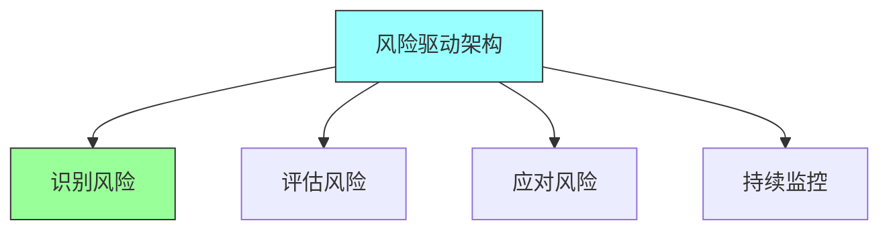
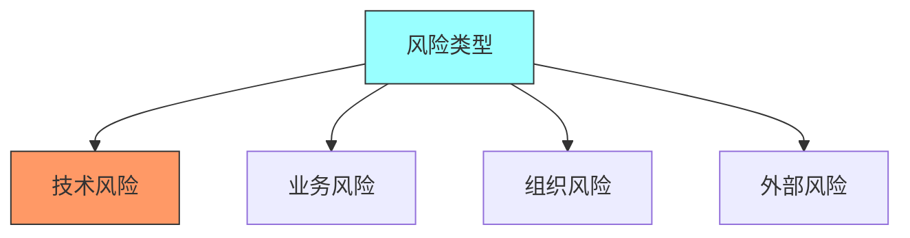
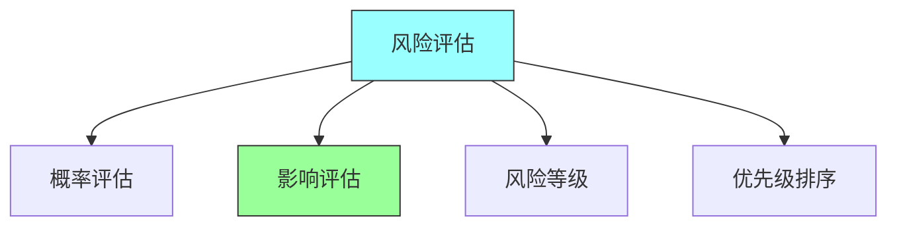
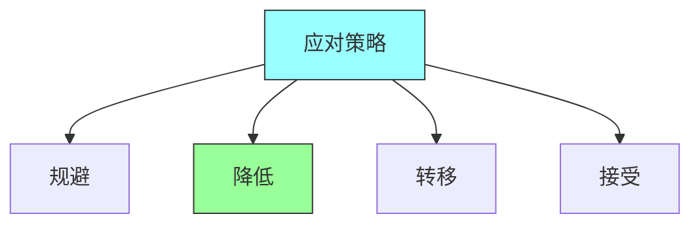

# 第十二章：Risk-Driven Architecture

## 一、风险驱动方法

### 1.1 风险驱动定义

风险驱动的架构方法：

**定义**：基于风险评估进行架构决策。**核心思想**：高风险领域投入更多精力。**目的**：优化架构投入的效益。**方法**：识别、评估、应对风险。

### 1.2 风险驱动的价值

风险驱动方法的价值：

**资源优化**：将资源投入到高风险领域。**决策指导**：指导架构决策的优先级。**风险降低**：有效降低项目风险。**价值最大化**：最大化架构投入的价值。

### 1.3 风险驱动原则

风险驱动架构的原则：

**风险优先**：优先处理高风险领域。**适度设计**：风险越高，设计越详细。**迭代验证**：通过迭代验证风险处理。**持续监控**：持续监控风险变化。

## 二、风险识别

### 2.1 风险类型

架构风险的不同类型：

**技术风险**：技术选型和技术实现的风险。**业务风险**：业务需求变化的风险。**组织风险**：团队和组织带来的风险。**外部风险**：外部环境带来的风险。

### 2.2 风险识别方法

识别风险的方法：

**头脑风暴**：团队头脑风暴。**历史分析**：分析历史项目风险。**专家访谈**：访谈领域专家。**风险清单**：使用风险清单检查。

### 2.3 风险描述

描述风险的方式：

**风险因素**：导致风险的因素。**风险事件**：可能发生的事件。**风险后果**：事件的后果。**风险概率**：事件发生的概率。

## 三、风险评估

### 3.1 风险评估矩阵

评估风险的工具：

**概率评估**：评估风险发生的概率。**影响评估**：评估风险的影响程度。**风险等级**：计算风险等级。**优先级排序**：按风险等级排序。

### 3.2 风险量化

量化风险的方法：

| 风险等级 | 概率 | 影响 | 应对策略 |
|---------|-----|------|---------|
| 高 | 高 | 高 | 立即处理 |
| 中 | 中 | 中 | 计划处理 |
| 低 | 低 | 低 | 接受监控 |

**定量分析**：使用数值量化风险。**定性分析**：使用定性描述风险。**风险指标**：定义风险指标。**风险阈值**：设定风险阈值。

### 3.3 风险比较

比较不同风险：

**风险排序**：对风险进行排序。**风险权衡**：权衡不同风险。**风险接受**：决定接受哪些风险。**风险规避**：决定规避哪些风险。

## 四、风险应对

### 4.1 应对策略

风险应对的策略：

**规避**：避免可能产生风险的活动。**降低**：采取措施降低风险。**转移**：将风险转移给第三方。**接受**：有意识地接受风险。

### 4.2 应对措施

针对架构风险的应对措施：

**原型验证**：通过原型验证技术风险。**渐进式设计**：渐进式设计降低风险。**冗余设计**：冗余设计降低可用性风险。**监控预警**：监控和预警风险。

### 4.3 应对效果

评估风险应对的效果：

**风险降低**：评估风险降低的程度。**成本效益**：评估应对的成本效益。**残余风险**：评估残余风险。**持续监控**：持续监控残余风险。

## 五、总结与启示

核心要点：风险驱动方法基于风险评估进行架构决策。识别和评估风险是风险驱动的基础。选择合适的风险应对策略。持续监控和管理风险。

---

*本章精读笔记完成*
