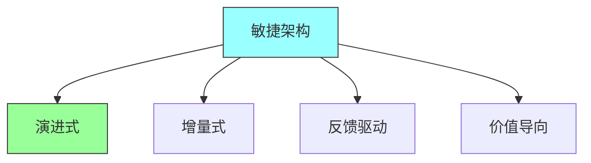
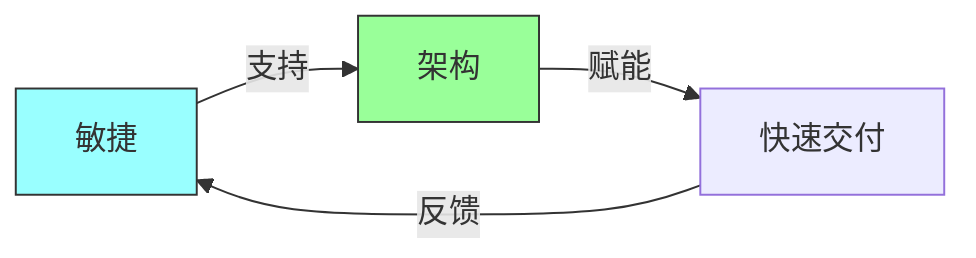
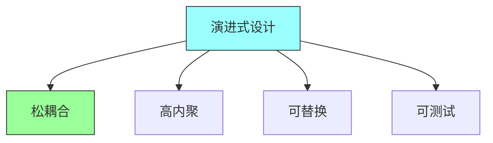
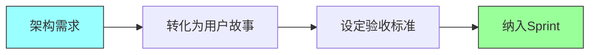
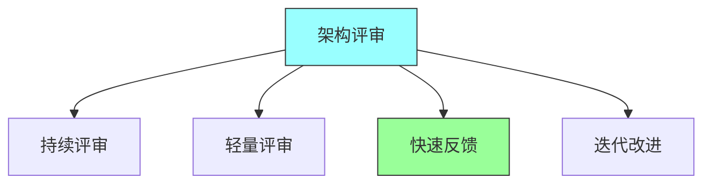

# 第十三章：Agile Architecture

## 一、敏捷架构概述

### 1.1 敏捷架构定义

敏捷环境下的架构实践：

**定义**：在敏捷开发中应用架构原则。**核心思想**：架构应该是演进的。**平衡**：平衡设计和灵活性。**价值**：架构为业务创造价值。

### 1.2 敏捷架构原则

敏捷架构的原则：

**简单设计**：优先选择简单的设计。**充分设计**：设计刚好满足当前需求。**持续集成**：架构与代码同步演进。**反馈驱动**：基于反馈调整架构。

### 1.3 敏捷与架构

敏捷与架构的关系：

**矛盾与统一**：解决敏捷与架构的矛盾。**架构作为障碍**：架构不应成为敏捷的障碍。**架构作为赋能**：架构赋能团队快速交付。**持续投资**：持续投资架构。

## 二、演进式架构

### 2.1 演进式架构定义

支持持续演进的架构：

**定义**：支持逐步演进的架构。**特点**：可演化、可适应、可扩展。**目标**：支撑业务持续演进。**原则**：保持架构的灵活性。

### 2.2 演进式设计

支持演进的设计原则：

**松耦合**：组件之间松耦合。**高内聚**：组件内部高内聚。**可替换**：组件可替换。**可测试**：组件可独立测试。

### 2.3 演进策略

架构演进的策略：

**增量演进**：通过增量变化演进。**逐步替换**：逐步替换旧组件。**实验验证**：通过实验验证演进方向。**回滚能力**：保持回滚能力。

## 三、架构与敏捷实践

### 3.1 架构与Sprint

在Sprint中处理架构：

**架构任务**：在Sprint中包含架构任务。**架构评审**：在Sprint评审中包含架构。**技术债**：管理架构相关的技术债。**探索性工作**：在Sprint中包含探索性工作。

### 3.2 架构与用户故事

将架构与用户故事结合：

**架构故事**：创建架构相关的用户故事。**非功能需求**：将非功能需求转化为故事。**架构任务估算**：估算架构任务的工时。**验收标准**：定义架构的验收标准。

### 3.3 架构与持续集成

架构与CI/CD的结合：

**架构验证**：在CI中验证架构。**架构测试**：进行架构相关的测试。**架构监控**：在CD中监控架构。**架构反馈**：获取架构的反馈。

## 四、敏捷架构实践

### 4.1 架构积压

管理架构积压：

**架构故事**：将架构工作转化为故事。**优先级排序**：对架构故事排序。**估算**：估算架构故事的工作量。**评审**：定期评审架构积压。

### 4.2 架构评审

敏捷环境下的架构评审：

**持续评审**：持续进行架构评审。**轻量评审**：采用轻量级的评审方式。**快速反馈**：获取快速反馈。**迭代改进**：根据反馈改进架构。

### 4.3 架构守护

守护架构的质量：

**架构一致性**：保持架构的一致性。**架构演进**：支持架构的演进。**技术债管理**：管理架构相关的技术债。**知识共享**：分享架构知识。

## 五、总结与启示

核心要点：敏捷架构是支持敏捷开发的架构实践。演进式架构支持系统的持续演进。架构应该与敏捷实践紧密结合。持续投资架构以保持系统健康。

---

*本章精读笔记完成*
