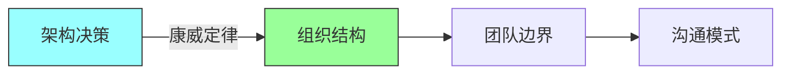
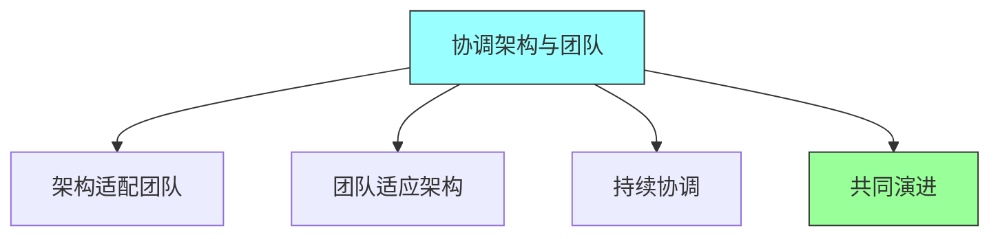
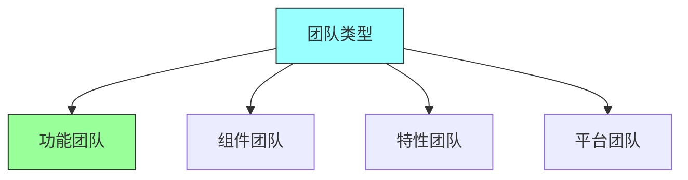
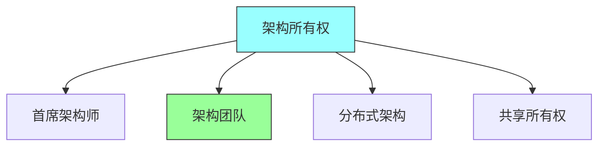
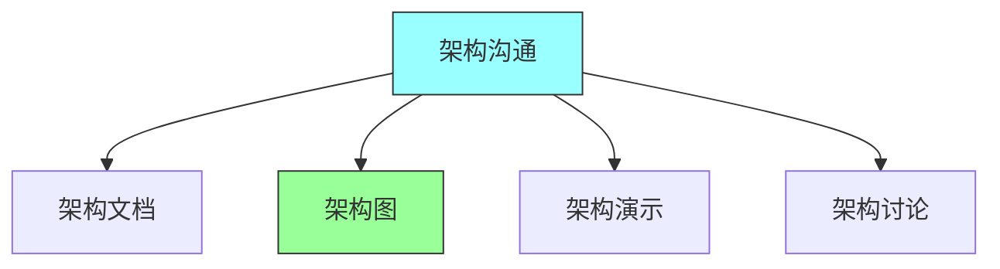

# 第十四章：Architecture and the Team

## 一、架构与团队关系

### 1.1 架构影响团队

架构决策影响团队的组织和工作：

**康威定律**：架构反映组织结构。**团队边界**：架构边界与团队边界一致。**沟通模式**：架构影响团队沟通。**工作流程**：架构影响团队工作流程。

### 1.2 团队影响架构

团队的能力和结构影响架构：

**团队技能**：团队技能影响技术选型。**团队规模**：团队规模影响架构风格。**团队分布**：团队分布影响架构设计。**团队经验**：团队经验影响架构决策。

### 1.3 协调架构与团队

协调架构与团队的关系：

**架构适配团队**：选择适合团队的架构。**团队适应架构**：团队学习适应架构。**持续协调**：持续协调架构与团队。**共同演进**：架构和团队共同演进。

## 二、团队结构与架构

### 2.1 团队类型

不同类型的团队：

**功能团队**：按功能组织的团队。**组件团队**：按组件组织的团队。**特性团队**：按特性组织的团队。**平台团队**：平台型团队。

### 2.2 团队规模

团队规模对架构的影响：

| 团队规模 | 适合架构 | 特点 |
|---------|---------|------|
| 小团队 | 微服务 | 灵活、快速响应 |
| 大团队 | 分层架构 | 需要正式流程 |
| 分布式团队 | 服务化 | 需要文档和流程 |
| 跨职能团队 | 端到端 | 全栈交付 |

**小团队**：适合微服务架构。**大团队**：需要更正式的架构流程。**分布式团队**：需要更多文档和流程。**跨职能团队**：支持端到端交付。

### 2.3 团队协作

团队之间的协作模式：

**紧密协作**：同一地点的紧密协作。**分布式协作**：跨地点的协作。**异步协作**：通过文档和代码协作。**工具支持**：使用工具支持协作。

## 三、架构所有权

### 3.1 架构所有权模式

架构所有权的不同模式：

**首席架构师**：单一架构师负责。**架构团队**：专门的架构师团队。**分布式架构**：架构责任分布式。**共享所有权**：团队共享架构所有权。

### 3.2 架构决策权

架构决策权的分配：

**集中式决策**：架构决策集中做出。**分布式决策**：架构决策分布式做出。**协商决策**：通过协商做出决策。**渐进式授权**：逐步授权决策权。

### 3.3 架构治理

架构治理的实践：

**架构评审委员会**：通过委员会治理。**架构评审流程**：建立评审流程。**架构决策记录**：记录架构决策。**架构合规检查**：检查架构合规性。

## 四、团队能力建设

### 4.1 架构技能培养

培养团队的架构能力：

**架构培训**：提供架构培训。**实践机会**：提供架构实践机会。**导师制度**：建立导师制度。**知识分享**：促进知识分享。

### 4.2 架构沟通

提高团队的架构沟通能力：

**架构文档**：编写清晰的架构文档。**架构图**：绘制清晰的架构图。**架构演示**：进行架构演示。**架构讨论**：组织架构讨论。

### 4.3 架构参与

增加团队对架构的参与：

**架构评审**：让更多人参于架构评审。**架构决策**：让团队参与决策。**架构反馈**：收集团队对架构的反馈。**架构所有权**：建立团队的架构所有权。

## 五、总结与启示

核心要点：架构与团队结构相互影响。选择适合团队结构的架构模式。明确架构所有权和决策权。培养团队的架构能力。

---

*本章精读笔记完成*
