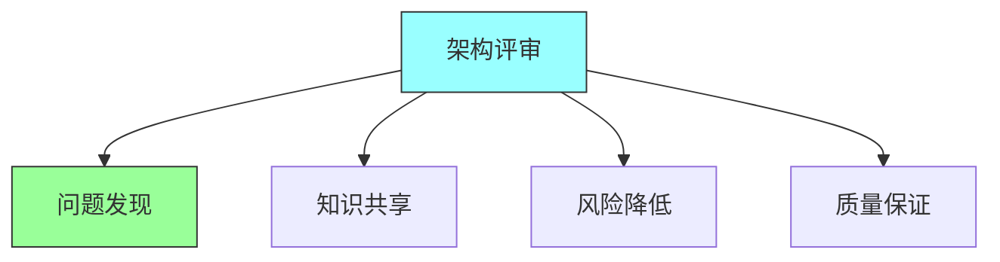
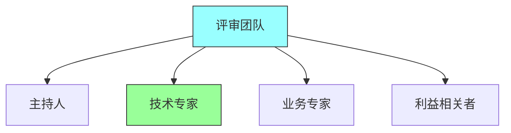
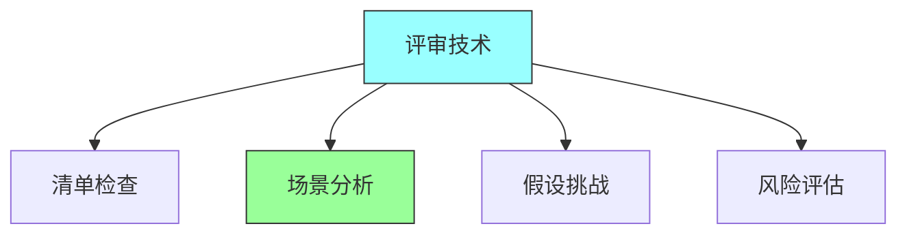
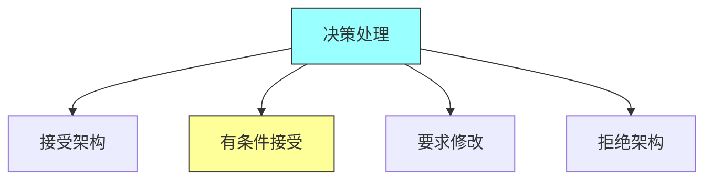

# 第十五章：Architecture Reviews

## 一、架构评审概述

### 1.1 架构评审定义

架构评审是对架构的正式检查：

**定义**：系统性地检查架构决策。**目的**：验证架构满足需求。**时机**：在架构生命周期中的评审。**参与者**：架构师、开发人员、利益相关者。

### 1.2 架构评审类型

不同类型的架构评审：

| 评审类型 | 评审内容 | 适用时机 |
|---------|---------|---------|
| 概念评审 | 概念架构 | 项目早期 |
| 详细评审 | 详细设计 | 设计阶段 |
| 安全评审 | 安全性 | 上线前 |
| 性能评审 | 性能指标 | 性能优化时 |

**概念评审**：评审概念架构。**详细评审**：评审详细架构设计。**安全评审**：评审架构的安全性。**性能评审**：评审架构的性能。

### 1.3 架构评审价值

架构评审的价值：

**问题发现**：早期发现架构问题。**知识共享**：促进架构知识共享。**风险降低**：降低架构风险。**质量保证**：保证架构质量。

## 二、架构评审准备

### 2.1 评审材料准备

准备架构评审材料：

**架构文档**：准备架构文档。**决策记录**：准备架构决策记录。**风险分析**：准备风险分析报告。**原型演示**：准备原型或演示。

### 2.2 评审团队组建

组建评审团队：

**评审主持人**：选择有经验的主持人。**技术专家**：包括技术专家。**业务专家**：包括业务专家。**利益相关者**：包括关键利益相关者。

### 2.3 评审议程设计

设计评审议程：

**议程结构**：设计评审的结构。**时间分配**：分配各部分的时间。**评审重点**：确定评审的重点。**输出定义**：定义评审的输出。

## 三、架构评审执行

### 3.1 评审会议

执行架构评审会议：

**开场介绍**：介绍评审目的和议程。**架构介绍**：介绍被评审的架构。**问题讨论**：讨论发现的问题。**结果总结**：总结评审结果。

### 3.2 评审技术

使用有效的评审技术：

**清单检查**：使用评审清单。**场景分析**：使用场景进行分析。**假设挑战**：挑战架构的假设。**风险评估**：评估架构的风险。

### 3.3 评审记录

记录评审的结果：

**问题记录**：记录发现的问题。**建议记录**：记录改进建议。**决策记录**：记录评审决策。**行动项**：分配后续行动项。

## 四、评审结果处理

### 4.1 问题处理

处理评审中发现的问题：

**问题分类**：分类问题。**优先级排序**：排序问题的优先级。**责任分配**：分配问题解决责任。**跟踪解决**：跟踪问题的解决。

### 4.2 决策处理

处理评审中的决策：

**接受架构**：接受架构设计。**有条件接受**：有条件地接受。**要求修改**：要求修改后重新评审。**拒绝架构**：拒绝架构设计。

### 4.3 后续跟踪

跟踪评审的后续行动：

**行动项跟踪**：跟踪行动项的完成。**复评安排**：安排复评。**经验总结**：总结评审经验。**流程改进**：改进评审流程。

## 五、总结与启示

核心要点：架构评审是保证架构质量的重要手段。充分准备评审材料和团队。有效执行评审会议并记录结果。处理评审结果并跟踪后续行动。

---

*本章精读笔记完成*
