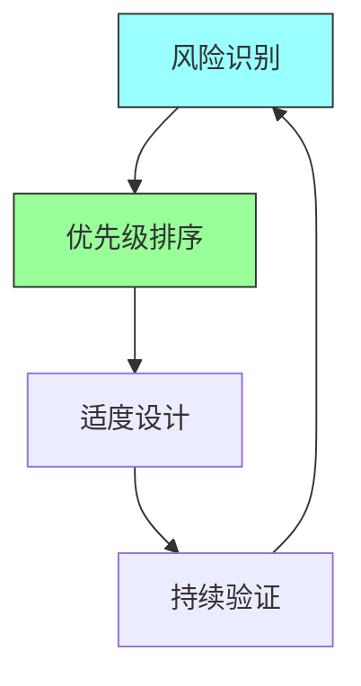
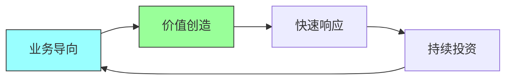
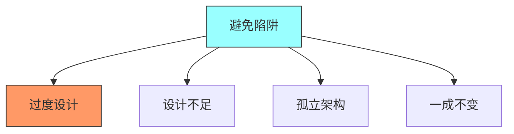
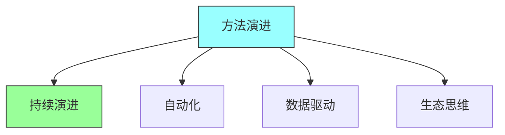
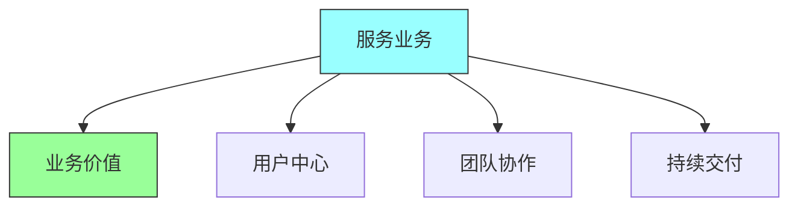

# 第十六章：The Last Word

## 一、核心思想回顾

### 1.1 风险驱动方法

回顾本书的核心方法论：

**风险识别**：识别项目的关键风险。**优先级排序**：按风险排序架构投入。**适度设计**：根据风险调整设计深度。**持续验证**：通过迭代验证架构。

### 1.2 实用主义架构

回顾实用主义的架构原则：

**简单优先**：选择简单的解决方案。**实证验证**：用实验验证假设。**价值导向**：每一项决策都要创造价值。**持续改进**：不断改进架构。

### 1.3 架构与业务

架构与业务的结合：

**业务导向**：架构为业务服务。**价值创造**：架构创造业务价值。**快速响应**：架构支持快速响应变化。**持续投资**：持续投资架构。

## 二、架构实践建议

### 2.1 开始实践

开始应用本书的方法：

**从小处开始**：从一个小项目开始。**选择适当风险**：选择适当的风险领域。**建立模式**：建立架构实践模式。**持续学习**：持续学习和改进。

### 2.2 避免陷阱

避免常见的架构陷阱：

**过度设计**：避免为不存在的问题设计。**设计不足**：避免忽视重要的风险。**孤立架构**：避免架构与业务脱节。**一成不变**：避免架构不随业务演进。

### 2.3 持续改进

持续改进架构实践：

**收集反馈**：收集架构实践的反馈。**评估效果**：评估架构的效果。**调整方法**：根据反馈调整方法。**分享经验**：与团队分享经验。

## 三、未来展望

### 3.1 架构趋势

软件架构的未来趋势：

**云原生架构**：基于云原生技术的架构。**微服务**：微服务架构的普及。**Serverless**：Serverless架构的兴起。**智能化**：AI辅助架构设计。

### 3.2 方法演进

架构方法的演进：

**持续演进**：架构持续演进的实践。**自动化**：架构设计的自动化。**数据驱动**：数据驱动的架构决策。**生态思维**：生态系统思维。

### 3.3 持续学习

保持学习的建议：

**阅读经典**：阅读架构经典书籍。**实践项目**：在项目中实践。**社区参与**：参与技术社区。**分享传播**：分享经验和知识。

## 四、给读者的寄语

### 4.1 拥抱不确定性

拥抱架构中的不确定性：

**接受变化**：接受需求和技术的变化。**灵活应对**：灵活应对变化。**实验验证**：用实验验证假设。**持续学习**：保持学习的态度。

### 4.2 追求卓越

追求架构的卓越：

**质量优先**：坚持质量标准。**持续改进**：持续改进架构。**创新探索**：探索新的方法和技术。**分享传承**：分享知识和经验。

### 4.3 服务业务

始终服务于业务：

**业务价值**：以业务价值为导向。**用户中心**：以用户为中心。**团队协作**：与团队紧密协作。**持续交付**：持续交付业务价值。

## 五、总结

核心要点：风险驱动方法帮助优化架构投入。实用主义是架构设计的核心原则。架构需要与业务紧密结合。持续学习和改进是架构师的核心能力。

---

*本书精读笔记完成*
