# 《Designing Data-Intensive Applications》- 第10章：批处理（深度版）

## 一、本章概述

本章深入探讨了**批处理（Batch Processing）**技术，这是大规模数据处理的基础范式之一。批处理系统通过对大量静态数据进行批量计算，提供了强大的数据处理能力和高吞吐量。

> **本章核心问题**：如何高效地处理 TB/PB 级别的静态数据？批处理系统如何实现容错和水平扩展？

### 1.1 核心主题
- 批处理的本质与特点
- MapReduce 模型详解
- 数据流引擎与 Spark
- 批处理优化技术
- 批处理的应用场景

### 1.2 重要程度
⭐⭐⭐⭐（高）

### 1.3 预计学习时间
100-120 分钟

### 1.4 本章与其他章节的关联

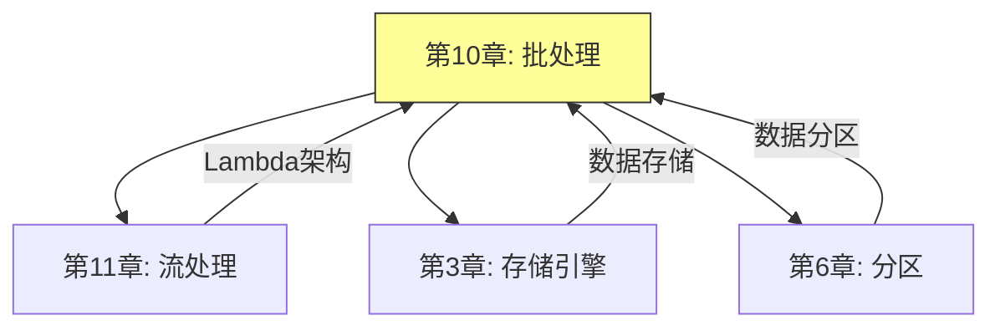

---

## 二、批处理的本质

### 2.1 批处理的特点

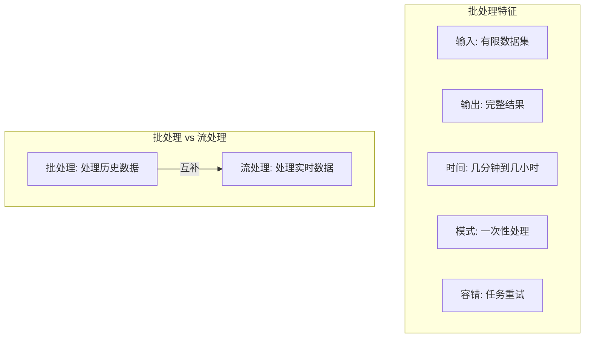

**批处理的核心特点：**

| 特点 | 说明 | 优势 |
|-----|-----|-----|
| **数据有限** | 处理固定大小的数据集 | 可预测的资源使用 |
| **一次性** | 任务执行后结束 | 简化容错处理 |
| **高吞吐** | 优化批量读写 | 处理大规模数据 |
| **容错性** | 失败后可重跑 | 结果准确 |

### 2.2 批处理的应用场景

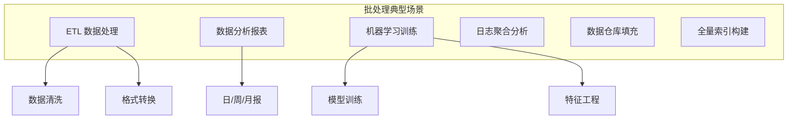

---

## 三、MapReduce 模型

### 3.1 MapReduce 概述

**MapReduce** 是 Google 提出的经典批处理编程模型，将计算分为 Map 和 Reduce 两个阶段。

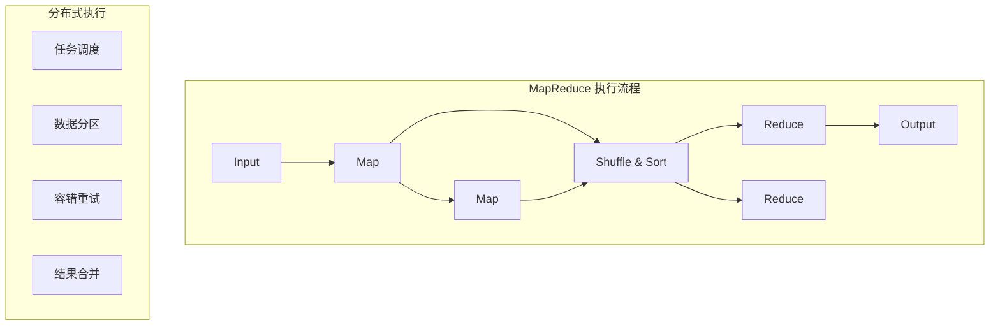

### 3.2 Map 阶段详解

**Map 函数**：将输入数据转换为键值对。

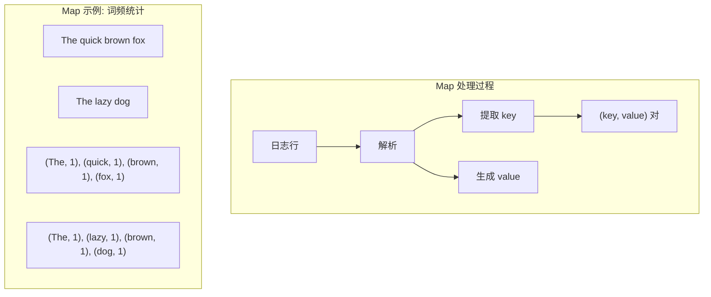

### 3.3 Shuffle 阶段详解

**Shuffle**：Map 和 Reduce 之间的数据分发过程。

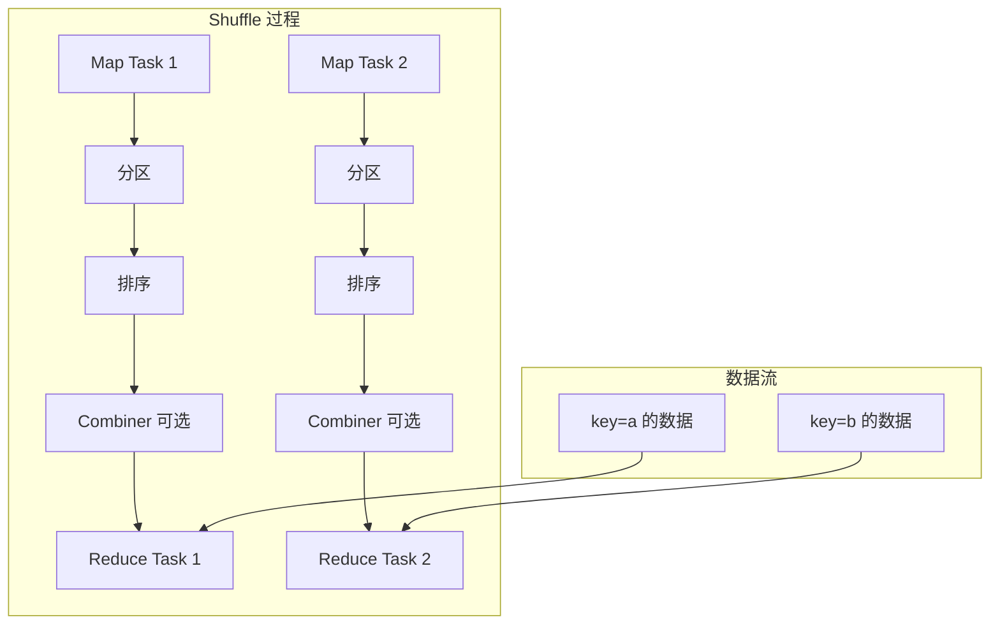

**Shuffle 的关键步骤：**

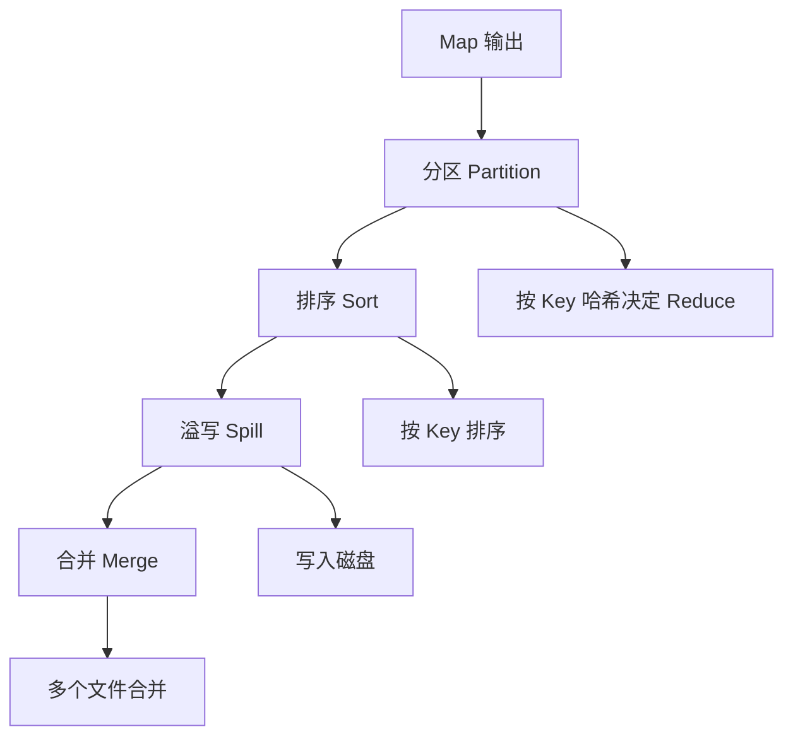

### 3.4 Reduce 阶段详解

**Reduce 函数**：对相同 key 的所有 value 进行聚合。

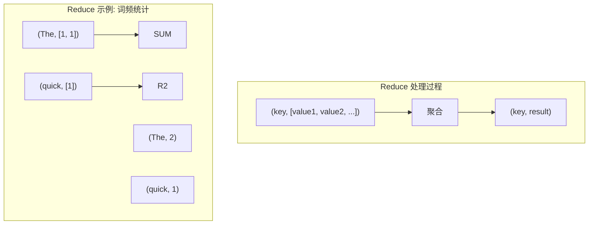

### 3.5 MapReduce 代码示例

**WordCount 示例：**

```java
// Mapper
public static class WordCountMapper
    extends Mapper<LongWritable, Text, Text, IntWritable> {

    private final static IntWritable one = new IntWritable(1);
    private Text word = new Text();

    public void map(LongWritable key, Text value, Context context) {
        String line = value.toString();
        String[] words = line.split(" ");

        for (String w : words) {
            word.set(w);
            context.write(word, one);
        }
    }
}

// Reducer
public static class WordCountReducer
    extends Reducer<Text, IntWritable, Text, IntWritable> {

    public void reduce(Text key, Iterable<IntWritable> values, Context context) {
        int sum = 0;
        for (IntWritable v : values) {
            sum += v.get();
        }
        context.write(key, new IntWritable(sum));
    }
}
```

### 3.6 MapReduce 的容错机制

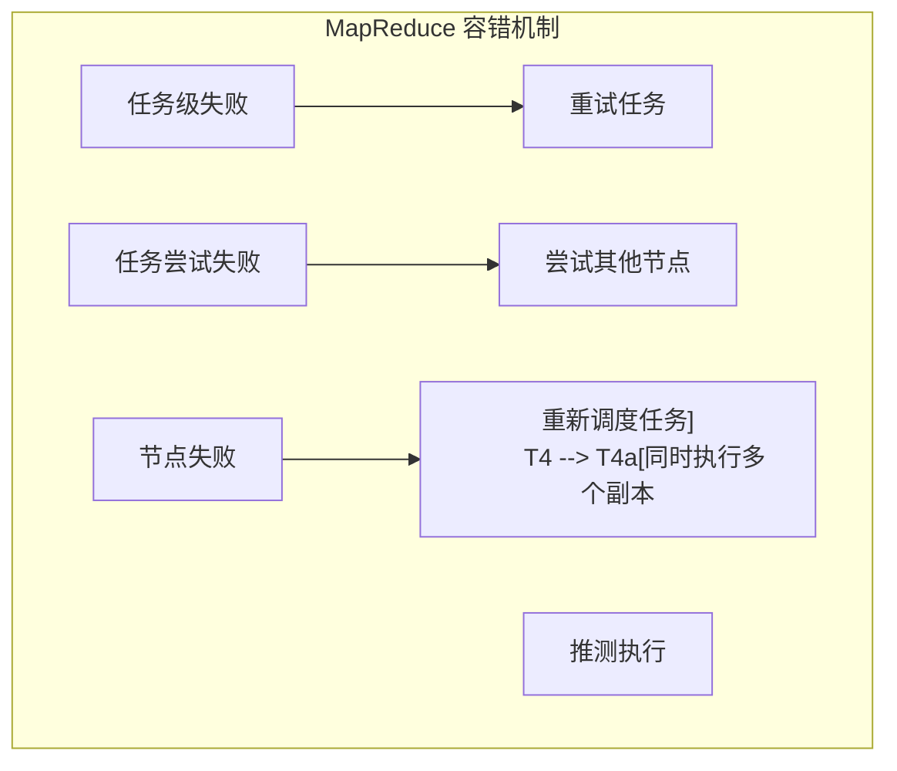

**容错策略：**

| 失败类型 | 处理方式 | 重试次数 |
|---------|---------|---------|
| Map 任务失败 | 在其他节点重新执行 | 通常 4 次 |
| Reduce 任务失败 | 重新获取 Map 输出并执行 | 通常 4 次 |
| 节点故障 | 调度器重新分配任务 | 自动检测 |
| 任务卡住 | 启动备份任务 | 推测执行 |

---

## 四、数据流引擎

### 4.1 MapReduce 的局限性

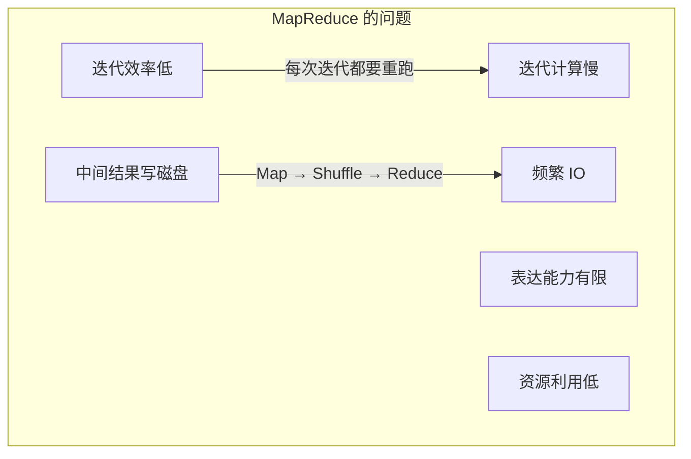

| 问题 | 影响 | 改进方向 |
|-----|-----|---------|
| **迭代计算** | 无法高效支持 ML、图计算 | 引入 DAG 执行 |
| **中间结果** | 每次都写 HDFS | 内存缓存 |
| **任务启动** | 开销大 | 持续运行的进程 |
| **灵活性** | 只有 Map+Reduce | 多种算子 |

### 4.2 Spark 核心概念

**Spark** 是新一代数据流引擎，通过 DAG 和内存计算解决了 MapReduce 的问题。

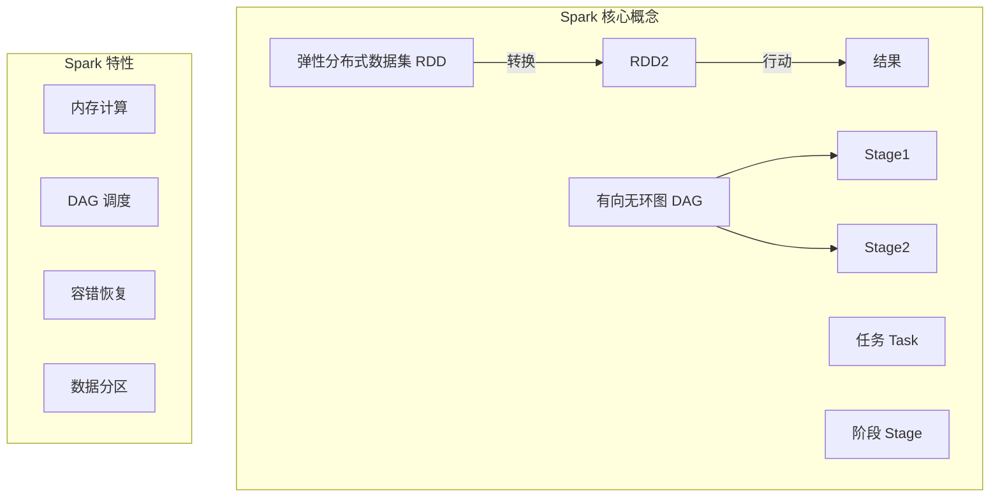

### 4.3 RDD 与 DataFrame

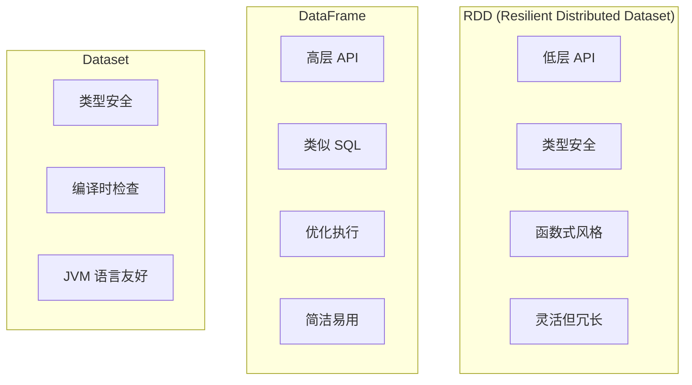

### 4.4 Spark 执行流程

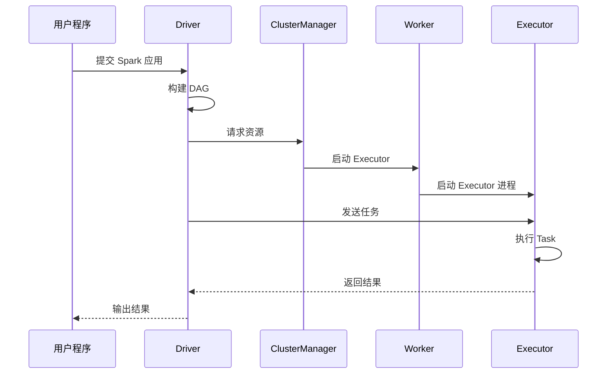

### 4.5 Spark 宽依赖与窄依赖

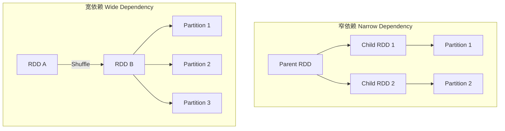

| 依赖类型 | 特点 | 适用操作 |
|---------|-----|---------|
| **窄依赖** | 父分区对应一个子分区 | map, filter |
| **宽依赖** | 父分区对应多个子分区 | groupBy, join |

---

## 五、批处理优化技术

### 5.1 数据分区与并行度

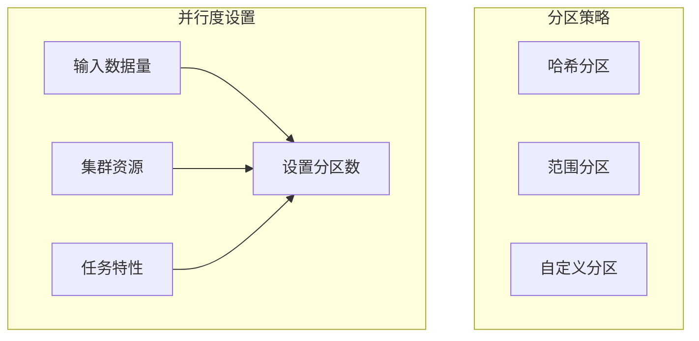

### 5.2 排序优化

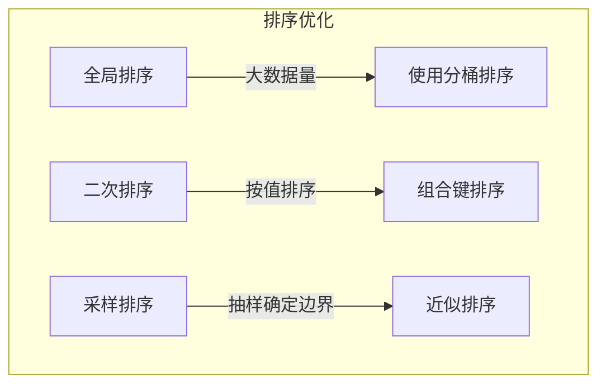

### 5.3 连接策略

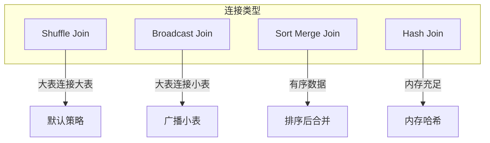

**连接策略选择：**

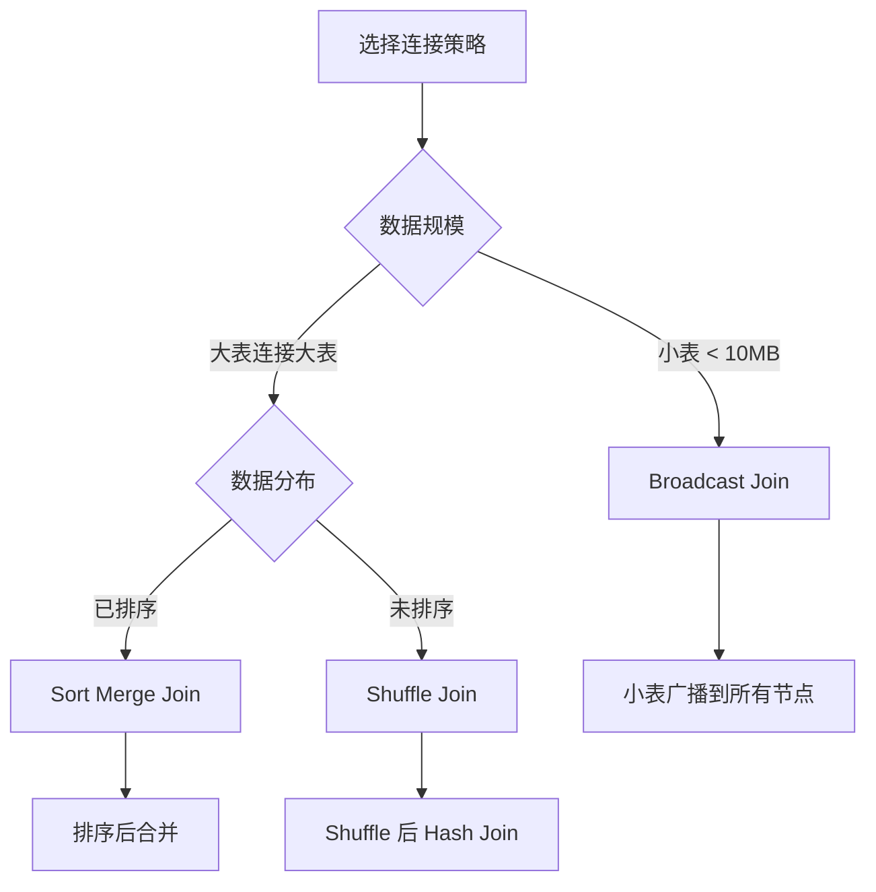

### 5.4 缓存与持久化

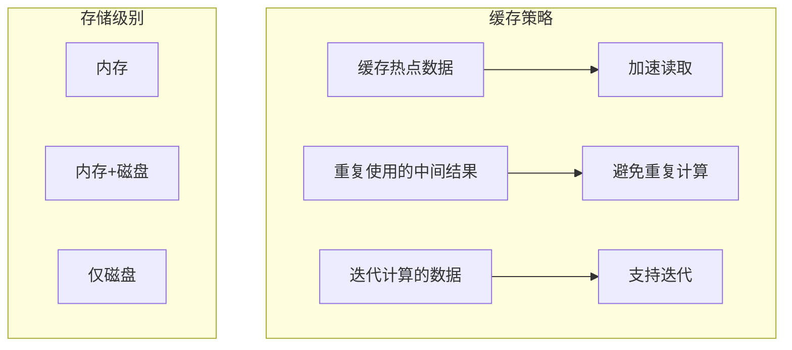

---

## 六、批处理的应用场景

### 6.1 ETL 数据处理

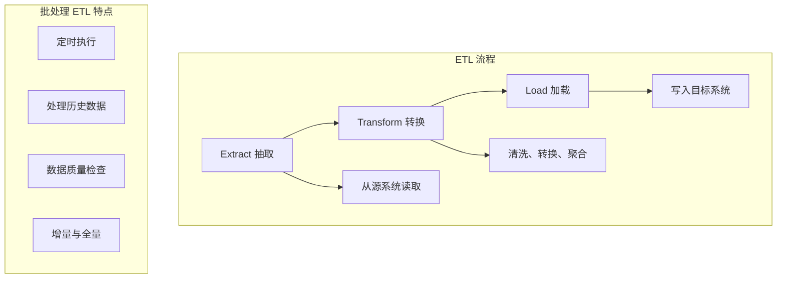

### 6.2 数据仓库

```mermaid
graph TD
    subgraph 数据仓库["数据仓库架构"]
        ODS[操作数据存储]
        DW[数据仓库]
        DM[数据集市]

        ODS -->|"ETL"| DW
        DW -->|"切片"| DM

        subgraph 分层["分层架构"]
            L1[STG 临时层]
            L2[DWD 明细层]
            L3[DWS 汇总层]
            L4[ADS 应用层]
        end
    end
```

### 6.3 机器学习训练

```mermaid
graph TD
    subgraph ML训练["批处理在 ML 中的应用"]
        D[数据准备] --> F[特征工程]
        F --> T[模型训练]
        T --> E[模型评估]

        D --> D1["数据清洗"]
        D --> D2[特征提取]
        T --> T1["批量梯度下降"]
        T --> T2[分布式训练]
    end

    subgraph 分布式训练["分布式训练策略"]
        S1[数据并行]
        S2[模型并行]
        S3[流水线并行]
    end
```

---

## 七、面试题整理

### 7.1 概念理解类 🌱

**Q1：MapReduce 的执行流程是什么？**

**答案：**

**MapReduce 执行流程：**

```mermaid
graph TD
    A[输入分片] --> B[Map 阶段]
    B --> C[Shuffle 阶段]
    C --> D[Reduce 阶段]
    D --> E[输出]

    A --> A1["InputFormat 决定分片"]
    B --> B1["每个分片一个 Map 任务"]
    C --> C1["分区、排序、合并"]
    D --> D1["相同 key 的数据聚合"]
```

**详细步骤：**

1. **输入分片**：将大文件分成固定大小的块
2. **Map 阶段**：每个 Map 任务处理一个分片，输出键值对
3. **Shuffle 阶段**：按 key 分区、排序，将数据发送到 Reduce
4. **Reduce 阶段**：对相同 key 的数据进行聚合
5. **输出**：写入 HDFS

**Q2：Spark 和 MapReduce 有什么区别？**

**答案：**

| 特性 | MapReduce | Spark |
|-----|-----------|-------|
| **编程模型** | Map + Reduce | RDD + 多种转换 |
| **中间结果** | 写 HDFS | 内存缓存 |
| **迭代计算** | 每次重跑 | 缓存 RDD |
| **容错** | 任务重试 | Lineage 重建 |
| **资源利用** | 任务级隔离 | Executor 进程 |
| **API 丰富度** | 有限 | 丰富 |

---

### 7.2 原理分析类 🌿

**Q3：Spark 的宽依赖和窄依赖有什么区别？有什么影响？**

**答案：**

**窄依赖：**
- 一个父分区只对应一个子分区
- 可以在同一个节点流水线执行
- 失败恢复只需要重新计算受影响的分区

**宽依赖：**
- 一个父分区对应多个子分区
- 需要 Shuffle，数据跨节点传输
- 失败恢复需要重新计算所有上游分区

**对 Stage 划分的影响：**

```mermaid
graph TD
    subgraph Stage划分["Stage 划分规则"]
        R1["窄依赖 → 同一个 Stage"]
        R2["宽依赖 → 新 Stage 边界"]
        R3["Shuffle → Stage 分隔符"]
    end

    D1["map → filter → map → filter"]
    D2["map → groupBy → reduce"]
    D3["↑ 这里有 Shuffle，划分 Stage"]
```

**Q4：Spark 如何实现容错？RDD 的 Lineage 是什么？**

**答案：**

**Spark 容错机制：**

```mermaid
graph TD
    subgraph 容错实现["Spark 容错机制"]
        L[Lineage 血缘]
        C[Checkpoint 检查点]
        R[任务重试]

        L -->|"依赖关系"| R1["丢失分区从上游重建"]
        C -->|"快照"| R2["避免长 lineage"]
        R -->|"失败重试"| R3["重新执行任务"]
    end
```

**RDD Lineage（血缘）：**
- 每个 RDD 记录了创建它的转换操作
- 形成一个依赖图（Lineage Graph）
- 丢失数据时，可以根据 Lineage 重新计算

```scala
// Lineage 示例
val lines = sc.textFile("hdfs://...")           // HadoopRDD
val words = lines.flatMap(_.split(" "))          // FlatMappedRDD
val pairs = words.map((_, 1))                    // MapPartitionsRDD
val counts = pairs.reduceByKey(_ + _)             // ShuffledRDD

// Lineage: HadoopRDD → FlatMappedRDD → MapPartitionsRDD → ShuffledRDD
```

---

### 7.3 对比选型类 🔧

**Q5：什么场景下应该使用批处理，什么场景下应该使用流处理？**

**答案：**

```mermaid
flowchart TD
    A[选择处理模式] --> B{数据特点}

    B -->|历史数据| C[批处理]
    B -->|实时数据| D[流处理]
    B -->|两者都要| E[Lambda 架构]

    C --> C1["日终报表"]
    C --> C2["模型训练"]
    C --> C3["全量索引"]

    D --> D1["实时监控"]
    D --> D2["告警"]
    D --> D3["在线推荐"]

    E --> E1["实时+历史结合"]
    E --> E2["批流一体"]
```

**选择建议：**

| 场景 | 推荐 | 原因 |
|-----|-----|-----|
| 日报/周报 | 批处理 | 数据完整、处理时间充裕 |
| 实时监控 | 流处理 | 延迟要求高 |
| 机器学习 | 批处理 | 需要全量数据 |
| 异常检测 | 流处理 + 批处理 | 实时 + 历史对比 |

**Q6：如何优化 Spark 作业的性能？**

**答案：**

**性能优化方向：**

```mermaid
graph TD
    subgraph 优化维度["Spark 优化维度"]
        O1[数据序列化]
        O2[内存管理]
        O3[并行度设置]
        O4[数据倾斜处理]
        O5[Shuffle 优化]
    end

    O1 --> S1["使用 Kryo 序列化"]
    O2 --> S2["调整堆内存/Off-heap"]
    O3 --> S3["合理设置分区数"]
    O4 --> S4["倾斜 key 单独处理"]
    O5 --> S5["减少 Shuffle 数据量"]
```

**具体优化措施：**

| 优化项 | 具体措施 | 效果 |
|-------|---------|-----|
| **序列化** | 使用 Kryo 替代 Java 序列化 | 减少 10x 体积 |
| **缓存** | 缓存常用 RDD | 避免重复计算 |
| **并行度** | 设置合适的分区数 | 充分利用资源 |
| **Shuffle** | 减少 Shuffle 文件 | 提升性能 |
| **广播** | 广播小表 | 避免 Shuffle |
| **数据倾斜** | 加盐、打散、聚合 | 避免热点 |

---

### 7.4 实战应用类 🔧

**Q7：设计一个批处理系统来处理日增 1TB 的日志数据**

**答案：**

**系统设计：**

```mermaid
graph TD
    subgraph 整体架构["批处理系统架构"]
        I[数据采集] --> Q[消息队列]
        Q --> H[HDFS 存储]
        H --> S[Spark 处理]
        S --> D[数据仓库]
        D --> R[报表/应用]
    end

    subgraph 技术选型["技术选型"]
        T1[采集: Flume/Filebeat]
        T2[存储: HDFS/Parquet]
        T3[处理: Spark]
        T4[调度: Airflow/Oozie]
    end
```

**关键设计点：**

| 设计点 | 方案 | 考虑因素 |
|-------|-----|---------|
| **数据分区** | 按日期/小时分区 | 查询效率 |
| **文件格式** | Parquet + Snappy | 压缩率 + 性能 |
| **调度策略** | 每日凌晨执行 | 资源空闲期 |
| **容错机制** | 检查点 + 重试 | SLA 保证 |
| **监控告警** | 任务执行监控 | 问题及时发现 |

---

## 八、实践要点

### 8.1 批处理作业设计原则

```mermaid
graph TD
    A[批处理设计原则] --> B[输入优化]
    A --> C[计算优化]
    A --> D[输出优化]
    A --> E[资源优化]

    B --> B1["合理分区"]
    B --> B2["使用列式存储"]
    C --> C1["减少 Shuffle"]
    C --> C2["缓存热点数据"]
    D --> D1["批量写入"]
    D --> D2["适当压缩"]
    E --> E1["动态资源分配]
    E --> E2["预估资源需求"]
```

### 8.2 常见问题与解决方案

| 问题 | 原因 | 解决方案 |
|-----|-----|---------|
| **数据倾斜** | Key 分布不均 | 加盐、打散 |
| **内存溢出** | 分区过大 | 增加分区数 |
| **任务卡住** | 数据倾斜/资源不足 | 监控定位 |
| **执行慢** | 并行度不足 | 调整分区数 |
| **Shuffle 量大** | 连接/聚合不当 | 使用广播 |

### 8.3 批处理与流处理的关系

```mermaid
graph TD
    subgraph 两种处理["批处理与流处理"]
        B[批处理: 有界数据] --> L[Lambda 架构]
        S[流处理: 无界数据] --> L

        L -->|"批处理层"| H[HDFS]
        L -->|"速度层"| R[实时计算]
        L -->|"服务层"| V[结果合并]
    end

    subgraph Kappa架构["Kappa 架构（批流一体）"]
        K[统一流处理]
        K --> B["批量处理 = 流的切片"]
        K --> S["实时处理 = 流的部分"]
    end
```

---

## 九、扩展阅读

### 9.1 必读论文

| 论文 | 作者 | 年份 | 贡献 |
|-----|-----|-----|-----|
| MapReduce | Dean, Ghemawat | 2004 | MapReduce 模型 |
| Spark | Zaharia et al. | 2010 | Spark 内存计算 |
| Dataflow | Google | 2015 | Dataflow 模型 |

### 9.2 推荐资源

- Spark 官方文档：spark.apache.org
- 《Spark: The Definitive Guide》
- Hadoop 官方文档

### 9.3 实践项目

- 实现 WordCount（MapReduce + Spark）
- 设计 ETL 管道
- 搭建 Spark 集群进行大数据分析

---

## 十、本章小结

### 核心收获

1. **批处理的本质**
   - 处理有限数据集
   - 高吞吐、高容错
   - 适用于离线分析

2. **MapReduce 模型**
   - Map + Reduce 简单模型
   - Shuffle 实现数据分发
   - 容错通过任务重试

3. **Spark 的改进**
   - 内存计算
   - DAG 执行计划
   - 丰富的 API

4. **批处理优化**
   - 合理设置并行度
   - 减少 Shuffle
   - 处理数据倾斜

### 概念地图

```mermaid
mindmap
  root((批处理))
    计算模型
      MapReduce
      Spark RDD
      Dataflow
    核心概念
      分区
      Shuffle
      容错
    优化技术
      缓存
      广播
      序列化
```

### 下一章预告

第 11 章将探讨**流处理**，了解如何处理实时数据流：
- 事件时间处理
- 窗口计算
- 流处理框架
- 批流一体

---

## 附录 A：MapReduce vs Spark 对比

| 特性 | MapReduce | Spark |
|-----|-----------|-------|
| 编程模型 | Map + Reduce | 转换 + 行动 |
| 中间结果 | HDFS | 内存 |
| 容错 | 任务重试 | Lineage |
| 迭代计算 | 低效 | 高效 |
| 资源管理 | YARN | YARN/K8s |
| 语言支持 | Java | Scala/Java/Python/R |

## 附录 B：Spark RDD 转换操作

| 操作类型 | 转换 | 说明 |
|---------|-----|-----|
| **转换** | map | 元素级转换 |
| **转换** | flatMap | 展平转换 |
| **转换** | filter | 过滤 |
| **转换** | groupByKey | 按 key 分组 |
| **转换** | reduceByKey | 按 key 聚合 |
| **行动** | collect | 收集到 driver |
| **行动** | count | 计数 |
| **行动** | saveAsTextFile | 保存 |

---

*文档生成时间：2024-01-08*
*基于《Designing Data-Intensive Applications》第10章*
