# 《Designing Data-Intensive Applications》- 第11章：流处理（深度版）

## 一、本章概述

本章深入探讨了**流处理（Stream Processing）**技术，这是处理连续数据流的核心范式。与批处理处理有限数据不同，流处理面对的是无限的、持续到达的数据流。

> **本章核心问题**：如何在毫秒级延迟下持续处理无限的数据流？如何保证流处理的正确性和容错？

### 1.1 核心主题
- 流处理的基本概念
- 事件时间与处理时间
- 窗口计算
- 流处理框架
- 流处理的容错机制
- 流与批处理的统一

### 1.2 重要程度
⭐⭐⭐⭐（高）

### 1.3 预计学习时间
100-120 分钟

### 1.4 本章与其他章节的关联

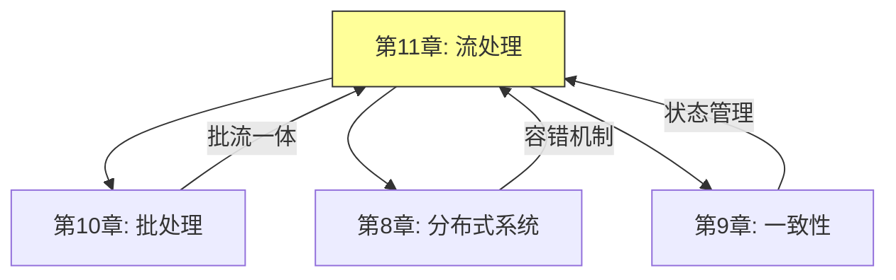

---

## 二、流处理的基本概念

### 2.1 流处理的本质

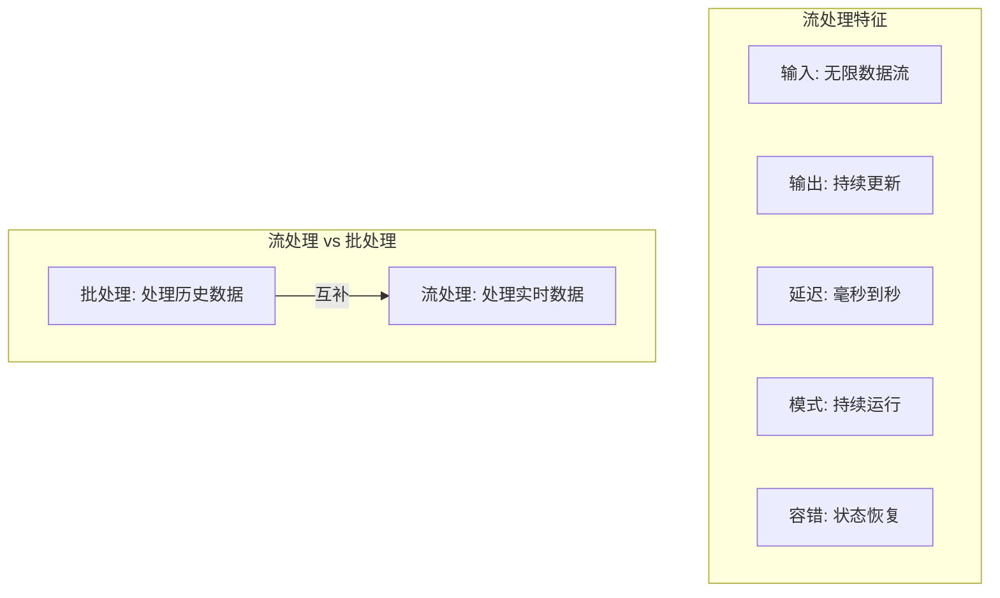

**流处理的核心特点：**

| 特点 | 说明 | 优势 |
|-----|-----|-----|
| **数据无限** | 没有明确的结束 | 持续产生结果 |
| **低延迟** | 处理延迟毫秒级 | 实时响应 |
| **状态流** | 状态随时间变化 | 反映最新情况 |
| **事件驱动** | 事件触发计算 | 资源利用率高 |

### 2.2 流处理的应用场景

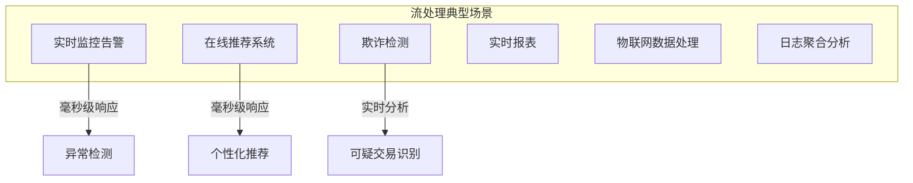

### 2.3 消息队列与流处理

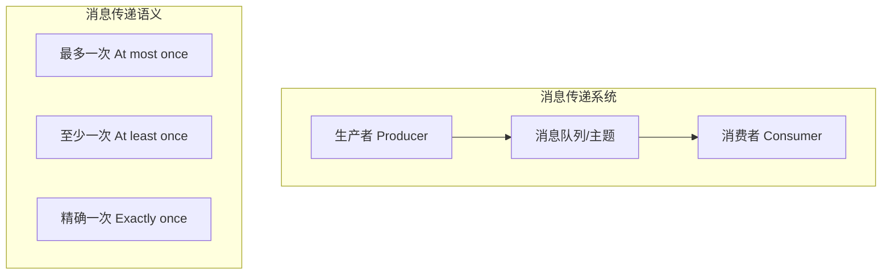

| 语义 | 说明 | 丢失 | 重复 |
|-----|-----|-----|-----|
| **最多一次** | 消息可能丢失 | ✓ | ✗ |
| **至少一次** | 消息不丢失 | ✗ | ✓ |
| **精确一次** | 消息恰好一次 | ✗ | ✗ |

---

## 三、事件时间与处理时间

### 3.1 两种时间

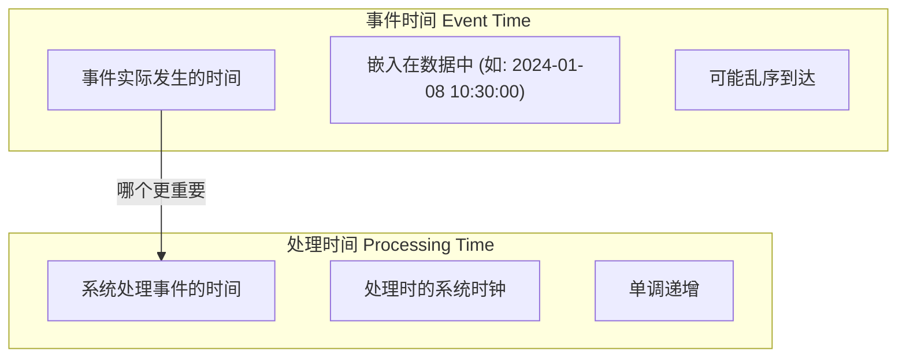

### 3.2 乱序问题

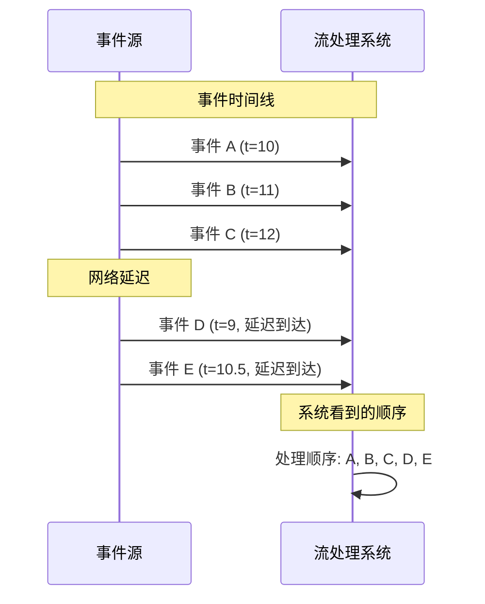

### 3.3 水位线（Watermark）

**水位线**用于追踪事件时间的进度，标记系统认为所有在该时间之前的事件都已经到达。

```mermaid
graph TD
    subgraph 水位线["水位线概念"]
        W1[Watermark(t)]
        W2["表示: 所有 t' < t 的事件都已到达"]
        W3["用于触发窗口计算"]
    end

    subgraph 水位线示例["水位线示例"]
        T1["事件时间: 10:00:00"]
        T2["处理时间: 10:00:05"]
        W["Watermark: 09:59:55"]

        W -->|"安全边界"| T1
    end
```

**水位线策略：**

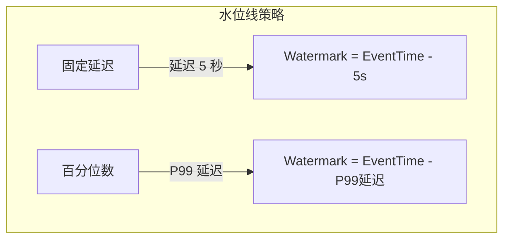

### 3.4 允许延迟（Allowed Lateness）

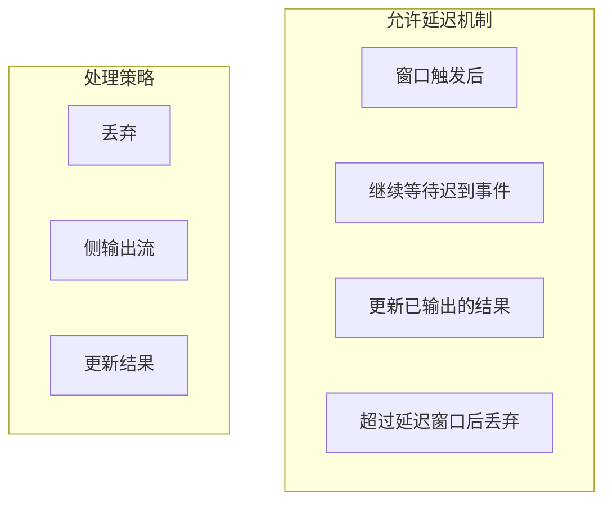

---

## 四、窗口计算

### 4.1 窗口类型

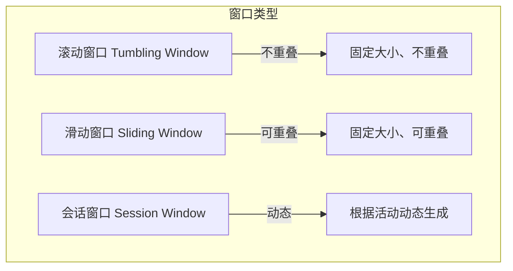

### 4.2 滚动窗口

**滚动窗口**：将数据流切分为固定大小、不重叠的窗口。

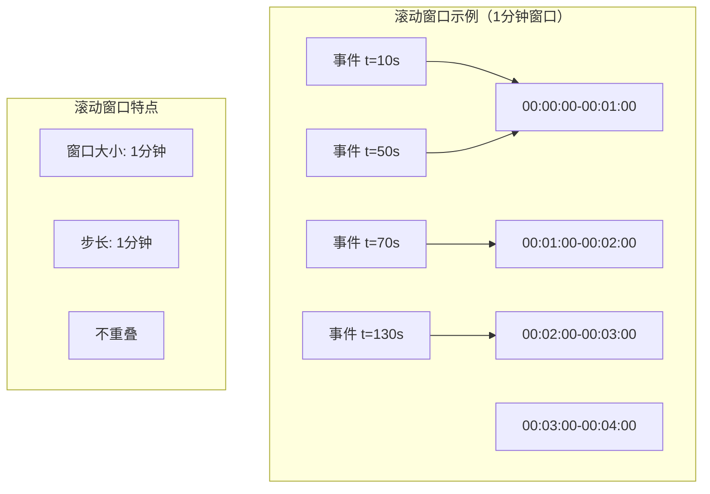

### 4.3 滑动窗口

**滑动窗口**：固定大小、可重叠的窗口。

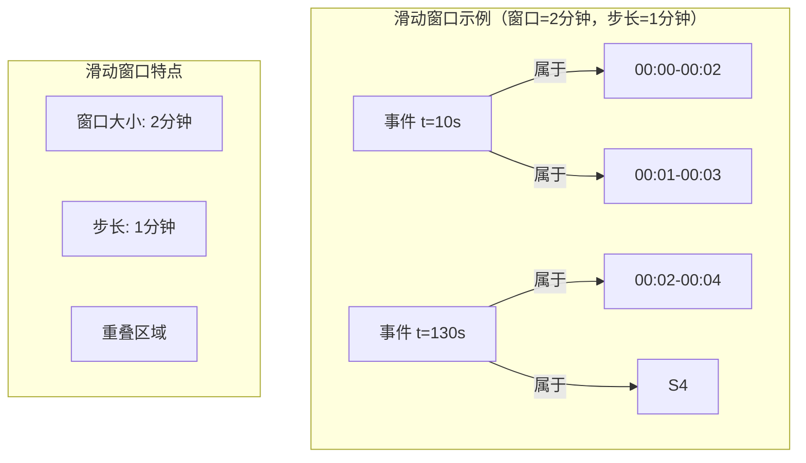

### 4.4 会话窗口

**会话窗口**：根据用户活动动态生成的窗口。

```mermaid
graph TD
    subgraph 会话窗口["会话窗口示例"]
        U1[用户 A]
        U1 --> E1["事件 10:00"]
        U1 --> E2["事件 10:05"]
        U1 --> E3["事件 10:30"]  -- 超过 10 分钟间隔

        S1["会话1: 10:00-10:05"]
        S2["会话2: 10:30-..."]
    end

    subgraph 参数["会话窗口参数"]
        G1[Gap timeout: 10分钟]
        G2[超过 gap 则开始新会话]
    end
```

### 4.5 窗口计算模式

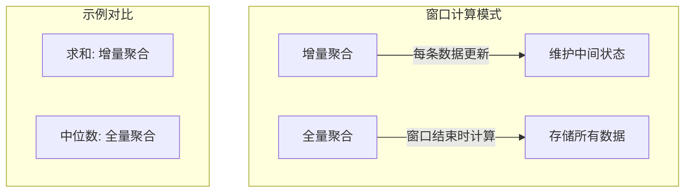

---

## 五、流处理框架

### 5.1 流处理框架对比

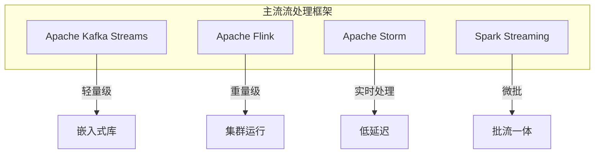

| 框架 | 模型 | 延迟 | 容错 | 适用场景 |
|-----|-----|-----|-----|---------|
| **Kafka Streams** | 轻量级 | 秒级 | exactly-once | 嵌入式应用 |
| **Flink** | 真正的流 | 毫秒级 | exactly-once | 复杂流处理 |
| **Storm** | 实时流 | 毫秒级 | at-least-once | 简单拓扑 |
| **Spark Streaming** | 微批 | 秒级 | exactly-once | 批流统一 |

### 5.2 Flink 核心概念

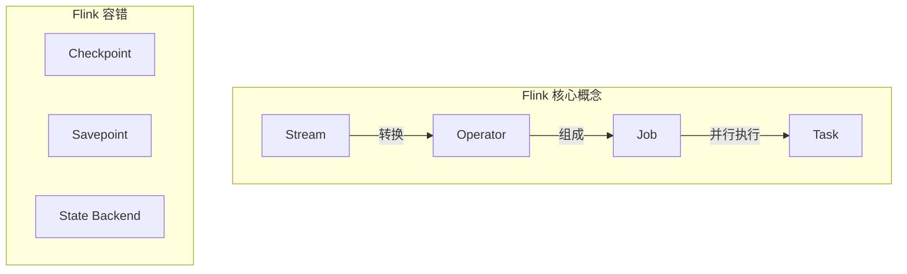

### 5.3 状态管理

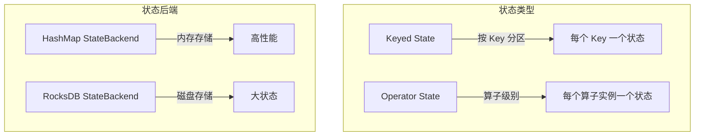

### 5.4 Flink 代码示例

```java
// 窗口聚合示例
DataStream<Tuple2<String, Integer>> input = ...;

// 滚动窗口，1分钟
input
    .keyBy(value -> value.f0)
    .window(TumblingProcessingTimeWindows.of(Time.minutes(1)))
    .aggregate(new SumAggregateFunction());

// 带水位的会话窗口
input
    .keyBy(value -> value.f0)
    .window(EventTimeSessionWindows.withGap(Time.minutes(10)))
    .allowedLateness(Time.minutes(1))
    .sideOutputLateData(lateOutputTag)
    .aggregate(new SessionAggregateFunction());
```

---

## 六、流处理的容错机制

### 6.1 检查点（Checkpoint）

**检查点**是流处理系统实现容错的核心机制，定期保存状态的快照。

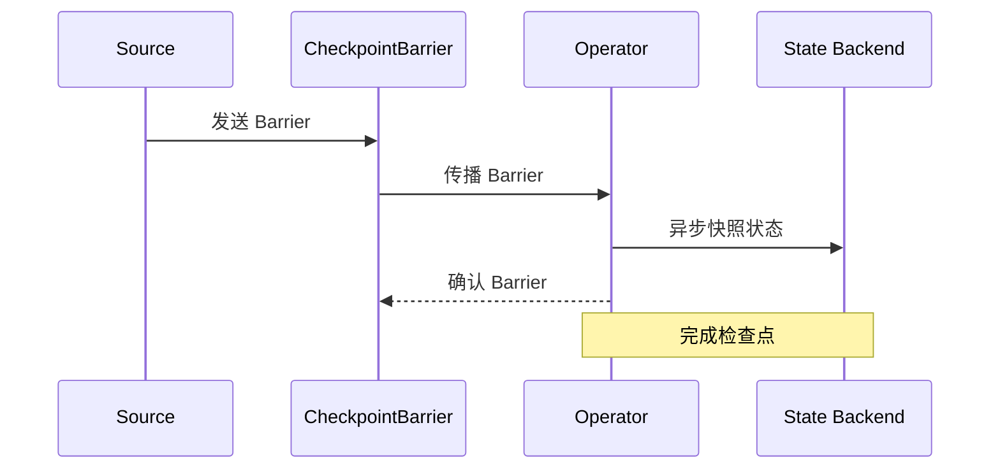

### 6.2 精确一次语义

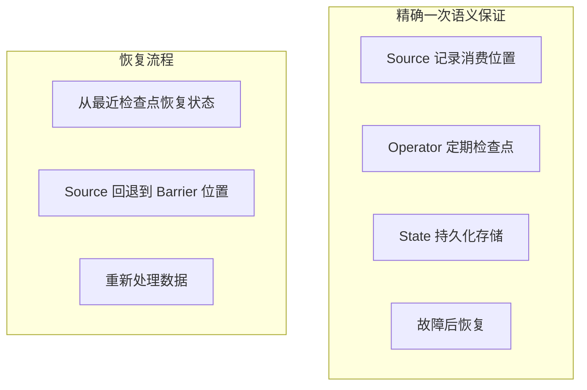

### 6.3 端到端精确一次

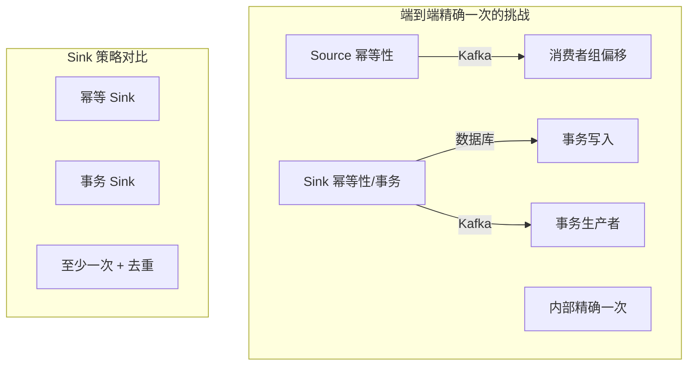

---

## 七、流处理应用场景

### 7.1 实时告警

```mermaid
graph TD
    subgraph 告警系统["实时告警架构"]
        I[事件流] --> P[规则引擎]
        P --> C[条件检测]
        C --> A[告警生成]
        A --> N[通知渠道]

        C -->|"超过阈值"| A
        C -->|"模式匹配"| A
    end

    subgraph 告警规则["告警规则类型"]
        R1[阈值告警]
        R2[速率告警]
        R3[模式告警]
    end
```

### 7.2 实时报表

```mermaid
graph TD
    subgraph 实时报表["实时报表系统"]
        E[事件] --> K[Kafka]
        K --> F[Flink]
        F --> S[Redis/ES]
        S --> D[Dashboard]

        F -->|"实时聚合"| S
        S -->|"API 查询"| D
    end

    subgraph 指标类型["实时指标"]
        M1[PV/UV]
        M2[转化率]
        M3[延迟监控]
    end
```

### 7.3 流与表的双重性

```mermaid
graph TD
    subgraph 流表二元性["流与表的二元性"]
        Stream -->|"追加"| Table
        Table -->|"变更流"| Stream
    end

    subgraph 实现["实现方式"]
        I1[Change Data Capture CDC]
        I2[Materialized View]
        I3[事件溯源]

        I1 -->|"数据变更"| I2
        I2 -->|"维护"| Table
    end
```

---

## 八、面试题整理

### 8.1 概念理解类 🌱

**Q1：什么是事件时间和处理时间？它们有什么区别？**

**答案：**

**事件时间（Event Time）**：事件实际发生的时间，嵌入在数据本身中。

**处理时间（Processing Time）**：流处理系统处理该事件的时间。

| 特性 | 事件时间 | 处理时间 |
|-----|---------|---------|
| **来源** | 数据中的时间戳 | 系统时钟 |
| **特点** | 与处理时机无关 | 简单、确定 |
| **问题** | 乱序、迟到 | 窗口不平 |
| **适用** | 需要准确时间分析 | 简单监控 |

**使用场景：**
- 事件时间：用户行为分析、业务报表
- 处理时间：简单监控、调试

**Q2：什么是水位线（Watermark）？它有什么作用？**

**答案：**

**水位线**是一个时间戳，表示系统认为所有在该时间之前的事件都已经到达。

**作用：**
1. 触发窗口计算
2. 处理乱序事件
3. 平衡延迟和完整性

**水位线策略：**

| 策略 | 说明 | 优点 | 缺点 |
|-----|-----|-----|-----|
| **固定延迟** | Watermark = EventTime - 延迟 | 简单 | 不适应延迟变化 |
| **百分位数** | 基于历史延迟分布 | 适应性好 | 需要历史数据 |
| **激进** | 延迟小 | 延迟低 | 可能丢失数据 |
| **保守** | 延迟大 | 完整性好 | 延迟高 |

---

### 8.2 原理分析类 🌿

**Q3：流处理如何实现精确一次（Exactly-Once）语义？**

**答案：**

**精确一次语义的核心：**

```mermaid
graph TD
    subgraph 实现机制["精确一次实现机制"]
        C1[Checkpoint 定期保存状态]
        C2[Source 记录消费位置]
        C3[Sink 事务写入]

        C1 -->|"恢复时"| R1["恢复到检查点"]
        C2 -->|"恢复时"| R2["回退消费位置"]
        C3 -->|"恢复时"| R3["撤销未提交写入"]
    end

    subgraph 各层保证["各层保证"]
        L1[Source: 幂等/事务]
        L2[内部: Checkpoint]
        L3[Sink: 事务/幂等]
    end
```

**具体实现：**

| 组件 | 实现方式 | 说明 |
|-----|---------|-----|
| **Source** | Kafka 消费者组偏移 | 精确记录消费位置 |
| **内部状态** | Checkpoint + RocksDB | 定期快照到持久存储 |
| **Sink** | 事务写入/幂等 | 保证输出恰好一次 |

**Q4：滚动窗口、滑动窗口和会话窗口有什么区别？**

**答案：**

| 窗口类型 | 特点 | 适用场景 |
|---------|-----|---------|
| **滚动窗口** | 固定大小、不重叠 | 定期统计 |
| **滑动窗口** | 固定大小、可重叠 | 移动平均 |
| **会话窗口** | 动态大小、根据活动 | 用户会话分析 |

**示例对比：**

```java
// 滚动窗口：每分钟统计
.keyBy(...)
.window(TumblingProcessingTimeWindows.of(Time.minutes(1)))
.aggregate(...)

// 滑动窗口：每30秒更新过去2分钟的统计
.keyBy(...)
.window(SlidingProcessingTimeWindows.of(Time.minutes(2), Time.seconds(30)))
.aggregate(...)

// 会话窗口：用户活动间隔超过10分钟开始新会话
.keyBy(...)
.window(EventTimeSessionWindows.withGap(Time.minutes(10)))
.aggregate(...)
```

---

### 8.3 对比选型类 🔧

**Q5：Flink、Spark Streaming、Kafka Streams 应该如何选择？**

**答案：**

```mermaid
flowchart TD
    A[选择流处理框架] --> B{场景特点}

    B -->|嵌入式、简单逻辑| C[Kafka Streams]
    B -->|复杂流处理、低延迟| D[Flink]
    B -->|已有 Spark 生态| E[Spark Streaming]

    C --> C1["轻量级库"]
    C --> C2["无集群依赖"]
    C --> C3["适合微服务"]

    D --> D1["毫秒级延迟"]
    D --> D2["复杂窗口"]
    D --> D3["大状态处理"]

    E --> E1["微批处理"]
    E --> E2["秒级延迟"]
    E --> E3["批流统一"]
```

**详细对比：**

| 特性 | Kafka Streams | Flink | Spark Streaming |
|-----|--------------|-------|-----------------|
| **模型** | 真正的流 | 真正的流 | 微批 |
| **延迟** | 秒级 | 毫秒级 | 秒级 |
| **复杂度** | 低 | 高 | 中 |
| **状态管理** | 内置 | 强大 | 有限 |
| **集群依赖** | 无 | YARN/K8s | YARN/Spark |
| **适用场景** | 嵌入式应用 | 复杂流处理 | 批流统一 |

**Q6：如何处理流处理中的数据倾斜？**

**答案：**

**数据倾斜的表现：**

```mermaid
graph TD
    subgraph 数据倾斜["数据倾斜问题"]
        S1["某个 Key 数据量远超其他"]
        S2["导致部分任务处理慢"]
        S3["整体任务延迟增加"]
    end

    subgraph 解决策略["解决策略"]
        K1["Key 加盐"]
        K2["两阶段聚合"]
        K3["广播小表"]
    end
```

**具体方案：**

| 方案 | 适用场景 | 实现方式 |
|-----|---------|---------|
| **Key 加盐** | 热点 Key 单一 | Key + 随机后缀 |
| **两阶段聚合** | 分布式聚合 | 先局部再全局 |
| **热点单独处理** | 少量极热 Key | 单独任务处理 |
| **Rebalancing** | 动态负载 | 自动重分配 |

---

### 8.4 实战应用类 🔧

**Q7：设计一个实时交易监控系统**

**答案：**

**系统设计：**

```mermaid
graph TD
    subgraph 整体架构["实时交易监控系统"]
        S[交易事件] --> K[Kafka]
        K --> F[Flink]

        F -->|"规则检测"| R1[异常检测]
        F -->|"实时聚合"| R2[统计指标]

        R1 --> A[告警系统]
        R2 --> D[监控大盘]

        subgraph 状态管理["状态管理"]
            State1[规则状态]
            State2[聚合状态]
        end
    end

    subgraph 核心功能["核心功能"]
        F1[欺诈检测]
        F2[限流监控]
        F3[实时报表]
    end
```

**关键设计点：**

| 设计点 | 方案 | 考虑因素 |
|-------|-----|---------|
| **数据采集** | Kafka Topic | 吞吐量、保留时间 |
| **规则引擎** | CEP / 自定义规则 | 灵活性、性能 |
| **状态存储** | RocksDB | 状态大小、恢复时间 |
| **告警发送** | 多渠道 | 可靠性、延迟 |
| **监控指标** | 实时更新 | 精度、延迟 |

---

## 九、实践要点

### 9.1 流处理设计原则

```mermaid
graph TD
    A[流处理设计原则] --> B[状态管理]
    A --> C[时间处理]
    A --> D[容错考虑]
    A --> E[性能优化]

    B --> B1["合理设计状态大小"]
    B --> B2["选择合适的状态后端"]
    C --> C1["明确使用事件时间"]
    C --> C2["配置合理的水位线"]
    D --> D1["定期Checkpoint"]
    D --> D2["测试故障恢复"]
    E --> E1["避免数据倾斜"]
    E --> E2["合理并行度"]
```

### 9.2 常见问题与解决方案

| 问题 | 原因 | 解决方案 |
|-----|-----|---------|
| **延迟增加** | 水位线设置太激进 | 调大延迟窗口 |
| **状态过大** | Key 过多 | 增量清理、使用 TTL |
| **重复数据** | 故障恢复 | 精确一次语义 |
| **窗口不触发** | 水位线未推进 | 检查数据顺序 |
| **背压** | 处理能力不足 | 扩容/优化 |

### 9.3 流批一体

```mermaid
graph TD
    subgraph 流批一体["流批一体架构"]
        Stream[实时流] -->|"统一API"| Unified[统一处理引擎]
        Batch[批处理] -->|"统一API"| Unified

        Unified --> Output1[实时结果]
        Unified --> Output2[离线结果]
    end

    subgraph 实现["实现方式"]
        I1[Flink: Table API / SQL]
        I2[Spark: Structured Streaming]
    end
```

---

## 十、扩展阅读

### 10.1 必读论文

| 论文 | 作者 | 年份 | 贡献 |
|-----|-----|-----|-----|
| Dataflow | Akidau et al. | 2015 | Dataflow 模型 |
| MillWheel | Akidau et al. | 2013 | Google 流处理经验 |
| Watermarks | Google | 2016 | 水位线机制 |

### 10.2 推荐资源

- Flink 官方文档：flink.apache.org
- 《Stream Processing with Apache Flink》
- Kafka Streams 官方文档

### 10.3 实践项目

- 实现实时词频统计
- 设计实时告警系统
- 构建流批一体的分析平台

---

## 十一、本章小结

### 核心收获

1. **流处理的核心概念**
   - 事件时间 vs 处理时间
   - 水位线机制
   - 窗口计算类型

2. **流处理框架**
   - Flink：真正的流处理
   - Spark Streaming：微批处理
   - Kafka Streams：轻量级

3. **容错机制**
   - Checkpoint 机制
   - 精确一次语义
   - 状态管理

4. **流批一体**
   - 统一的 API
   - 统一的语义
   - 统一的状态管理

### 概念地图

```mermaid
mindmap
  root((流处理))
    核心概念
      事件时间
      水位线
      窗口
    窗口类型
      滚动窗口
      滑动窗口
      会话窗口
    容错机制
      Checkpoint
      Savepoint
      精确一次
    框架
      Flink
      Spark Streaming
      Kafka Streams
```

### 下一章预告

第 12 章将探讨**数据系统的未来**，了解数据系统的发展趋势：
- 未来的数据系统架构
- 新兴技术趋势
- 最佳实践总结

---

## 附录 A：窗口类型对比

| 窗口类型 | 大小 | 重叠 | 动态 | 适用场景 |
|---------|-----|-----|-----|---------|
| 滚动窗口 | 固定 | 无 | 否 | 定期统计 |
| 滑动窗口 | 固定 | 有 | 否 | 移动平均 |
| 会话窗口 | 动态 | 有 | 是 | 用户会话 |
| 全局窗口 | 全部 | 无 | 否 | 全局聚合 |

## 附录 B：流处理框架对比

| 框架 | 延迟 | 吞吐量 | 状态管理 | 复杂度 |
|-----|-----|-------|---------|-------|
| Flink | 毫秒级 | 高 | 强大 | 高 |
| Spark Streaming | 秒级 | 高 | 中 | 中 |
| Kafka Streams | 秒级 | 中 | 好 | 低 |
| Storm | 毫秒级 | 高 | 有限 | 中 |

---

*文档生成时间：2024-01-08*
*基于《Designing Data-Intensive Applications》第11章*
