# 《Designing Data-Intensive Applications》- 第12章：数据系统的未来（深度版）

## 一、本章概述

本章作为全书的收尾篇，总结了前11章的核心内容，并展望了**数据系统**的未来发展方向。我们将探讨数据系统的演进趋势、新兴技术以及构建可靠数据系统的最佳实践。

> **本章核心问题**：数据系统将向何处发展？如何在快速变化的技术浪潮中构建可靠的数据系统？

### 1.1 核心主题
- 数据系统演进趋势
- 新兴技术趋势
- 可靠性设计模式
- 数据系统的未来挑战
- 全书总结

### 1.2 重要程度
⭐⭐⭐⭐（高）

### 1.3 预计学习时间
60-80 分钟

### 1.4 本章与其他章节的关联

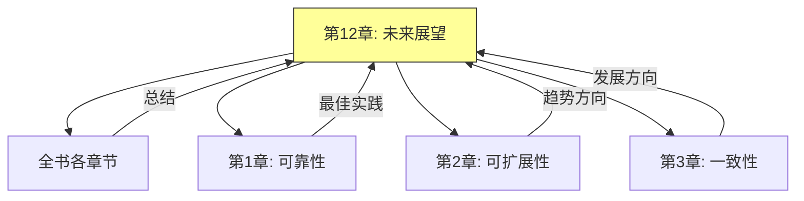
```mermaid
graph TD
    A[第12章: 未来展望] --> B[全书各章节]
    A --> C[第1章: 可靠性]
    A --> D[第2章: 可扩展性]
    A --> E[第3章: 一致性]

    B -->|总结| A
    C -->|"最佳实践"| A
    D -->|"趋势方向"| A
    E -->|"发展方向"| A

    style A fill:#ff9,stroke:#333
```

---

## 二、数据系统的演进趋势

### 2.1 技术发展时间线

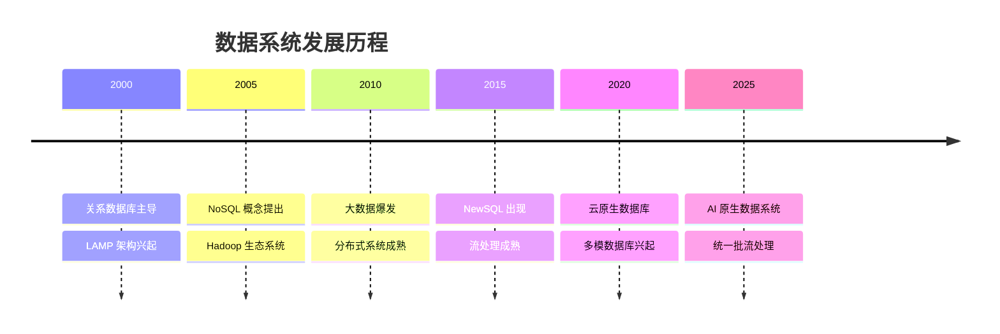
```mermaid
timeline
    title 数据系统发展历程

    2000 : 关系数据库主导
         : LAMP 架构兴起

    2005 : NoSQL 概念提出
         : Hadoop 生态系统

    2010 : 大数据爆发
         : 分布式系统成熟

    2015 : NewSQL 出现
         : 流处理成熟

    2020 : 云原生数据库
         : 多模数据库兴起

    2025 : AI 原生数据系统
         : 统一批流处理
```

### 2.2 数据库模型的演进

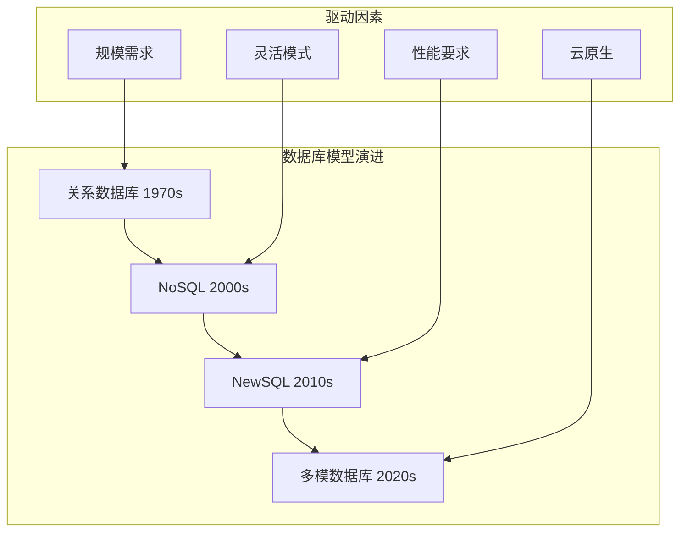
```mermaid
graph TD
    subgraph 演进历程["数据库模型演进"]
        R[关系数据库 1970s] --> N[NoSQL 2000s]
        N --> N2[NewSQL 2010s]
        N2 --> M[多模数据库 2020s]
    end

    subgraph 驱动因素["驱动因素"]
        D1[规模需求]
        D2[灵活模式]
        D3[性能要求]
        D4[云原生]

        D1 --> R
        D2 --> N
        D3 --> N2
        D4 --> M
    end
```

**各代数据库特点：**

| 代际 | 时间 | 代表技术 | 核心特点 |
|-----|-----|---------|---------|
| **关系数据库** | 1970s-2000s | MySQL, Oracle | ACID、强一致 |
| **NoSQL** | 2000s-2010s | MongoDB, Cassandra | 水平扩展、灵活模式 |
| **NewSQL** | 2010s-至今 | Spanner, CockroachDB | 扩展性 + ACID |
| **多模数据库** | 2020s-至今 | TiDB, CosmosDB | 多种模型统一 |

### 2.3 从单体到分布式

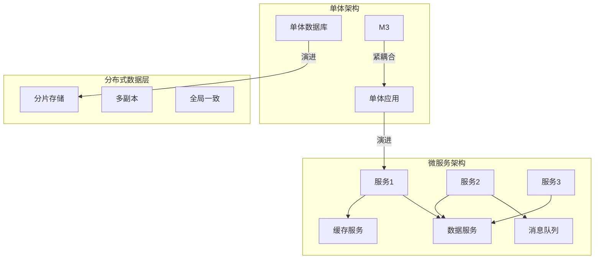
```mermaid
graph TD
    subgraph 单体架构["单体架构"]
        M1[单体应用]
        M2[单体数据库]
        M3 -->|"紧耦合"| M1
    end

    subgraph 微服务架构["微服务架构"]
        S1[服务1]
        S2[服务2]
        S3[服务3]

        D1[数据服务]
        D2[缓存服务]
        D3[消息队列]

        S1 --> D1
        S1 --> D2
        S2 --> D3
        S2 --> D1
        S3 --> D1
    end

    subgraph 分布式数据["分布式数据层"]
        P1[分片存储]
        P2[多副本]
        P3[全局一致]
    end

    M1 -->|"演进"| S1
    M2 -->|"演进"| P1
```

---

## 三、新兴技术趋势

### 3.1 云原生数据系统

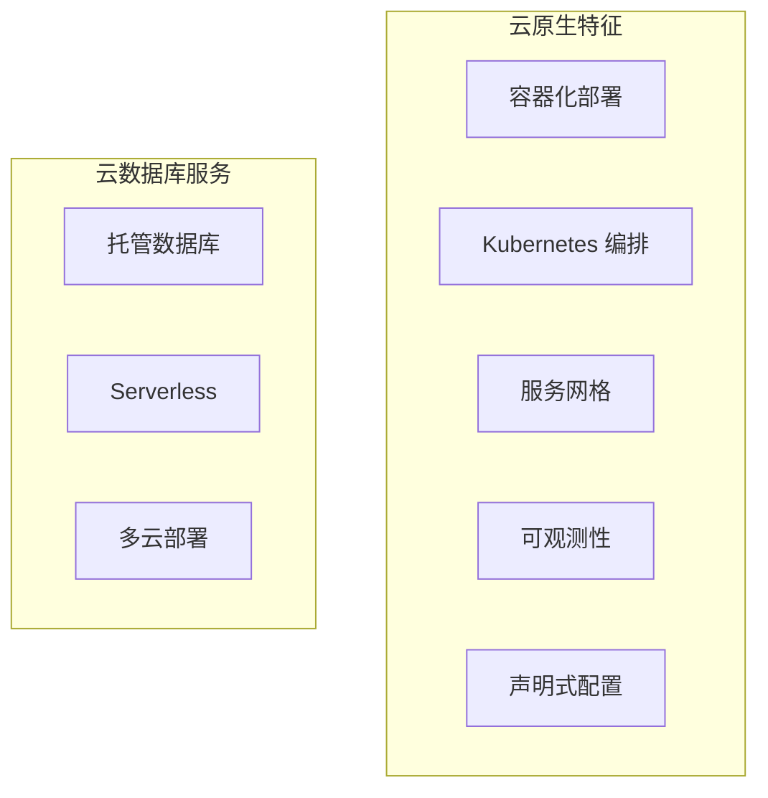
```mermaid
graph TD
    subgraph 云原生特征["云原生特征"]
        C1[容器化部署]
        C2[Kubernetes 编排]
        C3[服务网格]
        C4[可观测性]
        C5[声明式配置]
    end

    subgraph 云数据库["云数据库服务"]
        D1[托管数据库]
        D2[Serverless]
        D3[多云部署]
    end
```

**云原生的优势：**

| 优势 | 说明 |
|-----|-----|
| **弹性伸缩** | 根据负载自动扩缩容 |
| **高可用** | 多可用区部署 |
| **成本优化** | 按需付费、Serverless |
| **运维简化** | 托管服务、自动备份 |

### 3.2 多模数据库（Multi-Model Database）

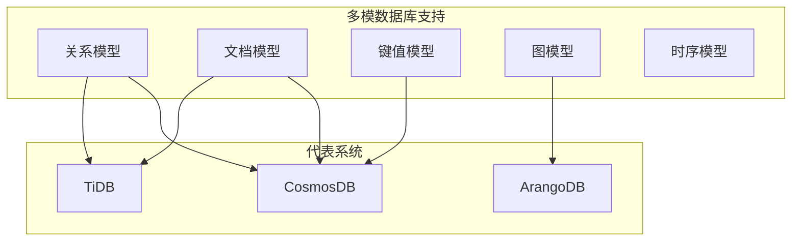
```mermaid
graph TD
    subgraph 多模能力["多模数据库支持"]
        M1[关系模型]
        M2[文档模型]
        M3[键值模型]
        M4[图模型]
        M5[时序模型]
    end

    subgraph 代表系统["代表系统"]
        S1[CosmosDB]
        S2[TiDB]
        S3[ArangoDB]
    end

    M1 --> S1
    M2 --> S1
    M3 --> S1
    M2 --> S2
    M1 --> S2
    M4 --> S3
```

### 3.3 流批一体（Lambda 与 Kappa 架构）

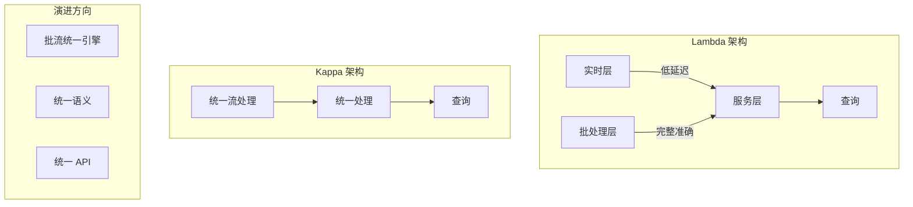
```mermaid
graph TD
    subgraph Lambda架构["Lambda 架构"]
        L1[实时层] -->|"低延迟"| L3[服务层]
        L2[批处理层] -->|"完整准确"| L3
        L3 --> Query[查询]
    end

    subgraph Kappa架构["Kappa 架构"]
        K1[统一流处理] --> K2[统一处理]
        K2 --> K3[查询]
    end

    subgraph 演进方向["演进方向"]
        E1[批流统一引擎]
        E2[统一语义]
        E3[统一 API]
    end
```

**流批一体的发展：**

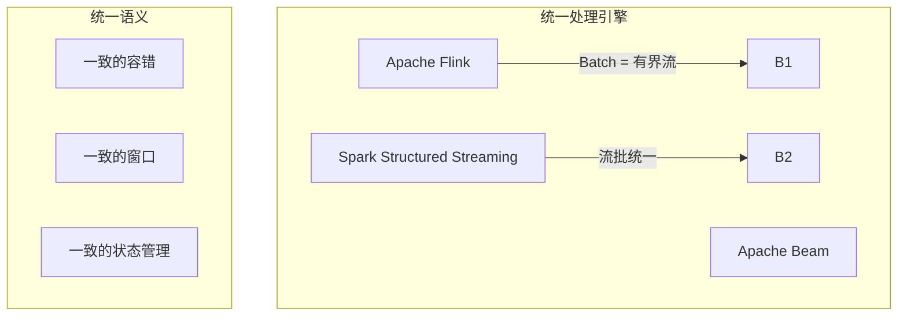
```mermaid
graph TD
    subgraph 统一引擎["统一处理引擎"]
        U1[Apache Flink]
        U2[Spark Structured Streaming]
        U3[Apache Beam]

        U1 -->|"Batch = 有界流"| B1
        U2 -->|"流批统一"| B2
    end

    subgraph 统一语义["统一语义"]
        S1[一致的容错]
        S2[一致的窗口]
        S3[一致的状态管理]
    end
```

### 3.4 AI 原生数据系统

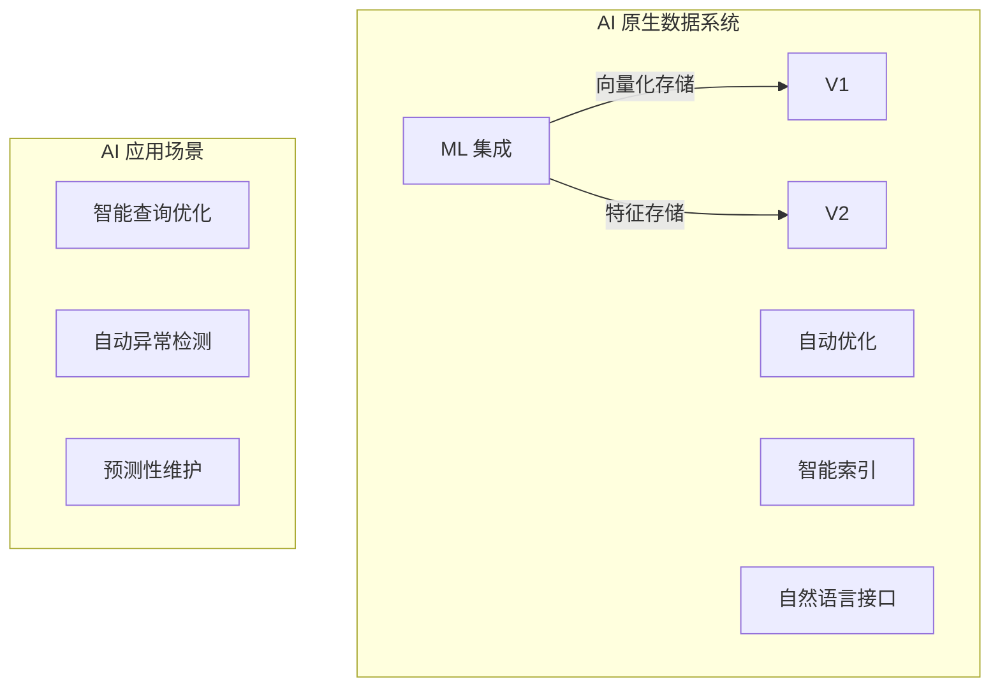
```mermaid
graph TD
    subgraph AI原生特性["AI 原生数据系统"]
        A1[ML 集成]
        A2[自动优化]
        A3[智能索引]
        A4[自然语言接口]

        A1 -->|"向量化存储"| V1
        A1 -->|"特征存储"| V2
    end

    subgraph 应用场景["AI 应用场景"]
        S1[智能查询优化]
        S2[自动异常检测]
        S3[预测性维护]
    end
```

---

## 四、数据可靠性设计模式

### 4.1 可靠性原则

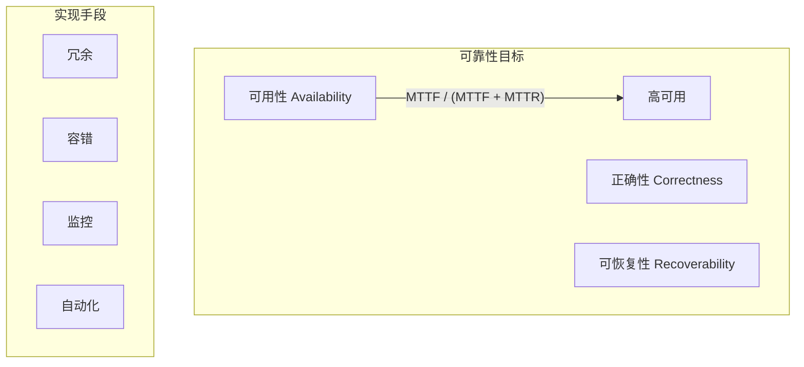
```mermaid
graph TD
    subgraph 可靠性目标["可靠性目标"]
        R1[可用性 Availability]
        R2[正确性 Correctness]
        R3[可恢复性 Recoverability]

        R1 -->|"MTTF / (MTTF + MTTR)"| U[高可用]
    end

    subgraph 实现手段["实现手段"]
        M1[冗余]
        M2[容错]
        M3[监控]
        M4[自动化]
    end
```

### 4.2 故障处理模式

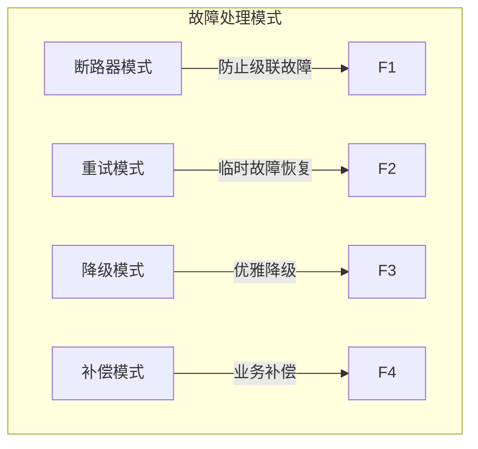
```mermaid
graph TD
    subgraph 故障处理模式["故障处理模式"]
        P1[断路器模式]
        P2[重试模式]
        P3[降级模式]
        P4[补偿模式]

        P1 -->|"防止级联故障"| F1
        P2 -->|"临时故障恢复"| F2
        P3 -->|"优雅降级"| F3
        P4 -->|"业务补偿"| F4
    end
```

**断路器模式：**

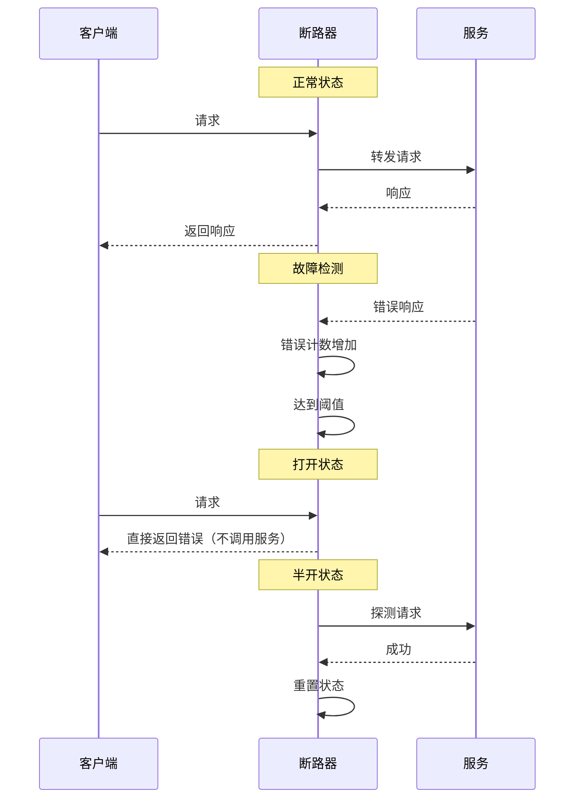
```mermaid
sequenceDiagram
    participant C as 客户端
    participant B as 断路器
    participant S as 服务

    Note over B: 正常状态
    C->>B: 请求
    B->>S: 转发请求
    S-->>B: 响应
    B-->>C: 返回响应

    Note over B: 故障检测
    S-->>B: 错误响应
    B->>B: 错误计数增加
    B->>B: 达到阈值

    Note over B: 打开状态
    C->>B: 请求
    B-->>C: 直接返回错误（不调用服务）

    Note over B: 半开状态
    B->>S: 探测请求
    S-->>B: 成功
    B->>B: 重置状态
```

### 4.3 数据一致性模式

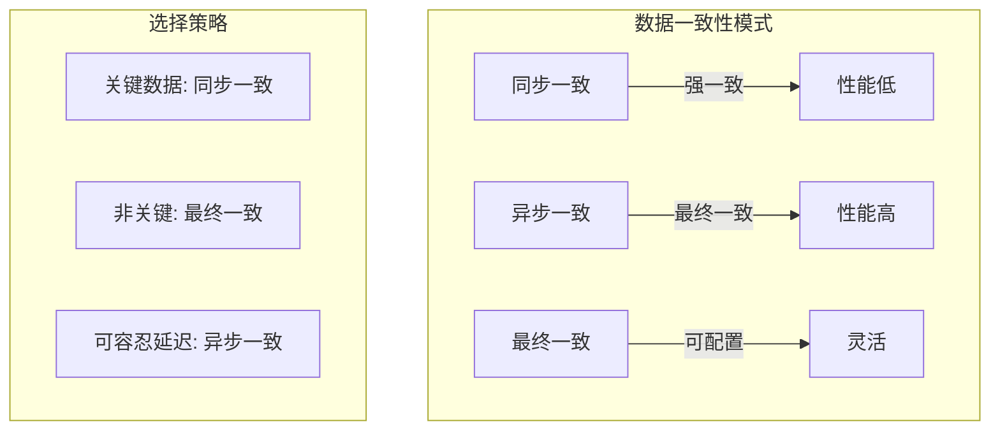
```mermaid
graph TD
    subgraph 一致性模式["数据一致性模式"]
        C1[同步一致]
        C2[异步一致]
        C3[最终一致]

        C1 -->|"强一致"| S1["性能低"]
        C2 -->|"最终一致"| S2["性能高"]
        C3 -->|"可配置"| S3["灵活"]
    end

    subgraph 选择策略["选择策略"]
        P1["关键数据: 同步一致"]
        P2["非关键: 最终一致"]
        P3["可容忍延迟: 异步一致"]
    end
```

### 4.4 缓存策略

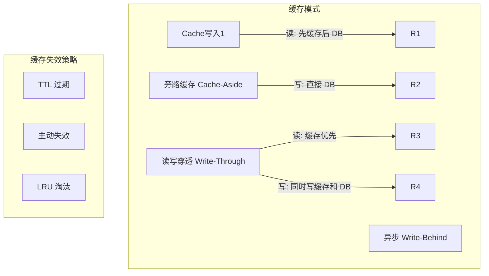
```mermaid
graph TD
    subgraph 缓存模式["缓存模式"]
        Cache1[旁路缓存 Cache-Aside]
        Cache2[读写穿透 Write-Through]
        Cache3[异步 Write-Behind]

        Cache写入1 -->|"读: 先缓存后 DB"| R1
        Cache1 -->|"写: 直接 DB"| R2

        Cache2 -->|"读: 缓存优先"| R3
        Cache2 -->|"写: 同时写缓存和 DB"| R4
    end

    subgraph 失效策略["缓存失效策略"]
        I1[TTL 过期]
        I2[主动失效]
        I3[LRU 淘汰]
    end
```

---

## 五、构建可靠数据系统的最佳实践

### 5.1 架构设计原则

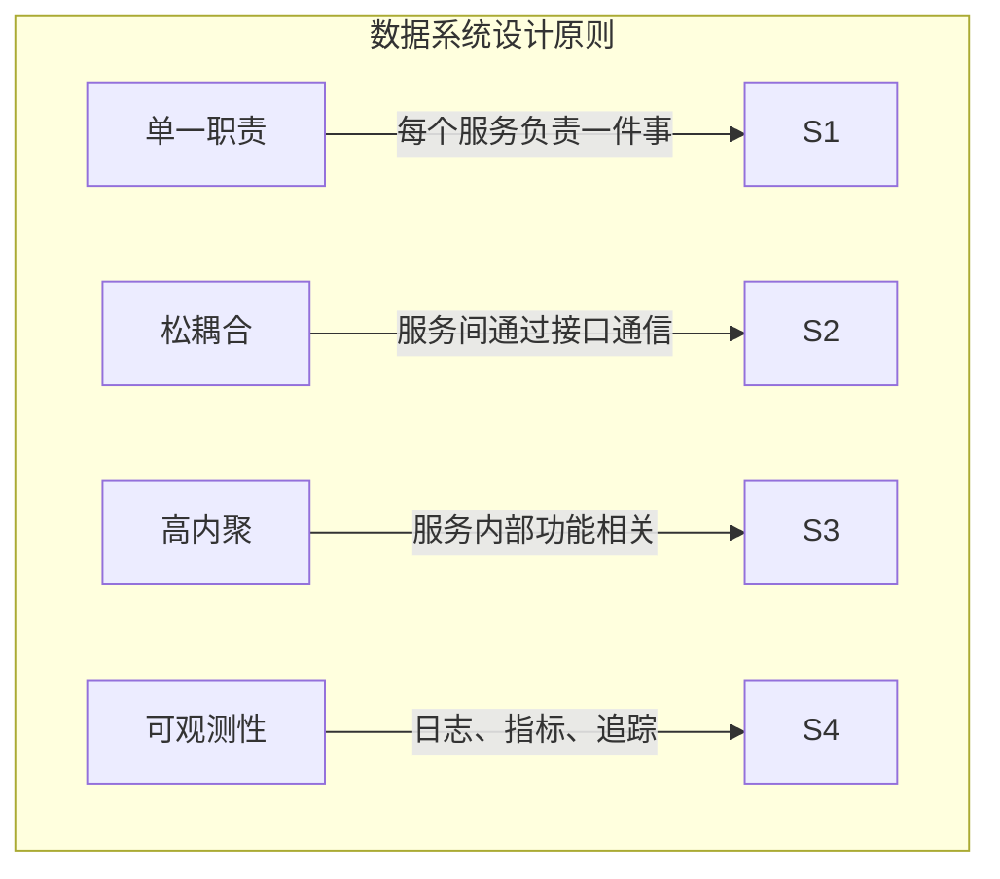
```mermaid
graph TD
    subgraph 设计原则["数据系统设计原则"]
        P1[单一职责]
        P2[松耦合]
        P3[高内聚]
        P4[可观测性]

        P1 -->|"每个服务负责一件事"| S1
        P2 -->|"服务间通过接口通信"| S2
        P3 -->|"服务内部功能相关"| S3
        P4 -->|"日志、指标、追踪"| S4
    end
```

### 5.2 数据建模最佳实践

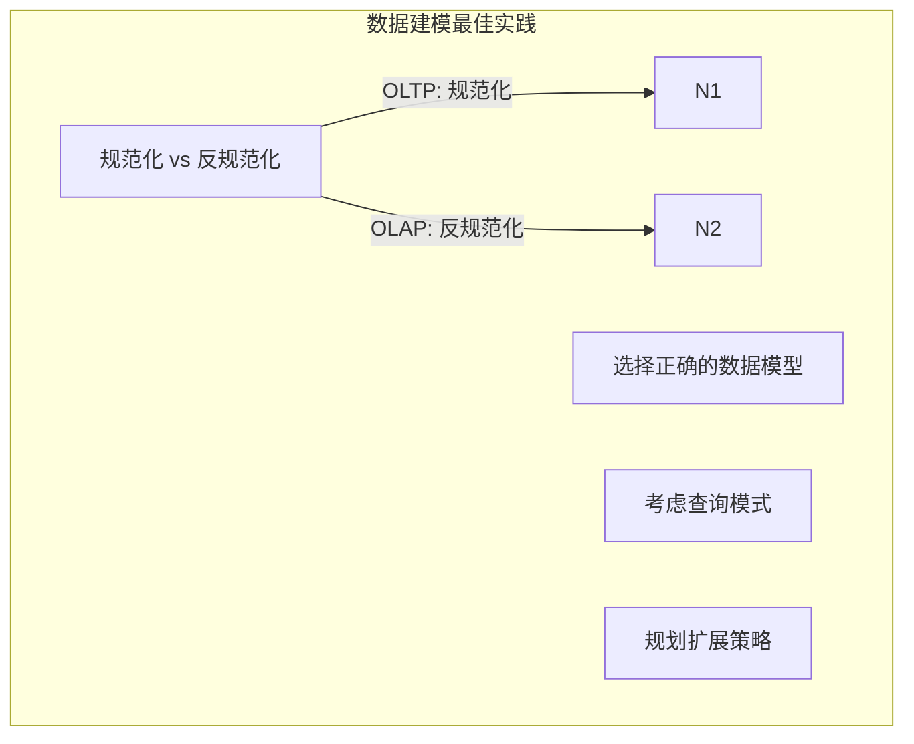
```mermaid
graph TD
    subgraph 数据建模["数据建模最佳实践"]
        M1[规范化 vs 反规范化]
        M2[选择正确的数据模型]
        M3[考虑查询模式]
        M4[规划扩展策略]

        M1 -->|"OLTP: 规范化"| N1
        M1 -->|"OLAP: 反规范化"| N2
    end
```

### 5.3 性能优化策略

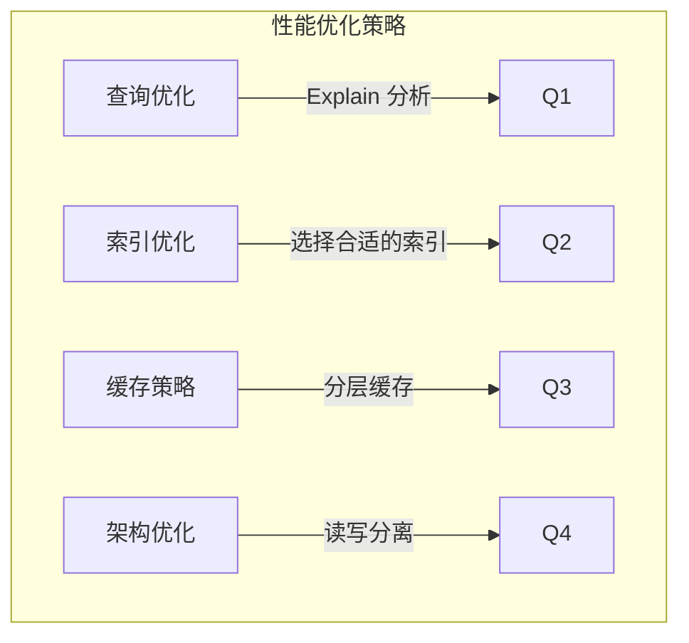
```mermaid
graph TD
    subgraph 性能优化["性能优化策略"]
        O1[查询优化]
        O2[索引优化]
        O3[缓存策略]
        O4[架构优化]

        O1 -->|"Explain 分析"| Q1
        O2 -->|"选择合适的索引"| Q2
        O3 -->|"分层缓存"| Q3
        O4 -->|"读写分离"| Q4
    end
```

### 5.4 运维最佳实践

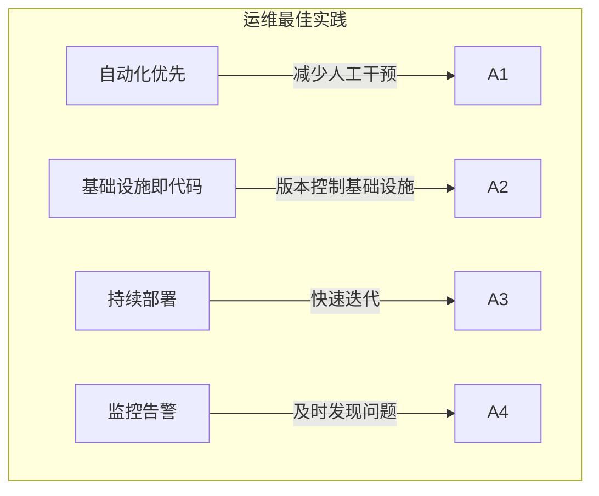
```mermaid
graph TD
    subgraph 运维实践["运维最佳实践"]
        O1[自动化优先]
        O2[基础设施即代码]
        O3[持续部署]
        O4[监控告警]

        O1 -->|"减少人工干预"| A1
        O2 -->|"版本控制基础设施"| A2
        O3 -->|"快速迭代"| A3
        O4 -->|"及时发现问题"| A4
    end
```

---

## 六、数据系统的未来挑战

### 6.1 规模化挑战

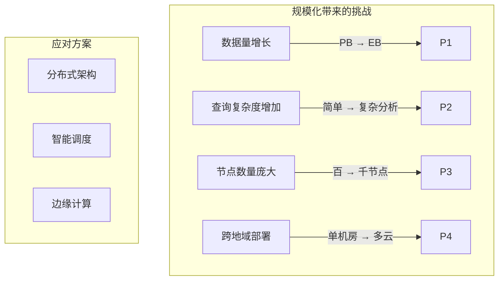
```mermaid
graph TD
    subgraph 规模挑战["规模化带来的挑战"]
        C1[数据量增长]
        C2[查询复杂度增加]
        C3[节点数量庞大]
        C4[跨地域部署]

        C1 -->|"PB → EB"| P1
        C2 -->|"简单 → 复杂分析"| P2
        C3 -->|"百 → 千节点"| P3
        C4 -->|"单机房 → 多云"| P4
    end

    subgraph 解决方案["应对方案"]
        S1[分布式架构]
        S2[智能调度]
        S3[边缘计算]
    end
```

### 6.2 安全性挑战

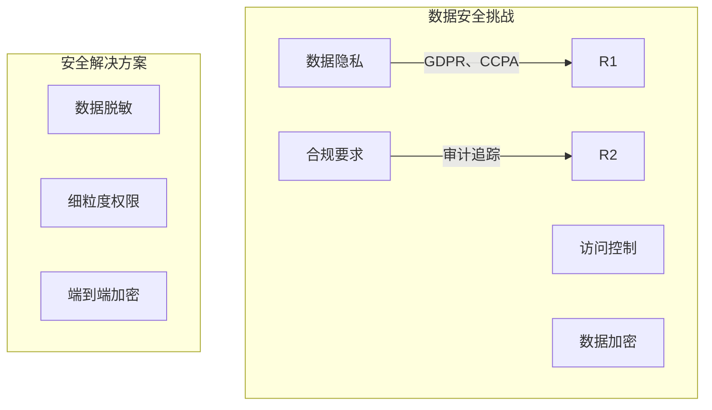
```mermaid
graph TD
    subgraph 安全挑战["数据安全挑战"]
        S1[数据隐私]
        S2[合规要求]
        S3[访问控制]
        S4[数据加密]

        S1 -->|"GDPR、CCPA"| R1
        S2 -->|"审计追踪"| R2
    end

    subgraph 解决方案["安全解决方案"]
        T1[数据脱敏]
        T2[细粒度权限]
        T3[端到端加密]
    end
```

### 6.3 可持续性挑战

```mermaid
graph TD
    subgraph 可持续性["数据系统的可持续性"]
        E1[能源消耗]
        E2[碳足迹]
        E3[电子垃圾]

        E1 -->|"数据中心能耗"| G1
        E2 -->|"云计算碳排放"| G2
    end

    subgraph 绿色计算["绿色计算实践"]
        G1[选择绿色数据中心]
        G2[优化资源利用]
        G3[延长硬件寿命]
    end
```

---

## 七、全书总结

### 7.1 核心概念回顾

```mermaid
mindmap
  root((数据系统核心))
    可靠性
      容错设计
      故障恢复
      数据备份
    可扩展性
      读/写扩展
      功能扩展
      地理扩展
    一致性
      强一致
      最终一致
      因果一致
    效率
      批处理
      流处理
      索引优化
```

### 7.2 各章节核心要点

| 章节 | 核心主题 | 关键概念 |
|-----|---------|---------|
| 第1章 | 数据系统基础 | 可靠性、可扩展性 |
| 第2章 | 数据模型 | 关系模型、文档模型、图模型 |
| 第3章 | 存储引擎 | LSM-Tree、B-Tree、索引 |
| 第4章 | 编码 | JSON、Protocol Buffers、Avro |
| 第5章 | 复制 | 主从复制、多主复制、无主复制 |
| 第6章 | 分区 | 哈希分区、范围分区、再平衡 |
| 第7章 | 事务 | ACID、隔离级别、分布式事务 |
| 第8章 | 分布式系统 | 故障模型、时钟、网络分区 |
| 第9章 | 一致性与共识 | 线性一致性、Paxos、Raft |
| 第10章 | 批处理 | MapReduce、Spark、流批一体 |
| 第11章 | 流处理 | 事件时间、窗口、流处理框架 |

### 7.3 主题关联图

```mermaid
graph TD
    subgraph 可靠性层["可靠性"]
        R1[复制]
        R2[容错]
        R3[恢复]
    end

    subgraph 可扩展性层["可扩展性"]
        S1[分区]
        S2[分布式]
        S3[缓存]
    end

    subgraph 一致性层["一致性"]
        C1[事务]
        C2[共识]
        C3[一致性模型]
    end

    subgraph 处理层["数据处理"]
        P1[批处理]
        P2[流处理]
        P3[混合处理]
    end

    R1 --> S1
    R2 --> C1
    R3 --> C2
    S1 --> P1
    S2 --> P2
    C1 --> P3
```

---

## 八、面试题整理

### 8.1 综合理解类 🌱

**Q1：如何设计一个可靠的数据系统？**

**答案：**

**设计可靠数据系统的关键要素：**

```mermaid
graph TD
    subgraph 可靠性设计["可靠性数据系统设计"]
        A1[数据冗余] --> A2[多副本]
        A2 --> A3[故障转移]

        A4[容错机制] --> A5[断路器]
        A5 --> A6[重试策略]

        A7[可观测性] --> A8[日志]
        A8 --> A9[指标]
        A9 --> A10[追踪]

        A11[自动化运维] --> A12[自动扩缩容]
        A12 --> A13[自动故障恢复]
    end
```

**核心原则：**

| 原则 | 说明 | 实现方式 |
|-----|-----|---------|
| **冗余** | 数据多副本存储 | 复制、分区 |
| **容错** | 故障不影响服务 | 重试、降级 |
| **可观测** | 及时发现问题 | 监控、告警 |
| **自动化** | 减少人工干预 | IaC、CI/CD |

**Q2：批处理和流处理应该如何选择？**

**答案：**

```mermaid
flowchart TD
    A[选择处理方式] --> B{业务需求}

    B -->|需要最新数据| C[流处理]
    B -->|需要完整数据| D[批处理]
    B -->|两者都需要| E[流批一体]

    C --> C1["实时监控"]
    C --> C2["在线推荐"]
    C --> C3["告警系统"]

    D --> D1["日报/周报"]
    D --> D2["模型训练"]
    D --> D3["全量分析"]

    E --> E1["Lambda 架构"]
    E --> E2["Kappa 架构"]
    E --> F1["Flink/Spark"]
```

**选择建议：**

| 场景 | 推荐 | 原因 |
|-----|-----|-----|
| 实时监控 | 流处理 | 延迟要求高 |
| 定期报表 | 批处理 | 数据完整 |
| 两者都需要 | 流批一体 | 综合优势 |

---

### 8.2 趋势分析类 🌿

**Q3：数据系统的未来发展趋势是什么？**

**答案：**

**未来发展趋势：**

```mermaid
graph TD
    subgraph 发展趋势["数据系统发展趋势"]
        T1[云原生化]
        T2[多模化]
        T3[智能化]
        T4[流批一体化]
        T5[边缘化]

        T1 -->|"Serverless"| C1
        T2 -->|"统一存储"| C2
        T3 -->|"AI 集成"| C3
        T4 -->|"统一引擎"| C4
        T5 -->|"就近处理"| C5
    end
```

**具体趋势：**

| 趋势 | 现状 | 未来 |
|-----|-----|-----|
| **云原生** | 逐步上云 | Serverless 普及 |
| **多模** | 多种数据库并存 | 统一多模平台 |
| **智能化** | 手动优化 | AI 自动优化 |
| **流批一体** | Lambda 架构 | 真正的统一 |
| **边缘计算** | 中心化 | 边云协同 |

**Q4：如何应对数据系统的规模化挑战？**

**答案：**

**规模化挑战及应对：**

| 挑战 | 应对策略 |
|-----|---------|
| **数据量增长** | 分布式存储、自动分片 |
| **查询复杂度** | 查询优化器、向量化执行 |
| **节点故障** | 自动故障转移、多副本 |
| **跨地域** | 多数据中心、CDN |
| **运维复杂** | 自动化运维、可观测性 |

---

### 8.3 实践应用类 🔧

**Q5：如果让你重新设计一个数据密集型应用，你会怎么做？**

**答案：**

**重新设计的关键考量：**

```mermaid
graph TD
    subgraph 设计步骤["重新设计步骤"]
        S1[需求分析] --> S2[数据建模]
        S2 --> S3[架构设计]
        S3 --> S4[技术选型]
        S4 --> S5[原型验证]
        S5 --> S6[迭代优化]
    end

    subgraph 设计考量["关键考量"]
        C1[一致性要求]
        C2[性能需求]
        C3[扩展要求]
        C4[成本限制]
        C5[团队能力]
    end
```

**设计原则：**

| 原则 | 实践 |
|-----|-----|
| **简单优先** | 先实现功能，再优化 |
| **可观测** | 从第一天就加入监控 |
| **渐进式** | 小步迭代，避免 Big Design Upfront |
| **松耦合** | 服务间通过接口通信 |
| **容错** | 假设任何组件都可能故障 |

---

## 九、扩展阅读

### 9.1 推荐阅读

| 书籍/论文 | 作者 | 说明 |
|----------|-----|-----|
| 《Designing Data-Intensive Applications》 | Martin Kleppmann | 本书原文 |
| 《Database Internals》 | Alex Petrov | 深入存储引擎 |
| 《Site Reliability Engineering》 | Google | SRE 实践 |
| 《Fundamentals of Data Engineering》 | Joe Reis | 数据工程基础 |

### 9.2 技术趋势资源

- 技术博客：Martin Kleppmann、Ben Stopford
- 会议：QCon、Strata Data、VLDB
- 开源项目：Apache 基金会各项目

### 9.3 实践项目建议

- 设计并实现一个简单的分布式 KV 存储
- 构建一个流批一体的分析平台
- 搭建多数据中心的数据系统

---

## 十、结语

### 核心收获总结

1. **数据系统的本质**
   - 可靠、可扩展、高效的数据处理
   - 没有银弹，需要权衡

2. **核心设计原则**
   - 冗余与容错
   - 分区与复制
   - 一致性与可用性

3. **技术演进方向**
   - 云原生化
   - 流批一体化
   - 智能化

4. **最佳实践**
   - 可观测性
   - 自动化
   - 渐进式设计

### 给读者的建议

```mermaid
graph TD
    subgraph 学习建议["学习建议"]
        L1[理论基础] --> L2[实践项目]
        L2 --> L3[持续学习]

        L1 -->|"阅读原书"| B1
        L1 -->|"研究论文"| B2
        L2 -->|"手写代码"| B3
        L2 -->|"参与开源"| B4
        L3 -->|"关注趋势"| B5
        L3 -->|"分享输出"| B6
    end
```

**持续学习的方向：**

| 方向 | 推荐内容 |
|-----|---------|
| **深入原理** | 分布式系统、数据库内核 |
| **实践应用** | 云服务、开源项目 |
| **前沿趋势** | AI + Data、边缘计算 |
| **软技能** | 系统设计、架构思维 |

---

## 附录 A：技术选型参考

| 场景 | 推荐技术 | 考虑因素 |
|-----|---------|---------|
| OLTP 事务 | PostgreSQL, TiDB | 强一致、ACID |
| OLAP 分析 | ClickHouse, Snowflake | 查询性能、列式存储 |
| 缓存 | Redis, Memcached | 内存速度 |
| 消息队列 | Kafka, Pulsar | 吞吐、持久化 |
| 搜索 | Elasticsearch | 全文搜索 |
| 时序数据 | InfluxDB, TimescaleDB | 时序优化 |
| 图数据 | Neo4j, TigerGraph | 图遍历 |

## 附录 B：可靠性检查清单

| 检查项 | 状态 | 说明 |
|-------|-----|-----|
| 数据备份 | ✓ | 定期备份、异地存储 |
| 多副本 | ✓ | 数据冗余 |
| 监控告警 | ✓ | 及时发现问题 |
| 故障演练 | ✓ | 定期演练恢复 |
| 自动化 | ✓ | 减少人工干预 |
| 文档 | ✓ | 记录架构和流程 |

---

*文档生成时间：2024-01-08*
*基于《Designing Data-Intensive Applications》第12章*
*全书完结*
