# 《Designing Data-Intensive Applications》- 第2章：数据模型与查询语言（深度版）

## 一、本章概述

本章深入探讨了**数据模型**和**查询语言**，这是应用程序开发中最基础也是最重要的决策之一。数据模型不仅决定了数据如何被组织和存储，还深刻影响着应用程序的编写方式和解决问题的方法论。

> **本章核心问题**：我们应该使用什么样的数据模型来存储和查询数据？不同模型之间的权衡是什么？

### 1.1 核心主题
- 关系模型 vs 文档模型的历史与演进
- NoSQL 数据库的兴起背景与技术动因
- 声明式查询语言 vs 命令式编程的本质区别
- 图数据模型的应用场景与底层原理
- 数据模型选择对应用程序架构的深远影响

### 1.2 重要程度
⭐⭐⭐⭐⭐（极高）

### 1.3 预计学习时间
90-120 分钟

### 1.4 本章与其他章节的关联

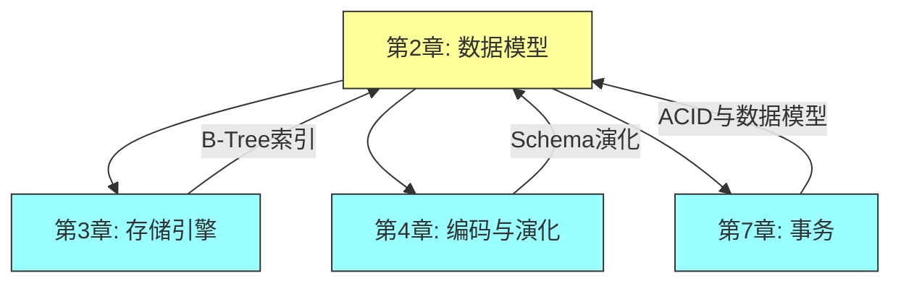

---

## 二、核心概念

### 2.1 什么是数据模型？

数据模型是描述数据、数据关系、数据语义以及数据约束的概念工具集合。它是连接人类思维与计算机存储的桥梁。

**数据模型的四个层次（Martin Fowler 分类法）：**

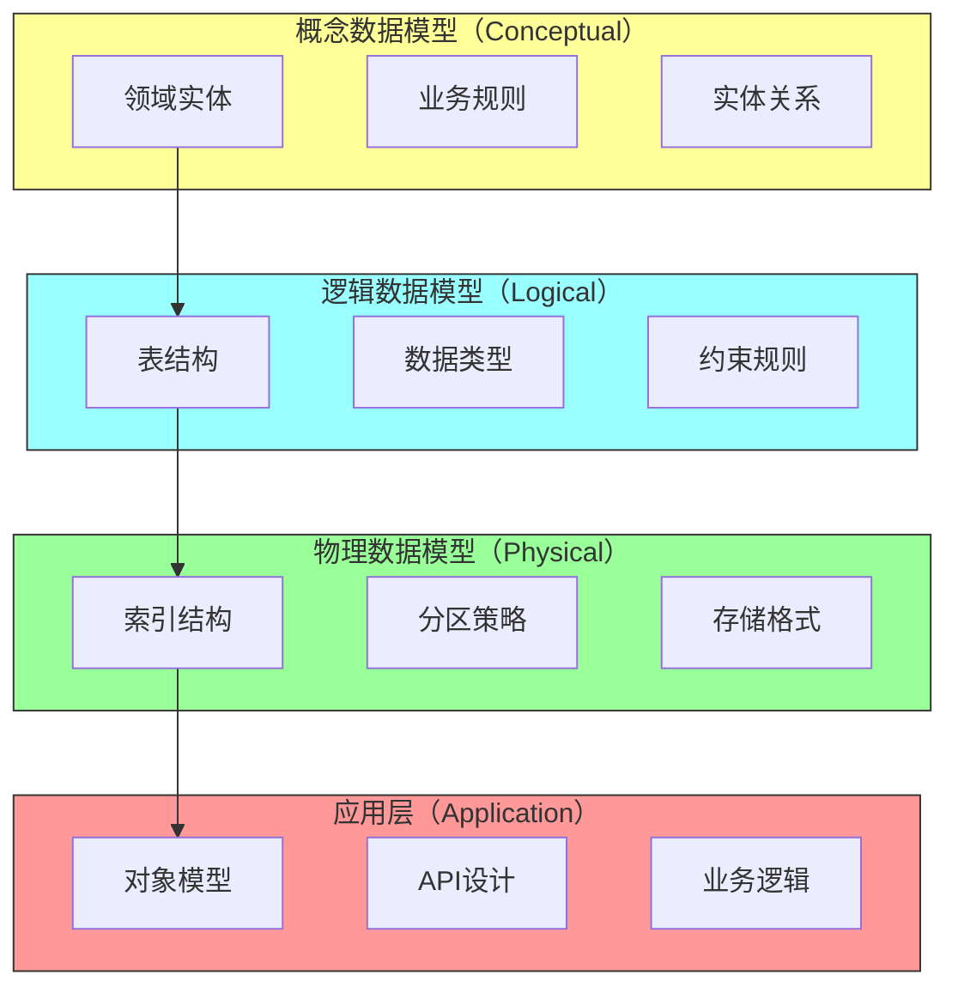

**各层次详细说明：**

| 层次 | 关注点 | 产物 | 示例工具 |
|-----|-------|-----|---------|
| 概念层 | 业务实体、领域边界 | ER 图、领域模型 | draw.io, PlantUML |
| 逻辑层 | 表结构、关系、约束 | DDL 语句 | MySQL Workbench |
| 物理层 | 存储、索引、分区 | 物理设计文档 | DBA 工具 |
| 应用层 | 对象映射、API | 代码、接口定义 | Java POJO, JSON Schema |

**数据模型的本质抽象：**

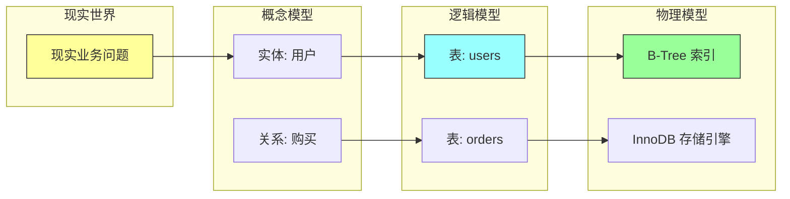

### 2.2 关系模型的历史与理论基础

**1970 年：Codd 的里程碑论文**

Edgar F. Codd 在 IBM 工作期间发表了开创性论文 "A Relational Model of Data for Large Shared Data Banks"，这篇论文奠定了现代数据库的基础。

**论文核心思想：**

1. **数据即关系（Relation）**
   - 关系 = 表
   - 元组（Tuple）= 行
   - 属性（Attribute）= 列

2. **声明式数据操作**
   - 不需要指定访问路径
   - 由优化器选择最优执行方式

3. **数据独立性**
   - 逻辑独立性：应用程序不受逻辑结构变化影响
   - 物理独立性：应用程序不受物理存储变化影响

**关系模型的理论基础：**

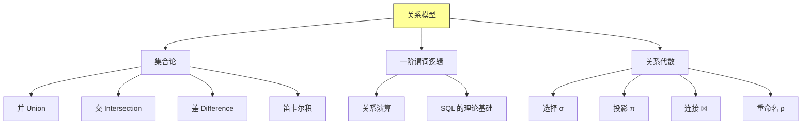

**关系代数操作符详解：**

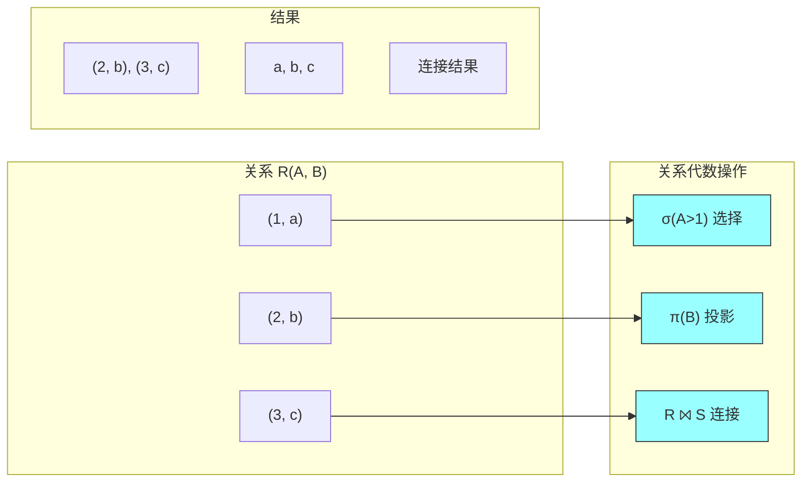

**关系模型的发展时间线：**

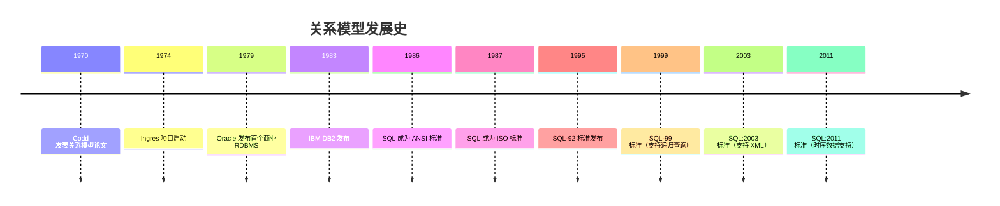

### 2.3 NoSQL 的兴起：技术动因分析

**2010 年后：互联网时代的挑战**

传统关系型数据库在互联网场景下遇到了前所未有的挑战：

**2.3.1 大规模数据处理的挑战**

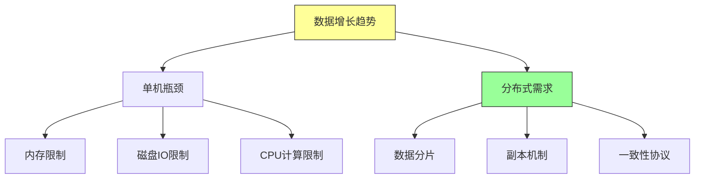

**2.3.2 互联网公司的具体需求**

| 公司 | 场景 | 挑战 | 解决方案 |
|-----|-----|-----|---------|
| Google | 索引构建 | PB级数据 | Bigtable |
| Amazon | 购物车 | 低延迟、高可用 | Dynamo |
| Facebook | 消息系统 | 高写入量 | Cassandra |
| LinkedIn | 社交图谱 | 复杂关系查询 | Espresso |

**2.3.3 CAP 定理的启示**

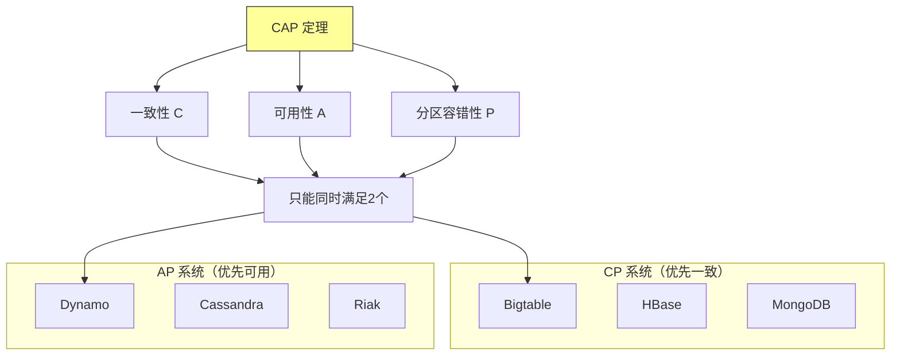

**2.3.4 NoSQL 的四种类型详细对比**

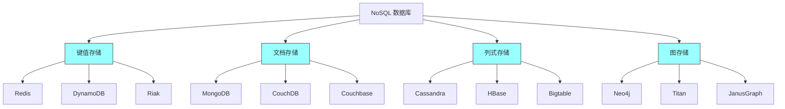

**各类型详细特性对比：**

| 类型 | 数据模型 | 优势 | 劣势 | 典型场景 |
|-----|---------|-----|-----|---------|
| 键值 | Key → Value | 极致性能、简单 | 无查询能力 | 缓存、会话 |
| 文档 | JSON/BSON | Schema灵活、嵌套 | 无复杂JOIN | 内容管理、日志 |
| 列式 | 列族存储 | 高压缩、列查询 | 写入成本高 | 分析、时序 |
| 图 | 节点+边 | 复杂关系查询 | 水平扩展难 | 社交、推荐 |

---

## 三、关键技术点

### 3.1 关系模型 vs 文档模型：深度对比

#### 3.1.1 数据组织方式的根本差异

**关系模型（Normalization）：**

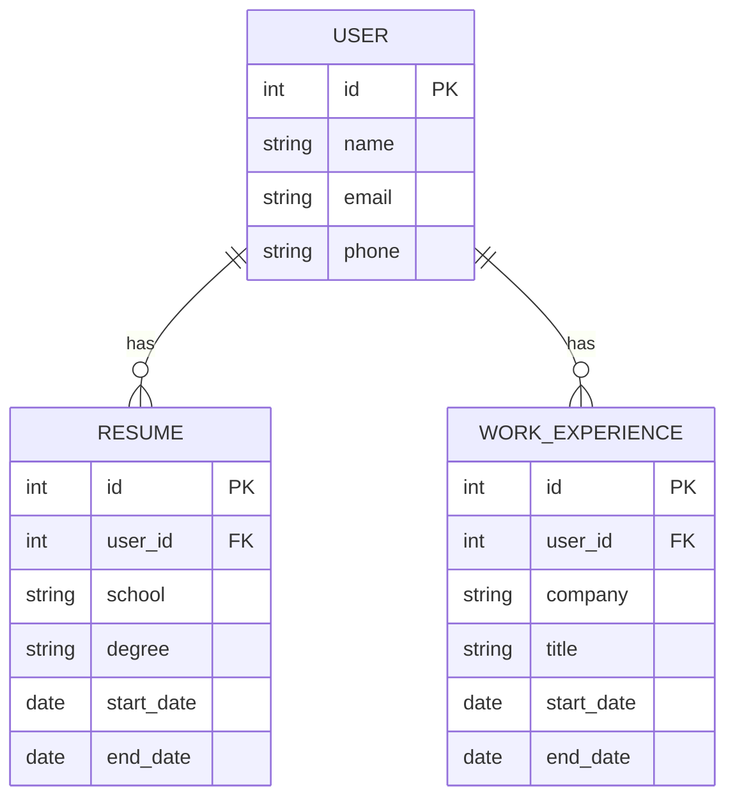

**文档模型（Denormalization）：**

```json
{
  "_id": "user_001",
  "name": "张三",
  "email": "zhangsan@example.com",
  "profile": {
    "age": 30,
    "city": "北京",
    "bio": "资深软件工程师"
  },
  "education": [
    {
      "school": "MIT",
      "degree": "PhD",
      "field": "Computer Science",
      "years": [2015, 2019]
    },
    {
      "school": "Stanford",
      "degree": "MS",
      "field": "Software Systems",
      "years": [2019, 2021]
    }
  ],
  "work_experience": [
    {
      "company": "Google",
      "title": "Senior Engineer",
      "start_date": "2021-06",
      "end_date": "present",
      "technologies": ["Go", "Kubernetes", "BigQuery"]
    }
  ],
  "skills": ["Java", "Python", "System Design"]
}
```

**两种模型的查询对比：**

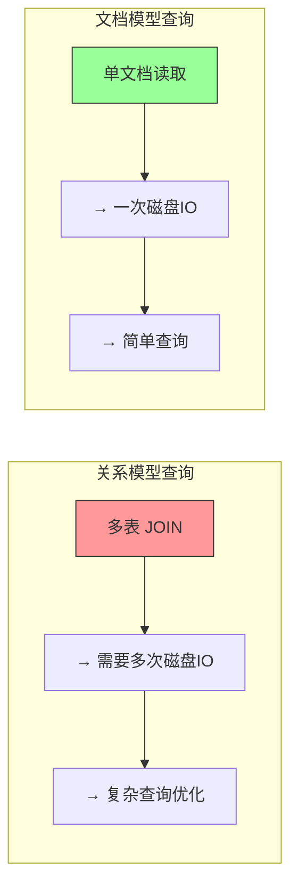

#### 3.1.2 JOIN 操作的实际成本

**JOIN 的执行过程（以用户简历为例）：**

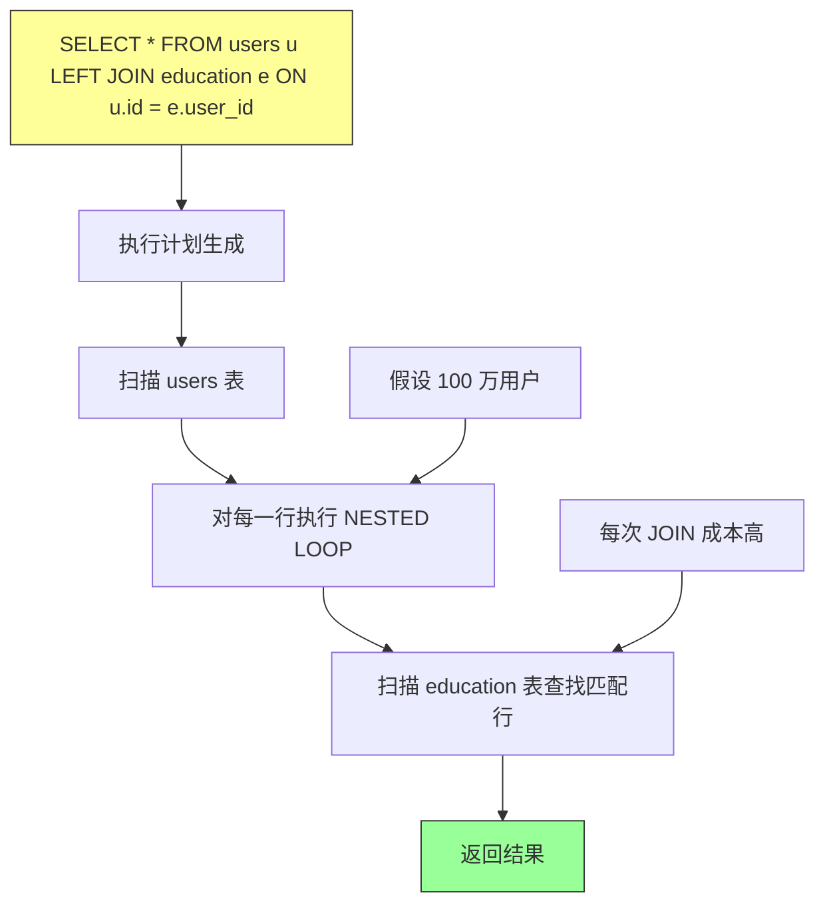

**JOIN 复杂度分析：**

```
假设：users 表有 M 行，education 表有 N 行

 Nested Loop Join:     O(M × N)
 Hash Join:            O(M + N)
 Sort Merge Join:      O(M log M + N log N)

 而文档模型单次读取:   O(1) 或 O(log N) 索引查找
```

#### 3.1.3 文档模型的适用场景与限制

**文档模型适合的场景：**

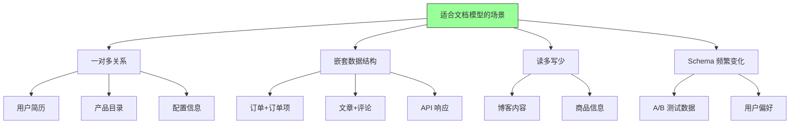

**文档模型不适合的场景：**

| 场景 | 问题 | 替代方案 |
|-----|-----|---------|
| 复杂 JOIN 报表 | 性能差 | 使用分析数据库 |
| 强一致性事务 | 支持有限 | 使用关系数据库 |
| 规范化数据 | 冗余大 | 混合使用 |
| 深度关联查询 | 跨文档查询复杂 | 使用图数据库 |

### 3.2 查询语言对比：声明式 vs 命令式

#### 3.2.1 声明式语言的本质

**声明式 vs 命令式：核心区别**

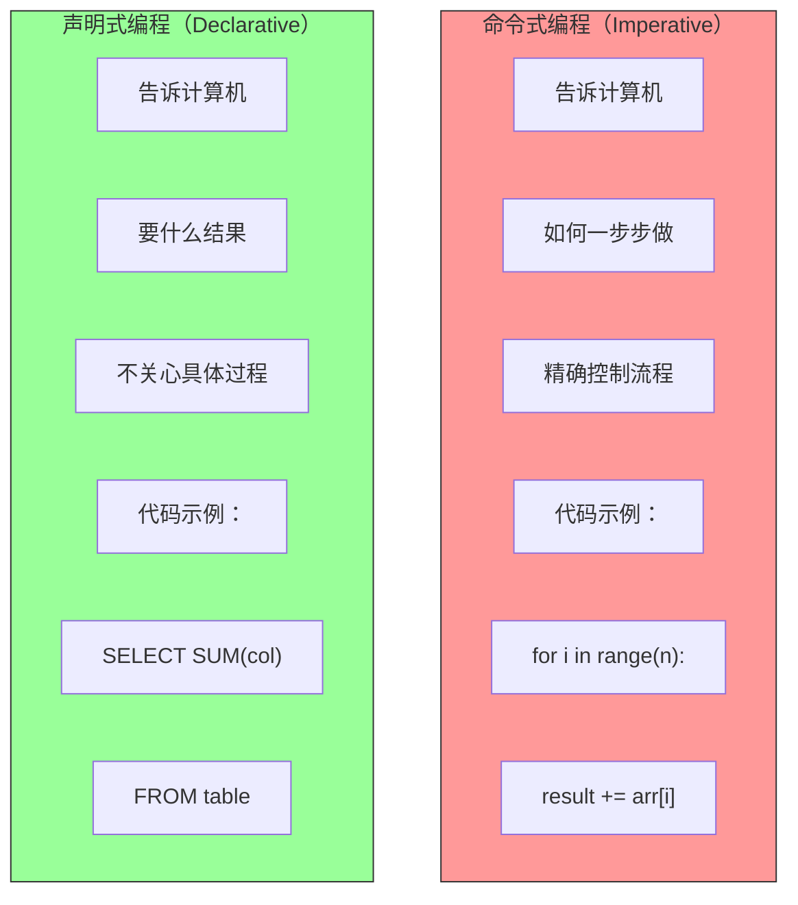

**SQL 的声明式优势详解：**

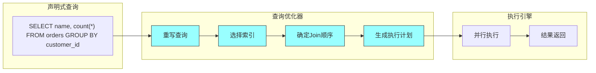

**优化器自动完成的优化：**

| 优化类型 | 用户视角 | 数据库自动完成 |
|---------|---------|---------------|
| 索引选择 | 不指定 | 优化器选择最优索引 |
| Join 顺序 | 不指定 | 基于统计信息选择 |
| 执行策略 | 不指定 | 选择 Nested Loop / Hash / Sort Merge |
| 并行化 | 不声明 | 自动并行执行 |

#### 3.2.2 MapReduce 详解

**MapReduce 的工作原理：**

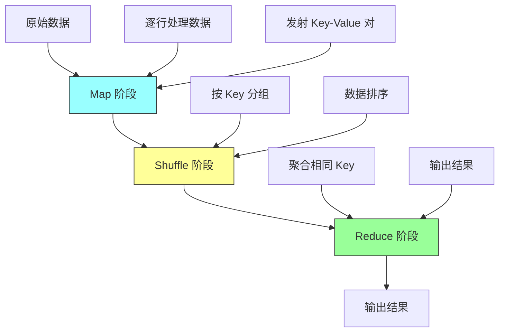

**MongoDB MapReduce 示例：**

```javascript
// 订单数据：统计每个客户的消费总额
db.orders.mapReduce(
    // Map 函数：对每条订单，发射 (customer_id, amount)
    function() {
        emit(this.customer_id, this.amount);
    },
    // Reduce 函数：汇总金额
    function(customerId, amounts) {
        return Array.sum(amounts);
    },
    {
        out: "customer_totals",
        query: { status: "completed" }  // 只处理已完成的订单
    }
);
```

**执行过程图解：**

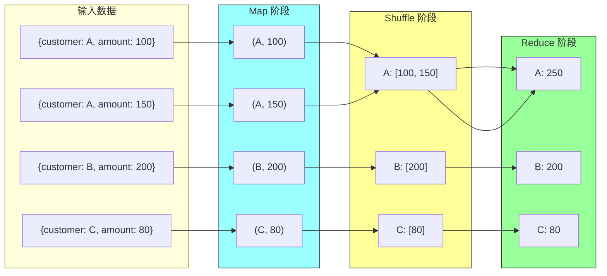

#### 3.2.3 各种查询语言的对比

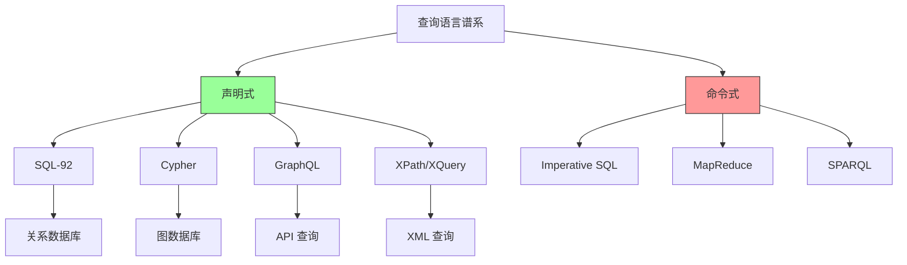

### 3.3 图数据模型：深度解析

#### 3.3.1 图模型的表达能力

**为什么关系模型在处理复杂关系时显得笨拙：**

```sql
-- 找出所有"朋友的朋友"（3度以内的人脉）
-- 关系数据库需要多次自 JOIN
WITH
friends_1 AS (
    SELECT friend_id FROM friendships WHERE user_id = 1
),
friends_2 AS (
    SELECT f2.friend_id
    FROM friendships f1
    JOIN friendships f2 ON f1.friend_id = f2.user_id
    WHERE f1.user_id = 1 AND f2.friend_id != 1
),
friends_3 AS (
    -- 还需要再套一层...
)
SELECT DISTINCT friend_id FROM (
    SELECT friend_id FROM friends_1
    UNION
    SELECT friend_id FROM friends_2
    UNION
    SELECT friend_id FROM friends_3
) AS all_friends;
```

**图数据库（Cypher）表达：**

```cypher
// 找出所有 3 度以内的人脉
MATCH (me:User {id: 1})-[:FRIEND*1..3]-(person)
WHERE person <> me
RETURN DISTINCT person.name
```

**对比图示：**

```mermaid
graph TD
    subgraph 关系模型["关系数据库 - 多次 JOIN"]
        A1[users] --> A2[friendships]
        A2 --> A3[users]
        A3 --> A4[friendships]
        A4 --> A5[users]
        A5 --> A6[friendships]
        A6 --> A7[users]

        style A2 fill:#f99,stroke:#333
        style A4 fill:#f99,stroke:#333
        style A6 fill:#f99,stroke:#333
    end

    subgraph 图模型["图数据库 - 原生遍历"]
        B1[User:A] -->|FRIEND| B2[User:B]
        B2 -->|FRIEND| B3[User:C]
        B3 -->|FRIEND| B4[User:D]

        style B1 fill:#9f9,stroke:#333
        style B2 fill:#9f9,stroke:#333
        style B3 fill:#9f9,stroke:#333
        style B4 fill:#9f9,stroke:#333
    end
```

#### 3.3.2 图模型的存储实现

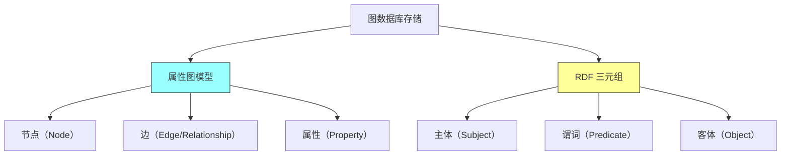

**Neo4j 的存储结构：**

```mermaid
graph TD
    subgraph 节点存储["节点存储"]
        A1["节点 ID"]
        A2["标签列表"]
        A3["属性键值对"]
        A4["边指针（出边）"]
        A5["边指针（入边）"]
    end

    subgraph 边存储["边存储"]
        B1["边 ID"]
        B2["边类型"]
        B3["起点 ID"]
        B4["终点 ID"]
        B5["属性键值对"]
    end

    A1 --> B3
    B4 --> A2

    style 节点存储 fill:#9f9,stroke:#333
    style 边存储 fill:#9ff,stroke:#333
```

#### 3.3.3 图查询优化

```mermaid
flowchart LR
    A[Cypher 查询] --> B[查询解析器]
    B --> C[查询优化器]
    C --> D[执行计划]
    D --> E[结果]

    C --> C1["索引使用"]
    C --> C2["Join 顺序"]
    C --> C3["最短路径算法"]

    style C fill:#9ff,stroke:#333
```

---

## 四、架构图与流程图

### 4.1 数据模型演进历史

```mermaid
timeline
    title 数据模型演进历程
    1960s : 网状模型 CODASYL : 层次模型 IMS
    1970 : 关系模型论文发表 : Codd 提出关系代数
    1980 : SQL 成为标准 : 商业 RDBMS 兴起
    1990 : 对象数据库兴起 : OR-Mapping 技术
    2000 : XML 数据库 : 全文搜索数据库
    2009 : NoSQL 术语诞生 : MongoDB, Cassandra
    2015 : NewSQL 兴起 : 多模型数据库
    2020 : 图数据库流行 : 云原生数据库
```

### 4.2 多模型数据库定位

```mermaid
graph TD
    A[数据存储需求] --> B{数据关联性}

    B -->|无关联/简单| C[键值存储]
    B -->|松散结构| D[文档数据库]
    B -->|中等关联| E[关系数据库]
    B -->|高度互联| F[图数据库]
    B -->|时序特征| G[时序数据库]
    B -->|文本搜索| H[搜索引擎]

    C --> C1[Redis]
    C --> C2[DynamoDB]

    D --> D1[MongoDB]
    D --> D2[Couchbase]

    E --> E1[PostgreSQL]
    E --> E2[MySQL]

    F --> F1[Neo4j]
    F --> F2[Amazon Neptune]

    G --> G1[InfluxDB]
    G --> G2[TimescaleDB]

    H --> H1[Elasticsearch]
    H --> H2[Solr]

    style C fill:#e0f7fa,stroke:#333
    style D fill:#e0f7fa,stroke:#333
    style E fill:#e0f7fa,stroke:#333
    style F fill:#e0f7fa,stroke:#333
    style G fill:#e0f7fa,stroke:#333
    style H fill:#e0f7fa,stroke:#333
```

### 4.3 Schema 演进对比

```mermaid
flowchart LR
    subgraph Schema-on-Write["Schema-on-Write（关系型）"]
        direction TB
        A1["数据变更"] --> A2["DDL 变更"]
        A2 --> A3["ALTER TABLE"]
        A3 --> A4["数据校验"]
        A4 --> A5["写入或拒绝"]
    end

    subgraph Schema-on-Read["Schema-on-Read（文档型）"]
        direction TB
        B1["数据变更"] --> B2["直接写入"]
        B2 --> B3["任意格式"]
        B3 --> B4["读取时解释"]
        B4 --> B5["应用层处理"]
    end

    style Schema-on-Write fill:#ffecb3,stroke:#333
    style Schema-on-Read fill:#c8e6c9,stroke:#333
```

### 4.4 Polyglot Persistence 架构

```mermaid
graph TD
    subgraph 应用层["应用层"]
        A1[API Gateway]
    end

    subgraph 服务层["服务层"]
        B1[用户服务]
        B2[订单服务]
        B3[推荐服务]
        B4[搜索服务]
    end

    subgraph 数据层["数据层"]
        C1[(PostgreSQL)]
        C2[(MongoDB)]
        C3[(Redis)]
        C4[(Elasticsearch)]
        C5[(Neo4j)]
    end

    B1 --> C1
    B2 --> C1
    B2 --> C2
    B3 --> C5
    B4 --> C4
    B1 --> C3
    B2 --> C3

    style C1 fill:#bbdefb,stroke:#333
    style C2 fill:#c8e6c9,stroke:#333
    style C3 fill:#ffcdd2,stroke:#333
    style C4 fill:#fff9c4,stroke:#333
    style C5 fill:#e1bee7,stroke:#333
```

---

## 五、面试题整理

### 5.1 概念理解类 🌱

**Q1：什么是关系型数据库？它的核心特征是什么？请从理论和实践两个角度说明。**

**答案：**

**理论角度：**
关系型数据库基于 E.F. Codd 提出的关系模型，理论基础包括：
- **集合论**：数据以关系（表）的形式组织
- **一阶谓词逻辑**：通过逻辑表达式查询数据
- **关系代数**：定义数据操作（选择、投影、连接、并、交、差）

**实践角度：**
- 使用 **SQL** 作为标准查询语言
- 支持 **ACID** 事务特性
- 具有 **强Schema**（写入前必须定义结构）
- 通过 **主键、外键、约束** 保证数据完整性

**核心特征：**
```
┌─────────────────────────────────────────────────┐
│           关系型数据库核心特征                    │
├─────────────────────────────────────────────────┤
│  1. 表结构（Table Structure）                    │
│  2. SQL 查询语言（Declarative）                  │
│  3. ACID 事务（Atomicity, Consistency,          │
│                Isolation, Durability）           │
│  4. 强一致性（Strong Consistency）               │
│  5. 复杂 JOIN 能力                               │
│  6. 成熟的优化器和执行计划                       │
└─────────────────────────────────────────────────┘
```

---

**Q2：NoSQL 数据库有哪些类型？请分别举例并说明各自的典型应用场景。**

**答案：**

**NoSQL 数据库分类：**

| 类型 | 数据模型 | 代表产品 | 典型场景 |
|-----|---------|---------|---------|
| **键值存储** | Key-Value | Redis, DynamoDB, Riak | 缓存、会话存储、配置 |
| **文档存储** | JSON/BSON | MongoDB, CouchDB, Couchbase | 内容管理、日志、用户档案 |
| **列式存储** | 列族 | Cassandra, HBase, Bigtable | 分析、时序数据、大规模写入 |
| **图存储** | 节点+边 | Neo4j, Amazon Neptune, JanusGraph | 社交网络、推荐、欺诈检测 |

**详细说明：**

```mermaid
graph TD
    A[NoSQL 选择] --> B["数据模型"]
    A --> C["读写模式"]
    A --> D["一致性需求"]

    B --> B1["简单 Key-Value → 键值存储"]
    B --> B2["嵌套文档 → 文档存储"]
    B --> B3["列式分析 → 列式存储"]
    B --> B4["复杂关系 → 图存储"]

    C --> C1["写多读少 → 列式存储"]
    C --> C2["读写均衡 → 文档存储"]

    D --> D1["强一致 → DynamoDB, etcd"]
    D --> D2["最终一致 → Cassandra, Riak"]
```

---

**Q3：声明式查询语言和命令式查询语言有什么区别？请举例说明。**

**答案：**

| 对比项 | 声明式 | 命令式 |
|-------|-------|-------|
| **描述方式** | 要什么 | 怎么做 |
| **优化方式** | 优化器自动 | 开发者手动 |
| **执行控制** | 不关心 | 完全控制 |
| **代码量** | 简洁 | 冗长 |
| **并行化** | 容易 | 困难 |
| **可读性** | 高 | 低 |

**示例对比：**

```sql
-- 声明式（SQL）：描述结果
SELECT department, COUNT(*) as num_employees, AVG(salary) as avg_salary
FROM employees
WHERE hire_date > '2020-01-01'
GROUP BY department
HAVING AVG(salary) > 50000
ORDER BY avg_salary DESC;
```

```python
# 命令式（Python）：描述过程
results = []
for emp in employees:
    if emp.hire_date > datetime(2020, 1, 1):
        if emp.department not in results:
            results[emp.department] = {'count': 0, 'total': 0}
        results[emp.department]['count'] += 1
        results[emp.department]['total'] += emp.salary

final_results = []
for dept, data in results.items():
    avg = data['total'] / data['count']
    if avg > 50000:
        final_results.append((dept, data['count'], avg))

final_results.sort(key=lambda x: x[2], reverse=True)
return final_results
```

**声明式的优势：**
1. **隐藏复杂性**：开发者不需了解存储引擎细节
2. **自动优化**：查询优化器选择最优执行路径
3. **易于并行化**：数据库可以并行执行查询
4. **代码简洁**：表达力强，代码量少
5. **跨平台**：标准 SQL 语法跨数据库兼容

---

### 5.2 原理分析类 🌿

**Q4：为什么 NoSQL 数据库在互联网时代流行起来？请从技术、业务、成本三个角度分析。**

**答案：**

**技术角度：**

```mermaid
graph TD
    A[技术驱动因素] --> B[大数据量]
    A --> C[高并发]
    A --> D[多样化数据]

    B --> B1["PB 级数据处理"]
    B --> B2["分布式存储需求"]

    C --> C1["百万级 QPS"]
    C --> C2["低延迟要求"]

    D --> D1["非结构化数据"]
    D --> D2["Schema 频繁变化"]
```

**业务角度：**

| 业务需求 | 关系数据库 | NoSQL 解决方案 |
|---------|-----------|---------------|
| 快速迭代 | Schema 变更成本高 | Schema-on-read |
| 用户增长 | 垂直扩展有限 | 水平扩展容易 |
| 个性化推荐 | JOIN 性能差 | 图数据库原生支持 |
| 实时分析 | 报表查询慢 | 列式存储优化 |

**成本角度：**

```
关系数据库成本模型：          NoSQL 成本模型：
┌─────────────────────┐      ┌─────────────────────┐
│ 硬件成本：$          │      │ 硬件成本：$$        │
│   - 高端服务器       │      │   - 普通服务器      │
│   - SAN 存储         │      │   - 本地磁盘        │
├─────────────────────┤      ├─────────────────────┤
│ 软件成本：$$$$$      │      │ 软件成本：$         │
│   - 商业数据库许可   │      │   - 开源免费        │
├─────────────────────┤      ├─────────────────────┤
│ 运维成本：$$$$       │      │ 运维成本：$$        │
│   - DBA 专家         │      │   - 自动化工具成熟  │
└─────────────────────┘      └─────────────────────┘

总体成本：NoSQL 可降低 60-80%
```

**具体推动因素：**
1. **Google/Bigtable/MapReduce**：证明了大规模分布式存储的可行性
2. **Amazon/Dynamo**：展示了最终一致性在高可用场景下的价值
3. **开源社区**：MongoDB、Redis、Cassandra 等降低了技术门槛
4. **云计算普及**：云服务商提供托管的 NoSQL 服务

---

**Q5：文档数据库和关系数据库在处理"一对多"关系时有什么不同？请从存储、查询、一致性三个维度对比。**

**答案：**

**存储维度对比：**

```mermaid
graph TD
    subgraph 关系模型["关系模型 - 规范化存储"]
        A1[users 表]
        A2[education 表]
        A3[work_exp 表]

        A1 --> |user_id| A2
        A1 --> |user_id| A3
    end

    subgraph 文档模型["文档模型 - 反规范化存储"]
        B1[users 文档]
        B2["education 数组"]
        B3["work_exp 数组"]

        B1 --> B2
        B1 --> B3
    end
```

**查询维度对比：**

| 操作 | 关系模型 | 文档模型 |
|-----|---------|---------|
| 读取单个用户信息 | `SELECT * FROM users WHERE id = 1` | `db.users.findOne({_id: 1})` |
| 读取用户+教育经历 | 需要 JOIN | 单次读取 |
| 统计用户数量 | `SELECT COUNT(*) FROM users` | `db.users.countDocuments()` |
| 更新教育经历 | 需要事务更新多表 | 更新单个文档 |

**一致性维度对比：**

```
关系模型：强一致性
┌────────────────────────────────────┐
│  UPDATE users SET ...              │
│  UPDATE education SET ...          │  → 事务保证
│  UPDATE work_exp SET ...           │     同时成功或失败
└────────────────────────────────────┘

文档模型：最终一致性（通常）
┌────────────────────────────────────┐
│  doc.education[0].school = 'MIT'   │  → 单文档原子性
│                                     │     跨文档需应用层处理
└────────────────────────────────────┘
```

**选择建议：**

| 场景 | 推荐 | 理由 |
|-----|-----|-----|
| 读取频繁，写入少 | 文档模型 | 局部性好，减少 IO |
| 需要复杂 JOIN | 关系模型 | 原生支持，性能好 |
| 强一致性要求高 | 关系模型 | ACID 支持完善 |
| Schema 频繁变化 | 文档模型 | 无需迁移 |

---

**Q6：什么是 Schema-on-Write 和 Schema-on-Read？它们在数据质量保证、性能开销、灵活性方面有什么区别？**

**答案：**

**概念定义：**

```mermaid
flowchart TD
    subgraph Schema-on-Write["Schema-on-Write（写时模式）"]
        A1[数据写入]
        A2[Schema 校验]
        A3{符合?}
        A3 -->|是| A4[写入存储]
        A3 -->|否| A5[拒绝/报错]
    end

    subgraph Schema-on-Read["Schema-on-Read（读时模式）"]
        B1[数据写入]
        B2[任意格式存储]
        B3[数据读取]
        B4[应用层解释]
        B5[返回结果]
    end
```

**对比表格：**

| 维度 | Schema-on-Write | Schema-on-Read |
|-----|-----------------|----------------|
| **数据质量保证** | 数据库强制校验 | 应用层保证 |
| **写入性能** | 写入时校验，有开销 | 写入快，无校验 |
| **读取性能** | 读取快，预解析 | 读取时解释，有开销 |
| **Schema 灵活性** | 低，变更需 DDL | 高，随时可变 |
| **适用场景** | 金融、医疗等强合规 | Web 应用、快速迭代 |
| **典型产品** | PostgreSQL, MySQL | MongoDB, Elasticsearch |

**详细对比图：**

```mermaid
gantt
    title 数据处理流程对比
    dateFormat X
    axisFormat %s

    section Schema-on-Write
    写入校验       :0, 2
    格式转换       :2, 4
    存储          :4, 6
    读取          :6, 8

    section Schema-on-Read
    直接写入      :0, 2
    存储          :2, 6
    读取          :6, 10
    格式解释      :10, 12
```

---

**Q7：为什么说 SQL 是一种声明式语言？这对数据库性能和开发效率有什么影响？**

**答案：**

**声明式的本质：**

```mermaid
flowchart TD
    A[用户查询] --> B["SQL: SELECT ... FROM ... WHERE ..."]
    B --> C[查询解析器]
    C --> D[抽象语法树]
    D --> E[查询优化器]

    E --> E1["重写查询"]
    E --> E2["选择索引"]
    E --> E3["确定 Join 顺序"]
    E --> E4["选择执行算法"]

    E --> F[执行计划]
    F --> G[执行引擎]
    G --> H[结果]

    style E fill:#9ff,stroke:#333
    style G fill:#9f9,stroke:#333
```

**性能影响：**

| 优化类型 | 声明式优势 | 具体表现 |
|---------|-----------|---------|
| **索引选择** | 自动选择 | 优化器根据统计信息选择最优索引 |
| **Join 顺序** | 自动确定 | 动态规划选择最优 Join 顺序 |
| **执行算法** | 自动选择 | Nested Loop / Hash / Sort Merge |
| **并行执行** | 自动并行 | 多核 CPU 并行处理 |

**开发效率影响：**

1. **代码量减少**：相同查询比命令式代码短 5-10 倍
2. **学习成本低**：SQL 语法直观，易于理解
3. **维护成本低**：不依赖具体实现细节
4. **可读性高**：业务意图清晰表达

**实际案例：**

```sql
-- 优化器自动优化案例
-- 用户查询：获取每个部门薪资最高的 3 个人

SELECT department, name, salary
FROM (
    SELECT *,
           ROW_NUMBER() OVER (PARTITION BY department ORDER BY salary DESC) as rn
    FROM employees
) ranked
WHERE rn <= 3;
```

优化器会自动：
- 选择 `salary` 索引
- 并行执行分区排序
- 优化 TOP-N 查询

---

### 5.3 对比选型类 🔧

**Q8：什么场景下应该选择图数据库而不是关系数据库？请给出具体案例并说明图模型的优势。**

**答案：**

**图数据库的适用场景：**

```mermaid
graph TD
    A[选择图数据库的信号] --> B["需要 3 层以上的关系查询"]
    A --> C["关系模式频繁变化"]
    A --> D["需要实时关系分析"]
    A --> E["存在复杂网络结构"]

    B --> B1["朋友的朋友的朋友"]
    C --> C1["动态标签/分类"]
    D --> D1["欺诈模式检测"]
    E --> E1["知识图谱"]

    style A fill:#9f9,stroke:#333
```

**具体案例对比：**

**案例：社交网络"共同好友"查询**

```sql
-- 关系数据库：需要多层 JOIN
WITH friends_of_alice AS (
    SELECT friend_id FROM friendships WHERE user_id = 1
),
friends_of_bob AS (
    SELECT friend_id FROM friendships WHERE user_id = 2
)
SELECT COUNT(*)
FROM friends_of_alice a
JOIN friends_of_bob b ON a.friend_id = b.friend_id;
```

```cypher
-- 图数据库：原生支持
MATCH (alice:User {name: 'Alice'})-[:FRIEND]-(common)-[:FRIEND]-(bob:User {name: 'Bob'})
RETURN count(common) as common_friends;
```

**性能对比（假设 100 万用户）：**

| 场景 | 关系数据库耗时 | 图数据库耗时 |
|-----|--------------|-------------|
| 1 度好友查询 | ~10ms | ~5ms |
| 2 度好友查询 | ~100ms | ~20ms |
| 3 度好友查询 | ~5000ms（超时） | ~50ms |
| 4 度好友查询 | 不支持 | ~200ms |

**图模型优势总结：**

```mermaid
graph TD
    A[图数据库优势] --> B[性能优势]
    A --> C[表达能力]
    A --> D[灵活性]

    B --> B1["复杂遍历 O(1) 扩展"]
    B --> B2["无需多表 JOIN"]

    C --> C1["原生支持路径查询"]
    C --> C2["直观表达关系"]

    D --> D3["动态添加关系类型"]
    D --> D4["无需修改 Schema"]
```

---

**Q9：如果你是一家电商公司的技术负责人，你会如何为不同业务选择合适的数据存储方案？请设计一个多数据源的架构方案。**

**答案：**

**业务需求分析：**

| 业务模块 | 数据特点 | 访问模式 | 一致性要求 |
|---------|---------|---------|-----------|
| 用户中心 | 结构化用户信息 | 读多写少 | 强一致 |
| 商品目录 | 半结构化商品信息 | 读多写少 | 强一致 |
| 订单系统 | 交易数据 | 读写均衡 | 强一致 |
| 购物车 | 临时会话数据 | 写多读多 | 最终一致 |
| 搜索 | 商品关键词 | 读多 | 最终一致 |
| 推荐 | 用户行为+商品关系 | 读多 | 最终一致 |
| 日志 | 时序数据 | 写多 | 最终一致 |

**多数据源架构方案：**

```mermaid
graph TD
    subgraph 客户端["客户端层"]
        A1[Web App]
        A2[Mobile App]
        A3[API Gateway]
    end

    subgraph 服务层["服务层"]
        B1[用户服务]
        B2[商品服务]
        B3[订单服务]
        B4[推荐服务]
        B5[搜索服务]
    end

    subgraph 数据层["数据层"]
        C1[(PostgreSQL)]
        C2[(MongoDB)]
        C3[(Redis)]
        C4[(Elasticsearch)]
        C5[(Neo4j)]
        C6[(Cassandra)]
    end

    A1 --> A3
    A2 --> A3
    A3 --> B1
    A3 --> B2
    A3 --> B3

    B1 --> C1
    B2 --> C1
    B2 --> C2
    B2 --> C4
    B3 --> C1
    B3 --> C3
    B4 --> C5
    B5 --> C4

    style C1 fill:#bbdefb,stroke:#333
    style C2 fill:#c8e6c9,stroke:#333
    style C3 fill:#ffcdd2,stroke:#333
    style C4 fill:#fff9c4,stroke:#333
    style C5 fill:#e1bee7,stroke:#333
    style C6 fill:#ffe0b2,stroke:#333
```

**数据源选择理由：**

| 数据源 | 存储内容 | 选择理由 |
|-------|---------|---------|
| **PostgreSQL** | 用户、订单、商品基础数据 | 强一致、ACID 支持完善、JSON 支持 |
| **MongoDB** | 商品详情、评论、日志 | Schema 灵活、嵌套结构、高写入性能 |
| **Redis** | 购物车、会话、缓存 | 内存存储、毫秒级响应 |
| **Elasticsearch** | 商品搜索、关键词索引 | 倒排索引、全文搜索、相关性排序 |
| **Neo4j** | 用户关系、推荐图谱 | 原生图遍历、高效多跳查询 |
| **Cassandra** | 行为日志、点击流 | 高写入、水平扩展、时序数据 |

**跨数据源一致性保证：**

```mermaid
flowchart TD
    A[订单创建] --> B{数据源}
    B --> C1[PostgreSQL: 订单记录]
    B --> C2[MongoDB: 订单快照]
    B --> C3[Redis: 购物车清空]
    B --> C4[Elasticsearch: 索引更新]

    C1 --> D1[成功]
    C2 --> D1
    C3 --> D1
    C4 --> D1

    D1 --> E[订单创建成功]

    C1 --> F1[失败: 回滚]
    C2 --> F2[失败: 补偿事务]
    C3 --> F3[失败: 补偿操作]
    C4 --> F4[失败: 重试]

    style A fill:#ff9,stroke:#333
    style E fill:#9f9,stroke:#333
```

---

**Q10：MongoDB 为什么能够支持灵活的数据模型？它的限制是什么？什么情况下不应该使用 MongoDB？**

**答案：**

**MongoDB 灵活数据模型的技术原理：**

```mermaid
graph TD
    A[MongoDB 灵活模型] --> B[BSON 存储格式]
    A --> C[Schema-on-Read]
    A --> D[无固定列定义]

    B --> B1["二进制 JSON"]
    B --> B2["支持任意嵌套"]
    B --> B3["动态类型"]

    C --> C1["写入时不校验"]
    C --> C2["读取时解释"]

    D --> D1["不同文档不同字段"]
    D --> D2["随时添加字段"]

    style A fill:#9f9,stroke:#333
```

**BSON 数据类型支持：**

| 类型 | 说明 | 示例 |
|-----|-----|-----|
| String | UTF-8 字符串 | `"hello"` |
| Integer | 32/64 位整数 | `42`, `Long(42)` |
| Double | 浮点数 | `3.14` |
| Boolean | 布尔值 | `true`, `false` |
| Array | 数组 | `[1, 2, 3]` |
| Object | 嵌套文档 | `{"name": "Alice"}` |
| Null | 空值 | `null` |
| Date | 日期 | `new Date()` |
| ObjectId | 自动生成 ID | `ObjectId()` |

**MongoDB 的限制：**

```mermaid
graph TD
    A[MongoDB 限制] --> B[JOIN 支持弱]
    A --> C[事务范围有限]
    A --> D[强一致性需权衡]
    A --> E[水平扩展限制]
    A --> F[无原生全文搜索]

    B --> B1["仅支持 $lookup"]
    B --> B2["跨分片 JOIN 性能差"]

    C --> C1["副本集事务"]
    C --> C2["分片事务限制"]

    D --> D1["默认最终一致"]
    D --> D2["读 Concern 配置]

    E --> E1["分片 key 选择"]
    E --> E2["数据再平衡成本"]

    style A fill:#f99,stroke:#333
```

**不应该使用 MongoDB 的场景：**

| 场景 | 问题 | 替代方案 |
|-----|-----|---------|
| **复杂 JOIN 报表** | 多表关联性能差 | PostgreSQL, ClickHouse |
| **强一致性金融交易** | 事务支持有限 | PostgreSQL, TiDB |
| **高度规范化数据** | 反范式化冗余大 | 关系数据库 |
| **深度关联查询** | 跨文档查询复杂 | Neo4j |
| **需要 FULL JOIN** | 不支持 | 关系数据库 |
| **固定 Schema 场景** | 灵活性浪费 | PostgreSQL |

**具体案例分析：**

```
❌ 不应该用 MongoDB：
   银行账户系统
   - 需要复杂事务（转账）
   - 需要强一致性
   - 数据高度规范化

✅ 应该用 MongoDB：
   用户行为追踪
   - 事件结构多样
   - 写入密集
   - 可容忍短暂不一致
```

---

### 5.4 实战应用类 🔧

**Q11：假设你需要在 MongoDB 中存储一个电商订单系统，请设计文档结构并说明设计决策的理由。**

**答案：**

**订单文档设计：**

```json
{
  "_id": ObjectId("507f1f77bcf86cd799439011"),
  "order_id": "ORD-2024-001234",
  "customer_id": "CUST-5678",
  "status": "processing",

  "shipping_address": {
    "name": "张三",
    "phone": "13800138000",
    "province": "北京",
    "city": "北京",
    "district": "朝阳区",
    "detail": "xxx 路 123 号"
  },

  "items": [
    {
      "product_id": "PROD-001",
      "product_name": "iPhone 15 Pro",
      "sku_id": "SKU-001-128",
      "quantity": 1,
      "unit_price": 7999.00,
      "total_price": 7999.00
    },
    {
      "product_id": "PROD-002",
      "product_name": "手机壳",
      "sku_id": "SKU-002-red",
      "quantity": 2,
      "unit_price": 49.00,
      "total_price": 98.00
    }
  ],

  "payment": {
    "method": "credit_card",
    "amount": 8097.00,
    "currency": "CNY",
    "paid_at": ISODate("2024-01-08T10:30:00Z"),
    "transaction_id": "TXN-ABC123"
  },

  "totals": {
    "subtotal": 8097.00,
    "shipping": 0.00,
    "tax": 0.00,
    "discount": 0.00,
    "grand_total": 8097.00
  },

  "timeline": [
    {
      "status": "created",
      "timestamp": ISODate("2024-01-08T10:25:00Z"),
      "note": "订单创建"
    },
    {
      "status": "paid",
      "timestamp": ISODate("2024-01-08T10:30:00Z"),
      "note": "支付完成"
    },
    {
      "status": "processing",
      "timestamp": ISODate("2024-01-08T11:00:00Z"),
      "note": "仓库拣货中"
    }
  ],

  "metadata": {
    "source": "mobile_app",
    "version": 2,
    "created_from": "web"
  },

  "created_at": ISODate("2024-01-08T10:25:00Z"),
  "updated_at": ISODate("2024-01-08T11:00:00Z")
}
```

**设计决策说明：**

```mermaid
graph TD
    A[订单设计决策] --> B[内嵌 vs 引用]
    A --> C[字段设计]
    A --> D[索引设计]

    B --> B1["items 内嵌 - 订单项与订单生命周期相同"]
    B --> B2["shipping_address 内嵌 - 每次查询都需要"]

    C --> C1["timestamps 分开 - 方便查询"]
    C --> C2["使用 ObjectId - 天然有序"]

    D --> D1["order_id 唯一索引"]
    D --> D2["customer_id 普通索引"]
    D --> D3["status + created_at 复合索引"]

    style A fill:#9f9,stroke:#333
```

**内嵌决策矩阵：**

| 子文档 | 是否内嵌 | 理由 |
|-------|---------|-----|
| items (订单项) | ✅ 是 | 与订单同生命周期，很少单独查询 |
| shipping_address | ✅ 是 | 每次订单展示都需要 |
| payment | ✅ 是 | 订单级别的支付信息 |
| timeline | ✅ 是 | 有序事件流，查询频繁 |
| customer (客户) | ❌ 否 | 客户信息独立变化，需单独查询 |
| product (商品) | ❌ 否 | 商品信息独立管理 |

**查询模式优化：**

```javascript
// 常用查询模式
// 1. 按订单 ID 查询
db.orders.findOne({ order_id: "ORD-2024-001234" })

// 2. 按用户查询最近订单
db.orders.find({ customer_id: "CUST-5678" })
         .sort({ created_at: -1 })
         .limit(10)

// 3. 按状态查询
db.orders.find({ status: "processing" })
         .hint({ status: 1, created_at: -1 })

// 4. 统计订单金额
db.orders.aggregate([
    { $match: { created_at: { $gte: ISODate("2024-01-01") } } },
    { $group: { _id: null, total: { $sum: "$totals.grand_total" } } }
])
```

---

**Q12：请解释为什么在某些场景下应该使用多模型数据库（如 ArangoDB），以及它如何结合关系模型和图模型的优点。**

**答案：**

**多模型数据库的定义：**

```mermaid
graph TD
    A[多模型数据库] --> B[支持多种数据模型]
    A --> C[统一查询语言]
    A --> D[单一后端存储]

    B --> B1[文档模型]
    B --> B2[图模型]
    B --> B3[键值模型]
    B --> B4[关系模型]

    C --> C1[AQL 查询语言]
    C --> C2[统一 API]

    D --> D3["一次学习，多场景使用"]
    D --> D4["简化运维"]

    style A fill:#9f9,stroke:#333
```

**ArangoDB 的多模型特性：**

```mermaid
graph TD
    subgraph 文档存储["文档模型"]
        A1["_key, _id, _rev"]
        A2["自定义属性"]
        A3["嵌套对象和数组"]
    end

    subgraph 图存储["图模型"]
        B1["_from, _to 边"]
        B2["边集合"]
        B3["图遍历 AQL"]
    end

    subgraph 键值存储["键值模型"]
        C1["_key 主键"]
        C2["O(1) 查找"]
    end

    A1 --> B1
    B1 --> C1

    style A1 fill:#9ff,stroke:#333
    style B1 fill:#9ff,stroke:#333
    style C1 fill:#9ff,stroke:#333
```

**多模型查询示例（AQL）：**

```aql
// 文档查询：类似 SQL
FOR user IN users
  FILTER user.age > 25
  RETURN user

// 图遍历：类似 Cypher
FOR user, edge, path IN 1..3 ANY 'users/123' follows
  RETURN { user, path }

// 混合查询：文档 + 图
FOR order IN orders
  FILTER order.status == 'completed'
  FOR customer IN customers
    FILTER customer._id == order.customer_id
    FOR friend IN OUTBOUND customer.friends
      RETURN {
        order: order.order_id,
        customer: customer.name,
        friend: friend.name
      }
```

**多模型 vs 单模型对比：**

| 对比项 | 多模型数据库 | 单模型组合 |
|-------|-------------|-----------|
| **学习成本** | 一次学习，多处使用 | 需要学习多种数据库 |
| **运维复杂度** | 单一后端 | 多种后端 |
| **查询能力** | 原生支持多种模型 | 各自最优 |
| **性能** | 各模型性能均衡 | 各模型性能最优 |
| **一致性** | 单一数据库保证 | 需跨库协调 |
| **适用场景** | 中小规模多模型需求 | 大规模专业化场景 |

**选择多模型的信号：**

```mermaid
graph TD
    A[考虑多模型数据库] --> B["数据模型不固定"]
    A --> C["团队规模小"]
    A --> D["运维资源有限"]
    A --> E["需要快速原型"]

    B --> B1["同时需要文档和图"]
    B --> B2["模型可能演进"]

    C --> C1["无法支持多套数据库"]
    C --> C2["DevOps 能力有限"]

    D --> D1["无专职 DBA"]
    D --> D2["云资源有限"]

    style A fill:#9f9,stroke:#333
```

---

## 六、实践要点

### 6.1 数据模型选择决策树

```mermaid
flowchart TD
    A[选择数据模型] --> B{"数据关联性如何?"}

    B -->|无关联/简单| C[键值存储]
    B -->|松散结构| D[文档数据库]
    B -->|中等关联| E{"需要 JOIN 吗?"}
    B -->|高度互联| F[图数据库]

    E -->|是| G{"一致性要求?"}
    E -->|否| D

    G -->|强一致| H[关系数据库]
    G -->|最终一致| I["列式存储 / NoSQL"]

    C --> C1["Redis / DynamoDB"]
    D --> D1["MongoDB / Couchbase"]
    F --> F1["Neo4j / Neptune"]
    H --> H1["PostgreSQL / MySQL"]
    I --> I1["Cassandra / Bigtable"]

    style A fill:#ff9,stroke:#333
    style H fill:#9f9,stroke:#333
    style F fill:#9f9,stroke:#333
```

### 6.2 Schema 设计最佳实践

**关系模型 Schema 设计原则：**

1. **第一范式（1NF）**：每个字段原子值
2. **第二范式（2NF）**：消除部分函数依赖
3. **第三范式（3NF）**：消除传递函数依赖
4. **适当反范式化**：权衡查询性能和更新成本

**文档模型 Schema 设计原则：**

```mermaid
graph TD
    A[文档 Schema 设计] --> B[内嵌决策]
    A --> C[引用决策]
    A --> D[索引规划]
    A --> E[版本策略]

    B --> B1["同生命周期"]
    B --> B2["读取频率高"]
    B --> B3["数据量可控"]

    C --> C1["独立变化"]
    C --> C2["单独查询"]
    C --> C3["数据量大"]

    D --> D1["查询字段索引"]
    D --> D2["避免过度索引"]

    E --> E1["版本字段"]
    E --> E2["迁移策略"]
```

### 6.3 常见陷阱与解决方案

| 陷阱 | 症状 | 解决方案 |
|-----|-----|---------|
| **过早优化** | 过度设计，复杂度过高 | 从简单开始，按需优化 |
| **过度反范式化** | 数据不一致，更新困难 | 平衡读取和写入 |
| **错误选择 JOIN** | 复杂 JOIN 性能差 | 考虑应用层 JOIN 或图数据库 |
| **忽视一致性** | 数据不一致 | 明确一致性需求 |
| **单一数据库思维** | 用一种数据库解决所有问题 | Polyglot Persistence |

### 6.4 性能优化建议

**查询优化检查清单：**

```mermaid
graph LR
    A[查询慢] --> B{检查索引}
    B -->|无索引| C[添加索引]
    B -->|有索引| D[检查执行计划]

    D --> E[避免全表扫描]
    D --> F[优化 JOIN 顺序]

    C --> G[验证效果]
    E --> G
    F --> G

    G --> H[仍慢?]
    H -->|是| I[考虑架构优化]
    H -->|否| J[优化完成]

    style A fill:#f99,stroke:#333
    style J fill:#9f9,stroke:#333
```

---

## 七、扩展阅读

### 7.1 必读论文

| 论文 | 作者 | 年份 | 贡献 |
|-----|-----|-----|-----|
| A Relational Model of Data for Large Shared Data Banks | E.F. Codd | 1970 | 关系模型理论基础 |
| Bigtable: A Distributed Storage System for Structured Data | Google | 2006 | 列式存储理论基础 |
| Dynamo: Amazon's Highly Available Key-value Store | Amazon | 2007 | 最终一致性、NoSQL 基础 |
| The Log-Structured Merge-Tree (LSM-Tree) | O'Neil et al. | 1996 | 写入优化存储引擎 |

### 7.2 推荐资源

**书籍：**
- 《Designing Data-Intensive Applications》- Martin Kleppmann（本教材）
- 《Database System Concepts》- Silberschatz
- 《SQL Performance Explained》- Markus Winand

**在线资源：**
- [MongoDB University](https://university.mongodb.com/)
- [Neo4j Graph Academy](https://graphacademy.neo4j.com/)
- [PostgreSQL Documentation](https://www.postgresql.org/docs/)

### 7.3 实践项目

| 项目 | 技术栈 | 目标 |
|-----|-------|-----|
| 电商数据平台 | PostgreSQL + MongoDB + Redis | 理解多数据源架构 |
| 社交网络图谱 | Neo4j | 掌握图数据库查询 |
| 日志分析系统 | Elasticsearch + Kafka | 理解时序和搜索 |

---

## 八、本章小结

### 核心收获

1. **数据模型是架构决策的核心**
   - 影响应用程序的设计方式
   - 没有银弹，只有权衡

2. **关系模型 vs 文档模型**
   - 关系模型：强一致性，复杂查询，ACID
   - 文档模型：灵活 Schema，高性能读取，Schema-on-read

3. **查询语言范式**
   - 声明式语言（SQL）更适合通用场景
   - 命令式语言提供更多控制
   - MapReduce 是中间路线

4. **图数据模型适合高度互联数据**
   - 社交网络、推荐系统、欺诈检测
   - 原生支持复杂关系遍历

5. **Polyglot Persistence**
   - 不同场景使用不同数据存储
   - 组合多种数据库解决复杂问题

### 概念地图

```mermaid
mindmap
  root((数据模型))
    关系模型
      理论基础
        集合论
        谓词逻辑
        关系代数
      特点
        ACID
        SQL
        强一致
    NoSQL
      键值存储
      文档存储
      列式存储
      图存储
    查询语言
      声明式
      命令式
      MapReduce
    架构选择
      Schema设计
      索引策略
      Polyglot
```

### 学习建议

1. **理论学习**
   - 阅读 Codd 的原始论文
   - 理解关系代数和范式理论
   - 学习 CAP 定理和 BASE 理论

2. **动手实践**
   - 安装 PostgreSQL 和 MongoDB
   - 设计一个完整的数据模型
   - 对比不同查询的性能

3. **深入思考**
   - 什么场景下应该用 NoSQL？
   - 如何在一致性和可用性之间权衡？
   - 未来数据库的发展趋势是什么？

### 下一章预告

第 3 章将深入探讨**存储引擎**，了解数据库如何高效地在磁盘上存储和检索数据，包括：
- B-Tree 和 LSM-Tree 的原理对比
- 索引结构的详细设计
- 查询处理和优化策略

---

## 附录 A：主流数据库特性对比表

| 数据库 | 类型 | 一致性 | 扩展性 | Schema | 事务 | 典型场景 |
|-------|-----|-------|-------|-------|-----|---------|
| **PostgreSQL** | 关系型 | 强 | 中 | 强 | ACID | 金融、复杂查询 |
| **MySQL** | 关系型 | 强 | 中 | 强 | ACID | Web 应用 |
| **MongoDB** | 文档型 | 弱 | 高 | 灵活 | 单文档 | 内容管理、日志 |
| **Redis** | 键值型 | 强 | 高 | 无 | 单键 | 缓存、会话 |
| **Cassandra** | 列式 | 弱 | 极高 | 灵活 | 单行 | 时序、IoT |
| **Neo4j** | 图 | 强 | 中 | 灵活 | ACID | 社交、推荐 |
| **Elasticsearch** | 搜索 | 弱 | 高 | 动态 | 无 | 全文搜索、日志 |
| **ArangoDB** | 多模型 | 强 | 高 | 灵活 | ACID | 多模型场景 |

## 附录 B：SQL 与 NoSQL 查询语言对比

| 操作 | SQL | MongoDB | Cypher | AQL |
|-----|-----|--------|--------|-----|
| 查询全部 | `SELECT * FROM t` | `db.t.find()` | `MATCH (n) RETURN n` | `FOR n IN t RETURN n` |
| 条件查询 | `WHERE age > 25` | `.find({age: {$gt: 25}})` | `WHERE n.age > 25` | `FILTER n.age > 25` |
| 排序 | `ORDER BY age DESC` | `.sort({age: -1})` | `ORDER BY n.age DESC` | `SORT n.age DESC` |
| 限制 | `LIMIT 10` | `.limit(10)` | `LIMIT 10` | `LIMIT 10` |
| 聚合 | `GROUP BY dept` | `.aggregate([...])` | `WITH` | `COLLECT` |
| 连接 | `JOIN ... ON` | `$lookup` | `MATCH (a)-[r]->(b)` | `FOR a IN t1 FOR b IN t2` |
| 递归 | CTE/递归查询 | `$graphLookup` | `*1..3` | `1..3 OUTBOUND` |

---

*文档生成时间：2024-01-08*
*基于《Designing Data-Intensive Applications》第2章*
