# 《Designing Data-Intensive Applications》- 第3章：存储与检索（深度版）

## 一、本章概述

本章深入探讨了数据库的**存储引擎**，这是数据库最核心的底层组件。理解存储引擎的工作原理，对于选择合适的数据库、优化查询性能、诊断性能问题都至关重要。

> **本章核心问题**：数据库如何在磁盘上高效地存储和检索数据？不同的存储引擎有什么优劣？

### 1.1 核心主题
- 事务处理（OLTP）与分析处理（OLAP）的本质区别
- 两种核心索引结构：LSM-Tree 与 B-Tree
- 列式存储的原理与优势
- 数据压缩技术与存储布局优化

### 1.2 重要程度
⭐⭐⭐⭐⭐（极高）

### 1.3 预计学习时间
120-150 分钟

### 1.4 本章与其他章节的关联

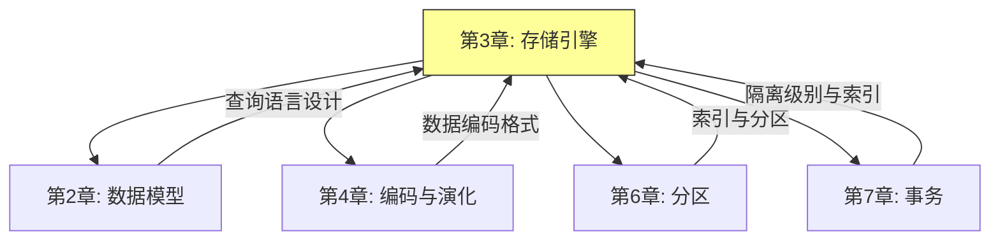

---

## 二、核心概念

### 2.1 存储引擎的演化历程

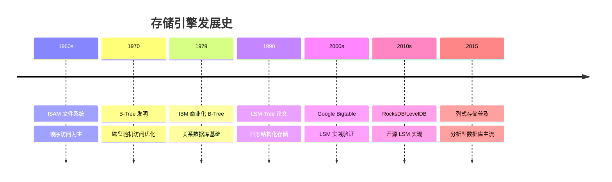

### 2.2 OLTP vs OLAP：两种数据库 workload

**2.2.1 核心差异对比**

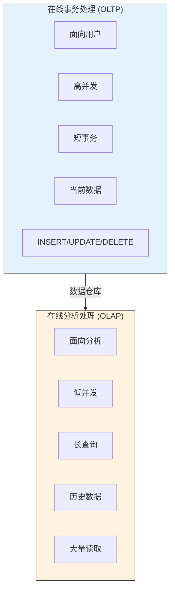

**2.2.2 详细对比表**

| 特性 | OLTP | OLAP |
|-----|-----|-----|
| **读写模式** | 随机读写，频繁更新 | 大量顺序读取 |
| **并发量** | 高并发（数千 QPS） | 低并发（少数用户） |
| **事务长度** | 短（毫秒级） | 长（分钟到小时） |
| **数据量** | GB 级 | TB/PB 级 |
| **查询模式** | 简单查询（单表） | 复杂查询（多表 JOIN） |
| **索引需求** | 辅助索引丰富 | 少量索引 |
| **典型产品** | MySQL, PostgreSQL, Oracle | Redshift, BigQuery, Snowflake |

**2.2.3 星型模型与数据仓库**

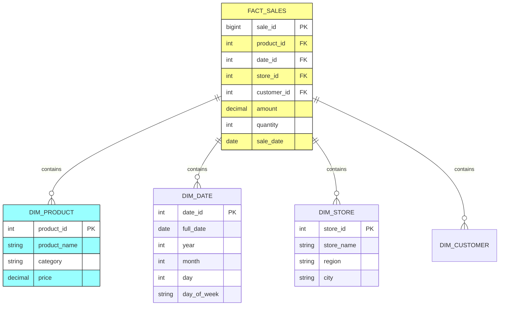

---

## 三、关键技术点

### 3.1 索引结构：存储引擎的核心

**3.1.1 索引的基本原理**

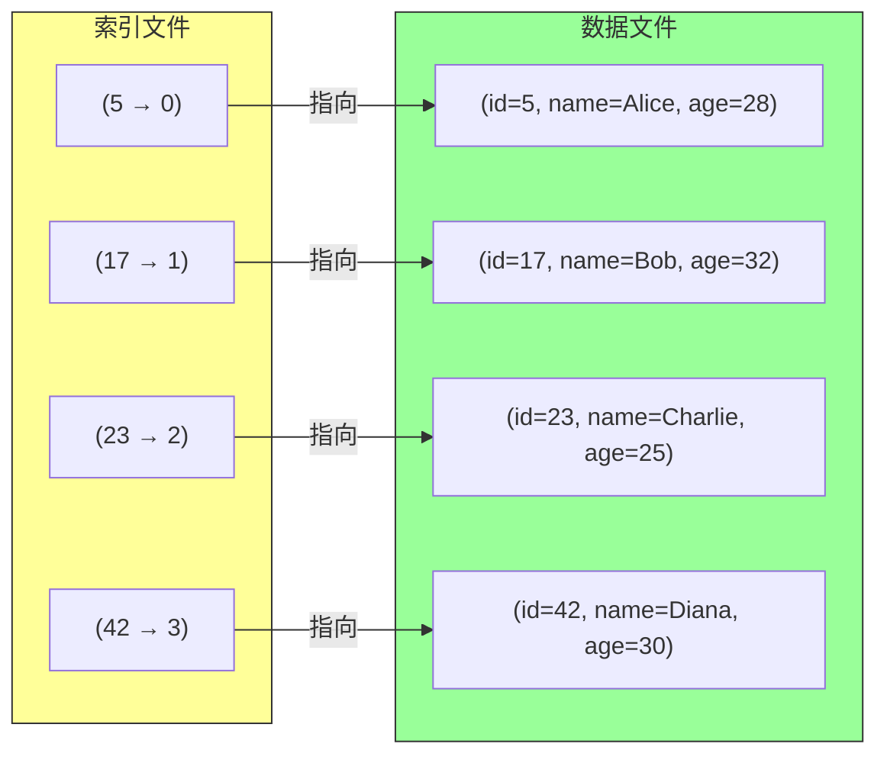

**索引的代价：**
- **空间代价**：索引本身占用磁盘空间
- **写入代价**：每次写入需要更新索引
- **一致性代价**：事务处理更复杂

**3.1.2 哈希索引**

**工作原理：**

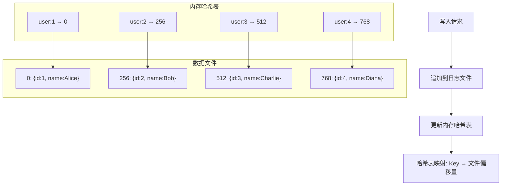

**哈希索引的限制：**

| 限制 | 说明 |
|-----|-----|
| **范围查询效率低** | 无法高效查询 id > 100 的记录 |
| **内存依赖** | 哈希表必须装入内存 |
| **不支持排序** | 无法按 key 顺序遍历 |

**3.1.3 SSTable 与 LSM-Tree**

**SSTable（Sorted String Table）概念：**

```
┌─────────────────────────────────────────────────────────┐
│                    SSTable 结构                          │
├─────────────────────────────────────────────────────────┤
│  key1:value1 │ key2:value2 │ key3:value3 │ key4:value4 │
│  (有序排列)    (有序排列)     (有序排列)     (有序排列)    │
├─────────────────────────────────────────────────────────┤
│  特点：                                                   │
│  1. Key-Value 对按键排序                                 │
│  2. 适合压缩，节省空间                                    │
│  3. 支持高效的范围查询                                    │
└─────────────────────────────────────────────────────────┘
```

**LSM-Tree（Log-Structured Merge-Tree）工作原理：**

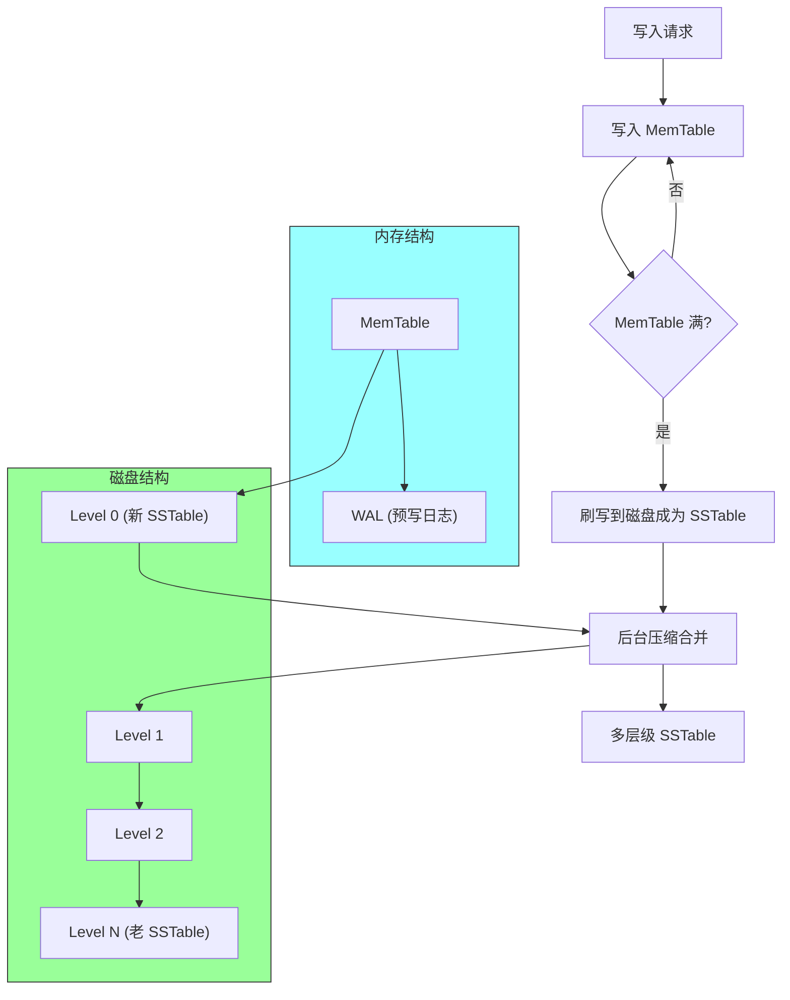

**LSM-Tree 写入流程图解：**

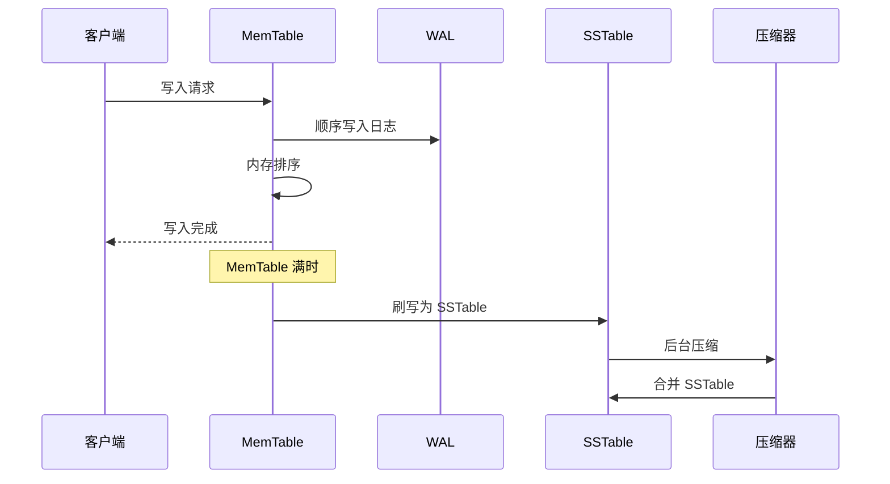

**LSM-Tree 的优势：**

| 优势 | 说明 |
|-----|-----|
| **写入性能高** | 顺序写入磁盘，无随机 IO |
| **空间效率高** | 压缩去除重复数据 |
| **范围查询快** | 数据有序排列 |
| **适合 SSD** | 顺序写入对 SSD 友好 |

**3.1.4 B-Tree 详解**

**B-Tree 结构：**

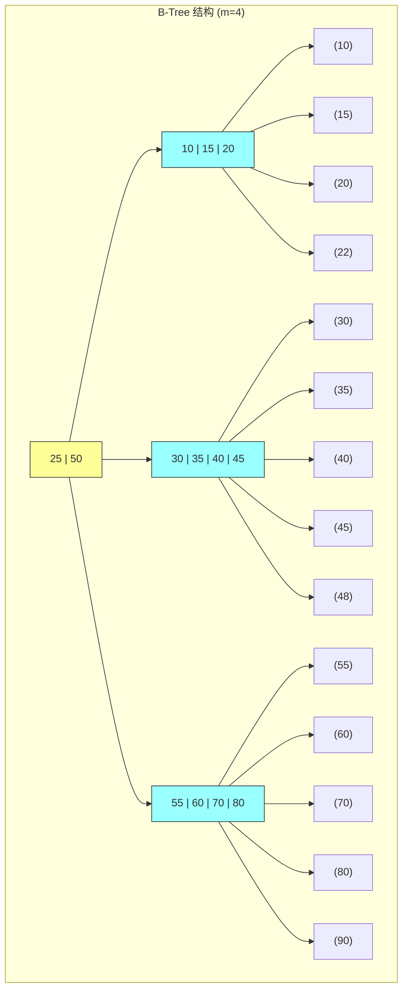

**B-Tree vs LSM-Tree 深度对比：**

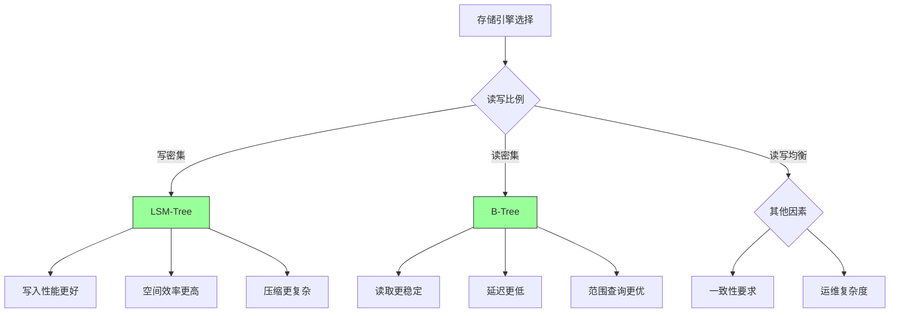

| 对比项 | B-Tree | LSM-Tree |
|-------|--------|---------|
| **写入方式** | 随机写入（更新 in-place） | 顺序写入（追加） |
| **读取性能** | O(log n) 稳定 | O(log n) 需多层查找 |
| **写入放大** | 低（单次写入） | 高（后台压缩） |
| **空间放大** | 低（无冗余） | 高（压缩前冗余） |
| **复杂性** | 成熟稳定 | 实现复杂 |
| **崩溃恢复** | 复杂（WAL+checkpoint） | 简单（重放日志） |
| **典型产品** | MySQL InnoDB, PostgreSQL | RocksDB, LevelDB, Cassandra |

### 3.2 列式存储：分析查询的利器

**3.2.1 行式存储 vs 列式存储**

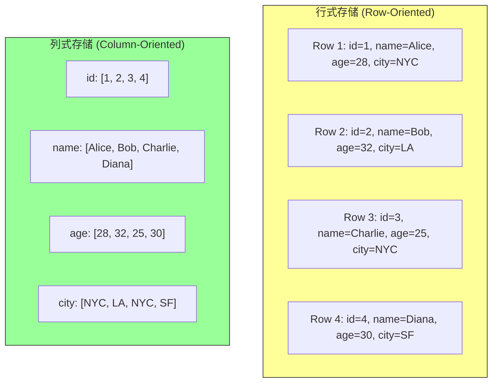

**3.2.2 列式存储的查询执行**

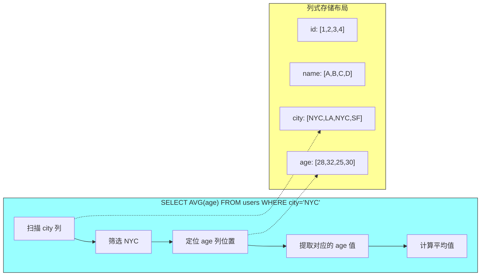

**3.2.3 列式存储的优势**

| 优势 | 说明 |
|-----|-----|
| **查询高效** | 只读取需要的列，减少 IO |
| **压缩率高** | 同类型数据重复多，易压缩 |
| **向量化执行** | CPU 缓存友好 SIMD 优化 |
| **并行处理** | 各列可独立处理 |

**列式存储压缩算法：**

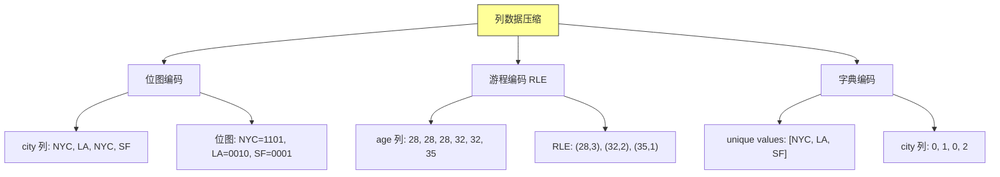

### 3.3 数据压缩技术

**3.3.1 压缩算法对比**

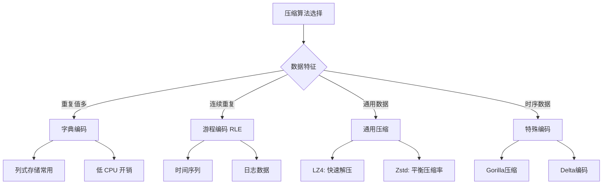

### 3.4 事务处理与恢复

**3.4.1 WAL（Write-Ahead Log）**

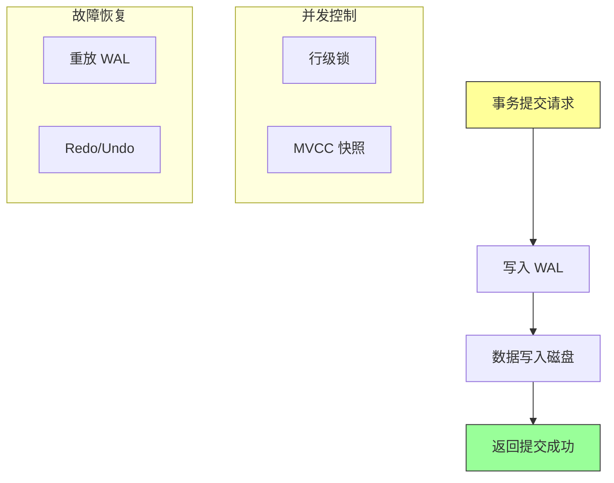

**3.4.2 检查点（Checkpoint）机制**

```mermaid
gantt
    title 检查点机制
    dateFormat  X
    axisFormat %s

    section 正常运行
    初始状态           :0, 1
    事务A执行          :1, 3
    事务B执行          :2, 5

    section 检查点
    生成检查点         :crit, 5, 6
    写入检查点日志     :5, 6

    section 故障恢复
    系统故障           :6, 6
    重放日志           :6, 8
    恢复完成           :8, 9
```

---

## 四、架构图与流程图

### 4.1 存储引擎整体架构

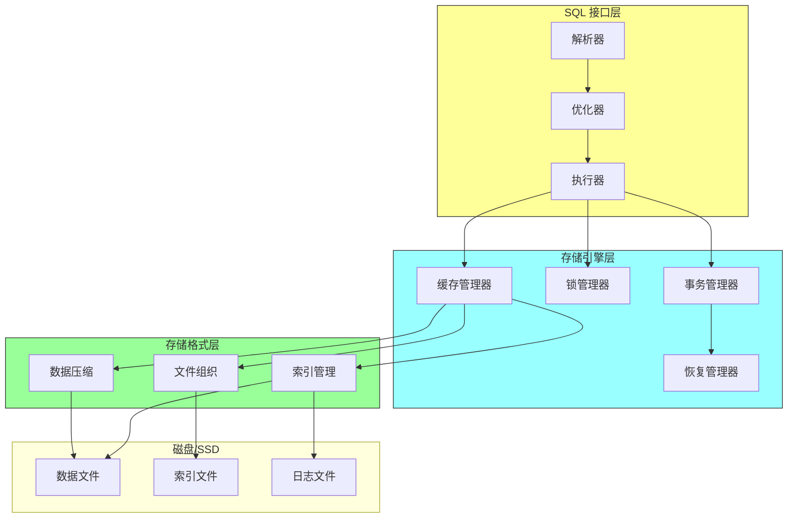

### 4.2 LSM-Tree 写入流程

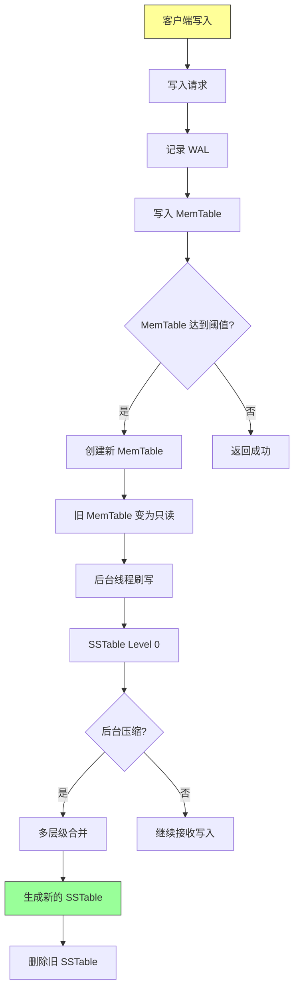

### 4.3 B-Tree 页面管理

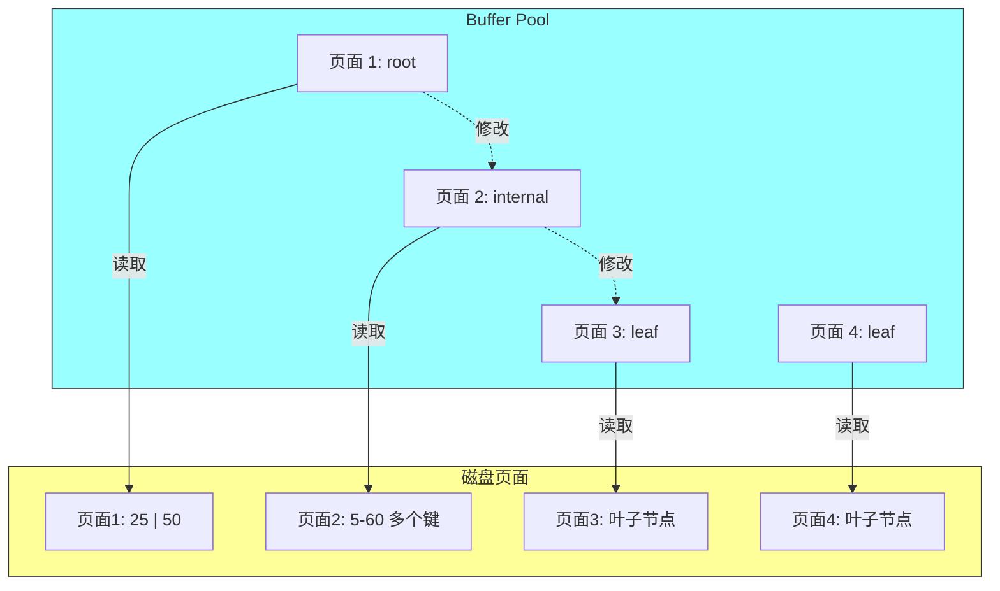

---

## 五、面试题整理

### 5.1 概念理解类 🌱

**Q1：什么是 OLTP 和 OLAP？它们有什么区别？**

**答案：**

**OLTP（在线事务处理）**：
- 面向用户的日常操作
- 高并发、短事务
- 读少写多，数据实时
- 典型场景：用户下单、银行转账

**OLAP（在线分析处理）**：
- 面向分析师的决策支持
- 低并发、长查询
- 读多写少，数据历史
- 典型场景：报表分析、数据挖掘

**核心区别：**

| 维度 | OLTP | OLAP |
|-----|-----|-----|
| 目标 | 日常业务处理 | 决策支持分析 |
| 操作 | 增删改查 | 大量读取 |
| 数据量 | GB 级 | TB/PB 级 |
| 查询 | 简单 | 复杂（多表 JOIN） |
| 响应 | 毫秒级 | 分钟到小时 |

---

**Q2：B-Tree 和 LSM-Tree 有什么区别？各自有什么优缺点？**

**答案：**

**B-Tree**：
- 原地更新（in-place update）
- 每个节点是一个磁盘页
- 读性能稳定 O(log n)
- 写入需要找到位置，随机 IO

**LSM-Tree**：
- 追加写入（append-only）
- 内存和磁盘多层结构
- 写入性能高（顺序 IO）
- 读取需要多层查找

**对比表格：**

| 对比项 | B-Tree | LSM-Tree |
|-------|--------|---------|
| 写入性能 | 随机 IO | 顺序 IO |
| 读取性能 | 稳定 O(log n) | 可能需多次 IO |
| 空间效率 | 无冗余 | 有压缩放大 |
| 写入放大 | 低 | 高 |
| 实现复杂度 | 低 | 高 |
| 崩溃恢复 | 复杂 | 简单 |
| 典型产品 | MySQL, PostgreSQL | RocksDB, Cassandra |

---

**Q3：为什么列式存储适合分析查询？**

**答案：**

**1. 减少不必要的数据读取**

```sql
-- 只读取 age 列，不需要读取其他列
SELECT AVG(age) FROM users WHERE city = 'NYC';
```

**行式存储**：读取整行数据（id, name, age, city...）
**列式存储**：只读取 age 列

**2. 更高的压缩率**

- 同类型数据连续存储，重复值多
- 便于使用字典编码、游程编码等
- 节省存储空间和 IO 带宽

**3. 向量化执行优化**

- 列数据连续存储，CPU 缓存命中率高
- 支持 SIMD 指令批量处理
- 减少分支预测失败

---

### 5.2 原理分析类 🌿

**Q4：请详细说明 LSM-Tree 的工作原理，包括写入流程和压缩策略。**

**答案：**

**LSM-Tree 核心组件：**

```
┌─────────────────────────────────────────────────────────┐
│                     LSM-Tree 结构                        │
├─────────────────────────────────────────────────────────┤
│                                                         │
│   ┌─────────────┐                                       │
│   │  MemTable   │  ← 内存，活跃表（可写）                  │
│   └─────────────┘                                       │
│         ↓                                               │
│   ┌─────────────┐                                       │
│   │   WAL       │  ← 预写日志（崩溃恢复）                  │
│   └─────────────┘                                       │
│         ↓                                               │
│   ┌─────────────────────────────────────────────┐       │
│   │                 SSTable 文件                 │       │
│   │  ┌─────────┐ ┌─────────┐ ┌─────────┐        │       │
│   │  │ Level 0 │ │ Level 1 │ │ Level N │ ...   │       │
│   │  └─────────┘ └─────────┘ └─────────┘        │       │
│   └─────────────────────────────────────────────┘       │
│                                                         │
└─────────────────────────────────────────────────────────┘
```

**写入流程：**

1. 写入请求到达
2. 追加到 WAL（日志文件）
3. 写入 MemTable（内存有序表）
4. 返回成功

**压缩策略（Tiered vs Leveled）：**

| 策略 | 说明 | 优点 | 缺点 |
|-----|-----|-----|-----|
| **Tiered** | 每层多个 SSTable | 写入友好 | 读取需多层查找 |
| **Leveled** | 每层单个 SSTable | 读取友好 | 写入放大高 |

**压缩过程示例：**

```
Level 0 (4个文件):
  [1-100] [51-150] [101-200] [151-250]
      ↓ 压缩合并
Level 1 (1个文件):
  [1-250]
```

---

**Q5：B-Tree 的查找、插入、删除操作的时间复杂度是多少？请解释其原理。**

**答案：**

**时间复杂度：O(log n)**

**查找过程：**

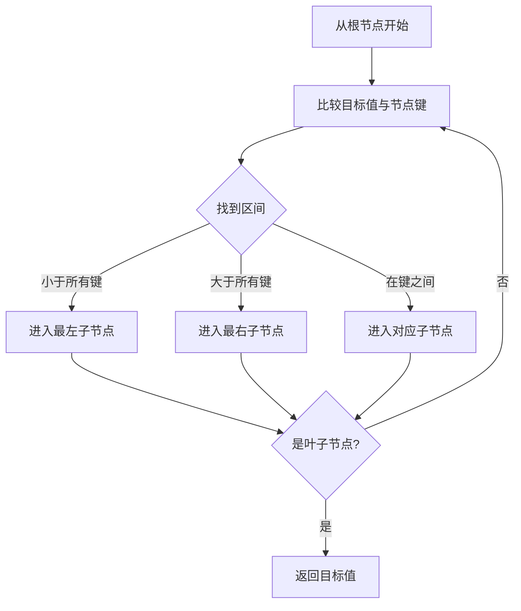

**复杂度分析：**

```
假设：每个节点有 m 个键，树高度为 h
总节点数：n ≈ m^h
h ≈ log_m n

对于 B+Tree（实际数据库实现）：
- 查找：O(log n)
- 插入：O(log n) + 可能分裂
- 删除：O(log n) + 可能合并
```

---

**Q6：什么是写入放大（Write Amplification）？LSM-Tree 和 B-Tree 谁的写入放大更严重？**

**答案：**

**写入放大的定义：**

```
写入放大 = 实际写入磁盘的数据量 / 用户请求写入的数据量

例如：
用户写入 1KB
实际写入磁盘 10KB（多次写入）
写入放大 = 10
```

**B-Tree 的写入放大：**

1. 写入 WAL：1x
2. 写入数据页：1x
3. 写入索引页：可能多页

**LSM-Tree 的写入放大：**

1. 写入 WAL：1x
2. 写入 MemTable：1x
3. 后台压缩：多次（可能 10x+）

```mermaid
graph TD
    A[用户写入 1] --> B[WAL 1]
    A --> C[MemTable 1]
    B --> D[磁盘写入总量]
    C --> D

    D --> E[后台压缩 5-10x]
    E --> F[总放大 10-20x]

    style F fill:#f99,stroke:#333
```

**结论：LSM-Tree 写入放大更严重，但写入性能更高**

---

### 5.3 对比选型类 🔧

**Q7：在什么场景下应该选择 LSM-Tree 而不是 B-Tree？请给出具体案例。**

**答案：**

**选择 LSM-Tree 的场景：**

```mermaid
graph TD
    A[选择 LSM-Tree] --> B[写入密集场景]
    A --> C[时序数据]
    A --> D[日志存储]
    A --> E[SSD 存储]

    B --> B1["写入 QPS > 10,000"]
    B --> B2["时间序列指标"]

    C --> C1["监控数据"]
    C --> C2["IoT 传感器"]

    D --> D1["应用日志"]
    D --> D2["审计追踪"]

    E --> E1["SSD 顺序写入友好"]
    E --> E2["减少写放大影响"]

    style A fill:#9f9,stroke:#333
```

**具体案例：**

| 场景 | 推荐 | 理由 |
|-----|-----|-----|
| 时序数据库 | LSM-Tree | 写入时序、压缩高效 |
| 消息队列 | LSM-Tree | 高吞吐、顺序写入 |
| 电商订单 | B-Tree | 强事务、随机读取 |
| 游戏存档 | B-Tree | 随机更新、点查询 |

---

**Q8：为什么现代分析型数据库都采用列式存储？请从技术原理角度分析。**

**答案：**

**分析查询的特点：**

```sql
-- 典型的分析查询
SELECT
    product_category,
    SUM(sales_amount) as total_sales,
    AVG(quantity) as avg_quantity
FROM sales
WHERE sale_date >= '2024-01-01'
GROUP BY product_category
HAVING SUM(sales_amount) > 1000000
```

**列式存储的优势：**

**1. IO 效率**

| 存储方式 | 读取的数据量 |
|---------|-------------|
| 行式存储 | 整行数据（假设 100 列，只用到 3 列） |
| 列式存储 | 只读取需要的 3 列 |

**2. 压缩效率**

```
age 列: [28, 32, 25, 30, 28, 32, ...]
- 字典编码：unique values 很少
- RLE 编码：连续相同值
- 压缩率可达 10x+
```

**3. 向量化执行**

```python
# 向量化计算示例（伪代码）
ages = column('age')  # [28, 32, 25, 30, ...]
avg_age = sum(ages) / len(ages)  # CPU 批量处理
```

**4. 并行处理**

- 各列独立处理
- 易于分布式扩展

---

### 5.4 实战应用类 🔧

**Q9：如果你需要为一个日活 100 万的社交应用设计数据库架构，你会如何选择存储引擎？**

**答案：**

**业务需求分析：**

| 数据类型 | 特点 | 存储需求 |
|---------|-----|---------|
| 用户信息 | 读多写少，点查询 | 快速点读 |
| 社交关系 | 复杂关联查询 | 图数据库 |
| 动态 Feed | 写入密集 | LSM-Tree |
| 消息会话 | 写入密集，时序 | LSM-Tree |
| 用户行为 | 分析查询 | 列式存储 |

**架构设计：**

```mermaid
graph TD
    subgraph 应用层
        A1[API Gateway]
    end

    subgraph 存储层
        B1[(PostgreSQL)]
        B2[(Neo4j)]
        B3[(RocksDB)]
        B4[(ClickHouse)]
        B5[(Redis)]
    end

    A1 --> B1[用户信息]
    A1 --> B2[社交关系]
    A1 --> B3[动态 Feed]
    A1 --> B4[行为分析]
    A1 --> B5[会话缓存]

    style B1 fill:#bbdefb,stroke:#333
    style B2 fill:#e1bee7,stroke:#333
    style B3 fill:#c8e6c9,stroke:#333
    style B4 fill:#fff3e0,stroke:#333
    style B5 fill:#ffcdd2,stroke:#333
```

**存储引擎选择理由：**

| 引擎 | 数据 | 选择理由 |
|-----|-----|---------|
| PostgreSQL | 用户信息 | 强一致、复杂查询 |
| Neo4j | 社交关系 | 原生图遍历 |
| RocksDB | 动态 Feed | 高写入性能 |
| ClickHouse | 行为分析 | 列式存储、聚合查询 |
| Redis | 会话缓存 | 毫秒级响应 |

---

**Q10：如何优化数据库的写入性能？请从存储引擎角度给出具体方案。**

**答案：**

**优化方案概览：**

```mermaid
graph TD
    A[写入性能优化] --> B[批量写入]
    A --> C[异步写入]
    A --> D[压缩优化]
    A --> E[存储引擎选择]

    B --> B1[Batch INSERT]
    B --> B2[COPY 命令]

    C --> C1[异步刷盘]
    C --> C2[延迟写入]

    D --> D1[选择压缩算法]
    D --> D2[减少写入放大]

    E --> E1[LSM-Tree]
    E --> E2[分区表]

    style A fill:#9f9,stroke:#333
```

**具体优化措施：**

| 优化项 | 具体方案 | 效果 |
|-------|---------|-----|
| 批量写入 | `INSERT INTO t VALUES (...), (...), (...)` | 减少网络往返 |
| 异步写入 | 设置 `innodb_flush_log_at_trx_commit=2` | 提高 TPS |
| 减少索引 | 删除不必要的索引 | 减少写入放大 |
| 选择 LSM | RocksDB 等 | 顺序写入 |
| 分区表 | 按时间分区 | 并行写入 |

---

### 5.5 源码级别类 🌳

**Q11：请分析 MySQL InnoDB 的 Buffer Pool 机制及其对查询性能的影响。**

**答案：**

**Buffer Pool 结构：**

```mermaid
graph TD
    subgraph Buffer Pool
        A1[Page Hash]
        A2[LRU List]
        A3[Free List]
        A4[Flush List]
    end

    subgraph 数据页["数据页管理"]
        B1[数据页]
        B2[索引页]
        B3[Undo 页]
        B4[系统页]
    end

    A2 -->|淘汰| B1
    A3 -->|分配| B2
    A4 -->|刷盘| B3

    style Buffer Pool fill:#9ff,stroke:#333
```

**LRU 缓存淘汰算法：**

```
InnoDB LRU 特点：
1. 分为 young 和 old 区域（默认 37:63）
2. 防止热点数据被一次性淘汰
3. 访问 old 区域后移到 young 头部

访问模式：A B C D E F G
假设 Buffer Pool 只能存 5 个：

初始: [A, B, C, D, E]
访问 F: [B, C, D, E, F]
访问 B: [C, D, E, F, B]
```

**Buffer Pool 优化参数：**

```sql
-- 设置 Buffer Pool 大小
SET GLOBAL innodb_buffer_pool_size = 64G;

-- 设置 Buffer Pool 实例数（CPU 核数）
SET GLOBAL innodb_buffer_pool_instances = 16;

-- 预加载数据到 Buffer Pool
SELECT SQL_NO_CACHE * FROM large_table FORCE INDEX (PRIMARY);
```

---

**Q12：什么是 MVCC（多版本并发控制）？它如何实现读写分离？**

**答案：**

**MVCC 核心思想：**

```
每个事务看到的是数据库的一个"快照"

事务开始          事务提交
   │                │
   ▼                ▼
┌─────────────────────────────┐
│  快照版本号（snapshot）     │
│  - 所有早于该版本的数据可见 │
└─────────────────────────────┘
```

**MVCC 工作流程：**

```mermaid
flowchart TD
    A[事务 T1 开始] --> B[获取快照版本 v1]
    B --> C[读取数据]

    D[事务 T2 开始] --> E[获取快照版本 v2]
    E --> F[读取数据]

    G[事务 T1 写入] --> H[创建新版本 v1.1]
    H --> I[事务 T2 仍读旧版本]

    style A fill:#9ff,stroke:#333
    style D fill:#9ff,stroke:#333
```

**版本链与可见性判断：**

```mermaid
graph TD
    subgraph 数据行["数据行"]
        R1[row_id=1]
    end

    subgraph 版本链["版本链"]
        V1["trx_id=100, data='A', roll_ptr=null"]
        V1 -.-> V2["trx_id=150, data='B', roll_ptr→V1"]
        V2 -.-> V3["trx_id=200, data='C', roll_ptr→V2"]
    end

    V1 -->|插入| R1
    V2 -->|更新| V1
    V3 -->|更新| V2

    style 版本链 fill:#ff9,stroke:#333
```

**可见性判断规则：**

```
对于事务 T，当前数据版本 V 是否可见：

1. V 的创建事务是否已提交？
   - 否 → 不可见
   - 是 → 继续判断

2. V 的创建事务是否在 T 的快照之后开始？
   - 是 → 不可见
   - 否 → 可见
```

---

## 六、实践要点

### 6.1 存储引擎选择决策树

```mermaid
flowchart TD
    A[选择存储引擎] --> B{主要 workload?}

    B -->|写入密集| C[LSM-Tree]
    B -->|读写均衡| D{一致性要求?}
    B -->|读密集| E{查询类型?}

    D -->|强一致| F[B-Tree]
    D -->|最终一致| G[LSM-Tree]

    E -->|点查询为主| H[B-Tree]
    E -->|范围查询为主| I[LSM-Tree / B-Tree]
    E -->|聚合分析| J[列式存储]

    C --> C1["RocksDB, LevelDB"]
    F --> F1["InnoDB, PostgreSQL"]
    H --> H1["InnoDB, MyISAM"]
    J --> J1["ClickHouse, Redshift"]

    style C fill:#c8e6c9,stroke:#333
    style F fill:#bbdefb,stroke:#333
    style J fill:#fff3e0,stroke:#333
```

### 6.2 索引设计最佳实践

```mermaid
graph TD
    A[索引设计] --> B[识别慢查询]
    A --> C[分析查询模式]
    A --> D[选择索引列]

    B --> B1[Explain 分析]
    C --> C1[WHERE 条件]
    C --> C2[JOIN 条件]
    C --> C3[ORDER BY]

    D --> D1[高选择性列]
    D --> D2[联合索引顺序]

    D1 --> D1a["区分度 > 30%"]
    D1 --> D1b["避免低基数列"]

    D2 --> D2a["等值在前"]
    D2 --> D2b["范围在后"]

    style A fill:#ff9,stroke:#333
```

### 6.3 常见性能问题与解决方案

| 问题 | 原因 | 解决方案 |
|-----|-----|---------|
| 写入性能差 | 随机 IO | 批量写入、LSM-Tree |
| 读取性能差 | 缺少索引 | 添加索引、覆盖索引 |
| 内存占用高 | Buffer Pool 过大 | 调小、限制 |
| 压缩慢 | CPU 瓶颈 | 选择快速压缩算法 |
| 崩溃恢复慢 | 日志过大 | 定期 checkpoint |

---

## 七、扩展阅读

### 7.1 必读论文

| 论文 | 作者 | 年份 | 贡献 |
|-----|-----|-----|-----|
| The Log-Structured Merge-Tree (LSM-Tree) | O'Neil et al. | 1996 | LSM 理论基础 |
| B-Tree Locking | 多个作者 | 1980s | B-Tree 并发控制 |
| MVCC | Reed | 1978 | 多版本并发控制 |
| Column-Oriented Storage | Stonebraker et al. | 2005 | 列式存储分析 |

### 7.2 推荐资源

- RocksDB 官方文档
- ClickHouse 官方文档
- 《Database Internals》- Alex Petrov

### 7.3 实践项目

- 实现一个简单的 LSM-Tree
- 分析 InnoDB 源码
- 优化 MySQL 查询性能

---

## 八、本章小结

### 核心收获

1. **OLTP vs OLAP 的本质区别**
   - 读写模式、数据量、查询复杂度

2. **两种主流索引结构**
   - B-Tree：原地更新，读性能稳定
   - LSM-Tree：追加写入，写性能高

3. **列式存储适合分析场景**
   - 减少 IO、提高压缩率、向量化执行

4. **存储引擎选择需要权衡**
   - 根据 workload 特点选择

### 概念地图

```mermaid
mindmap
  root((存储引擎))
    索引结构
      B-Tree
      LSM-Tree
      Hash Index
    存储类型
      行式存储
      列式存储
    压缩技术
      字典编码
      RLE
      通用压缩
    事务处理
      WAL
      MVCC
      Checkpoint
```

### 下一章预告

第 4 章将探讨**编码与演化**，了解数据如何在不同的进程、服务之间传输和存储，包括：
- JSON、Protocol Buffers 等编码格式
- Schema 演化的兼容性
- 数据流与消息传递

---

## 附录 A：存储引擎特性对比表

| 引擎 | 类型 | 写入方式 | 适用场景 |
|-----|-----|---------|---------|
| InnoDB | B-Tree | 随机写入 | OLTP |
| MyISAM | B-Tree | 随机写入 | 只读场景 |
| RocksDB | LSM-Tree | 顺序写入 | 写入密集 |
| LevelDB | LSM-Tree | 顺序写入 | KV 存储 |
| ClickHouse | 列式 | 批量写入 | OLAP |
| HBase | LSM-Tree | 顺序写入 | 大数据 |

## 附录 B：索引类型对比

| 索引类型 | 结构 | 特点 | 适用场景 |
|---------|-----|-----|---------|
| B-Tree | 树形 | 范围查询 | 通用 |
| Hash | 哈希表 | 点查询 | KV 存储 |
| GiST | 树形 | 空间数据 | GIS |
| GIN | 倒排索引 | 全文搜索 | 文本搜索 |

---

*文档生成时间：2024-01-08*
*基于《Designing Data-Intensive Applications》第3章*
