# 《Designing Data-Intensive Applications》- 第4章：编码与演化（深度版）

## 一、本章概述

本章深入探讨了数据在**不同进程、不同服务、不同时间点**之间如何可靠地传输和存储。数据编码不仅是技术细节，更是系统演化的基石。

> **本章核心问题**：数据如何在分布式系统中流动？Schema 变更如何保证兼容性？

### 1.1 核心主题
- 数据编码格式：JSON、Protocol Buffers、Avro 等
- Schema 演化的两种类型：向前兼容与向后兼容
- 数据流模式：数据库、服务调用、消息传递
- 大规模数据处理的编码策略

### 1.2 重要程度
⭐⭐⭐⭐⭐（极高）

### 1.3 预计学习时间
120-150 分钟

### 1.4 本章与其他章节的关联

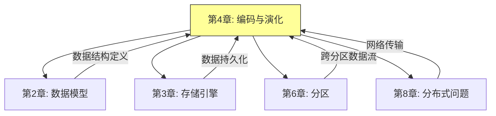

---

## 二、核心概念

### 2.1 编码格式的演化历程

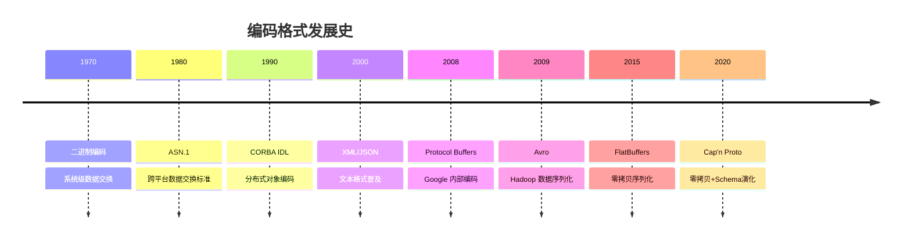

### 2.2 语言内置序列化 vs 二进制编码

**2.2.1 语言内置序列化的缺点：**

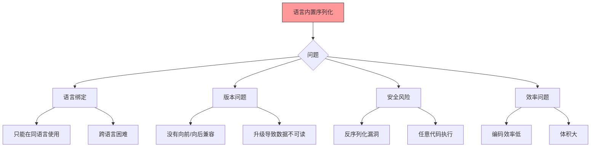

**2.2.2 二进制编码的优势：**

| 优势 | 说明 |
|-----|-----|
| **跨语言** | Schema 定义，多语言代码生成 |
| **高效** | 二进制格式，紧凑快速 |
| **可演化** | 支持 Schema 变更，向后/向前兼容 |
| **安全** | 无任意代码执行风险 |

---

## 三、关键技术点

### 3.1 主流编码格式详解

**3.1.1 JSON、XML 与 CSV**

**JSON 编码示例：**

```json
{
  "user_id": 12345,
  "name": "张三",
  "email": "zhangsan@example.com",
  "age": 30,
  "hobbies": ["读书", "跑步", "摄影"],
  "address": {
    "city": "北京",
    "district": "朝阳区"
  }
}
```

**JSON 的优缺点：**

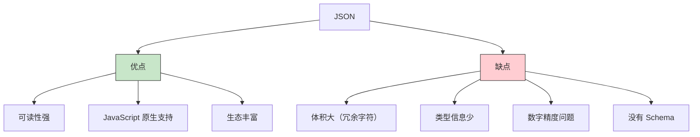

**3.1.2 Protocol Buffers（protobuf）**

**Schema 定义：**

```protobuf
syntax = "proto3";

message User {
  int64 user_id = 1;
  string name = 2;
  string email = 3;
  int32 age = 4;
  repeated string hobbies = 5;
  Address address = 6;

  message Address {
    string city = 1;
    string district = 2;
  }
}
```

**二进制编码格式：**

```
┌─────────────────────────────────────────────────────────────┐
│                    Protobuf 编码格式                         │
├─────────────────────────────────────────────────────────────┤
│  字段编号 | 字段类型 | 字段值                                 │
│  (varint) | (3 bit)  | (根据类型)                            │
├─────────────────────────────────────────────────────────────┤
│  示例: user_id=12345, name="张三"                            │
│  0x08 (字段1, varint) + 0x39 (12345 的 varint 编码)          │
│  0x12 (字段2, length-delimited) + 0x06 + "张三"             │
└─────────────────────────────────────────────────────────────┘
```

**Protobuf 编码原理：**

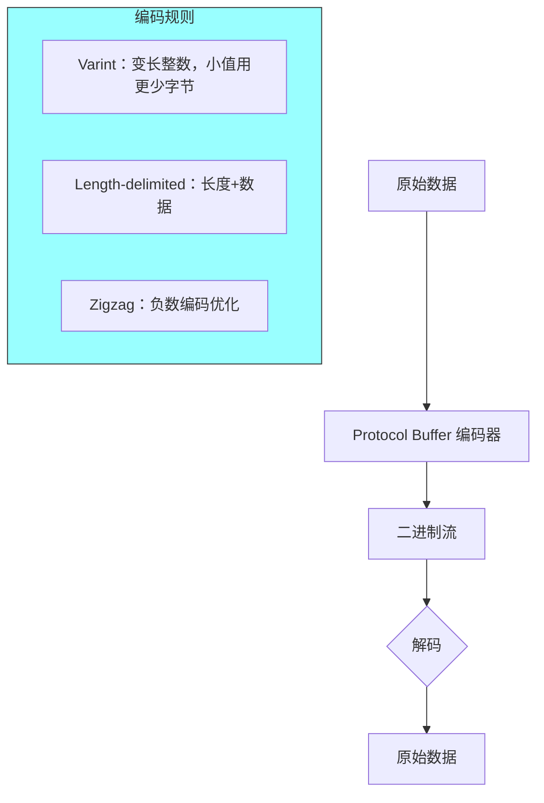

**Varint 编码示例：**

```
数字 300 = 0x12C = 二进制 10 1100 1000

拆分为 7 位一组：10 1100 1000 → [0101100, 0000010]
添加 MSB 表示是否继续：10101100, 00000010 = 0xAC, 0x02
```

**3.1.3 Apache Avro**

**Avro Schema 定义：**

```json
{
  "type": "record",
  "name": "User",
  "fields": [
    {"name": "user_id", "type": "long"},
    {"name": "name", "type": "string"},
    {"name": "email", "type": ["null", "string"], "default": null},
    {"name": "age", "type": "int"},
    {"name": "hobbies", "type": {"type": "array", "items": "string"}}
  ]
}
```

**Avro vs Protobuf 对比：**

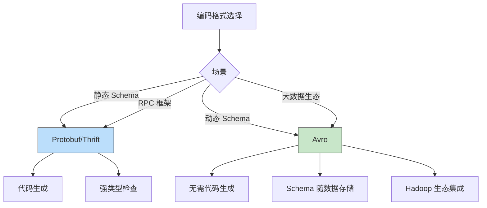

### 3.2 Schema 演化机制

**3.2.1 向后兼容 vs 向前兼容**

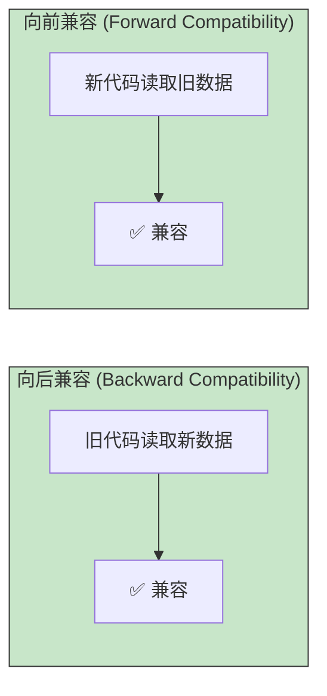

**3.2.2 Schema 演化规则**

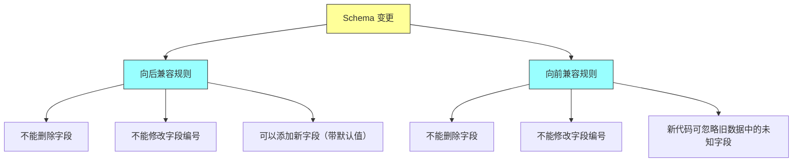

**具体示例：**

```protobuf
// 原始 Schema (v1)
message User {
  int64 user_id = 1;
  string name = 2;
  string email = 3;
}

// 演化的 Schema (v2) - 向后兼容
message User {
  int64 user_id = 1;
  string name = 2;
  string email = 3;
  string phone = 4;  // 新增字段
  int32 age = 5;     // 新增字段
}

// 演化的 Schema (v3) - 向后兼容
message User {
  int64 user_id = 1;
  string name = 2;
  // email 被删除 ❌ 不兼容！
}

// 演化的 Schema (v4) - 向后兼容
message User {
  int64 user_id = 1;
  string name = 2;
  string email = 3;
  string name = 2;  // 修改类型 ❌ 不兼容！
}
```

**3.2.3 演化冲突场景**

| 变更类型 | 向后兼容 | 向前兼容 | 双向兼容 |
|---------|:--------:|:--------:|:--------:|
| 添加字段 | ✅ | ✅ | ✅ |
| 删除字段 | ❌ | ✅ | ❌ |
| 修改字段名 | ❌ | ❌ | ❌ |
| 修改字段类型 | ❌ | ❌ | ❌ |
| 修改字段编号 | ❌ | ❌ | ❌ |

### 3.3 数据流模式

**3.3.1 三种主要数据流模式**

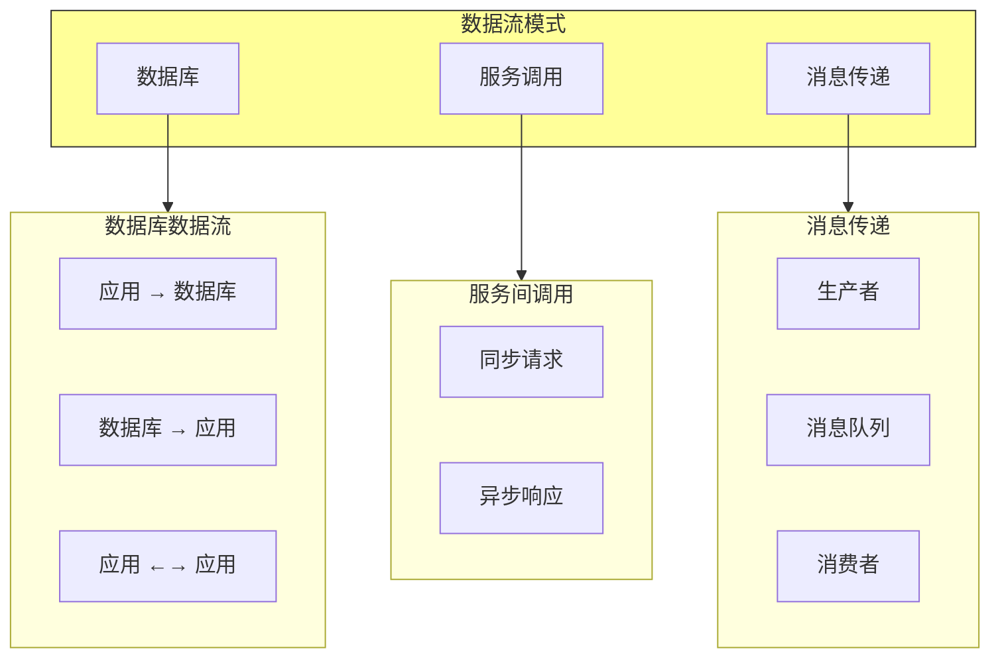

**3.3.2 通过数据库的数据流**

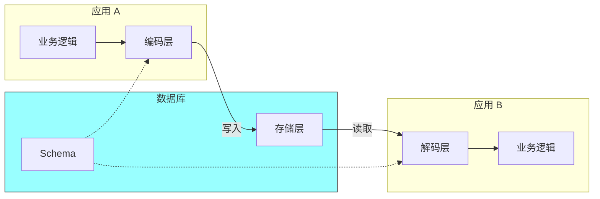

**通过数据库数据流的特点：**

| 特点 | 说明 |
|-----|-----|
| **异步** | 写入和读取可以不同时间 |
| **多消费者** | 多个应用读取同一数据 |
| **Schema 挑战** | 不同应用需要不同 Schema 版本 |

**3.3.3 通过服务调用（REST/gRPC）的数据流**

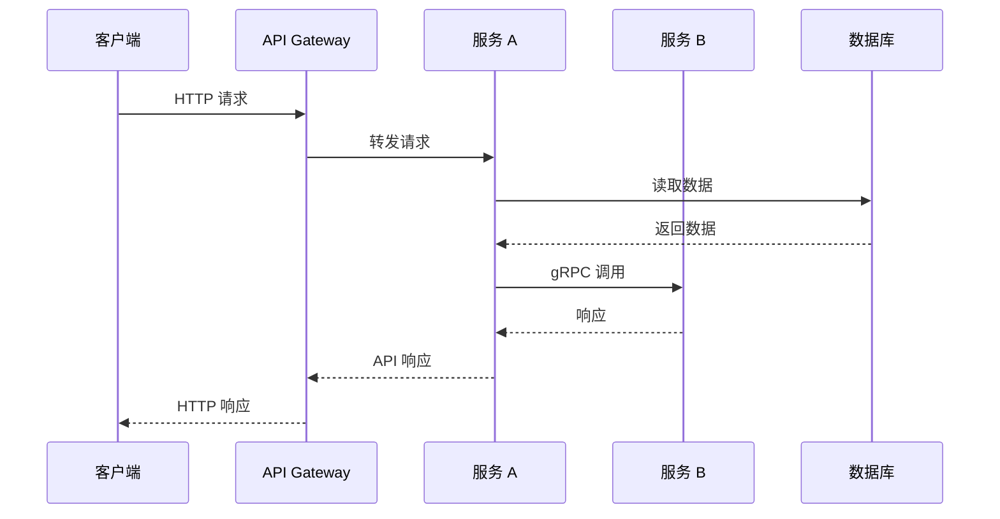

**REST vs gRPC：**

| 对比项 | REST | gRPC |
|-------|-----|-----|
| 通信方式 | HTTP/1.1 | HTTP/2 |
| 数据格式 | JSON/XML | Protocol Buffers |
| 性能 | 较低 | 高 |
| 类型安全 | 弱 | 强 |
| 代码生成 | OpenAPI | protoc |
| 适用场景 | 外部 API | 微服务内部 |

**3.3.4 通过消息队列的数据流**

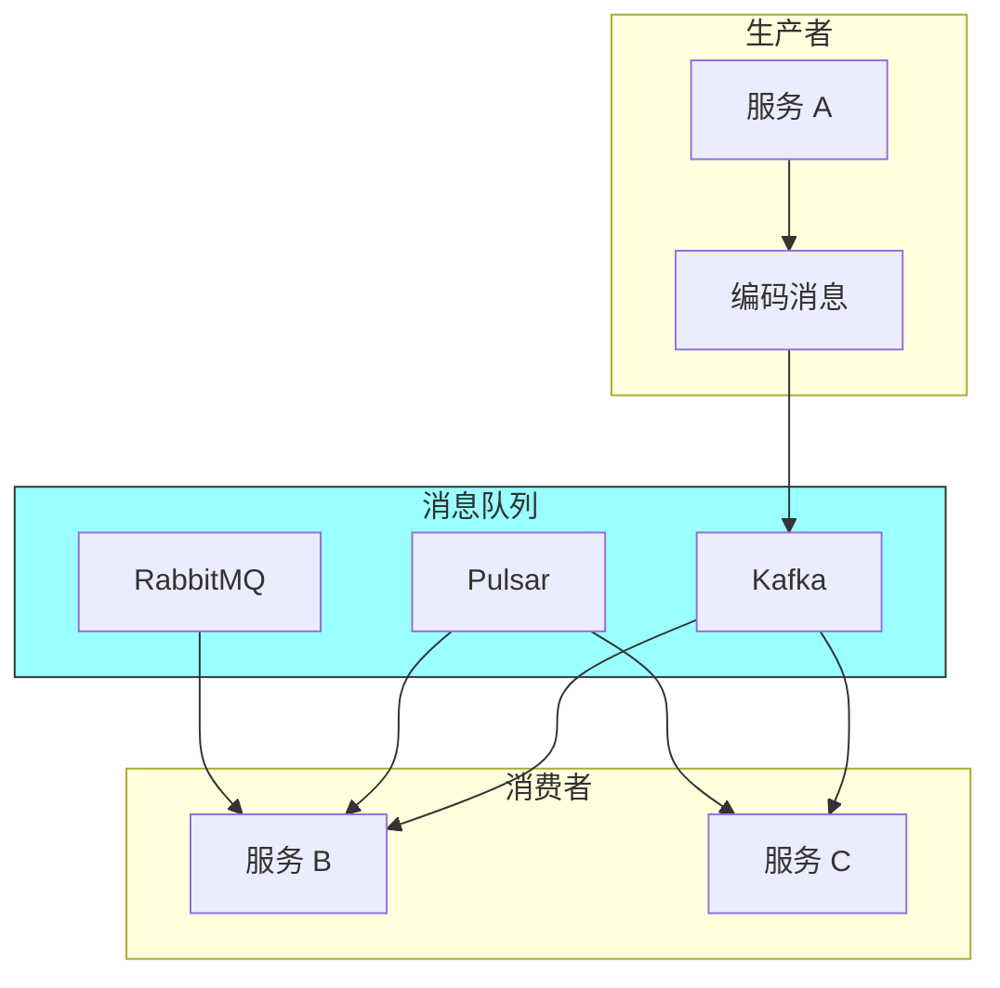

**消息队列的优势：**

| 优势 | 说明 |
|-----|-----|
| **异步** | 生产者不需等待消费者 |
| **解耦** | 生产者和消费者独立演进 |
| **缓冲** | 削峰填谷 |
| **重试** | 失败消息重试 |
| **多播** | 一条消息多个消费者 |

---

## 四、架构图与流程图

### 4.1 编码格式选择决策树

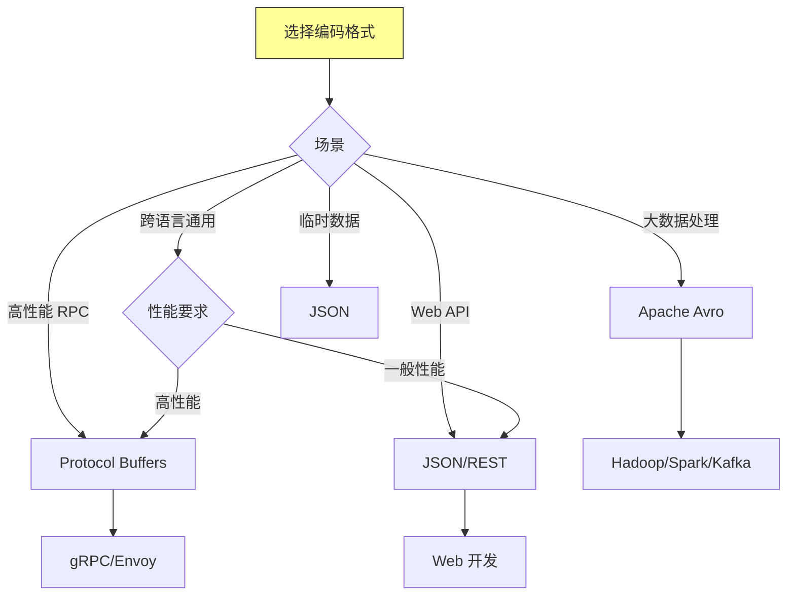

### 4.2 Schema 注册中心架构

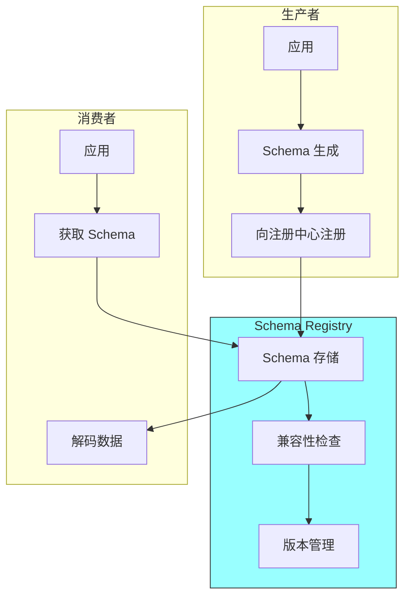

### 4.3 数据流全景图

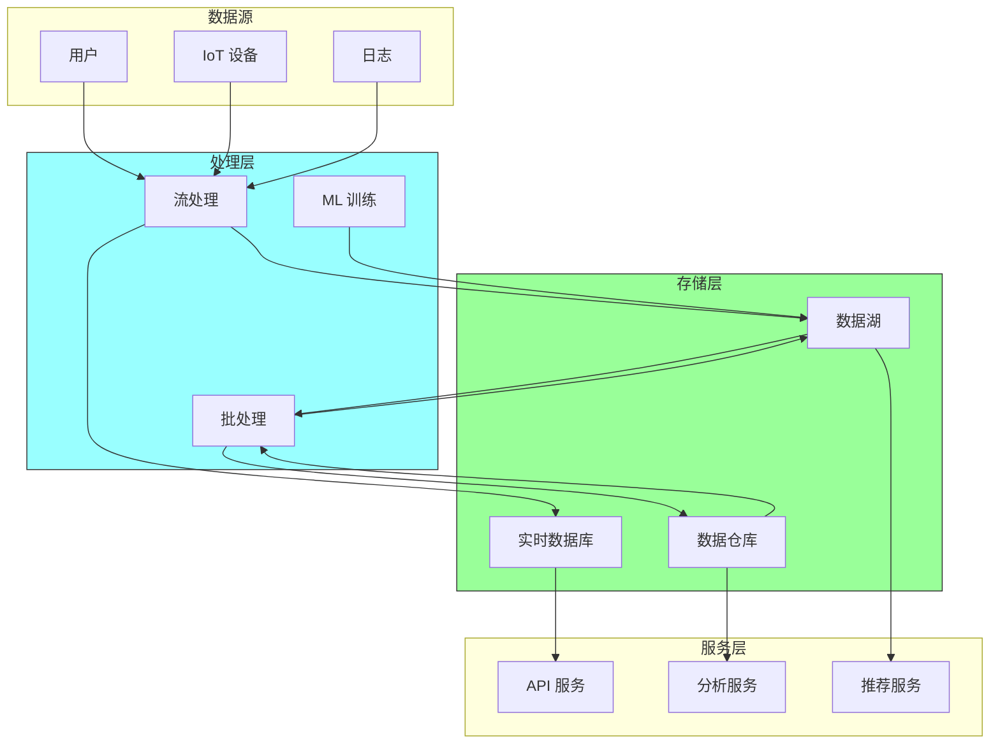

---

## 五、面试题整理

### 5.1 概念理解类 🌱

**Q1：什么是编码（Serialization）？它与序列化（Marshalling）有什么区别？**

**答案：**

**编码（Encoding/Serialization）**：
- 将内存中的数据结构转换为字节流
- 用于存储或网络传输

**反编码（Decoding/Deserialization）**：
- 将字节流还原为数据结构

**相关概念对比：**

| 术语 | 含义 |
|-----|-----|
| Encoding | 将对象转换为字节流 |
| Decoding | 将字节流还原为对象 |
| Serialization | 通常与 Encoding 同义 |
| Deserialization | 通常与 Decoding 同义 |
| Marshalling | 序列化 + 跨进程边界传输 |
| Unmarshalling | 反序列化 |

---

**Q2：JSON 和 Protocol Buffers 有什么区别？各自适用于什么场景？**

**答案：**

**核心区别：**

| 对比项 | JSON | Protocol Buffers |
|-------|-----|------------------|
| 格式 | 文本 | 二进制 |
| 可读性 | 高 | 低 |
| 体积 | 大 | 小（通常 3-10x） |
| 性能 | 慢 | 快 |
| Schema | 无 | 有 |
| 类型检查 | 运行时 | 编译时 |
| 兼容性 | 无 | 自动支持 |

**适用场景：**

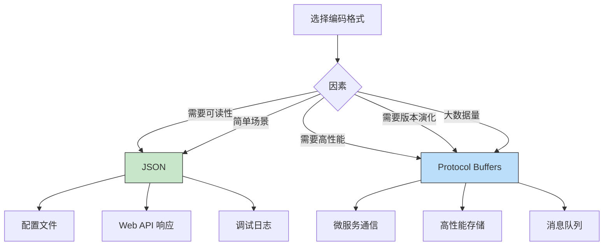

---

**Q3：什么是 Schema 演化？它有什么重要性？**

**答案：**

**Schema 演化的定义：**

Schema 演化是指在不破坏现有系统兼容性的前提下，修改数据的 Schema 定义。

**为什么重要：**

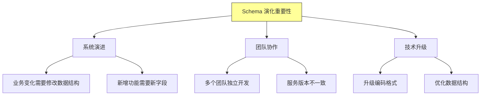

**演化带来的挑战：**

```
问题场景：
┌─────────────────────────────────────────────┐
│  服务 A (v1)    →    数据库    ←    服务 B (v2)  │
│  字段: id, name           字段: id, name, age    │
│                                             ↑    │
│                                      服务 B 添加了 age │
└─────────────────────────────────────────────┘

如果 Schema 不兼容：
- 服务 A 读取包含 age 的数据会报错
- 服务 B 删除 name 字段会导致服务 A 崩溃
```

---

### 5.2 原理分析类 🌿

**Q4：Protocol Buffers 是如何实现向前兼容和向后兼容的？**

**答案：**

**核心机制：**

```
Protocol Buffers 兼容性保证基于两个关键设计：

1. 字段编号（Field Number）
   - 每个字段有一个唯一编号
   - 编码时只存储编号，不存储字段名
   - 读取时根据编号查找字段

2. 未知字段忽略
   - 新代码读取旧数据时，忽略未知字段
   - 旧代码读取新数据时，忽略未知字段
```

**编码示例：**

```protobuf
message User {
  int64 user_id = 1;  // 字段编号 1
  string name = 2;    // 字段编号 2
  string email = 3;   // 字段编号 3
}
```

**二进制编码：**

```
原始数据：user_id=12345, name="张三"

编码后：0x08 0x39 0x12 0x06 0xE5 0xBC 0xA0 0xE4 0xB8 0x80

解析：
0x08 → 字段编号 1，类型 varint
0x39 → 值 12345 (39 = 0xAC 0x02 的 varint 解码)

0x12 → 字段编号 2，类型 length-delimited
0x06 → 长度 6 字节
0xE5 0xBC 0xA0 0xE4 0xB8 0x80 → "张三" 的 UTF-8 编码
```

**向后兼容（旧代码读新数据）：**

```
旧代码（v1 Schema）：user_id, name
新数据（v2 Schema）：user_id, name, age, phone

解码过程：
- 读取字段 1 → user_id ✓
- 读取字段 2 → name ✓
- 读取字段 3 → 未知字段，忽略
- 读取字段 4 → 未知字段，忽略
```

**向前兼容（新代码读旧数据）：**

```
新代码（v2 Schema）：user_id, name, age, phone
旧数据（v1 Schema）：user_id, name

解码过程：
- 读取字段 1 → user_id ✓
- 读取字段 2 → name ✓
- age 字段不存在 → 使用默认值 0
- phone 字段不存在 → 使用默认值 ""
```

---

**Q5：Avro Schema 和 Protobuf Schema 有什么本质区别？**

**答案：**

**核心区别：Schema 如何被使用**

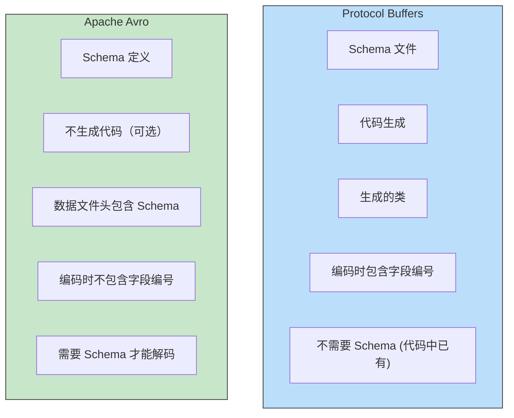

**详细对比：**

| 对比项 | Protocol Buffers | Apache Avro |
|-------|-----------------|-------------|
| Schema 位置 | 编译时嵌入代码 | 随数据存储或传输 |
| 字段标识 | 字段编号（整数） | 字段名称（字符串） |
| 代码生成 | 必须 | 可选 |
| 数据膨胀 | 小（字段编号 1-2 字节） | 更小（无字段标识） |
| Schema 变更 | 编号不变，名称可改 | 字段名不可变 |
| 适用场景 | RPC、大数据 | 大数据处理、Hadoop |

**Avro 编码示例：**

```
Avro 数据文件结构：

┌─────────────────────────────────────────┐
│  File Header                             │
│  - Magic Number (Obj1)                   │
│  - Schema (JSON 格式)                    │
│  - Sync Marker                           │
├─────────────────────────────────────────┤
│  Data Block 1                            │
│  - Row count                             │
│  - Compressed data                       │
│  - Sync Marker                           │
├─────────────────────────────────────────┤
│  Data Block 2                            │
│  ...                                     │
└─────────────────────────────────────────┘

Avro 二进制编码（无字段编号）：
- 值直接按类型编码
- 解码时需要 Schema 知道字段顺序和类型
```

---

**Q6：微服务架构中如何处理 Schema 演化导致的兼容性问题？**

**答案：**

**挑战分析：**

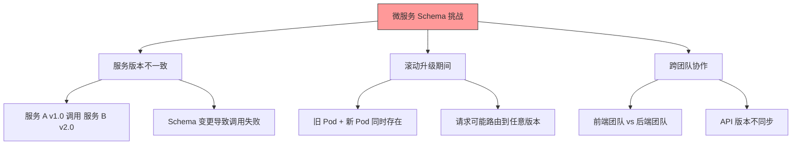

**解决方案：**

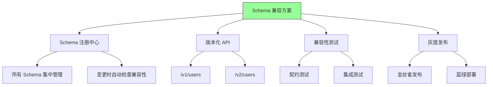

**最佳实践：**

```yaml
# API 版本管理示例
/api/v1/users:
  # 旧版本 API，保持兼容
  - GET /users
  - POST /users

/api/v2/users:
  # 新版本 API
  - GET /users?include=profile
  - POST /users (新字段)

# Schema 兼容性检查
schema_registry:
  compatibility_type: BACKWARD
  # 允许添加字段，不允许删除或修改
```

---

### 5.3 对比选型类 🔧

**Q7：JSON、MessagePack、Protocol Buffers、Avro 应该如何选择？**

**答案：**

**选择决策矩阵：**

| 场景 | 推荐格式 | 理由 |
|-----|---------|-----|
| 简单配置 | JSON | 可读性强，生态丰富 |
| 高性能 API | Protocol Buffers | 二进制，紧凑，快速 |
| 大数据存储 | Avro | Schema 随数据，Hadoop 生态 |
| 跨语言 RPC | Thrift/Protobuf | 成熟，多语言支持 |
| 资源受限 | MessagePack | 比 JSON 小，比 Protobuf 简单 |
| 前端通信 | JSON | 浏览器原生支持 |

**性能对比（参考）：**

```
编码大小对比（1000条用户记录）：
┌─────────────────────────────────────────┐
│  JSON (无压缩):        450 KB           │
│  MessagePack:          380 KB           │
│  Protocol Buffers:     220 KB           │
│  Avro:                 200 KB           │
│  Protocol Buffers (gzip): 85 KB         │
└─────────────────────────────────────────┘

编码速度对比：
┌─────────────────────────────────────────┐
│  JSON stringify:     1200 ops/sec       │
│  MessagePack:        1800 ops/sec       │
│  Protobuf:           4500 ops/sec       │
└─────────────────────────────────────────┘
```

---

**Q8：REST API 和 gRPC 应该怎么选择？**

**答案：**

**核心对比：**

| 对比项 | REST API | gRPC |
|-------|---------|------|
| 传输协议 | HTTP/1.1 | HTTP/2 |
| 数据格式 | JSON/XML | Protocol Buffers |
| 性能 | 中等 | 高 |
| 强类型 | 否 | 是 |
| 代码生成 | OpenAPI | protoc |
| 可发现性 | 高（URL） | 中等（.proto 文件） |
| 浏览器支持 | 原生 | 需要额外配置 |

**选择建议：**

```mermaid
graph TD
    A[选择通信方式] --> B{因素}
    B -->|客户端多样性| C[REST]
    B -->|高性能要求| D[gRPC]
    B -->|团队熟悉度| E[团队现有技术栈]
    B -->|外部用户| C
    B -->|内部服务| D

    C --> C1["Web/移动客户端"]
    C --> C2["第三方集成"]
    C --> C3["简单场景"]

    D --> D1["微服务间通信"]
    D --> D2["高性能场景"]
    D --> D3["流式传输"]

    style C fill:#c8e6c9,stroke:#333
    style D fill:#bbdefb,stroke:#333
```

---

### 5.4 实战应用类 🔧

**Q9：设计一个 Schema 注册中心，需要考虑哪些关键问题？**

**答案：**

**Schema 注册中心核心功能：**

```mermaid
graph TD
    subgraph 核心功能
        A1[Schema 存储]
        A2[版本管理]
        A3[兼容性检查]
        A4[Schema 获取]
    end

    subgraph 扩展功能
        B1[变更通知]
        B2[Schema 演化追踪]
        B3[使用统计]
        B4[访问控制]
    end

    A1 --> B1
    A2 --> B2
    A3 --> B3
    A4 --> B4
```

**关键设计问题：**

| 问题 | 解决方案 |
|-----|---------|
| **存储什么？** | Schema 全文、版本历史、兼容性配置 |
| **如何检查兼容性？** | 自动化规则检测（Avro Schemata） |
| **如何获取 Schema？** | 缓存层 + 注册中心查询 |
| **如何处理并发？** | 乐观锁 + 冲突检测 |
| **如何保证可用性？ | 多副本 + 本地缓存 |

**架构设计：**

```yaml
Schema Registry 架构：

┌─────────────────────────────────────────────────────┐
│                    API Gateway                       │
│  - Schema 注册 POST /schemas                        │
│  - Schema 获取 GET /schemas/{name}/versions/{v}    │
│  - 兼容性检查 POST /compatibility-check             │
└─────────────────────────────────────────────────────┘
                           │
                           ▼
┌─────────────────────────────────────────────────────┐
│                    服务层                            │
│  - Schema 验证器                                     │
│  - 兼容性检查器                                      │
│  - 版本管理器                                        │
└─────────────────────────────────────────────────────┘
                           │
                           ▼
┌─────────────────────────────────────────────────────┐
│                    存储层                            │
│  - PostgreSQL: Schema 元数据                        │
│  - Kafka: Schema 变更事件                           │
│  - Redis: Schema 缓存                               │
└─────────────────────────────────────────────────────┘
```

---

**Q10：在大数据场景下，为什么 Avro 是首选的编码格式？**

**答案：**

**大数据场景的特点：**

```mermaid
graph TD
    A[大数据特点] --> B[海量数据]
    A --> C[分布式处理]
    A --> D[Schema 变更]
    A --> E[多系统集成]

    B --> B1["TB/PB 级数据"]
    B --> B2["存储成本敏感"]

    C --> C1["Hadoop/Spark"]
    C --> C2["需要 Schema 共享"]

    D --> D1["业务快速迭代"]
    D --> D2["字段频繁增删"]

    E --> E1["多系统数据交换"]
    E --> E2["类型一致性"]
```

**Avro 的优势：**

| 优势 | 说明 | 对大数据的影响 |
|-----|-----|---------------|
| **紧凑编码** | 无字段标识，只有数据 | 减少存储和传输成本 |
| **Schema 随数据** | 数据文件包含 Schema | 自描述数据，易于处理 |
| **动态 Schema** | 无需代码生成 | 快速适应 Schema 变更 |
| **Hadoop 生态** | 原生集成 | 与 Hive、Spark 无缝配合 |
| **行式存储** | 每行一个 Record | 适合 MapReduce 处理 |

**Avro 在 Hadoop 生态中的使用：**

```java
// Avro 与 Spark 集成
Dataset<Row> df = spark.read()
    .format("avro")
    .load("hdfs://data/users.avro");

// Avro Schema 定义
Schema schema = new Schema.Parser()
    .parse(new File("user.avsc"));

// Avro 序列化
DatumWriter<User> writer = new SpecificDatumWriter<>(schema);
Encoder encoder = EncoderFactory.get().binaryEncoder(outputStream, null);
writer.write(user, encoder);
encoder.flush();
```

---

## 六、实践要点

### 6.1 编码格式选择决策表

```mermaid
flowchart TD
    A[开始选择] --> B{性能要求?}
    B -->|极致| C[Protocol Buffers]
    B -->|一般| D{可读性要求?}
    D -->|需要| E[JSON]
    D -->|不需要| F{生态系统?}
    F -->|Hadoop| G[Avro]
    F -->|一般| H[MessagePack]

    C --> C1["微服务、API"]
    E --> E1["配置、调试日志"]
    G --> G1["大数据处理"]
    H --> H1["移动端、资源受限"]

    style A fill:#ff9,stroke:#333
```

### 6.2 Schema 演化最佳实践

```mermaid
graph TD
    A[Schema 变更最佳实践] --> B[变更前]
    A --> C[变更中]
    A --> D[变更后]

    B --> B1["备份当前 Schema"]
    B --> B2["运行兼容性检查"]
    B --> B3["制定回滚方案"]

    C --> C1["使用新字段编号"]
    C --> C2["添加字段带默认值"]
    C --> C3["禁止删除/修改字段"]

    D --> D1["验证兼容性"]
    D --> D2["监控错误率"]
    D --> D3["逐步灰度发布"]

    style A fill:#9f9,stroke:#333
```

### 6.3 常见问题与解决方案

| 问题 | 原因 | 解决方案 |
|-----|-----|---------|
| JSON 解析错误 | 字段类型不匹配 | Schema 验证 |
| Protobuf 解码失败 | Schema 版本不一致 | Schema 注册中心 |
| Avro 解析异常 | 缺少 Schema | Schema 随数据存储 |
| REST API 变更破坏客户端 | 缺少版本管理 | API 版本化 |
| 消息队列消费者失败 | Schema 不兼容 | Schema 兼容性检查 |

---

## 七、扩展阅读

### 7.1 必读论文

| 论文 | 作者 | 年份 | 贡献 |
|-----|-----|-----|-----|
| Protocol Buffers | Google | 2008 | 二进制编码标准 |
| Avro Specification | Apache | 2009 | 大数据序列化标准 |
| Cap'n Proto | Sandstorm | 2013 | 零拷贝序列化 |

### 7.2 推荐资源

- [Protocol Buffers 官方文档](https://developers.google.com/protocol-buffers)
- [Apache Avro 官方文档](https://avro.apache.org/)
- [Schema Registry 最佳实践](https://docs.confluent.io/platform/current/schema-registry/index.html)

### 7.3 实践项目

- 实现一个简单的 Schema 注册中心
- 将项目从 JSON 迁移到 Protocol Buffers
- 设计微服务的 API 版本策略

---

## 八、本章小结

### 核心收获

1. **编码格式的选择影响系统性能**
   - JSON：可读性好，性能一般
   - Protocol Buffers：高性能，紧凑
   - Avro：大数据场景首选

2. **Schema 演化的两种兼容**
   - 向后兼容：新代码读旧数据
   - 向前兼容：旧代码读新数据

3. **数据流的三种模式**
   - 数据库：异步、多消费者
   - 服务调用：同步、请求-响应
   - 消息队列：异步、解耦

4. **微服务 Schema 管理**
   - Schema 注册中心
   - 版本化 API
   - 兼容性测试

### 概念地图

```mermaid
mindmap
  root((编码与演化))
    编码格式
      JSON/XML
      Protocol Buffers
      Apache Avro
      Thrift
    Schema 演化
      向后兼容
      向前兼容
      版本管理
    数据流
      数据库
      服务调用
      消息队列
    最佳实践
      Schema 注册中心
      API 版本化
      兼容性测试
```

### 下一章预告

第 5 章将探讨**复制**，了解数据如何在多个节点之间同步，包括：
- 主从复制与多主复制
- 复制延迟与一致性
- 无主复制与冲突解决

---

## 附录 A：编码格式对比表

| 格式 | 类型 | Schema | 性能 | 可读性 | 生态 |
|-----|-----|--------|-----|-------|-----|
| JSON | 文本 | 无 | 低 | 高 | 广 |
| MessagePack | 二进制 | 无 | 中 | 低 | 中 |
| Protocol Buffers | 二tobuf | 有 | 高 | 低 | 广 |
| Thrift | 二进制 | 有 | 高 | 低 | 中 |
| Avro | 二进制 | 有 | 高 | 中 | 大数据 |
| FlatBuffers | 二进制 | 有 | 极高 | 低 | 小 |

## 附录 B：Schema 演化规则速查

| 变更 | 向后兼容 | 向前兼容 | 操作建议 |
|-----|:--------:|:--------:|:--------:|
| 添加字段 | ✅ | ✅ | 添加带默认值 |
| 删除字段 | ❌ | ✅ | 标记为 deprecated |
| 修改字段名 | ❌ | ❌ | ❌ 禁止 |
| 修改字段类型 | ❌ | ❌ | ❌ 禁止 |
| 修改字段编号 | ❌ | ❌ | ❌ 禁止 |
| 添加枚举值 | ✅ | ✅ | 添加到最后 |
| 删除枚举值 | ❌ | ✅ | 标记为保留 |

---

*文档生成时间：2024-01-08*
*基于《Designing Data-Intensive Applications》第4章*
