# 《Designing Data-Intensive Applications》- 第5章：复制（深度版）

## 一、本章概述

数据复制是分布式系统的基石。通过在多个节点上保留数据的副本，我们可以实现**高可用性**、**低延迟**和**可扩展性**。然而，复制也带来了**一致性**、**协调**和**冲突处理**等复杂问题。

> **本章核心问题**：如何在不同节点之间同步数据？不同复制策略有什么权衡？

### 1.1 核心主题
- 主从复制与多主复制的工作原理
- 同步复制 vs 异步复制的权衡
- 复制延迟与最终一致性
- 无主复制与冲突检测
- 复制拓扑与故障处理

### 1.2 重要程度
⭐⭐⭐⭐⭐（极高）

### 1.3 预计学习时间
150-180 分钟

### 1.4 本章与其他章节的关联

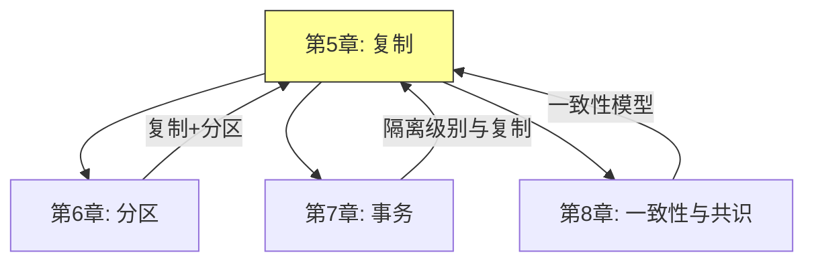

---

## 二、核心概念

### 2.1 为什么需要数据复制？

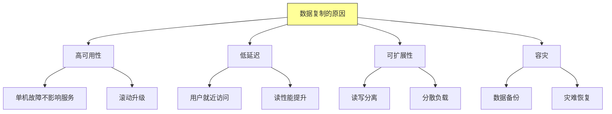

### 2.2 复制的发展历程

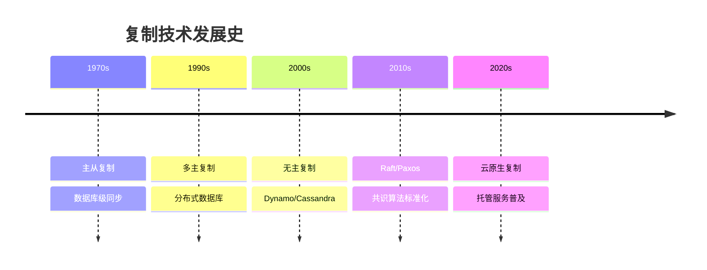

---

## 三、关键技术点

### 3.1 主从复制（Leader-Based Replication）

**3.1.1 核心架构：**

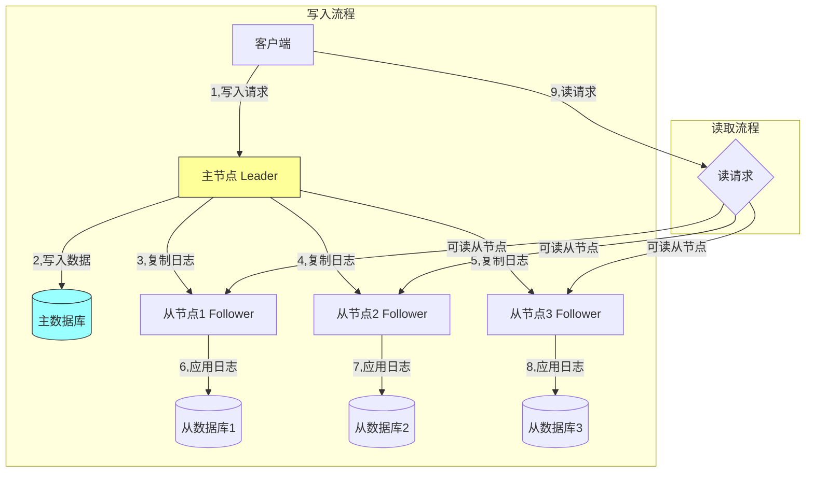

**3.1.2 复制日志的类型：**

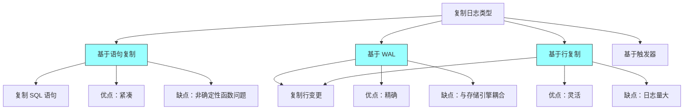

### 3.2 同步复制 vs 异步复制

**3.2.1 核心对比：**

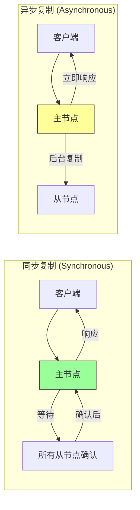

**3.2.2 详细对比表：**

| 对比项 | 同步复制 | 异步复制 |
|-------|---------|---------|
| **数据安全性** | 高（所有节点确认） | 低（可能丢失） |
| **写入延迟** | 高（等待从节点） | 低（立即返回） |
| **可用性** | 低（从节点故障阻塞） | 高（独立运行） |
| **一致性** | 强一致性 | 最终一致性 |
| **适用场景** | 金融交易 | 日志、社交 |

**3.2.3 半同步复制：**

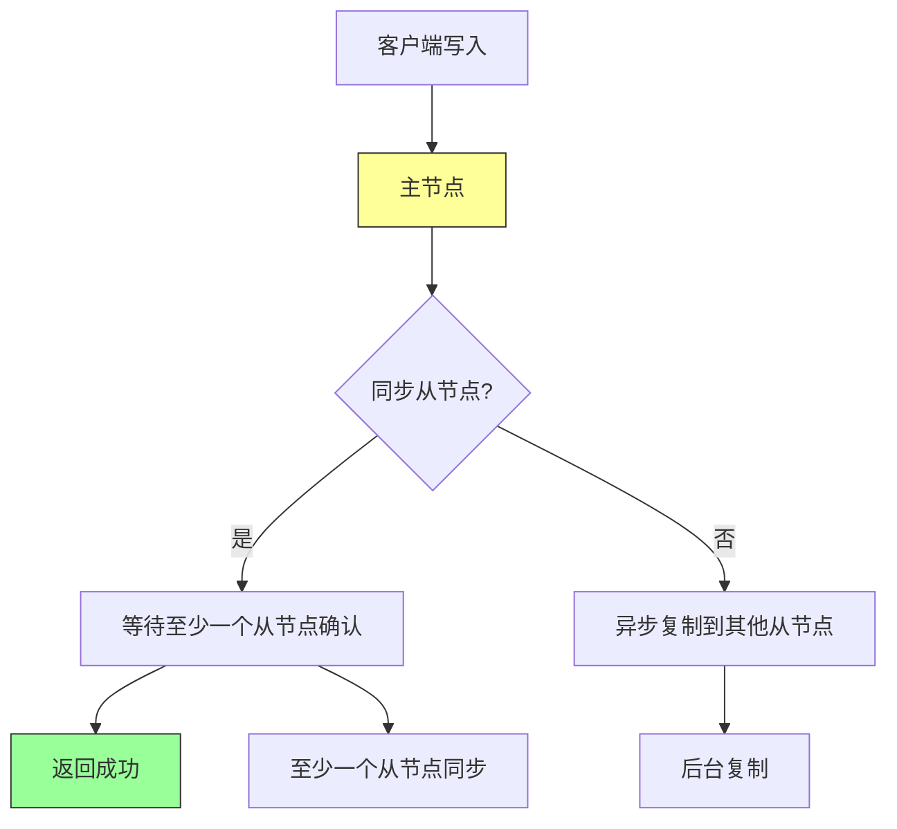

### 3.3 复制延迟与一致性

**3.3.1 复制延迟的问题：**

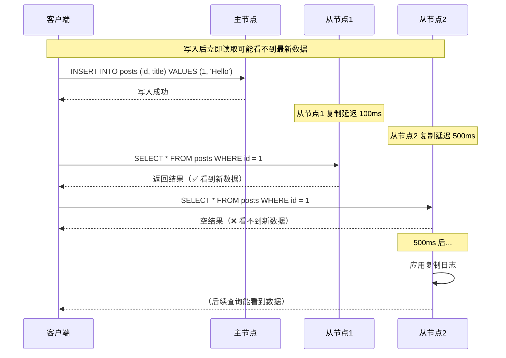

**3.3.2 复制延迟的解决方案：**

| 方案 | 说明 | 适用场景 |
|-----|-----|---------|
| **读写分离** | 写入主节点，读取从节点 | 允许短暂延迟 |
| **延迟读** | 写入后等待一段时间再读 | 可预估延迟 |
| **强制读主** | 敏感数据强制读主节点 | 金融场景 |
| **事务一致性** | 使用分布式事务 | 强一致需求 |
| **客户端缓存** | 客户端缓存最新写入 | 用户体验 |

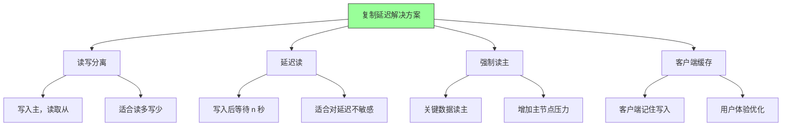

### 3.4 多主复制（Multi-Leader Replication）

**3.4.1 架构图：**

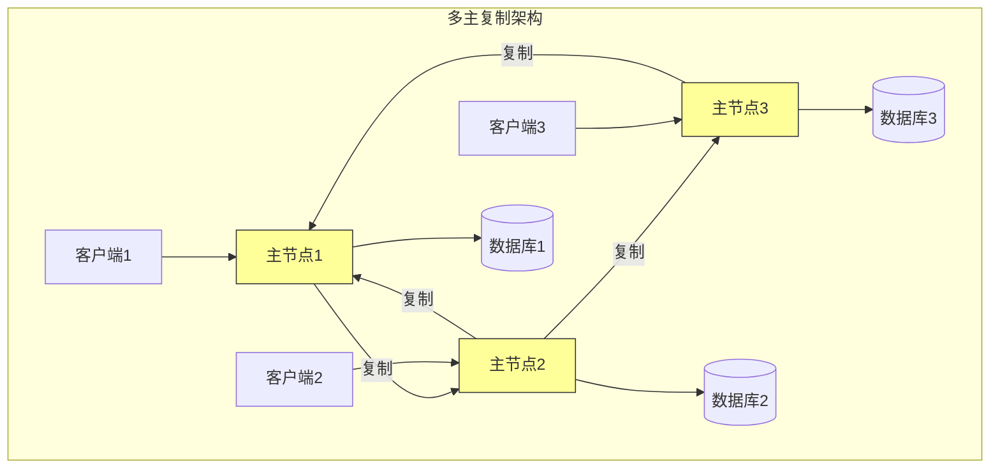

**3.4.2 多主复制的使用场景：**

| 场景 | 说明 | 示例 |
|-----|-----|-----|
| **多数据中心** | 每个数据中心有主节点 | 全球分布式应用 |
| **离线操作** | 设备离线后同步 | 移动应用 |
| **协作编辑** | 多用户同时编辑 | Google Docs |

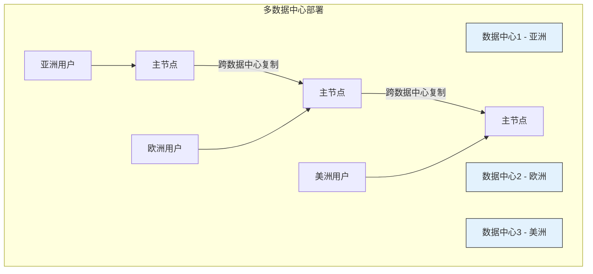

**3.4.3 多主复制的挑战 - 写入冲突：**

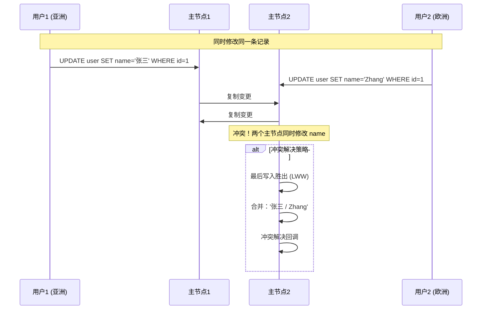

**冲突解决策略：**

| 策略 | 说明 | 优点 | 缺点 |
|-----|-----|-----|-----|
| **最后写入胜出** | 时间戳最新者获胜 | 简单 | 可能丢失数据 |
| **应用层合并** | 自定义合并逻辑 | 灵活 | 复杂 |
| **冲突检测** | 标记冲突，人工处理 | 准确 | 需人工干预 |
| **CRDT** | 无冲突数据类型 | 自动合并 | 有限场景 |

### 3.5 无主复制（Leaderless Replication）

**3.5.1 核心架构：**

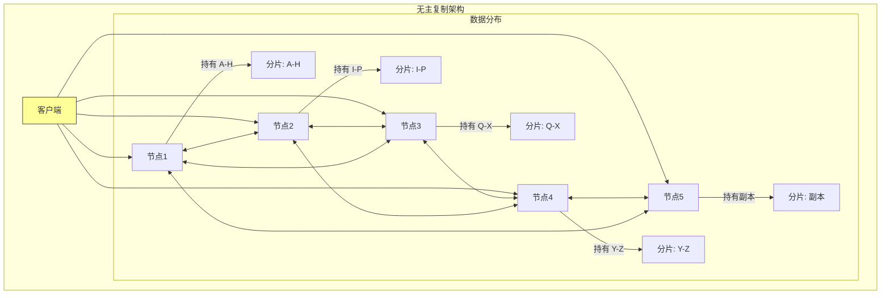

**3.5.2 读修复与反熵：**

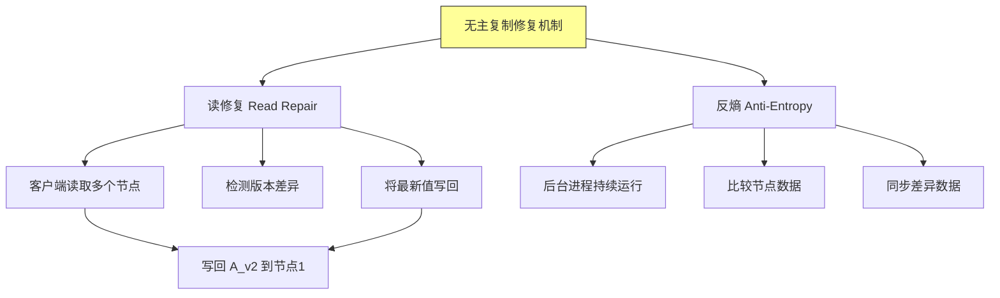

**3.5.3 Quorum 机制：**

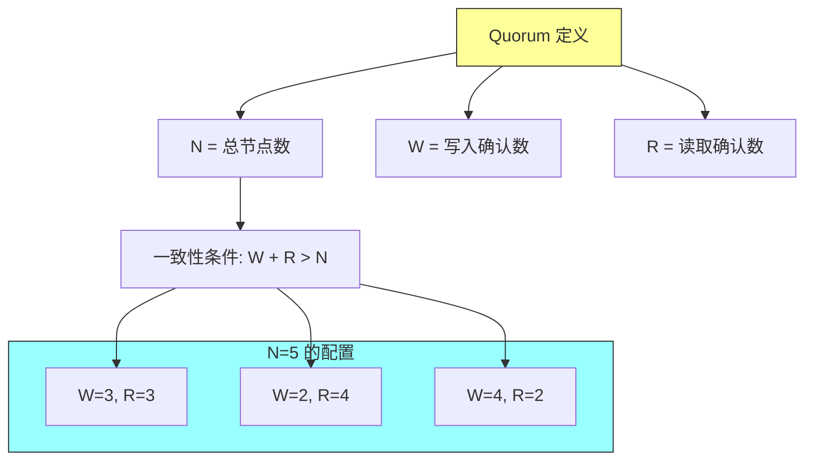

**Quorum 规则：**

```
总节点数 N = 5
写入节点数 W = 3
读取节点数 R = 3

一致性保证：
- 写入需要 3 个节点确认
- 读取需要 3 个节点返回
- 任意 2 个节点必有交集
- 交集节点包含最新数据
```

**3.5.4 一致性与可用性权衡（CAP）：**

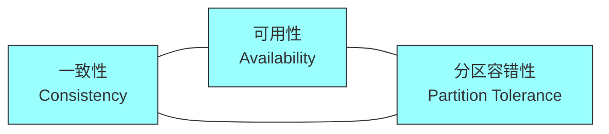

**CAP 定理：只能同时满足 2 个**

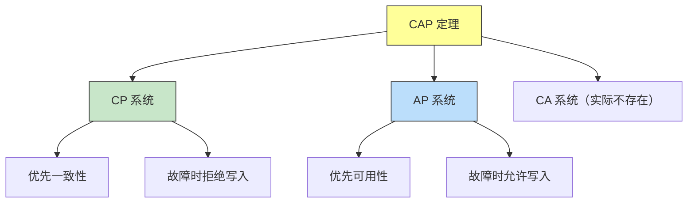

---

## 四、架构图与流程图

### 4.1 复制策略对比总览

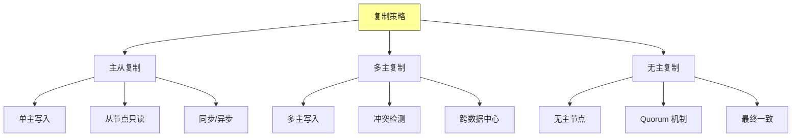

### 4.2 复制拓扑结构

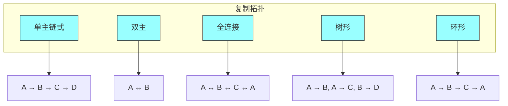

### 4.3 故障切换流程

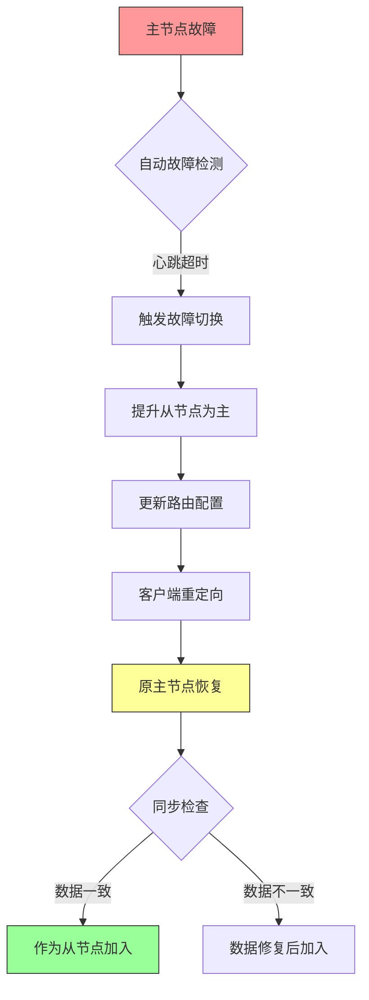

---

## 五、面试题整理

### 5.1 概念理解类 🌱

**Q1：什么是数据复制？它有哪些主要目的？**

**答案：**

**数据复制的定义：**
在多个节点上维护数据的副本，以实现数据的同步。

**主要目的：**

```mermaid
graph TD
    A[数据复制目的] --> B[高可用性]
    A --> C[容灾恢复]
    A --> D[性能提升]
    A --> E[低延迟访问]

    B --> B1["单点故障不影响服务"]
    B --> B2["滚动升级、回滚"]

    C --> C1["数据备份"]
    C --> C2["灾难恢复"]

    D --> D1["读写分离"]
    D --> D2["分散负载"]

    E --> E1["用户就近访问"]
    E --> E2["地理分布访问"]
```

---

**Q2：主从复制和多主复制有什么区别？各自适用于什么场景？**

**答案：**

**核心区别：**

| 对比项 | 主从复制 | 多主复制 |
|-------|---------|---------|
| 写入节点 | 单主 | 多主 |
| 写入扩展 | 有限 | 可扩展 |
| 冲突处理 | 无 | 需要 |
| 复杂性 | 低 | 高 |
| 一致性 | 容易保证 | 困难 |

**适用场景：**

| 场景 | 复制策略 | 理由 |
|-----|---------|-----|
| 单数据中心 | 主从 | 简单可靠 |
| 多数据中心 | 多主 | 就近写入 |
| 离线应用 | 多主 | 离线同步 |
| 高可用读 | 主从 | 读写分离 |
| 高可用写 | 多主 | 多点写入 |

---

**Q3：什么是复制延迟？它会导致什么问题？**

**答案：**

**复制延迟的定义：**
主节点写入数据到从节点应用该变更的时间差。

**导致的问题：**

```mermaid
sequenceDiagram
    participant C as 客户端

    Note over C: 问题 1：读取不到最新数据

    C->>L: INSERT INTO orders VALUES (1, 100)
    L-->>C: 成功
    C->>F: SELECT * FROM orders WHERE id=1
    F-->>C: 空结果

    Note over C: 问题 2：写入后立即修改失败

    C->>L: INSERT INTO counter VALUES (1, 0)
    L-->>C: 成功
    C->>L: UPDATE counter SET value=value+1 WHERE id=1
    L-->>C: 成功
    C->>F: SELECT value FROM counter WHERE id=1
    F-->>C: 0 （看到的是旧值）
```

**解决方案：**

| 方案 | 说明 | 适用场景 |
|-----|-----|---------|
| 读写分离 | 写入主，读取从 | 读多写少 |
| 延迟读 | 写入后等待 | 不要求即时一致 |
| 强制读主 | 敏感数据读主 | 金融场景 |
| 客户端缓存 | 缓存最近写入 | 用户体验 |

---

### 5.2 原理分析类 🌿

**Q4：同步复制和异步复制各有什么优缺点？在什么场景下应该选择哪种？**

**答案：**

**同步复制：**

```
流程：客户端 → 主节点 → [等待所有从节点] → 确认 → 响应
```

**优点：**
- 数据安全性高
- 强一致性保证
- 故障恢复简单

**缺点：**
- 写入延迟高
- 从节点故障会阻塞写入
- 可用性低

**异步复制：**

```
流程：客户端 → 主节点 → 立即响应 → [后台复制到从节点]
```

**优点：**
- 写入延迟低
- 可用性高
- 吞吐量大

**缺点：**
- 可能丢失数据
- 存在复制延迟
- 一致性弱

**选择建议：**

```mermaid
graph TD
    A[选择复制策略] --> B{因素}
    B -->|数据安全性要求| C{金融?}
    B -->|延迟要求| D{毫秒级?}
    B -->|可用性要求| E{99.99%?}

    C -->|是| F[同步复制]
    C -->|否| G{数据重要性}

    G -->|重要| F
    G -->|一般| H[异步复制]

    D -->|是| F
    D -->|否| H

    E -->|是| F
    E -->|否| H

    style F fill:#c8e6c9,stroke:#333
    style H fill:#bbdefb,stroke:#333
```

---

**Q5：什么是 Quorum 机制？它在无主复制中如何保证数据一致性？**

**答案：**

**Quorum 机制的定义：**

```
对于 N 个副本：
- 写入时至少需要 W 个节点确认
- 读取时至少需要 R 个节点返回
- 只要 W + R > N，就保证能读到最新数据
```

**工作原理：**

```mermaid
flowchart TD
    subgraph 写入["写入流程 (N=5, W=3)"]
        C[客户端] --> N1[节点1]
        C --> N2[节点2]
        C --> N3[节点3]
        C --> N4[节点4]
        C --> N5[节点5]

        N1 -->|确认| C
        N2 -->|确认| C
        N3 -->|确认| C

        Note1["后台同步"]:::note
        N4 -.-> Note1
        N5 -.-> Note1
    end

    subgraph 读取["读取流程 (N=5, R=3)"]
        C2[客户端] --> M1[节点1]
        C2 --> M2[节点2]
        C2 --> M3[节点3]
        C2 --> M4[节点4]
        C2 --> M5[节点5]

        M1 -->|返回 v2| C2
        M2 -->|返回 v2| C2
        M3 -->|返回 v1| C2

        Note2("v2 是最新值"):::note
    end

    classDef note fill:#ff9,stroke:#333
```

**配置示例：**

| N | W | R | 说明 |
|-----|-----|-----|-----|
| 5 | 3 | 3 | 标准配置，强一致 |
| 5 | 2 | 4 | 读优化 |
| 5 | 4 | 2 | 写优化 |
| 3 | 2 | 2 | 最小强一致配置 |
| 3 | 1 | 1 | 最终一致 |

---

**Q6：多主复制中的写入冲突如何检测和解决？**

**答案：**

**冲突的产生：**

```mermaid
sequenceDiagram
    participant L1 as 主节点1 (亚洲)
    participant L2 as 主节点2 (欧洲)

    Note over L1: 用户A修改 id=1
    L1->>L1: name = "张三"

    Note over L2: 用户B修改 id=1
    L2->>L2: name = "Zhang"

    L1->>L2: 复制 name="张三"
    L2->>L1: 复制 name="Zhang"

    Note over L1,L2: 冲突！两个主节点同时修改
```

**冲突检测：**

| 方法 | 说明 |
|-----|-----|
| **版本向量** | 记录每个节点的修改版本 |
| **时间戳** | 使用物理时钟判断先后 |
| **Last Writer Wins** | 最后写入者获胜 |

**冲突解决策略：**

```mermaid
graph TD
    A[冲突解决策略] --> B[最后写入胜出]
    A --> C[应用层合并]
    A --> D[CRDT]
    A --> E[人工干预]

    B --> B1["基于时间戳"]
    B --> B2["简单但可能丢数据"]

    C --> C1["自定义合并逻辑"]
    C --> C2["灵活但复杂"]

    D --> D1["无冲突数据类型"]
    D --> D2["自动合并"]

    E --> E1["标记冲突"]
    E --> E2["人工处理"]

    style A fill:#ff9,stroke:#333
```

---

### 5.3 对比选型类 🔧

**Q7：MySQL、PostgreSQL、MongoDB、Cassandra 分别使用什么复制策略？**

**答案：**

| 数据库 | 复制类型 | 特点 |
|-------|---------|-----|
| **MySQL** | 主从复制 | 基于 binlog，支持同步/异步 |
| **PostgreSQL** | 主从复制 | 基于 WAL，支持流复制 |
| **MongoDB** | 主从复制 + 多主 | 副本集（主从），分片（多主） |
| **Cassandra** | 无主复制 | Quorum + 反熵 + 读修复 |
| **Riak** | 无主复制 | CRDT + Vector Clock |
| **etcd** | 主从复制 | Raft 共识算法 |
| **Kafka** | 主从复制 | ISR（In-Sync Replicas） |

**详细说明：**

```mermaid
graph TD
    A[数据库复制策略] --> B[主从]
    A --> C[多主]
    A --> D[无主]

    B --> B1["MySQL"]
    B --> B2["PostgreSQL"]
    B --> B3["MongoDB 副本集"]
    B --> B4["etcd (Raft)"]

    C --> C1["MongoDB 分片"]
    C --> C2["CouchDB"]

    D --> D1["Cassandra"]
    D --> D2["Riak"]
    D --> D3["DynamoDB"]

    style B fill:#bbdefb,stroke:#333
    style C fill:#c8e6c9,stroke:#333
    style D fill:#fff3e0,stroke:#333
```

---

**Q8：什么场景下应该选择无主复制而不是主从复制？**

**答案：**

**选择无主复制的场景：**

```mermaid
graph TD
    A[选择无主复制] --> B[高可用写入]
    A --> C[地理分布]
    A --> D[故障容忍]
    A --> E[简化运维]

    B --> B1["任何节点都可写入"]
    B --> B2["无单点故障"]

    C --> C1["多数据中心"]
    C --> C2["网络分区容忍"]

    D --> D1["节点故障不影响写入"]
    D --> D2["自动恢复"]

    E --> E1["无需故障切换"]
    E --> E2["无需主节点选举"]

    style A fill:#9f9,stroke:#333
```

**无主复制的优势：**

| 优势 | 说明 |
|-----|-----|
| **无单点故障** | 任何节点都可接受写入 |
| **高可用** | 节点故障不影响服务 |
| **弹性扩展** | 增加节点简单 |
| **低延迟写入** | 写入最近节点 |

**无主复制的挑战：**

| 挑战 | 说明 |
|-----|-----|
| **一致性弱** | 最终一致，不是强一致 |
| **冲突处理** | 需要处理写入冲突 |
| **复杂性高** | Quorum、读修复等机制 |
| **运维复杂** | 需要监控更多状态 |

---

### 5.4 实战应用类 🔧

**Q9：设计一个高可用的三数据中心复制架构，需要考虑哪些关键问题？**

**答案：**

**架构设计：**

```mermaid
graph TD
    subgraph Asia["亚洲数据中心"]
        A1[主节点1]
        A2[从节点1]
        A3[从节点2]
    end

    subgraph Europe["欧洲数据中心"]
        E1[主节点1]
        E2[从节点1]
        E3[从节点2]
    end

    subgraph America["美洲数据中心"]
        M1[主节点1]
        M2[从节点1]
        M3[从节点2]
    end

    A1 <--> E1
    E1 <--> M1
    M1 <--> A1

    style Asia fill:#e3f2fd,stroke:#333
    style Europe fill:#e3f2fd,stroke:#333
    style America fill:#e3f2fd,stroke:#333
```

**关键问题及解决方案：**

| 问题 | 解决方案 |
|-----|---------|
| **写入冲突** | 自动冲突解决策略（如 LWW） |
| **网络分区** | Quorum 机制，CAP 权衡 |
| **复制延迟** | 监控延迟指标，设置告警 |
| **故障切换** | 自动主节点选举 |
| **数据一致性** | 同步复制到其他数据中心 |
| **灾备恢复** | 定期备份，演练恢复 |

**配置示例：**

```yaml
# 三数据中心复制配置
datacenter:
  asia:
    nodes: 3
    priority: 1
  europe:
    nodes: 3
    priority: 1
  america:
    nodes: 3
    priority: 1

replication:
  type: multi-master
  write_quorum: 2  # 至少2个DC确认
  read_quorum: 2   # 至少2个DC返回
  conflict_resolution: last_writer_wins

consistency:
  level: eventual  # 默认最终一致
  strong_read: true  # 强读可选
```

---

**Q10：如何检测和解决复制延迟问题？请给出具体方案。**

**答案：**

**复制延迟的检测：**

```mermaid
graph TD
    A[复制延迟监控] --> B[主节点指标]
    A --> C[从节点指标]
    A --> D[业务指标]

    B --> B1["binlog 位置"]
    B --> B2["已发送字节数"]

    C --> C1["IO 线程状态"]
    C --> C2["SQL 线程状态"]
    C --> C3["Relay log 位置"]

    D --> D1["主从数据差异"]
    D --> D2["查询延迟"]

    style A fill:#ff9,stroke:#333
```

**MySQL 监控示例：**

```sql
-- 查看复制延迟
SHOW SLAVE STATUS\G
-- Seconds_Behind_Master: 复制延迟秒数

-- 查看主从同步状态
SELECT * FROM performance_schema.replication_applier_status_by_worker;
```

**解决复制延迟的方案：**

| 方案 | 具体操作 |
|-----|---------|
| **优化网络** | 升级网络带宽，减少延迟 |
| **并行复制** | 开启并行复制（MySQL 5.7+） |
| **减少大事务** | 拆分为小事务 |
| **读写分离** | 非敏感读从节点 |
| **硬件升级** | SSD 硬盘，更大内存 |
| **分区表** | 按分区并行复制 |

**并行复制配置（MySQL）：**

```ini
# my.cnf
slave_parallel_workers=16        # 并行复制线程数
slave_parallel_type=LOGICAL_CLOCK  # 基于 logical clock
relay_log_recovery=ON            #  relay log 恢复
```

---

### 5.5 源码级别类 🌳

**Q11：请分析 Raft 共识算法如何实现主节点选举和数据复制？**

**答案：**

**Raft 核心概念：**

```mermaid
graph TD
    A[Raft 算法] --> B[节点状态]
    A --> C[任期 Term]
    A --> D[选举机制]
    A --> E[日志复制]

    B --> B1[Leader]
    B --> B2[Candidate]
    B --> C[Follower]

    B1 --> B1a["处理客户端请求"]
    B1 --> B1b["复制日志到从节点"]

    B2 --> B2a["选举超时后发起"]
    B2 --> B2b["请求投票"]

    B3 --> B3a["响应 Leader 心跳"]
    B3 --> B3b["响应投票请求"]

    style A fill:#ff9,stroke:#333
```

**节点状态转换：**

```mermaid
stateDiagram-v2
    [*] --> Follower

    Follower --> Candidate : 选举超时
    Candidate --> Leader : 获得多数票
    Leader --> Follower : 发现更高任期
    Candidate --> Follower : 选举失败
    Candidate --> Follower : 发现更高任期

    Leader --> Follower : 节点重启

    style Follower fill:#9ff,stroke:#333
    style Candidate fill:#ff9,stroke:#333
    style Leader fill:#9f9,stroke:#333
```

**选举过程：**

```
选举触发条件：Follower 选举超时（150-300ms 随机）

选举流程：
1. 增加任期号（Term）
2. 转换为 Candidate
3. 给自己投票
4. 发送 RequestVote 给所有节点
5. 等待投票结果：
   - 获得多数票 → 成为 Leader
   - 收到更高任期 → 降为 Follower
   - 选举超时 → 重新选举
```

**日志复制：**

```mermaid
sequenceDiagram
    participant C as 客户端
    participant L as Leader
    participant F1 as Follower1
    participant F2 as Follower2

    C->>L: 请求命令
    L->>L: 追加到本地日志

    L->>F1: AppendEntries (日志条目)
    L->>F2: AppendEntries (日志条目)

    F1-->>L: 确认
    F2-->>L: 确认

    alt 所有节点确认
        L->>L: 提交日志
        L-->>C: 响应成功
    else 节点未确认
        L->>L: 重试 AppendEntries
    end
```

---

## 六、实践要点

### 6.1 复制策略选择决策树

```mermaid
flowchart TD
    A[选择复制策略] --> B{数据中心数量?}
    B -->|单数据中心| C{写入量?}
    B -->|多数据中心| D{一致性要求?}
    B -->|离线场景| E[多主复制]

    C -->|写入量大| F[主从+读写分离]
    C -->|写入量小| G[主从+从节点]

    D -->|强一致| H[同步多主]
    D -->|最终一致| I[异步多主]

    style A fill:#ff9,stroke:#333
```

### 6.2 复制配置最佳实践

```mermaid
graph TD
    A[复制配置最佳实践] --> B[主从复制]
    A --> C[多主复制]
    A --> D[无主复制]

    B --> B1["监控复制延迟"]
    B --> B2["设置合理的超时"]
    B --> B3["开启并行复制"]

    C --> C1["配置冲突解决策略"]
    C --> C2["限制复制拓扑深度"]
    C --> C3["监控跨DC延迟"]

    D --> D1["配置合适的 Quorum"]
    D --> D2["开启读修复"]
    D --> D3["配置反熵周期"]

    style A fill:#9f9,stroke:#333
```

### 6.3 常见问题与解决方案

| 问题 | 原因 | 解决方案 |
|-----|-----|---------|
| 复制延迟 | 大事务、网络慢 | 并行复制、减少大事务 |
| 主从切换失败 | 配置错误、权限问题 | 检查配置、测试故障切换 |
| 数据不一致 | 半同步失败 | 使用强同步 |
| 脑裂 | 网络分区 | 使用 Raft/Paxos |
| 写入冲突 | 多主并发写入 | 冲突解决策略 |

---

## 七、扩展阅读

### 7.1 必读论文

| 论文 | 作者 | 年份 | 贡献 |
|-----|-----|-----|-----|
| Paxos Made Simple | Lamport | 2001 | Paxos 算法解释 |
| In Search of an Understandable Consensus Algorithm | Ongaro, Ousterhout | 2014 | Raft 算法 |
| Dynamo: Amazon's Highly Available Key-value Store | Amazon | 2007 | 无主复制设计 |

### 7.2 推荐资源

- [Raft 可视化演示](https://raft.github.io/)
- [MySQL 复制文档](https://dev.mysql.com/doc/refman/8.0/en/replication.html)
- [Cassandra 架构文档](https://cassandra.apache.org/doc/latest/architecture/)

### 7.3 实践项目

- 实现 Raft 共识算法
- 搭建 MySQL 主从复制
- 配置 Cassandra 集群

---

## 八、本章小结

### 核心收获

1. **复制的三种模式**
   - 主从：简单可靠，单点写入
   - 多主：高可用，多点写入
   - 无主：高容错，弹性扩展

2. **同步 vs 异步**
   - 同步：强一致，高延迟
   - 异步：最终一致，低延迟

3. **Quorum 机制**
   - W + R > N 保证一致性
   - 灵活配置读写比例

4. **冲突处理**
   - 多主和无主需要处理冲突
   - LWW、合并、CRDT

### 概念地图

```mermaid
mindmap
  root((复制))
    复制类型
      主从复制
      多主复制
      无主复制
    复制模式
      同步复制
      异步复制
      半同步复制
    核心机制
      Quorum
      读修复
      反熵
    共识算法
      Raft
      Paxos
```

### 下一章预告

第 6 章将探讨**分区**，了解大数据如何分散存储在多个节点上，包括：
- 哈希分区与范围分区
- 分区再平衡
- 二级索引

---

## 附录 A：复制策略对比表

| 策略 | 一致性 | 可用性 | 延迟 | 复杂度 | 适用场景 |
|-----|-------|-------|-----|-------|---------|
| 主从（同步） | 强 | 低 | 高 | 低 | 金融交易 |
| 主从（异步） | 最终 | 高 | 低 | 低 | Web 应用 |
| 多主（同步） | 强 | 中 | 高 | 高 | 多数据中心 |
| 多主（异步） | 最终 | 高 | 中 | 高 | 全球分布 |
| 无主（Quorum） | 可配置 | 高 | 中 | 高 | 高可用存储 |

## 附录 B：复制延迟监控指标

| 指标 | MySQL | PostgreSQL | MongoDB |
|-----|-------|------------|---------|
| 复制延迟 | Seconds_Behind_Master | lag | replicationLag |
| 同步状态 | Slave_IO_Running | synchronous_commit | replica.status |
| 落后量 | Relay_Log_Pos | pg_current_wal_lsn | oplog.js |

---

*文档生成时间：2024-01-08*
*基于《Designing Data-Intensive Applications》第5章*
