# 《Designing Data-Intensive Applications》- 第6章：分区（深度版）

## 一、本章概述

本章深入探讨了**数据分区（Partitioning）**技术，这是实现大规模数据存储和查询的关键技术。分区将大型数据集分割成多个较小的子集，分布到不同的节点上，从而实现水平扩展。

> **本章核心问题**：如何将数据合理地划分到多个节点上，以实现负载均衡、高可用和高效查询？

### 1.1 核心主题
- 分区的动机与收益
- 两种主要分区策略：哈希分区 vs 范围分区
- 分区与二级索引
- 负载均衡与再平衡
- 热点问题与解决方案

### 1.2 重要程度
⭐⭐⭐⭐⭐（极高）

### 1.3 预计学习时间
100-120 分钟

### 1.4 本章与其他章节的关联

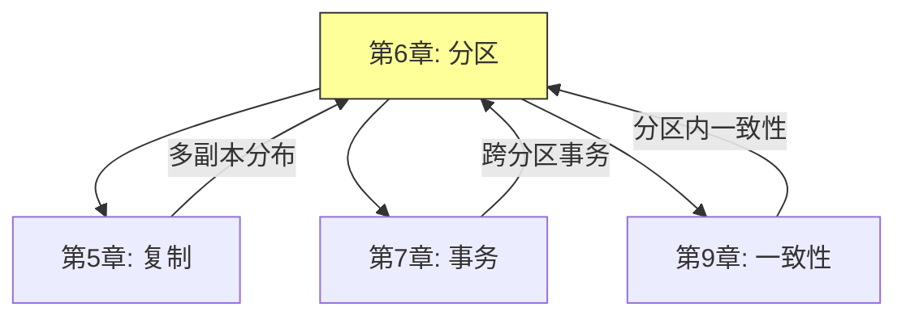

---

## 二、分区的动机与收益

### 2.1 为什么需要分区？

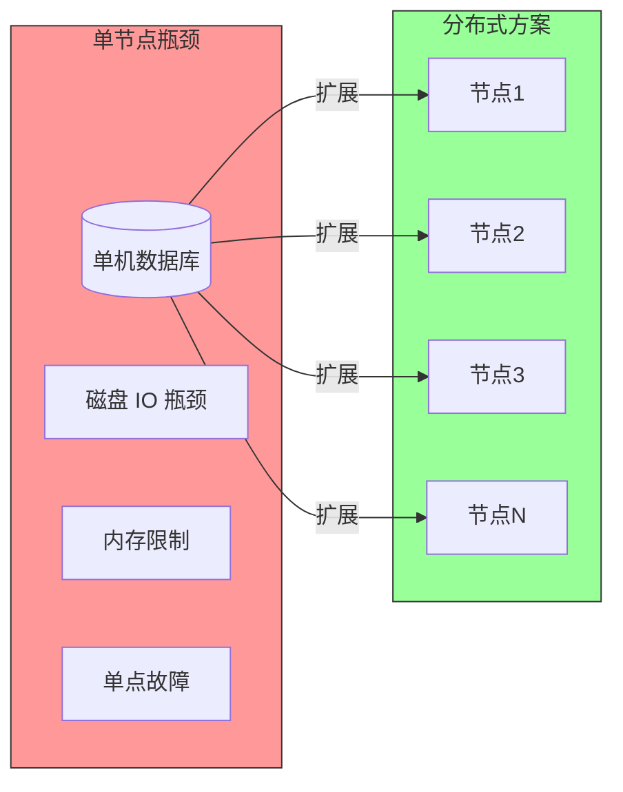

**分区的核心收益：**

| 收益 | 说明 |
|-----|-----|
| ** scalability ** | 数据量和请求量可以水平扩展到数百节点 |
| **性能** | 并行处理，大幅提升吞吐量 |
| **可用性** | 单节点故障不影响整体服务 |
| **成本效益** | 使用普通硬件即可构建大规模系统 |

### 2.2 分区 vs 复制

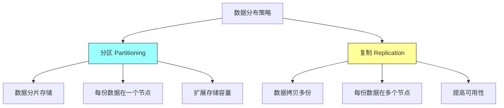

**关键区别：**
- **分区**：解决"数据太多，一台存不下"的问题
- **复制**：解决"访问太多，一台扛不住"的问题
- 实际系统通常**同时使用**分区和复制

---

## 三、分区策略

### 3.1 哈希分区

**核心思想**：使用哈希函数将键均匀分布到各个分区

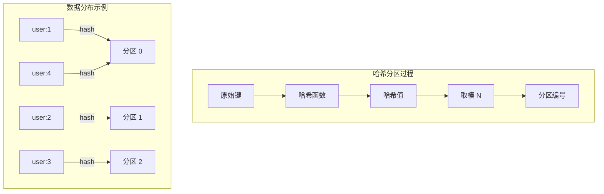

**哈希分区实现：**

```java
// 简单取模哈希
public class HashPartitioner {
    private int numPartitions;

    public HashPartitioner(int numPartitions) {
        this.numPartitions = numPartitions;
    }

    public int partition(String key) {
        int hash = key.hashCode();
        // 处理负数情况
        return Math.abs(hash % numPartitions);
    }
}
```

**优点：**
- 数据分布均匀
- 简单易实现

**缺点：**
- 范围查询效率低（相关数据可能在不同分区）
- 节点增减时数据搬迁量大

### 3.2 一致性哈希

**问题**：传统取模哈希在节点增减时会导致大量数据迁移

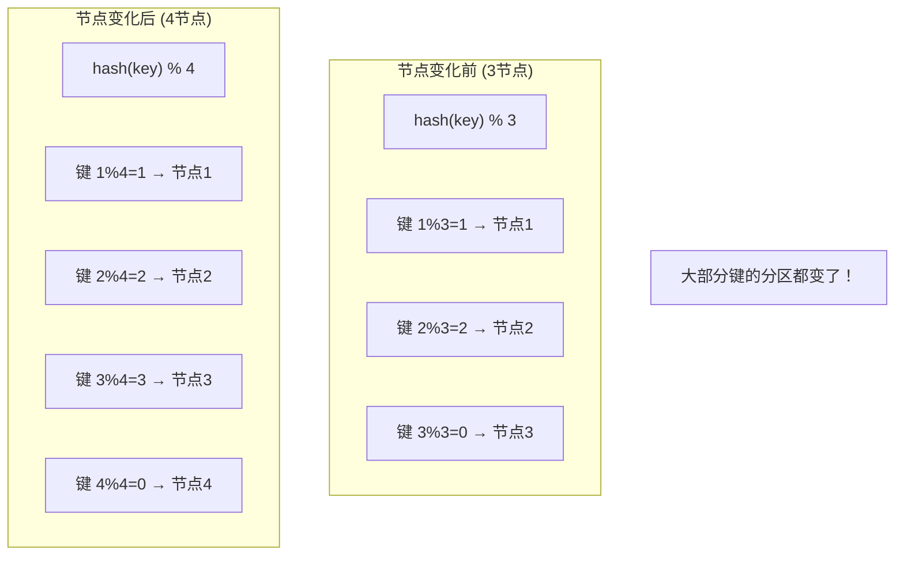

**一致性哈希原理：**

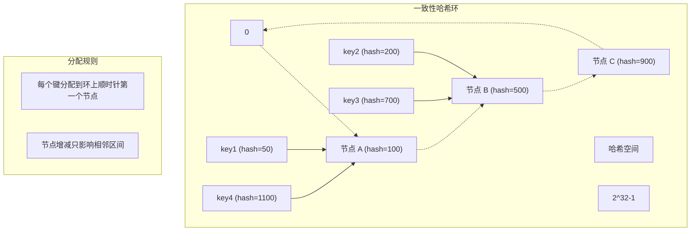

**一致性哈希的虚拟节点：**

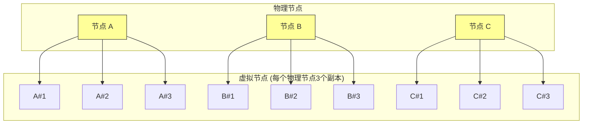

**虚拟节点的作用：**
- 使数据分布更均匀
- 负载均衡更细粒度
- 节点增减时数据迁移更平滑

### 3.3 范围分区

**核心思想**：将键划分为连续的范围区间

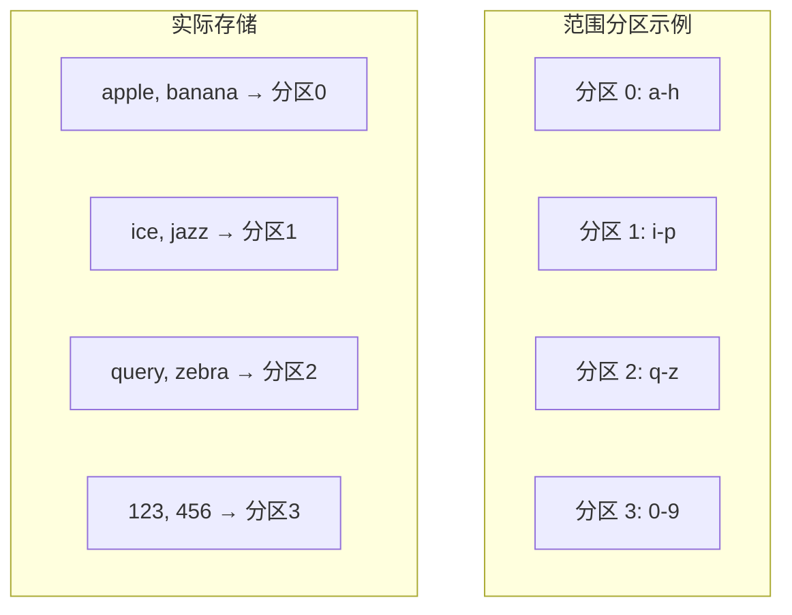

**范围分区的优缺点：**

| 优点 | 缺点 |
|-----|-----|
| 范围查询高效 | 可能出现热点 |
| 便于顺序扫描 | 需要处理热点问题 |
| 简单直观 | 动态调整困难 |

### 3.4 分区策略对比

| 策略 | 优点 | 缺点 | 适用场景 |
|-----|-----|-----|---------|
| **哈希分区** | 数据均匀 | 范围查询差 | 点查询为主 |
| **一致性哈希** | 扩展友好 | 实现复杂 | 分布式缓存 |
| **范围分区** | 范围查询优 | 可能不均 | 时序数据 |
| **混合策略** | 灵活 | 复杂 | 复合场景 |

---

## 四、分区与二级索引

### 4.1 二级索引的挑战

二级索引（Secondary Index）使得查询更加灵活，但也给分区带来了挑战。

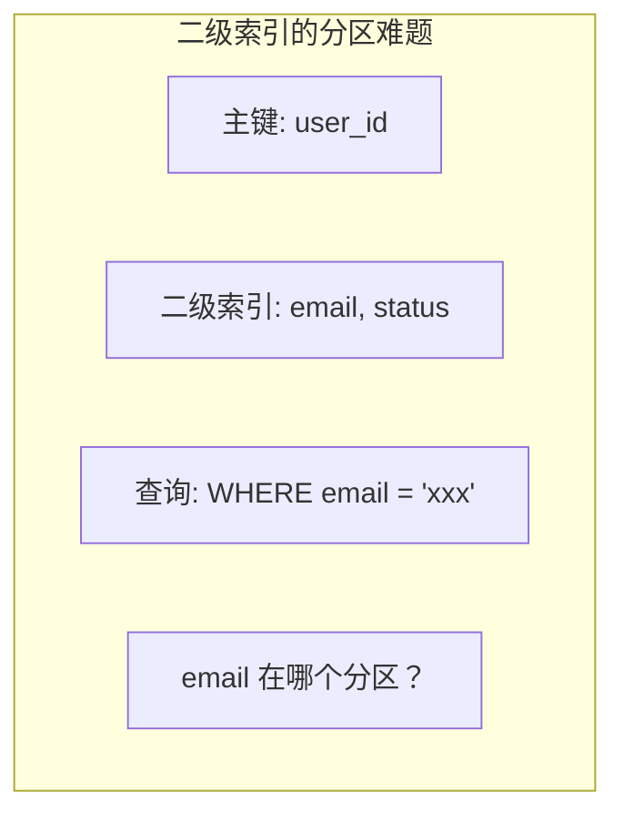

### 4.2 两种二级索引分区方案

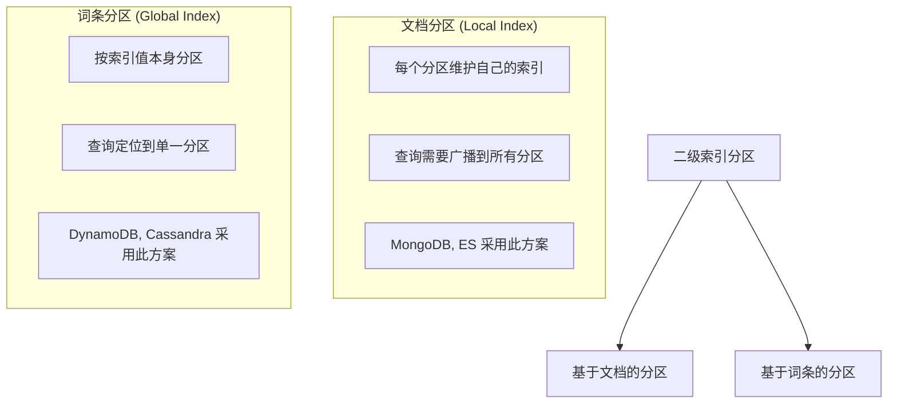

### 4.3 文档分区详解

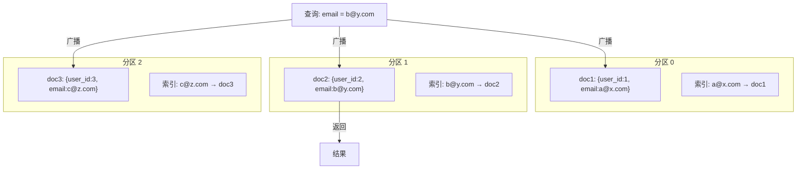

**查询流程：**
1. 发送查询到所有分区
2. 每个分区本地查找索引
3. 汇总结果返回客户端

**特点：**
- 写入效率高（本地更新）
- 读效率较低（需要 Scatter/Gather）

### 4.4 词条分区详解

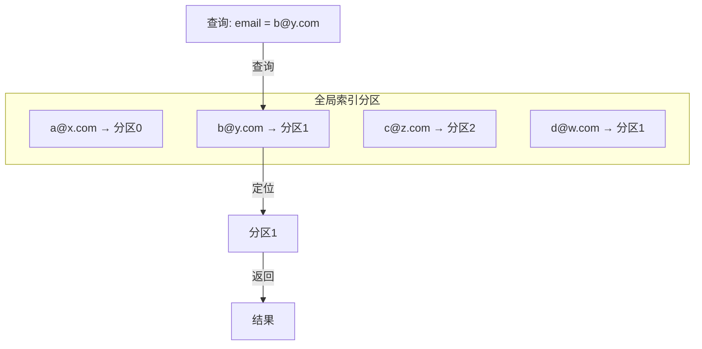

**特点：**
- 读取效率高（单次查询）
- 写入复杂（可能需要跨分区更新）
- 索引本身也需要分区

---

## 五、负载均衡与再平衡

### 5.1 何时需要再平衡？

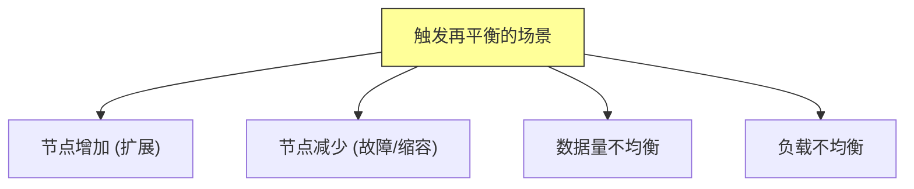

### 5.2 再平衡策略

**策略 1：固定数量分区**

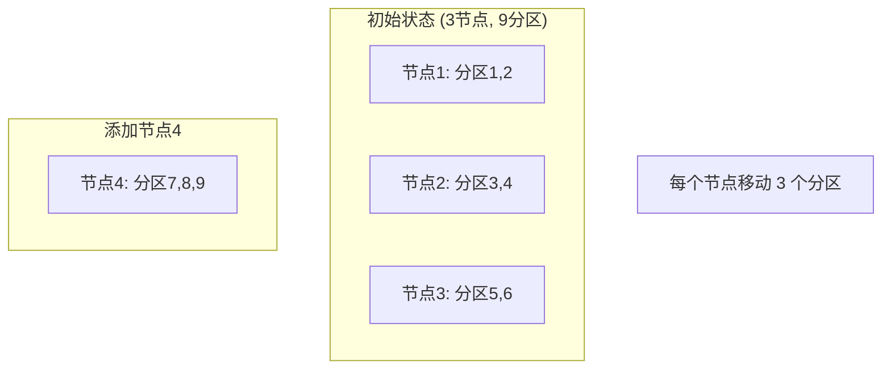

**策略 2：动态分区**


**策略 3：手动 vs 自动再平衡**

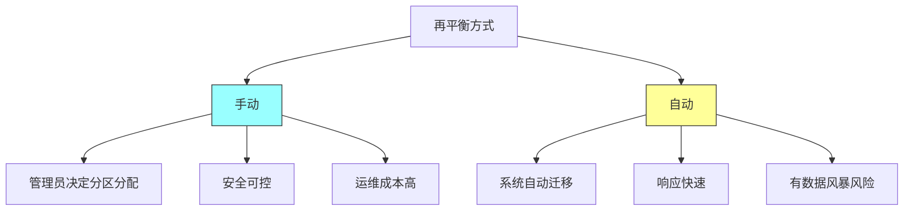

### 5.3 请求路由

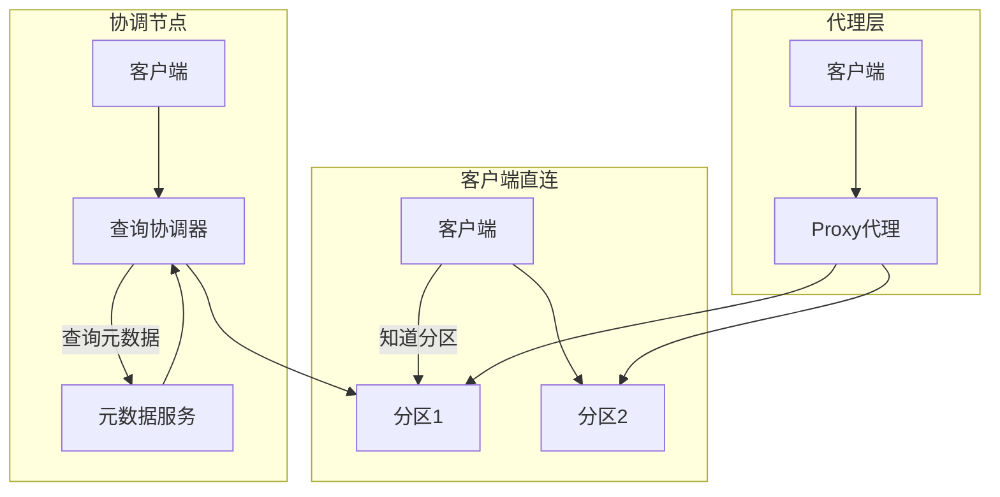

**服务发现与路由：**

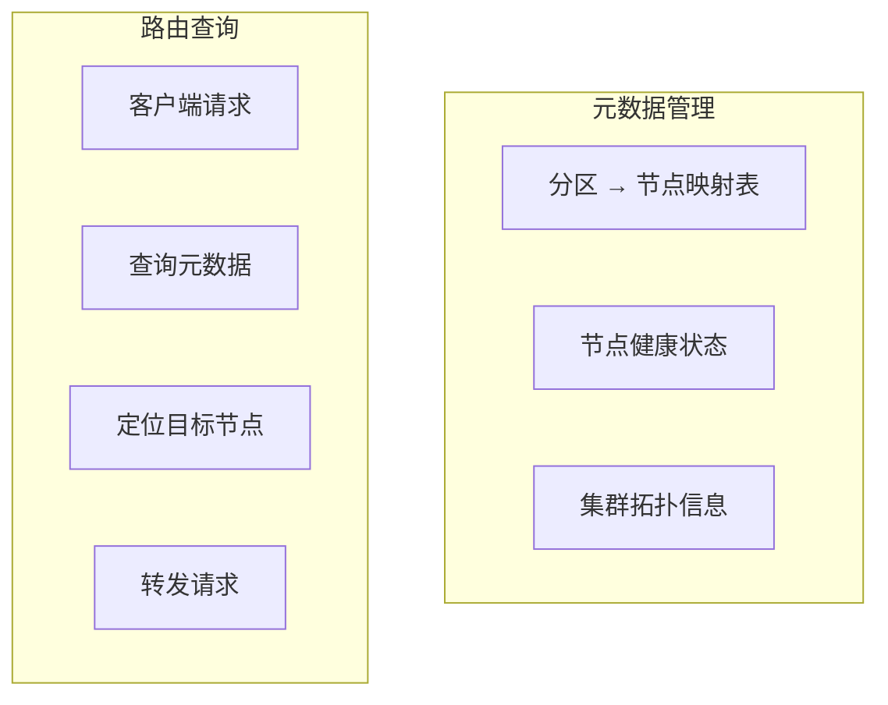

---

## 六、热点问题与解决方案

### 6.1 热点的成因

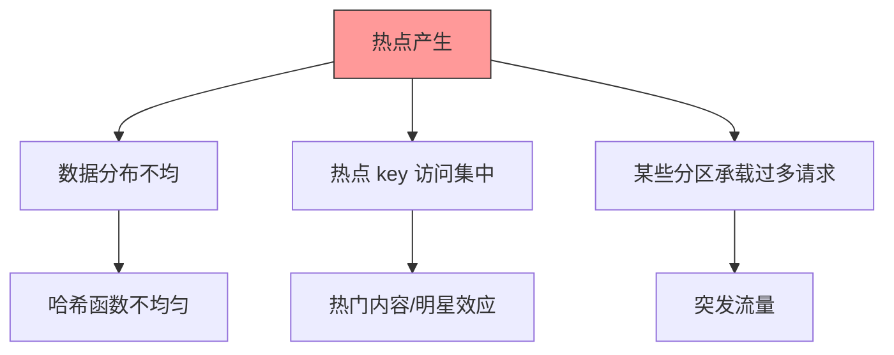

### 6.2 热点解决方案

**方案 1：随机化分区**

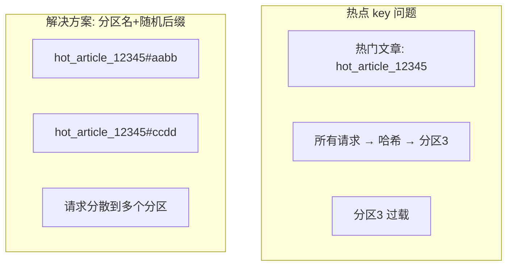

**方案 2：分层缓存**

```mermaid
graph TD
    subgraph 缓存层级["缓存架构"]
        L1["L1: CDN 缓存"]
        L2["L2: 应用缓存 Redis"]
        L3["L3: 数据库缓存"]
        L4["L4: 数据库本身"]
    end

    L1 -->|热点拦截| L2
    L2 -->|热点拦截| L3
    L3 -->|热点拦截| L4

    style L1 fill:#9f9,stroke:#333
    style L2 fill:#9f9,stroke:#333
    style L3 fill:#ff9,stroke:#333
    style L4 fill:#f99,stroke:#333
```

**方案 3：读写分离**

```mermaid
graph TD
    subgraph 读写分离["读写分离架构"]
        W[写入主库] -->|复制| R1[从库1]
        W -->|复制| R2[从库2]
        W -->|复制| R3[从库3]

        读请求 --> R1
        读请求 --> R2
        读请求 --> R3
    end
```

### 6.3 热点检测与处理

```mermaid
flowchart TD
    A[监控系统] --> B[实时指标采集]
    B --> C[热点检测算法]
    C --> D{超过阈值?}

    D -->|是| E[触发告警]
    D -->|否| F[继续监控]

    E --> G[自动限流]
    E --> H[缓存预热]
    E --> I[临时扩容]
```

---

## 七、面试题整理

### 7.1 概念理解类 🌱

**Q1：什么是数据分区？为什么要分区？**

**答案：**

**数据分区**是将大型数据集分割成多个较小的子集，分布到不同节点或存储单元的技术。

**分区的原因：**

| 原因 | 说明 |
|-----|-----|
| **容量扩展** | 单机存储有限，分区后可以横向扩展到 PB 级 |
| **性能提升** | 并行处理，负载分散到多个节点 |
| **可用性** | 单节点故障不影响整体服务 |
| **成本** | 使用普通服务器即可，成本可控 |

**Q2：哈希分区和范围分区有什么区别？**

**答案：**

**哈希分区：**
- 使用哈希函数均匀分布数据
- 优点：数据分布均匀
- 缺点：范围查询效率低
- 适用：点查询为主的场景

**范围分区：**
- 按键的连续范围划分分区
- 优点：范围查询高效
- 缺点：可能产生热点
- 适用：时序数据、范围查询场景

---

### 7.2 原理分析类 🌿

**Q3：什么是一致性哈希？它解决了什么问题？**

**答案：**

**一致性哈希的核心思想：**
- 将所有节点和数据映射到一个环上
- 每个数据项分配到环上顺时针第一个节点
- 节点增减只影响相邻区间的数据

**解决的问题：**
- 传统取模哈希在节点变化时会导致**大量数据迁移**
- 一致性哈希将迁移量降到最小

```python
# 一致性哈希伪代码
class ConsistentHash:
    def __init__(self, nodes, replicas=3):
        self.replicas = replicas
        self.ring = {}
        for node in nodes:
            for i in range(replicas):
                key = self._hash(f"{node}:{i}")
                self.ring[key] = node
        self.sorted_keys = sorted(self.ring.keys())

    def get_node(self, key):
        hash_key = self._hash(key)
        for k in self.sorted_keys:
            if hash_key <= k:
                return self.ring[k]
        return self.ring[self.sorted_keys[0]]
```

**Q4：二级索引如何分区？文档分区和词条分区各有什么优缺点？**

**答案：**

**文档分区（Local Index）：**
- 每个分区维护自己的二级索引
- 查询需要广播到所有分区
- 优点：写入简单
- 缺点：查询需要 Scatter/Gather

**词条分区（Global Index）：**
- 按二级索引的值本身进行分区
- 查询可以直接定位到目标分区
- 优点：查询高效
- 缺点：写入可能需要跨分区更新

---

### 7.3 对比选型类 🔧

**Q5：如何为系统选择合适的分区策略？**

**答案：**

```mermaid
flowchart TD
    A[选择分区策略] --> B{主要查询模式?}

    B -->|点查询为主| C[哈希分区]
    B -->|范围查询为主| D[范围分区]
    B -->|混合查询| E{数据特点?}

    C --> C1["需要再平衡? → 一致性哈希"]

    D --> D1["热点问题? → 分裂+迁移"]

    E --> E1["有时间属性? → 时间范围分区"]
    E --> E2["地域分布? → 地理分区"]
```

**考虑因素：**

| 因素 | 考虑点 |
|-----|-----|
| **查询模式** | 点查询还是范围查询 |
| **数据分布** | 是否均匀还是倾斜 |
| **扩展需求** | 水平扩展的频率 |
| **一致性要求** | 是否需要强一致 |

**Q6：再平衡时如何避免数据风暴？**

**答案：**

**数据风暴的危害：**
- 再平衡期间大量数据迁移
- 占用网络带宽
- 影响正常读写请求

**解决方案：**

| 方案 | 说明 |
|-----|-----|
| **限速迁移** | 控制迁移速率，如每秒迁移 10MB |
| **自动协调** | 限制同时迁移的分区数量 |
| **智能调度** | 优先迁移低优先级数据 |
| **渐进式** | 分批次进行，每批之间有间隔 |

---

### 7.4 实战应用类 🔧

**Q7：设计一个支持亿级用户的社交应用的分片方案**

**答案：**

**业务需求分析：**

| 数据类型 | 特点 | 分区策略 |
|---------|-----|---------|
| 用户信息 | 读多写少，点查询 | user_id 哈希 |
| 社交关系 | 复杂关联查询 | 混合分区 |
| 动态 Feed | 写入密集 | 时间范围 |
| 消息会话 | 时序特性 | 时间+用户哈希 |
| 行为数据 | 分析查询 | 按事件类型 |

**整体架构：**

```mermaid
graph TD
    subgraph 应用层
        API[API Gateway]
    end

    subgraph 分区层
        U1[(用户分片 0-99)]
        U2[(用户分片 100-199)]
        U3[(用户分片 200-299)]
        U4[(用户分片 N...)]
    end

    subgraph 辅助系统
        M[元数据服务]
        C[缓存集群]
    end

    API --> U1
    API --> U2
    API --> U3
    API --> U4
    API --> M
    API --> C
```

---

## 八、实践要点

### 8.1 分区设计最佳实践

```mermaid
graph TD
    A[分区设计检查清单] --> B[数据模型分析]
    A --> C[查询模式梳理]
    A --> D[分区策略选择]
    A --> E[容量规划]
    A --> F[监控告警设置]

    B --> B1["识别分区键"]
    C --> C1["热点查询识别"]
    D --> D1["策略匹配"]
    E --> E1["预留增长空间"]
    F --> F1["关键指标监控"]
```

### 8.2 常见问题与解决方案

| 问题 | 原因 | 解决方案 |
|-----|-----|---------|
| **跨分区查询慢** | 设计不合理 | 避免跨分区 JOIN |
| **热点 key** | 数据倾斜 | 拆分热点、加盐 |
| **再平衡卡顿** | 数据量太大 | 限速、增量迁移 |
| **元数据不一致** | 分布式协调问题 | 使用分布式协调服务 |

### 8.3 分区数量规划

```mermaid
graph TD
    A[分区数量规划] --> B{考虑因素}
    B --> C[单节点存储能力]
    B --> D[单分区数据量]
    B --> E[并发查询需求]
    B --> F[再平衡粒度]

    C --> C1["建议: 单分区 < 100GB"]
    D --> D1["建议: 初始预留 2-3 倍"]
    E --> E1["建议: 分区数 >= 并发数"]
```

---

## 九、扩展阅读

### 9.1 必读资源

| 资源 | 说明 |
|-----|-----|
| DynamoDB 论文 | 一致性哈希的经典实现 |
| Bigtable 论文 | 范围分区的经典实现 |
| Cassandra 文档 | 虚拟节点和分区设计 |

### 9.2 实践项目

- 实现一致性哈希环
- 设计多级分区策略
- 优化跨分区查询性能

---

## 十、本章小结

### 核心收获

1. **分区是水平扩展的基础**
   - 解决容量和性能瓶颈
   - 需要平衡均匀性和局部性

2. **分区策略的选择**
   - 哈希分区适合点查询
   - 范围分区适合范围查询
   - 一致性哈希解决扩展问题

3. **二级索引的挑战**
   - 文档分区 vs 词条分区
   - 读性能和写性能的权衡

4. **再平衡是关键挑战**
   - 策略选择：固定 vs 动态
   - 避免数据风暴

### 概念地图

```mermaid
mindmap
  root((分区))
    分区策略
      哈希分区
      范围分区
      一致性哈希
    二级索引
      文档分区
      词条分区
    再平衡
      固定分区
      动态分区
      热点处理
```

### 下一章预告

第 7 章将探讨**事务**，了解数据库如何保证 ACID 特性，包括：
- 事务的隔离级别
- 分布式事务的挑战
- 分布式共识算法

---

## 附录：分区策略代码模板

### Java 哈希分区实现

```java
public class PartitioningStrategies {

    // 简单取模分区
    public static int simpleHash(String key, int partitions) {
        return Math.abs(key.hashCode() % partitions);
    }

    // 一致性哈希（简化版）
    public static class ConsistentHash {
        private final SortedMap<Integer, String> ring = new TreeMap<>();
        private final int replicas;

        public ConsistentHash(List<String> nodes, int replicas) {
            this.replicas = replicas;
            for (String node : nodes) {
                addNode(node);
            }
        }

        public void addNode(String node) {
            for (int i = 0; i < replicas; i++) {
                int hash = (node + i).hashCode();
                ring.put(hash, node);
            }
        }

        public String getNode(String key) {
            int hash = key.hashCode();
            SortedMap<Integer, String> tail = ring.tailMap(hash);
            int nodeHash = tail.isEmpty() ? ring.firstKey() : tail.firstKey();
            return ring.get(nodeHash);
        }
    }

    // 范围分区
    public static class RangePartitioner {
        private final List<Range> ranges;

        public RangePartitioner(List<Range> ranges) {
            this.ranges = ranges;
        }

        public int partition(String key) {
            for (int i = 0; i < ranges.size(); i++) {
                if (ranges.get(i).contains(key)) {
                    return i;
                }
            }
            return ranges.size() - 1; // 默认最后一个分区
        }
    }
}
```

---

*文档生成时间：2024-01-08*
*基于《Designing Data-Intensive Applications》第6章*
