# 《Designing Data-Intensive Applications》- 第7章：事务（深度版）

## 一、本章概述

本章深入探讨了**事务（Transaction）**这一数据库最核心的概念之一。事务为应用程序提供了**原子性、一致性、隔离性和持久性（ACID）**的保证，使得在并发访问和系统故障下仍能维护数据的正确性。

> **本章核心问题**：数据库如何保证多个操作要么全部成功，要么全部失败？在并发环境下如何避免数据竞争？

### 1.1 核心主题
- ACID 特性详解
- 隔离级别与常见异常
- 分布式事务与两阶段提交
- 分布式事务的替代方案
- 事务性能优化

### 1.2 重要程度
⭐⭐⭐⭐⭐（极高）

### 1.3 预计学习时间
150-180 分钟

### 1.4 本章与其他章节的关联

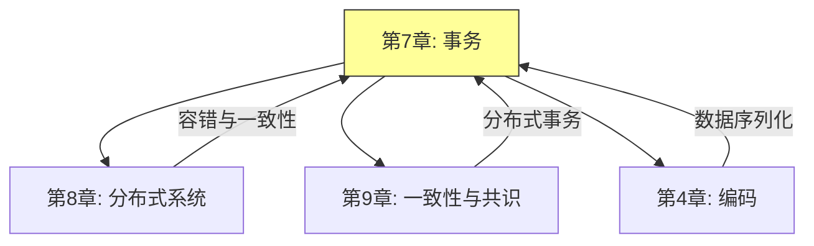

---

## 二、事务的 ACID 特性

### 2.1 ACID 概念图解

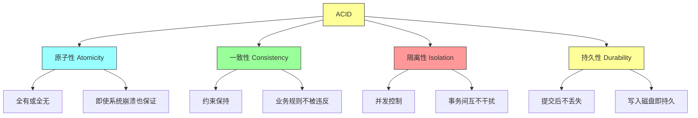

### 2.2 原子性（Atomicity）

**定义**：事务中的所有操作要么全部完成，要么全部不完成。

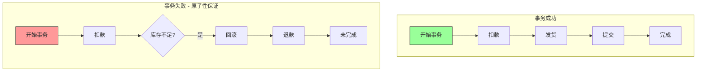

**原子性的实现机制：**

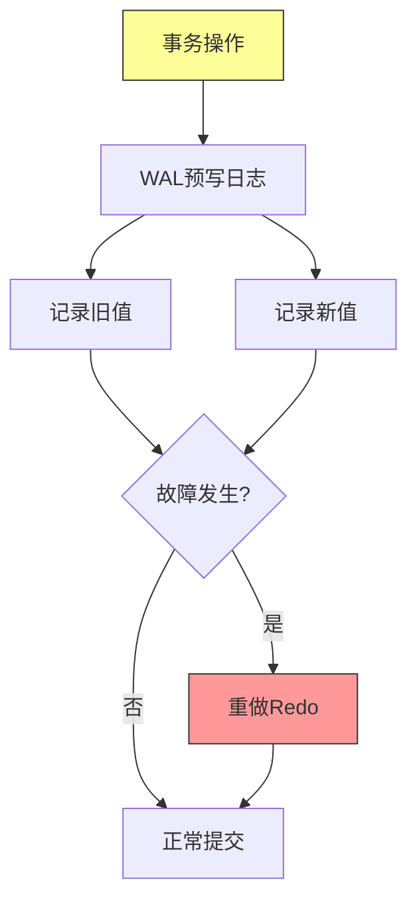

### 2.3 一致性（Consistency）

**定义**：事务将数据库从一个一致状态转换到另一个一致状态。

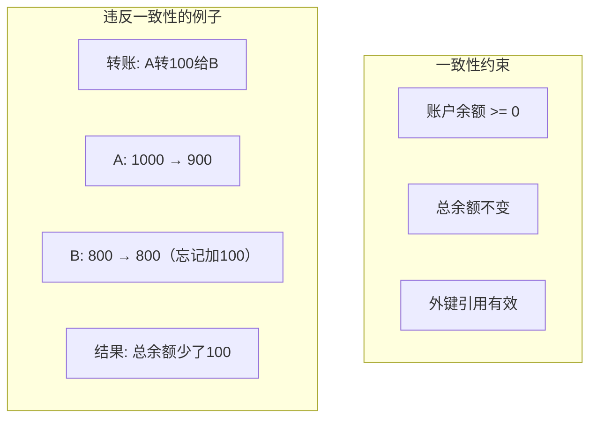

**一致性保证：**

| 约束类型 | 示例 | 保障方式 |
|---------|-----|---------|
| **数据类型** | 整数字段不能存字符串 | 数据库类型系统 |
| **唯一性** | 用户名唯一 | 唯一索引 |
| **外键约束** | 订单必须属于有效用户 | 外键约束 |
| **业务规则** | 余额不能为负 | 触发器/应用层 |

### 2.4 隔离性（Isolation）

**定义**：并发执行的事务之间互不干扰。

```mermaid
graph TD
    subgraph 并发问题["并发执行可能出现的问题"]
        P1[脏读 Dirty Read]
        P2[不可重复读 Non-repeatable Read]
        P3[幻读 Phantom Read]
        P4[丢失更新 Lost Update]
    end

    P1 -->|事务A读取未提交| P2
    P2 -->|同一事务内两次读取不同| P3
    P3 -->|两次查询结果集不同| P4
    P4 -->|两个事务都修改同一行]
```

### 2.5 持久性（Durability）

**定义**：一旦事务提交，其结果永久保存。

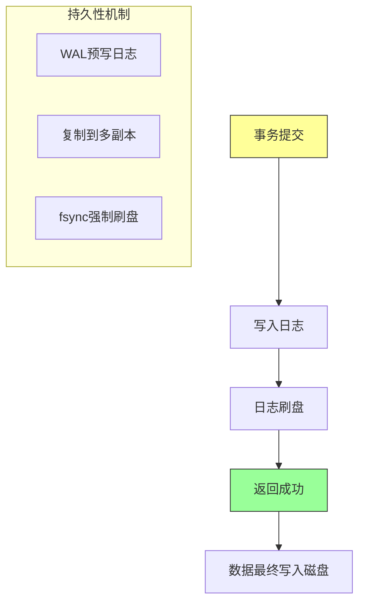

**持久性的代价：**

```
fsync 延迟对比（典型值）：
- HDD: 5-15ms
- SATA SSD: 0.1-1ms
- NVMe SSD: 0.02-0.1ms
```

---

## 三、隔离级别

### 3.1 隔离级别层次

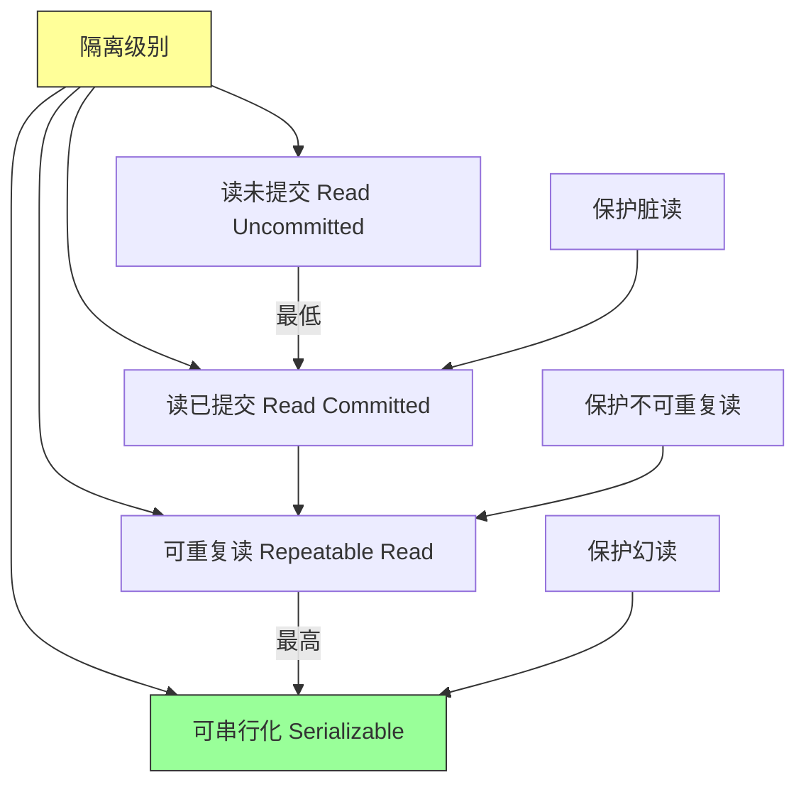

### 3.2 各隔离级别详解

| 隔离级别 | 脏读 | 不可重复读 | 幻读 | 性能 |
|---------|-----|-----------|-----|-----|
| **读未提交** | 可能 | 可能 | 可能 | 最高 |
| **读已提交** | 不可能 | 可能 | 可能 | 高 |
| **可重复读** | 不可能 | 不可能 | 可能 | 中 |
| **可串行化** | 不可能 | 不可能 | 不可能 | 最低 |

### 3.3 读已提交（Read Committed）

**核心保证**：

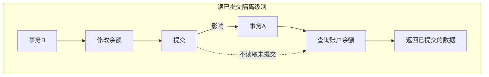

**实现原理**：

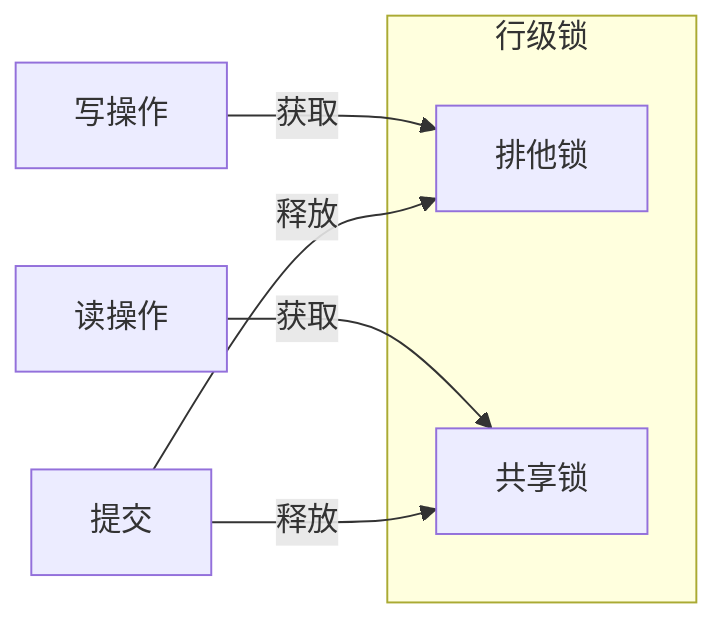

### 3.4 可重复读（Repeatable Read）

**核心保证**：同一事务内多次读取同一数据，结果一致。


**快照读实现**：

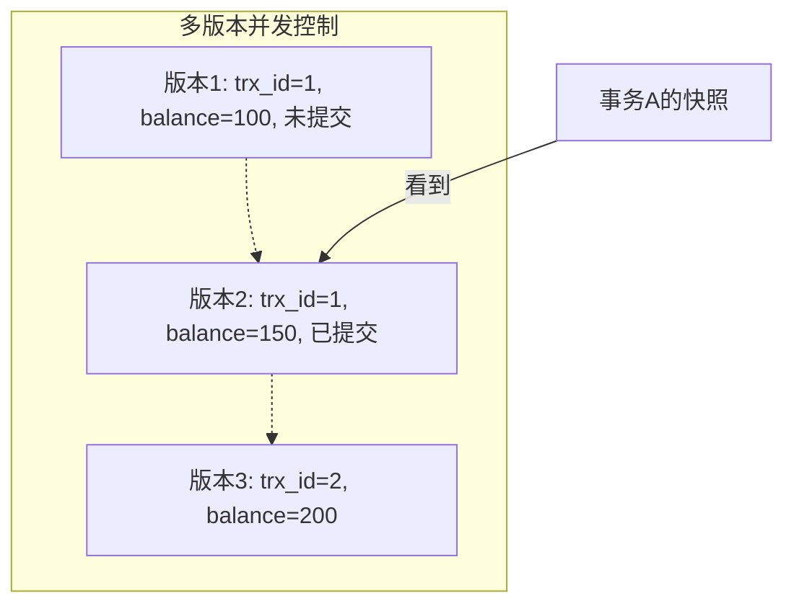

### 3.5 幻读与间隙锁

**幻读问题**：同一查询在事务内多次执行，结果集不同。

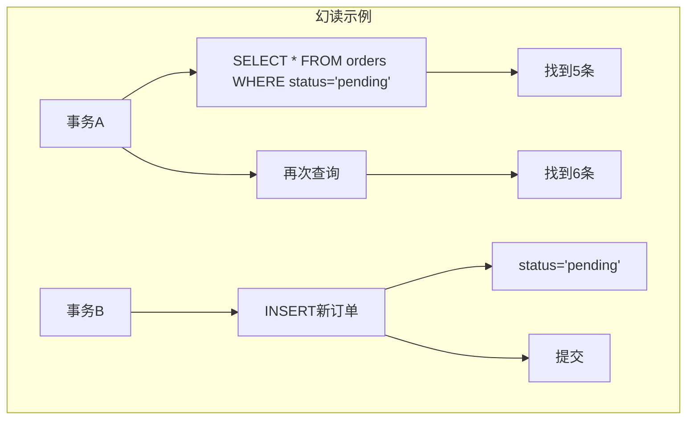

**间隙锁（Gap Lock）解决方案**：

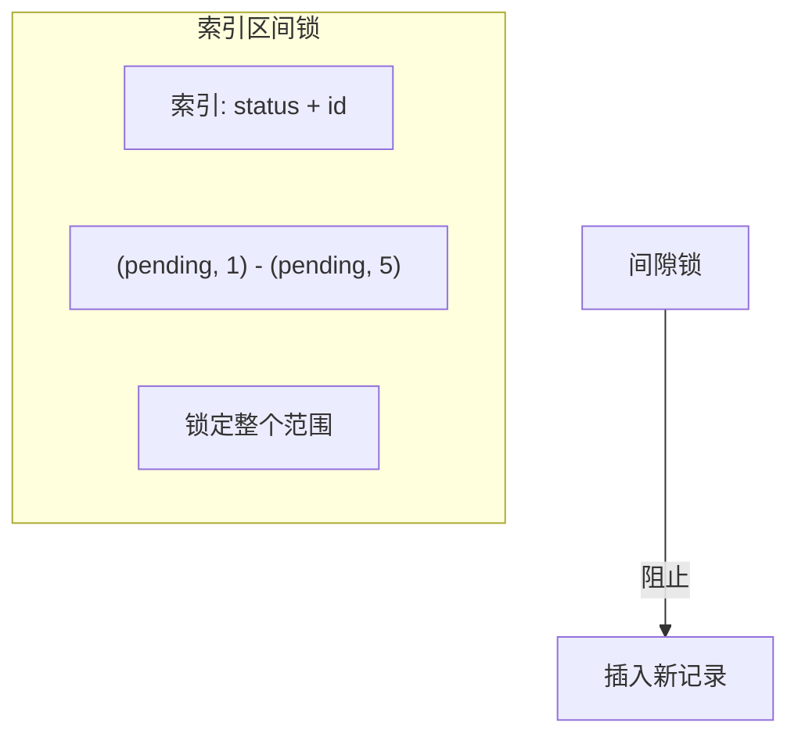

### 3.6 可串行化（Serializable）

**最强隔离级别**：事务执行效果等同于串行执行。

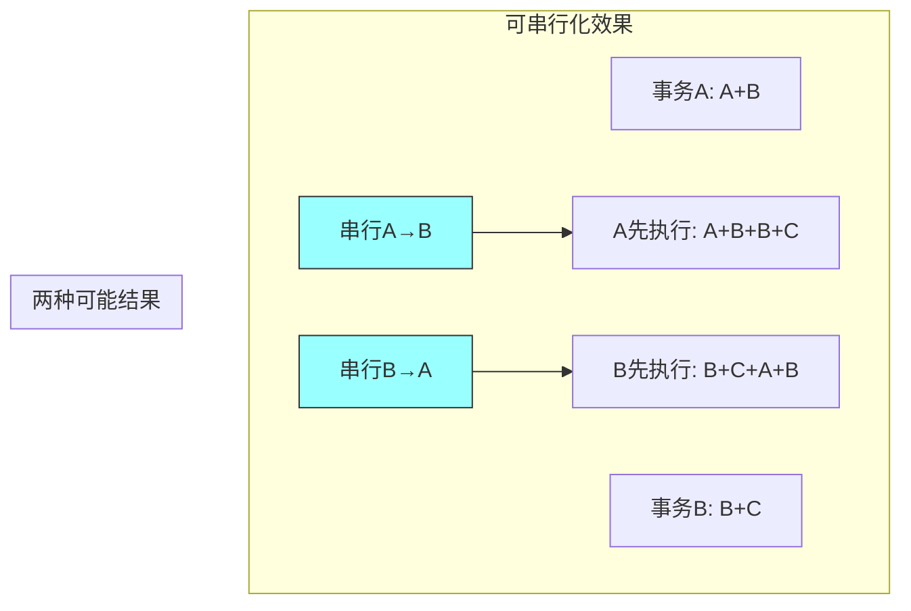

**实现方式**：

| 方式 | 说明 | 优点 | 缺点 |
|-----|-----|-----|-----|
| **两阶段锁** | 严格加锁 | 简单可靠 | 性能差 |
| **可串行化快照** | MVCC + 冲突检测 | 性能好 | 实现复杂 |
| **乐观并发控制** | 提交时检测冲突 | 并发高 | 冲突多时失败多 |

---

## 四、并发控制机制

### 4.1 锁机制

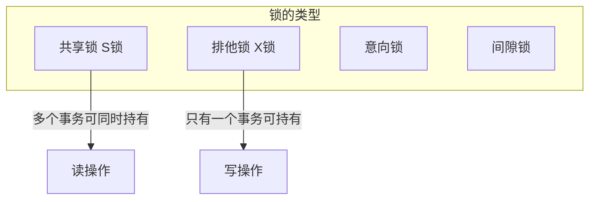

**锁兼容矩阵**：

|  | S锁 | X锁 | IS锁 | IX锁 |
|--|-----|-----|-----|-----|
| **S锁** | ✓ | ✗ | ✓ | ✗ |
| **X锁** | ✗ | ✗ | ✗ | ✗ |
| **IS锁** | ✓ | ✗ | ✓ | ✓ |
| **IX锁** | ✗ | ✗ | ✓ | ✓ |

### 4.2 两阶段锁协议


### 4.3 多版本并发控制（MVCC）

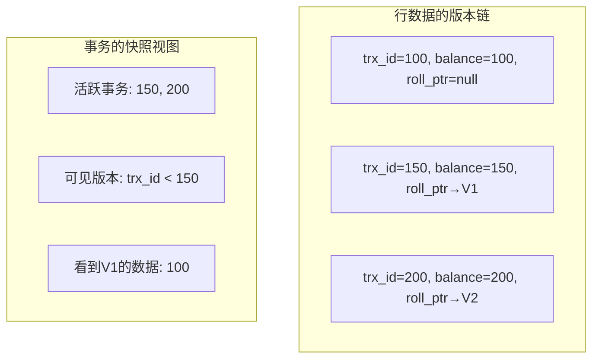

**MVCC 读操作流程**：

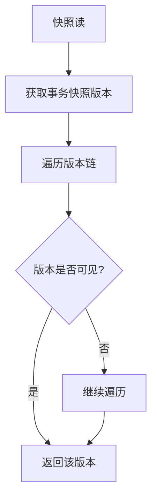

### 4.4 死锁处理

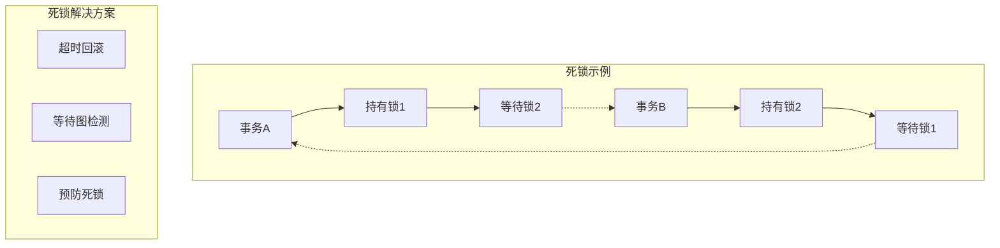

**死锁检测算法**：

```mermaid
flowchart TD
    A[构建等待图] --> B[节点: 事务]
    A --> C[边: 等待关系]

    B --> D[检测环]
    C --> D

    D --> E{发现环?}
    E -->|是| F[选择牺牲者回滚]
    E -->|否| G[继续执行]
```

---

## 五、分布式事务

### 5.1 分布式事务的挑战

```mermaid
graph TD
    subgraph 分布式事务["跨节点的事务"]
        N1[节点A] -->|网络通信| N2[节点B]
        N2 -->|网络通信| N3[节点C]
    end

    subgraph 问题["面临的问题"]
        P1[部分节点成功]
        P2[网络分区]
        P3[节点崩溃]
        P4[消息丢失]
    end

    style 分布式事务 fill:#ff9,stroke:#333
```

### 5.2 两阶段提交（2PC）

```mermaid
graph TD
    subgraph 协调者["协调者"]
        C[事务管理器]
    end

    subgraph 参与者["参与者"]
        P1[数据库A]
        P2[数据库B]
        P3[数据库C]
    end

    C -->|1. 准备 Prepare| P1
    C -->|1. 准备 Prepare| P2
    C -->|1. 准备 Prepare| P3

    P1 -->|2. 准备好/不好| C
    P2 -->|2. 准备好/不好| C
    P3 -->|2. 准备好/不好| C

    C -->|3. 提交/回滚| P1
    C -->|3. 提交/回滚| P2
    C -->|3. 提交/回滚| P3

    P1 -->|4. 确认| C
    P2 -->|4. 确认| C
    P3 -->|4. 确认| C
```

**两阶段提交的详细流程**：

```mermaid
sequenceDiagram
    participant C as 协调者
    participant P1 as 参与者1
    participant P2 as 参与者2

    C->>P1: CanCommit?
    P1-->>C: Yes/No
    C->>P2: CanCommit?
    P2-->>C: Yes/No

    Note over C: 所有都回复Yes

    C->>P1: DoCommit
    C->>P2: DoCommit

    P1-->>C: ACK
    P2-->>C: ACK

    Note over C: 事务完成
```

**2PC 的问题**：

| 问题 | 说明 | 严重程度 |
|-----|-----|---------|
| **阻塞问题** | 协调者故障时参与者阻塞 | 严重 |
| **同步阻塞** | 参与者需等待协调者 | 中等 |
| **数据不一致** | 部分提交可能导致不一致 | 严重 |
| **单点故障** | 协调者是单点 | 中等 |

### 5.3 三阶段提交（3PC）

```mermaid
graph TD
    subgraph 三阶段["三阶段提交"]
        P1[阶段1: CanCommit]
        P2[阶段2: PreCommit]
        P3[阶段3: DoCommit]
    end

    P1 --> P2
    P2 --> P3

    subgraph 改进["3PC 改进"]
        I1[增加超时机制]
        I2[避免阻塞]
        I3[更复杂的协调]
    end
```

**3PC vs 2PC**：

| 特性 | 2PC | 3PC |
|-----|-----|-----|
| 阶段数 | 2 | 3 |
| 阻塞问题 | 有 | 基本解决 |
| 实现复杂度 | 低 | 高 |
| 网络开销 | 低 | 高 |

### 5.4 TCC（Try-Confirm-Cancel）

```mermaid
graph TD
    subgraph TCC流程["TCC 模式"]
        T1[Try阶段] --> C1[预留资源]
        T1 --> L1[锁定资源]

        C1 --> C2[Confirm阶段]
        L1 --> C2
        C2 --> U1[确认执行]
        C2 --> R1[释放锁定]

        T1 --> Can[Cancel阶段]
        Can --> R2[回滚操作]
        R2 --> R3[释放资源]
    end

    style T1 fill:#9ff,stroke:#333
    style C2 fill:#9f9,stroke:#333
    style Can fill:#f99,stroke:#333
```

**TCC 示例：转账**：

```mermaid
graph TD
    subgraph 转账场景["A转100给B"]
        Try -->|A账户| T1[冻结A的100]
        Try -->|B账户| T2[预增加B的100]

        Confirm -->|A账户| C1[扣除冻结金额]
        Confirm -->|B账户| C2[增加B的余额]

        Cancel -->|A账户| Can1[解冻A的100]
        Cancel -->|B账户| Can2[取消预增加]
    end
```

### 5.5 Saga 模式

```mermaid
graph TD
    subgraph Saga["Saga 模式"]
        S1[步骤1: 创建订单]
        S2[步骤2: 扣减库存]
        S3[步骤3: 扣款]
        S4[步骤4: 发货]
        S5[步骤5: 完成]
    end

    C1[补偿1: 取消订单]
    C2[补偿2: 恢复库存]
    C3[补偿3: 退款]
    C4[补偿4: 取消发货]

    S1 --> S2 --> S3 --> S4 --> S5
    S1 -.-> C1
    S2 -.-> C2
    S3 -.-> C3
    S4 -.-> C4
```

**Saga vs 2PC**：

| 特性 | Saga | 2PC |
|-----|-----|-----|
| 协调方式 | 编排/ choreography | 集中协调 |
| 阻塞问题 | 无 | 有 |
| 数据一致性 | 最终一致 | 强一致 |
| 适用场景 | 长事务 | 短事务 |
| 实现复杂度 | 中 | 高 |

---

## 六、面试题整理

### 6.1 概念理解类 🌱

**Q1：什么是 ACID？分别解释每个特性的含义。**

**答案：**

**ACID** 是数据库事务的四个基本特性的缩写：

| 特性 | 含义 | 示例 |
|-----|-----|-----|
| **原子性（Atomicity）** | 事务要么全做，要么全不做 | 转账失败时自动回滚 |
| **一致性（Consistency）** | 事务将数据库从一个一致状态转为另一个 | 余额约束不被违反 |
| **隔离性（Isolation）** | 并发事务互不干扰 | 看不到其他事务的中间状态 |
| **持久性（Durability）** | 提交后数据永久保存 | 崩溃后数据不丢失 |

**Q2：什么是脏读、不可重复读、幻读？**

**答案：**

**脏读（Dirty Read）**：
- 读取了其他事务未提交的数据
- 示例：事务A修改了数据但未提交，事务B读取了该数据，然后事务A回滚

**不可重复读（Non-repeatable Read）**：
- 同一事务内，两次读取同一数据，结果不同
- 示例：事务A第一次读100，事务B修改并提交为150，事务A再次读150

**幻读（Phantom Read）**：
- 同一事务内，两次执行相同查询，结果集不同
- 示例：事务A查询状态为pending的订单5条，事务B插入一条新订单并提交，事务A再次查询6条

---

### 6.2 原理分析类 🌿

**Q3：MySQL 的可重复读是如何实现的？**

**答案：**

MySQL InnoDB 通过 **MVCC（多版本并发控制）** 实现可重复读：

1. **快照读**：每个事务开始时创建一个一致性快照
2. **版本链**：每行数据有多个版本，通过 roll_ptr 形成链表
3. **可见性判断**：
   - 创建版本号小于等于当前事务版本
   - 创建事务已提交

```sql
-- 快照读示例
SELECT * FROM users WHERE id = 1;
-- 即使其他事务修改并提交，返回的仍是事务开始时的版本
```

**Q4：两阶段提交有什么问题？为什么在实际系统中很少使用？**

**答案：**

**两阶段提交的问题：**

| 问题 | 说明 |
|-----|-----|
| **同步阻塞** | 参与者必须等待协调者，无法并行执行 |
| **协调者单点** | 协调者故障导致整个系统阻塞 |
| **数据不一致** | 部分提交后协调者故障，可能导致数据不一致 |
| **网络抖动敏感** | 任何网络延迟都可能导致超时回滚 |

**实际系统很少使用的原因：**
- 性能差（需要多轮网络通信）
- 可靠性问题（协调者单点）
- 现代系统倾向于最终一致性

---

### 6.3 对比选型类 🔧

**Q5：如何选择隔离级别？**

**答案：**

```mermaid
flowchart TD
    A[选择隔离级别] --> B{对一致性要求?}

    B -->|最高| C[可串行化]
    B -->|一般| D{对性能要求?}

    C --> C1["金融转账"]
    C --> C2["订单库存"]

    D -->|高| E[读已提交]
    D -->|中| F[可重复读]

    E --> E1["日志查询"]
    E --> E2["报表统计"]

    F --> F1["大部分业务场景"]
```

**各隔离级别适用场景：**

| 隔离级别 | 适用场景 | 典型应用 |
|---------|---------|---------|
| **读未提交** | 日志记录、监控 | 几乎不用 |
| **读已提交** | 报表查询 | Oracle默认 |
| **可重复读** | 业务交易 | MySQL默认 |
| **可串行化** | 金融核心业务 | 慎用 |

**Q6：分布式事务应该选择 2PC、TCC 还是 Saga？**

**答案：**

```mermaid
flowchart TD
    A[选择分布式事务方案] --> B{业务场景?}

    B -->|短事务、强一致| C[2PC/XA]
    B -->|长事务、性能敏感| D[TCC/Saga]

    C --> C1["支付核心"]
    C --> C2["库存扣减"]

    D --> D1["订单流程"]
    D --> D2["跨服务调用"]

    subgraph 决策因素["决策因素"]
        F1[一致性要求]
        F2[性能要求]
        F3[业务复杂度]
        F4[实现成本]
    end
```

**对比总结：**

| 方案 | 一致性 | 性能 | 复杂度 | 适用场景 |
|-----|-------|-----|-------|---------|
| **2PC/XA** | 强一致 | 低 | 中 | 短事务、同构数据库 |
| **TCC** | 最终一致 | 高 | 高 | 高并发、异构系统 |
| **Saga** | 最终一致 | 高 | 中 | 长流程、编排灵活 |
| **本地消息** | 最终一致 | 高 | 低 | 简单场景 |

---

### 6.4 实战应用类 🔧

**Q7：如何设计一个高可用的分布式事务系统？**

**答案：**

**架构设计：**

```mermaid
graph TD
    subgraph 协调层["协调层（高可用）"]
        L1[Leader]
        L2[Follower1]
        L3[Follower2]
        L4[Follower3]
    end

    subgraph 执行层["执行层（多副本）"]
        E1[(服务A)]
        E2[(服务B)]
        E3[(服务C)]
    end

    subgraph 存储层["存储层（持久化）"]
        S1[(事务日志)]
        S2[(状态存储)]
    end

    L1 --> E1
    L1 --> E2
    L1 --> E3

    L1 --> S1
    L2 -.-> S1
    L3 -.-> S1

    style L1 fill:#9f9,stroke:#333
```

**高可用保障：**

| 保障 | 实现方式 |
|-----|---------|
| **协调者高可用** | 主从切换、Raft协议 |
| **事务日志持久化** | WAL + 多副本 |
| **参与者超时机制** | 避免无限等待 |
| **补偿机制** | 回滚/重试策略 |
| **幂等设计** | 防止重复执行 |

---

## 七、实践要点

### 7.1 事务设计原则

```mermaid
graph TD
    A[事务设计原则] --> B[短事务原则]
    A --> C[最小化锁定时间]
    A --> D[避免长事务]
    A --> E[合理选择隔离级别]

    B --> B1["减少持有锁的时间"]
    C --> C1["先锁行，再处理业务"]
    D --> D1["拆分为多个小事务"]
    E --> E1["根据业务需求选择"]
```

### 7.2 常见问题与解决方案

| 问题 | 原因 | 解决方案 |
|-----|-----|---------|
| **死锁频繁** | 锁顺序不一致 | 统一加锁顺序 |
| **长事务** | 业务逻辑复杂 | 拆分为多个事务 |
| **幻读** | 隔离级别太低 | 使用间隙锁/可串行化 |
| **性能差** | 锁粒度过大 | 缩小锁范围 |
| **数据不一致** | 并发控制缺失 | 使用事务+隔离级别 |

### 7.3 事务性能优化

```mermaid
graph TD
    subgraph 优化方向["事务性能优化方向"]
        O1[减少持有时间]
        O2[缩小锁范围]
        O3[避免热点数据]
        O4[批量操作]
        O5[异步处理]
    end

    O1 --> T1["先处理业务，再获取锁"]
    O2 --> T2["按行加锁，不按表"]
    O3 --> T3["分散热点键"]
    O4 --> T4["批量提交"]
    O5 --> T5["非关键路径异步化"]
```

---

## 八、扩展阅读

### 8.1 必读论文

| 论文 | 作者 | 年份 | 贡献 |
|-----|-----|-----|-----|
| ARIES | Mohan et al. | 1992 | WAL和恢复算法 |
| Granularity of Locks | Gray et al. | 1975 | 锁粒度理论 |
|分布式事务综述 |  |  | 分布式事务综合 |

### 8.2 推荐资源

- MySQL 官方文档 - InnoDB 事务
- 《Database System Concepts》- 事务章节
- 《Designing Data-Intensive Applications》- 第7章

### 8.3 实践项目

- 实现一个简单的两阶段提交
- 模拟死锁检测
- 设计一个 TCC 框架

---

## 九、本章小结

### 核心收获

1. **ACID 是事务的基石**
   - 原子性：全有或全无
   - 一致性：约束不被违反
   - 隔离性：并发控制
   - 持久性：提交即永久

2. **隔离级别是性能与安全的平衡**
   - 从读未提交到可串行化
   - 越高级别，性能越低

3. **并发控制的核心机制**
   - 锁机制：共享锁/排他锁
   - MVCC：快照读
   - 两阶段锁协议

4. **分布式事务的挑战**
   - 两阶段提交的问题
   - TCC 和 Saga 作为替代
   - 最终一致性是务实的选择

### 概念地图

```mermaid
mindmap
  root((事务))
    ACID特性
      原子性
      一致性
      隔离性
      持久性
    隔离级别
      读未提交
      读已提交
      可重复读
      可串行化
    并发控制
      锁机制
      MVCC
      两阶段锁
    分布式事务
      2PC
      3PC
      TCC
      Saga
```

### 下一章预告

第 8 章将探讨**分布式系统的麻烦**，了解网络延迟、时钟同步、故障模型等分布式系统固有的挑战：
- 分布式系统的不可靠性
- 时间与顺序的问题
- 拜占庭故障与容错

---

## 附录 A：隔离级别对比表

| 隔离级别 | 脏读 | 不可重复读 | 幻读 | 实现方式 |
|---------|-----|-----------|-----|---------|
| 读未提交 | 可能 | 可能 | 可能 | 无 |
| 读已提交 | 不可能 | 可能 | 可能 | 读锁 |
| 可重复读 | 不可能 | 不可能 | 可能 | 快照/MVCC |
| 可串行化 | 不可能 | 不可能 | 不可能 | 两阶段锁 |

## 附录 B：分布式事务方案对比

| 方案 | 一致性 | 性能 | 复杂度 | 侵入性 |
|-----|-------|-----|-------|-------|
| 2PC/XA | 强 | 低 | 中 | 低 |
| TCC | 最终 | 高 | 高 | 高 |
| Saga | 最终 | 高 | 中 | 低 |
| 本地消息 | 最终 | 高 | 低 | 低 |

---

*文档生成时间：2024-01-08*
*基于《Designing Data-Intensive Applications》第7章*
