# 《Designing Data-Intensive Applications》- 第8章：分布式系统的麻烦（深度版）

## 一、本章概述

本章深入探讨了**分布式系统**固有的挑战和问题。与单机系统不同，分布式系统面临网络延迟、时钟不同步、节点故障等根本性问题，这些问题使得构建可靠的分布式系统变得极为困难。

> **本章核心问题**：为什么分布式系统如此难以正确构建？我们在设计时必须考虑哪些不可避免的问题？

### 1.1 核心主题
- 故障与部分故障
- 不可靠的网络
- 不可靠的时钟
- 进程暂停问题
- 拜占庭容错

### 1.2 重要程度
⭐⭐⭐⭐⭐（极高）

### 1.3 预计学习时间
120-150 分钟

### 1.4 本章与其他章节的关联

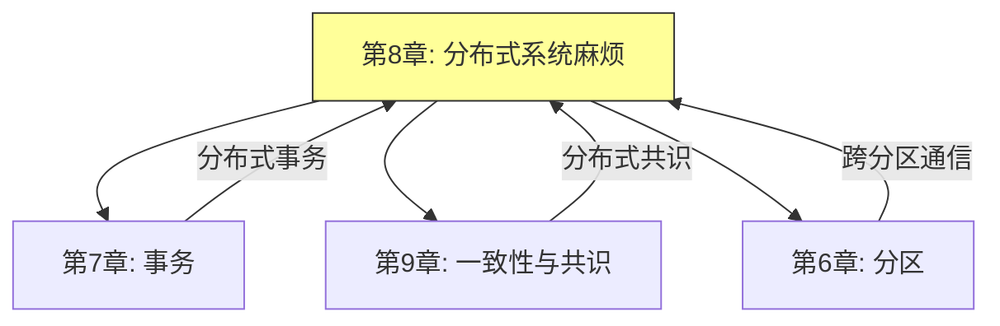

---

## 二、故障与部分故障

### 2.1 分布式系统的本质困难

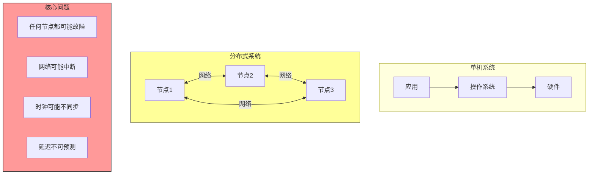

### 2.2 部分故障的概念

**部分故障（Partial Failure）**：系统中某些组件正常，而其他组件故障。

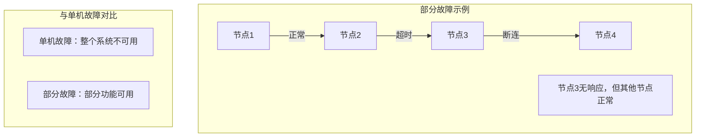

### 2.3 故障的不可检测性

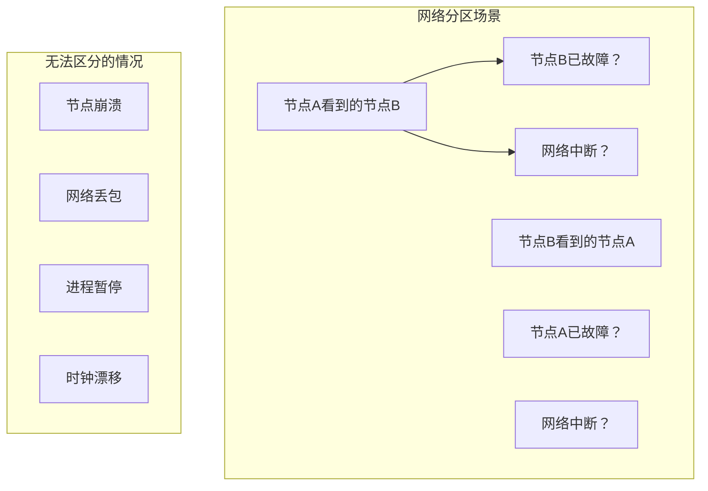

### 2.4 容错设计原则

```mermaid
graph TD
    A[容错设计] --> B[假设任何故障都可能发生]
    A --> C[设计冗余]
    A --> D[优雅降级]
    A --> E[检测并恢复]

    B --> B1["节点会崩溃"]
    B --> B2["网络会中断"]
    B --> B3["消息会丢失]

    C --> C1["多副本"]
    C --> C2["心跳检测]
    C --> C3["备份机制]

    D --> D1["部分功能可用]
    D --> D2["缓存降级]
    D --> D3["限流降级]

    E --> E1["故障检测]
    E --> E2["自动恢复]
    E --> E3["人工介入]
```

---

## 三、不可靠的网络

### 3.1 网络故障的类型


| 故障类型 | 描述 | 影响 |
|---------|-----|-----|
| **请求丢失** | 网络设备丢弃数据包 | 操作未执行 |
| **请求延迟** | 消息在队列中等待 | 响应超时 |
| **响应丢失** | 响应包丢失 | 重复操作 |
| **节点崩溃** | 进程/机器停止运行 | 服务不可用 |
| **网络分区** | 网络分裂成两部分 | 集群分裂 |

### 3.2 超时与重试

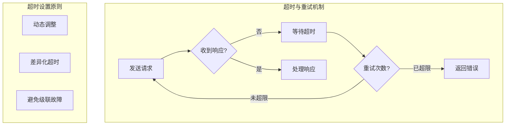

**超时时间的选择：**

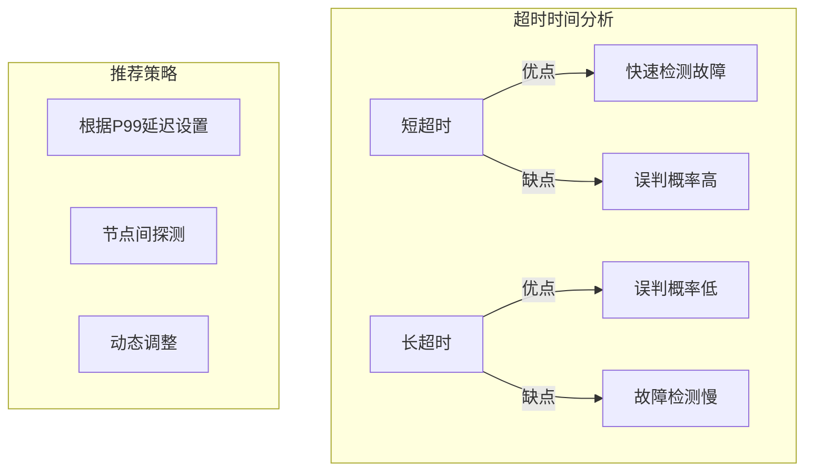

### 3.3 网络冗余与路由

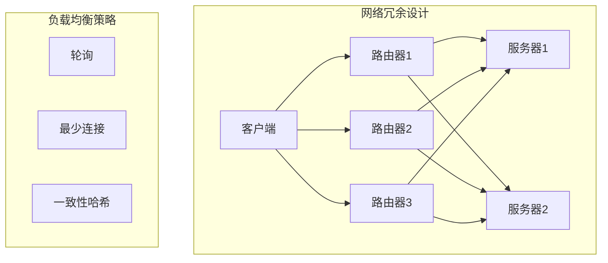

### 3.4 心跳与故障检测

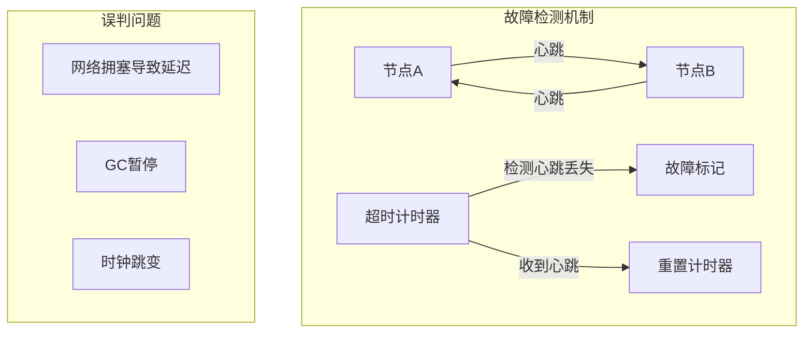

---

## 四、不可靠的时钟

### 4.1 时钟的种类

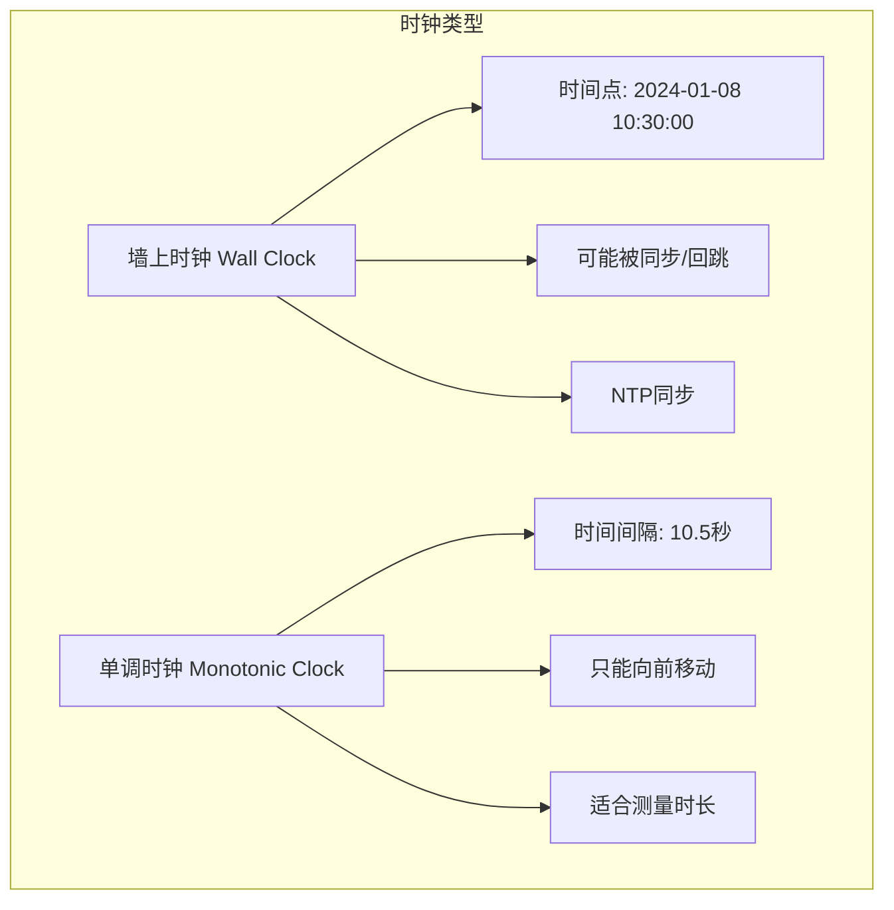

### 4.2 时钟同步问题

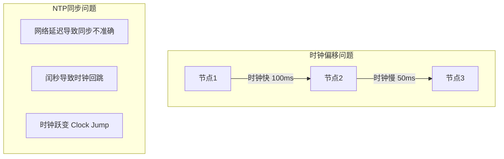

### 4.3 时间戳与顺序问题

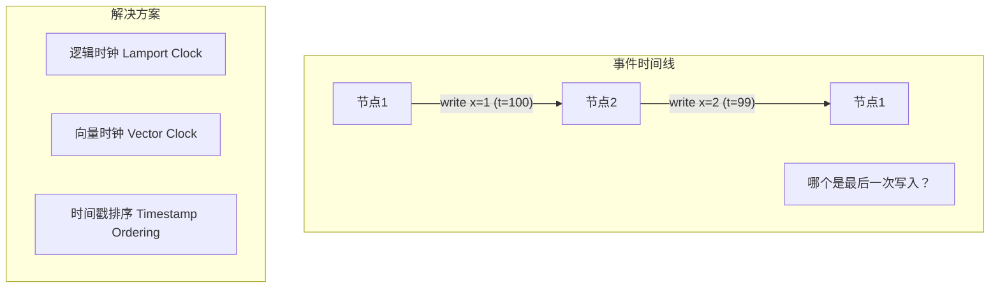

**时间戳比较的问题：**

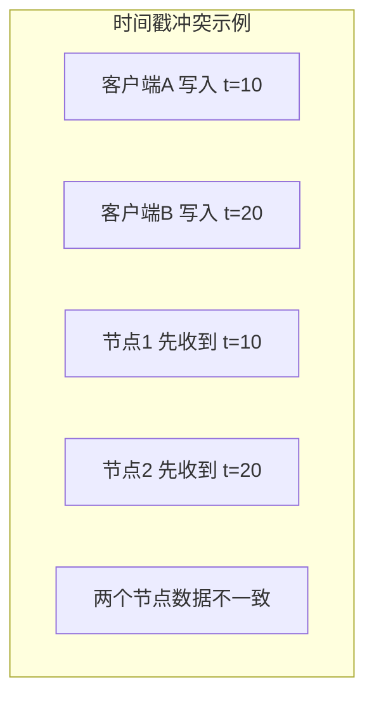

### 4.4 时钟的应用场景与风险

```mermaid
graph TD
    subgraph 时钟应用["时钟使用场景"]
        U1[TTL超时判断]
        U2[缓存过期]
        U3[日志排序]
        U4[测量延迟]
    end

    subgraph 风险场景["风险场景"]
        R1["依赖时钟排序"]
        R2["依赖精确时间间隔"]
        R3["跨节点时间比较]
    end
```

| 应用场景 | 风险 | 替代方案 |
|---------|-----|---------|
| **过期判断** | 时钟漂移 | 逻辑计数器 |
| **缓存过期** | 时间不同步 | 版本号 |
| **延迟计算** | 时钟跳跃 | 单调时钟 |
| **事件排序** | 时间戳不可靠 | 逻辑时钟 |

### 4.5 暂停问题

```mermaid
graph TD
    subgraph 进程暂停["进程暂停场景"]
        P1[GC 垃圾回收]
        P2[操作系统调度]
        P3[虚拟化迁移]
        P4[页面交换]

        G1["GC暂停: 100ms - 10s"]
        G2["OS调度: 毫秒级"]
        G3["VM迁移: 秒级"]
    end

    subgraph 暂停影响["暂停影响"]
        I1["心跳超时"]
        I2["租约过期]
        I3["超时判断错误]
        I4["数据不一致]
    end
```

**租约过期问题：**

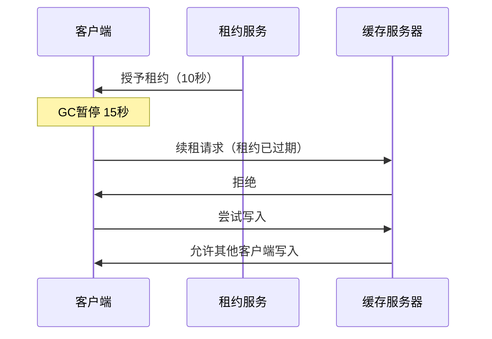

---

## 五、拜占庭容错

### 5.1 拜占庭将军问题

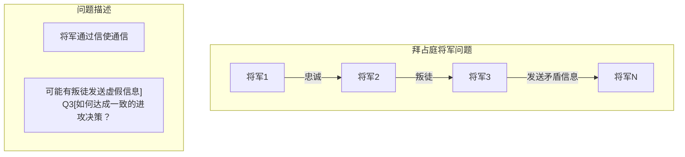

**拜占庭故障**：节点可能做出任何行为，包括恶意行为。

### 5.2 拜占庭容错算法

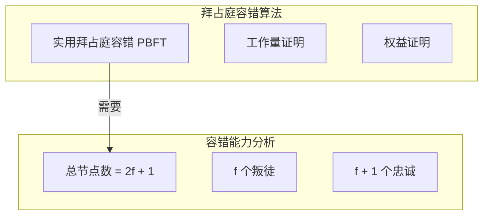

### 5.3 弱拜占庭将军问题

**在大多数分布式系统中，我们假设：**

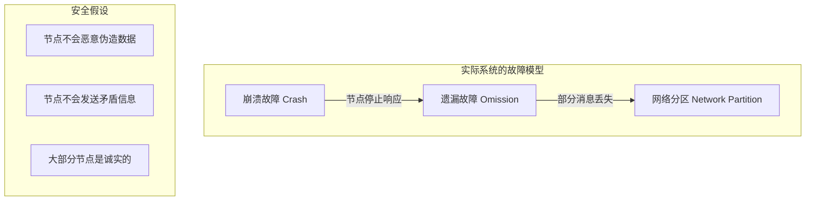

### 5.4 实用中的容错策略

```mermaid
graph TD
    subgraph 多层容错["多层容错策略"]
        L1[数据完整性校验]
        L2[消息签名]
        L3[多副本]
        L4[共识算法]

        L1 --> L2
        L2 --> L3
        L3 --> L4
    end

    subgraph 适用场景["适用场景"]
        S1["区块链：强拜占庭容错"]
        S2["数据库：崩溃容错"]
        S3["消息队列：可靠性保证"]
    end
```

---

## 六、分布式系统的理论模型

### 6.1 系统模型分类

```mermaid
graph TD
    subgraph 故障模型["故障模型分类"]
        F1[崩溃-停止 Crash-Stop]
        F2[崩溃-恢复 Crash-Recovery]
        F3[拜占庭 Byzantine]

        F1 -->|节点停止| F2
        F2 -->|节点重启| F3
    end

    subgraph 同步模型["同步模型分类"]
        S1[同步系统]
        S2[异步系统]
        S3[部分同步]

        S1 -->|有确定延迟| S2
        S2 -->|实际系统| S3
    end
```

| 模型 | 假设 | 实际系统 |
|-----|-----|---------|
| **同步系统** | 有已知延迟上界 | 很少满足 |
| **异步系统** | 无任何时间假设 | 理论模型 |
| **部分同步** | 大部分时间正常 | 实际系统 |

### 6.2 FLP 不可能定理

```mermaid
graph TD
    subgraph FLP["FLP 不可能定理"]
        F1["在异步系统中"]
        F2["即使只有一个故障节点"]
        F3["也无法同时实现"]
        F4["安全性 Liveness]
        F5["活性 Safety]
    end

    subgraph 含义["实际含义"]
        C1["不存在完美的共识算法"]
        C2["必须放弃某个假设"]
        C3["使用随机化"]
        C4["使用超时机制"]
    end
```

**突破 FLP 的方法：**

| 方法 | 说明 | 示例 |
|-----|-----|-----|
| **随机化** | 使用随机性达成共识 | Paxos 的随机投票 |
| **超时** | 引入时间假设 | Raft 的超时机制 |
| **部分同步** | 假设最终同步 | 实际共识算法 |

### 6.3 CAP 定理

```mermaid
graph TD
    A[CAP定理] --> B[一致性 Consistency]
    A --> C[可用性 Availability]
    A --> D[分区容错 Partition Tolerance]

    B -->|"只能选两个"| E
    C --> E
    D --> E

    E -->|CP| E1["放弃可用性"]
    E -->|AP| E2["放弃一致性"]
    E -->|CA| E3["放弃分区容错"]

    E1 -->|CP系统| R1["分布式数据库"]
    E2 -->|AP系统| R2["DNS、Cassandra"]
    E3 -->|CA系统| R3["单机数据库"]

    style A fill:#ff9,stroke:#333
    style E fill:#f99,stroke:#333
```

**CAP 的实际理解：**

```mermaid
graph TD
    subgraph 误解["常见误解"]
        M1["可以同时满足 CAP"]
        M2["系统必须三选二"]
        M3["分区很少发生"]
    end

    subgraph 正确理解["正确理解"]
        C1["分区时必须在 C 和 A 之间选择"]
        C2["正常情况下可以同时满足"]
        C3["分区容错是必须保证的"]
    end
```

---

## 七、面试题整理

### 7.1 概念理解类 🌱

**Q1：什么是部分故障？为什么分布式系统中部分故障是常态？**

**答案：**

**部分故障**是指系统中某些组件正常工作的同时，其他组件发生故障。

在分布式系统中，部分故障是常态的原因：

| 原因 | 说明 |
|-----|-----|
| **网络不可靠** | 消息可能丢失、延迟 |
| **节点独立故障** | 每个节点都可能独立崩溃 |
| **无全局时钟** | 无法准确判断远程节点状态 |
| **资源独立** | 节点间资源不共享 |

**Q2：同步时钟和单调时钟有什么区别？**

**答案：**

| 特性 | 同步时钟（墙上时钟） | 单调时钟 |
|-----|---------------------|---------|
| **用途** | 表示时间点 | 测量时间间隔 |
| **方向** | 可能回跳 | 只能前进 |
| **NTP同步** | 会同步 | 不参与同步 |
| **适用** | 日志时间戳 | 延迟测量、超时 |
| **精度** | 毫秒/秒级 | 纳秒级 |

---

### 7.2 原理分析类 🌿

**Q3：为什么分布式系统中的超时不能设置太长？**

**答案：**

**超时太长的影响：**

1. **故障检测慢**：发现问题需要更长时间
2. **资源占用**：等待期间资源被占用
3. **级联故障**：一个故障可能拖垮整个系统
4. **用户体验差**：用户需要等待更长时间

**超时设置的原则：**

```mermaid
graph TD
    A[超时设置] --> B{考虑因素}
    B --> C[网络延迟分布]
    B --> D[处理时间]
    B --> E[业务容忍度]

    C --> C1["P99 延迟"]
    D --> D1["处理时间 + 排队"]
    E --> E1["可接受的等待时间"]

    R[建议: P99 + 安全边际]
```

**Q4：什么是拜占庭故障？实际系统中如何处理？**

**答案：**

**拜占庭故障**：节点表现出任意行为，包括恶意行为。

**实际系统的处理策略：**

| 策略 | 说明 | 适用场景 |
|-----|-----|---------|
| **假设无恶意** | 假设节点只会崩溃，不会作恶 | 大多数企业系统 |
| **消息签名** | 对消息进行签名验证 | 区块链、P2P |
| **多副本验证** | 多副本结果对比 | 关键业务 |
| **准入控制** | 控制节点加入 | 联盟链 |

---

### 7.3 对比选型类 🔧

**Q5：CAP 定理中应该如何在 C 和 A 之间做选择？**

**答案：**

```mermaid
flowchart TD
    A[选择 CAP 策略] --> B{业务需求}

    B -->|强一致性| C[CP 系统]
    B -->|高可用性| D[AP 系统]
    B -->|两者都重要| E[最终一致 + 高可用]

    C --> C1["银行转账"]
    C --> C2["库存扣减"]

    D --> D1["社交Feed"]
    D --> D2["日志收集"]

    E --> E1["DynamoDB"]
    E --> E2["Cassandra"]
```

**实际建议：**
- 大多数系统选择 **AP**，通过最终一致性弥补
- 金融等关键系统选择 **CP**
- 避免在分区时追求完美的 C 或 A

**Q6：如何设计一个容忍网络故障的系统？**

**答案：**

**设计原则：**

```mermaid
graph TD
    subgraph 容错设计["容错系统设计"]
        A[超时重试] --> B[指数退避]
        B --> C[断路器]
        C --> D[降级处理]
        D --> E[恢复策略]
    end

    subgraph 技术选型["关键技术"]
        T1[重试机制]
        T2[熔断器 Hystrix]
        T3[降级服务]
        T4[补偿事务]
    end
```

---

### 7.4 实战应用类 🔧

**Q7：在分布式系统中，如何处理进程暂停（如 GC 暂停）导致的问题？**

**答案：**

**问题场景：**

```mermaid
sequenceDiagram
    participant C as 客户端
    participant S as 服务
    participant L as 锁服务

    C->>S: 请求处理
    Note over S: GC 暂停 30秒
    S->>L: 续租租约
    L->>S: 租约已过期
    S->>S: 处理完成，但锁已失效
```

**解决方案：**

| 方案 | 说明 | 优缺点 |
|-----|-----|-------|
| **延长租约** | 设置更长的超时时间 | 故障检测变慢 |
| **租约续期** | 在处理前续期租约 | 增加复杂度 |
| **去除依赖** | 不使用基于时间的锁 | 需要其他机制 |
| **小对象分配** | 减少 GC 暂停 | 代码复杂度增加 |
| **G1/ZGC** | 使用低延迟 GC | 吞吐量可能降低 |

---

## 八、实践要点

### 8.1 分布式系统设计原则

```mermaid
graph TD
    A[分布式系统设计原则] --> B[假设任何东西都会故障]
    A --> C[设计冗余和副本]
    A --> D[优雅降级]
    A --> E[可观测性]

    B --> B1["网络不可靠"]
    B --> B2["节点会崩溃"]
    B --> B3["时钟不精确"]

    C --> C1["多副本"]
    C --> C2["心跳检测"]
    C --> C3["故障转移]

    D --> D1["部分功能可用"]
    D --> D2["缓存降级]
    D --> D3["限流]

    E --> E1["日志追踪]
    E --> E2["指标监控]
    E --> E3["告警]
```

### 8.2 常见问题与解决方案

| 问题 | 原因 | 解决方案 |
|-----|-----|---------|
| **级联故障** | 一个节点故障拖垮其他节点 | 断路器、限流 |
| **数据不一致** | 并发写入 + 网络分区 | 冲突解决、最终一致 |
| **脑裂** | 网络分区导致集群分裂 | 仲裁机制、leader选举 |
| **时钟不同步** | NTP同步不准确 | 使用逻辑时钟 |
| **重复请求** | 重试导致多次执行 | 幂等设计 |

### 8.3 监控与可观测性

```mermaid
graph TD
    subgraph 可观测性三支柱["可观测性三要素"]
        M1[指标 Metrics]
        M2[日志 Logs]
        M3[链路 Tracing]
    end

    subgraph 分布式追踪["分布式追踪"]
        T1[请求入口]
        T2[跨服务调用]
        T3[依赖关系]
        T4[性能分析]
    end

    M1 --> T1
    M2 --> T2
    M3 --> T3
```

---

## 九、扩展阅读

### 9.1 必读论文

| 论文 | 作者 | 年份 | 贡献 |
|-----|-----|-----|-----|
| Impossibility of Distributed Consensus | Fischer, Lynch, Patterson | 1985 | FLP 不可能定理 |
| Time, Clocks, and the Ordering of Events | Leslie Lamport | 1978 | 逻辑时钟 |
| The Byzantine Generals Problem | Lamport, Shostak, Pease | 1982 | 拜占庭将军问题 |

### 9.2 推荐资源

- 《Distributed Systems: Principles and Paradigms》
- 《Introduction to Reliable and Secure Distributed Programming》
- Google 研究论文：Chubby, Spanner

### 9.3 实践项目

- 实现一个简单的租约机制
- 模拟网络分区和故障恢复
- 设计一个容错的 KV 存储

---

## 十、本章小结

### 核心收获

1. **分布式系统本质上是不可靠的**
   - 网络不可靠、节点会故障
   - 部分故障是常态

2. **时钟是分布式系统的痛点**
   - 墙上时钟可能回跳
   - 单调时钟只能用于测量间隔
   - 需要使用逻辑时钟解决排序问题

3. **故障检测是困难的**
   - 无法区分节点故障和网络故障
   - 超时设置需要平衡

4. **理论限制指导实践**
   - FLP 告诉我们完美的共识是不可能的
   - CAP 告诉我们在分区时必须取舍

### 概念地图

```mermaid
mindmap
  root((分布式系统))
    故障类型
      部分故障
      网络分区
      节点崩溃
    时钟问题
      墙上时钟
      单调时钟
      逻辑时钟
    理论模型
      FLP定理
      CAP定理
      拜占庭容错
    容错策略
      冗余
      重试
      降级
```

### 下一章预告

第 9 章将探讨**一致性与共识**，深入讲解分布式系统中如何达成共识：
- 一致性模型
- Paxos 和 Raft 算法
- 分布式事务的协调

---

## 附录 A：故障处理策略对比

| 策略 | 适用场景 | 优点 | 缺点 |
|-----|---------|-----|-----|
| **重试** | 临时故障 | 简单有效 | 可能加重故障 |
| **指数退避** | 网络拥塞 | 避免风暴 | 延迟增加 |
| **熔断器** | 级联故障 | 保护系统 | 可能过度降级 |
| **降级** | 过载 | 保证核心功能 | 功能受限 |
| **背压** | 反压控制 | 防止过载 | 延迟增加 |

## 附录 B：时钟使用建议

| 场景 | 推荐时钟 | 原因 |
|-----|---------|-----|
| 日志时间戳 | 墙上时钟 | 需要人类可读 |
| 超时判断 | 单调时钟 | 避免回跳问题 |
| 延迟测量 | 单调时钟 | 精确间隔 |
| 事件排序 | 逻辑时钟 | 跨节点比较 |
| 缓存过期 | 单调时钟 | 避免时间回跳 |

---

*文档生成时间：2024-01-08*
*基于《Designing Data-Intensive Applications》第8章*
