# 《Designing Data-Intensive Applications》- 第9章：一致性与共识（深度版）

## 一、本章概述

本章深入探讨了**一致性（Consistency）**和**共识（Consensus）**这两个分布式系统中最核心的概念。一致性定义了数据的行为规范，共识则是让多个节点就某个值达成一致的算法基础。

> **本章核心问题**：分布式系统如何在存在故障的情况下就数据的值达成一致？如何理解不同强度的一致性保证？

### 1.1 核心主题
- 一致性模型详解
- 线性一致性
- 顺序一致性
- 因果一致性
- 共识算法：Paxos 与 Raft
- 分布式事务与共识

### 1.2 重要程度
⭐⭐⭐⭐⭐（极高）

### 1.3 预计学习时间
150-180 分钟

### 1.4 本章与其他章节的关联

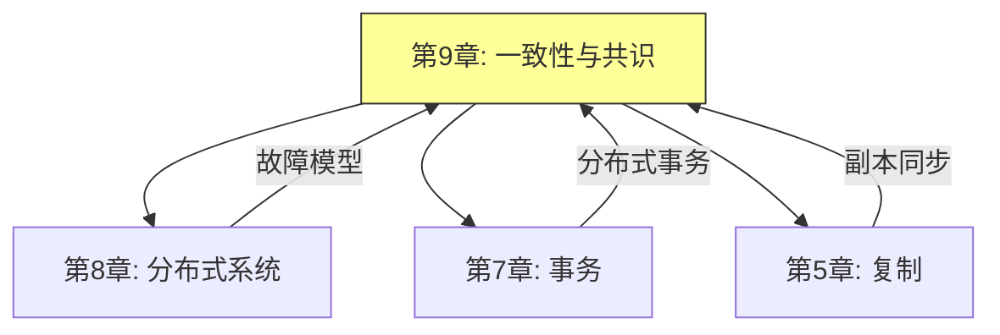

---

## 二、一致性模型

### 2.1 一致性模型的层次

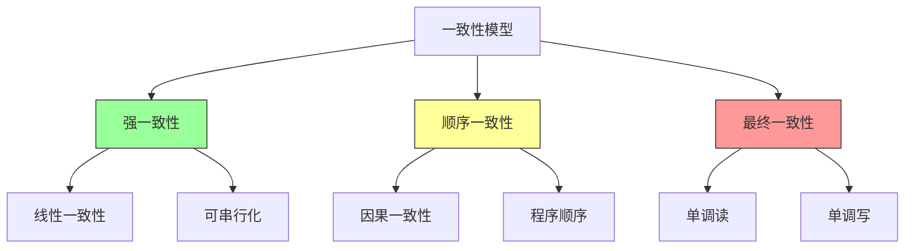

### 2.2 线性一致性（Linearizability）

**线性一致性**是最强的单对象一致性模型，保证所有操作看起来像是原子地执行。

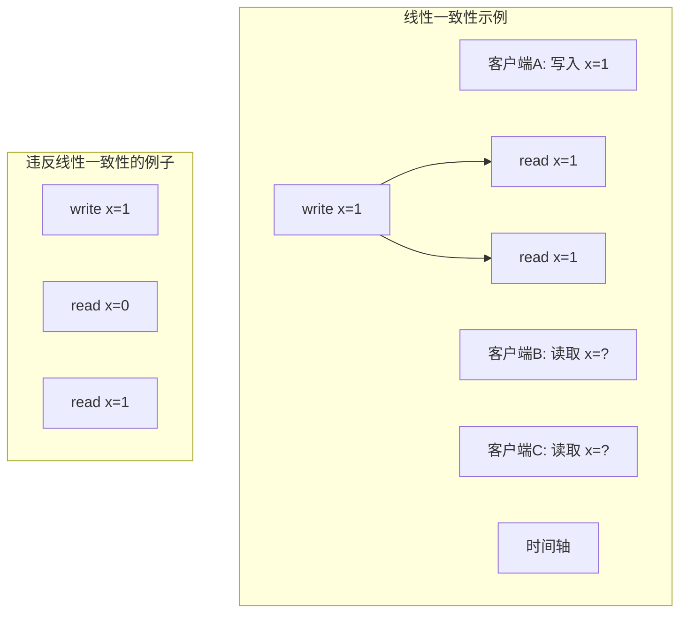

**线性一致性的核心保证：**

| 保证 | 说明 |
|-----|-----|
| **原子性** | 每个操作看起来是原子的 |
| **实时性** | 操作按实际时间顺序执行 |
| **唯一性** | 只有一个最新值可见 |

### 2.3 线性一致性图解

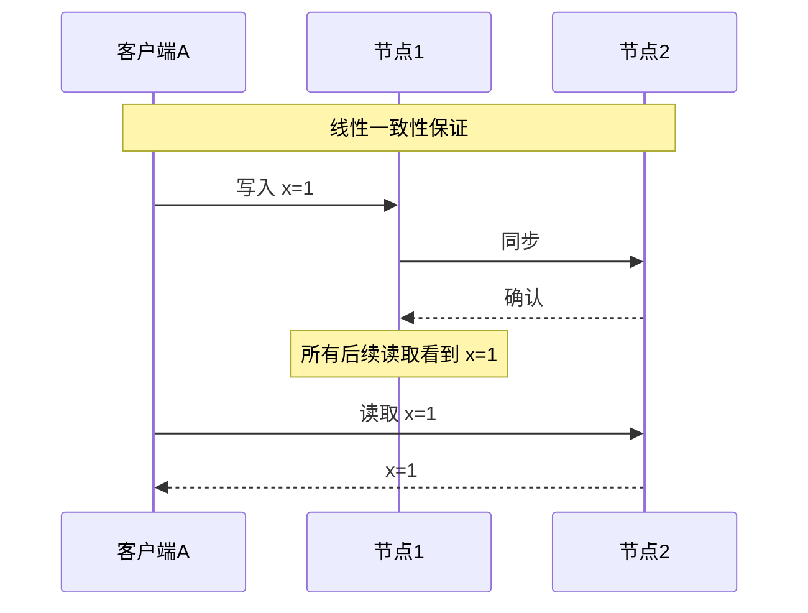

### 2.4 顺序一致性（Sequential Consistency）

**顺序一致性**保证所有进程看到的数据操作顺序相同，但不保证与实际时间一致。

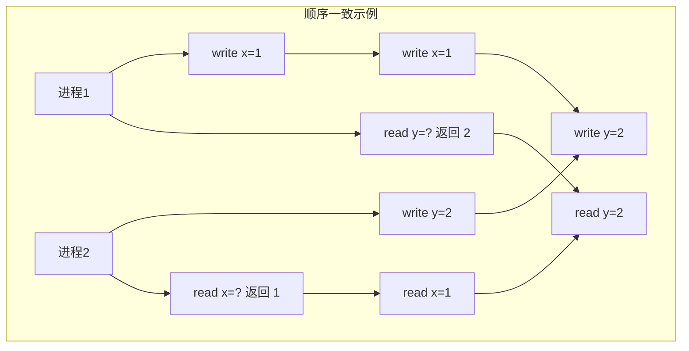

**顺序一致 vs 线性一致：**

| 特性 | 顺序一致 | 线性一致 |
|-----|---------|---------|
| 操作顺序 | 各进程同意的顺序 | 与实际时间一致 |
| 实现难度 | 较简单 | 较复杂 |
| 性能 | 较高 | 较低 |
| 适用场景 | 并行计算 | 分布式存储 |

### 2.5 因果一致性（Causal Consistency）

**因果一致性**只保证有因果关系的操作按因果顺序执行。

```mermaid
graph TD
    subgraph 因果关系["因果关系图"]
        E1["事件A: Alice 发送消息"]
        E2["事件B: Bob 看到消息"]
        E3["事件C: Bob 回复"]
        E4["事件D: Carol 看到回复"]

        E1 --> E2
        E2 --> E3
        E3 --> E4
    end

    subgraph 无因果["无因果关系"]
        N1["进程1: write x=1"]
        N2["进程2: write y=2"]
        N1 和 N2 可以任意顺序执行
    end
```

**因果一致性的保证：**

| 操作类型 | 保证 |
|---------|-----|
| **因果相关** | 按因果顺序执行 |
| **并发操作** | 任意顺序执行 |
| **独立操作** | 可能乱序到达 |

### 2.6 最终一致性（Eventual Consistency）

**最终一致性**是最弱的一致性保证，承诺在没有新更新的情况下，所有副本最终会收敛。

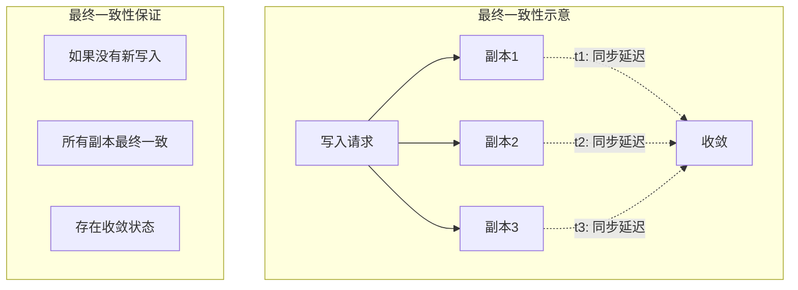

**最终一致性的变体：**

| 变体 | 说明 |
|-----|-----|
| **单调读** | 不会读到旧值 |
| **单调写** | 写入按顺序执行 |
| **读己之所写** | 能看到自己的写入 |
| **读写因果** | 组合以上保证 |

---

## 三、共识问题

### 3.1 共识问题的定义

**共识（Consensus）**：多个节点就某个值达成一致。

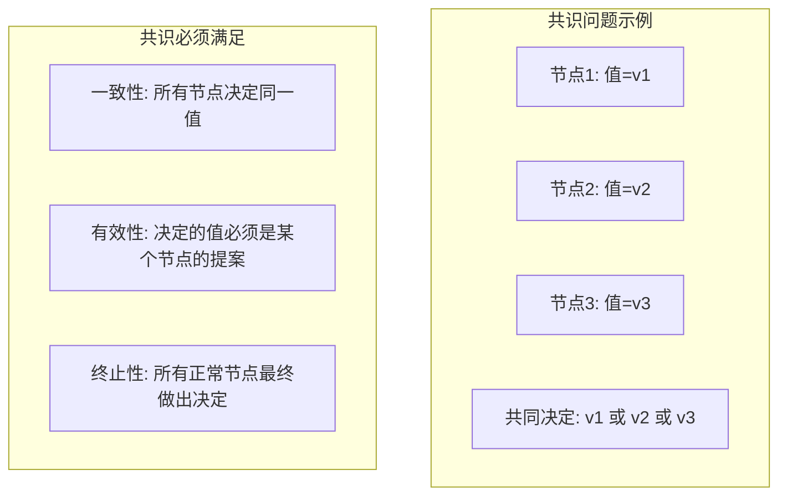

### 3.2 共识算法的特性

| 特性 | 说明 | 重要性 |
|-----|-----|-------|
| **安全性（Safety）** | 不会做出错误决定 | 必须保证 |
| **活性（Liveness）** | 最终能做出决定 | 尽量保证 |
| **容错性** | 能容忍节点故障 | 根据算法 |
| **不变性** | 某些属性永远不变 | 必须保证 |

### 3.3 FLP 与共识

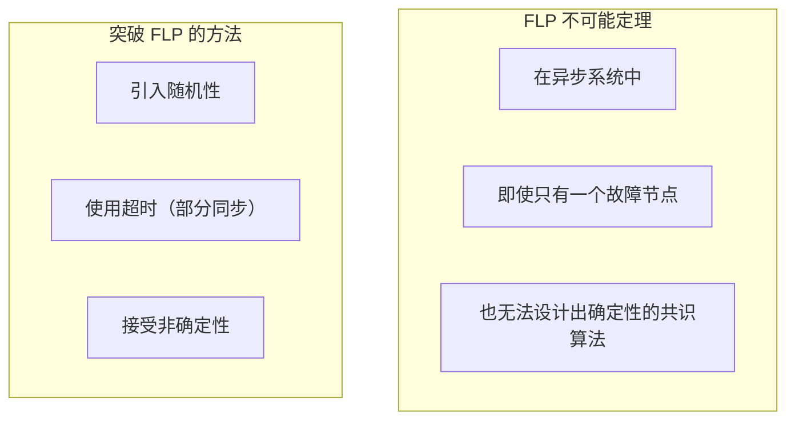

---

## 四、Paxos 算法

### 4.1 Paxos 算法概述

**Paxos** 是 Leslie Lamport 提出的经典共识算法，被认为是分布式共识的基石。

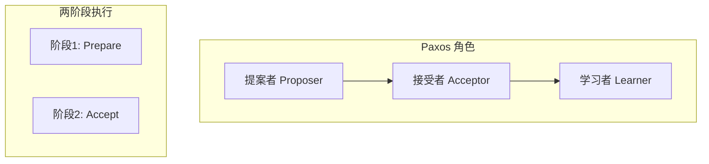

### 4.2 Paxos 算法流程

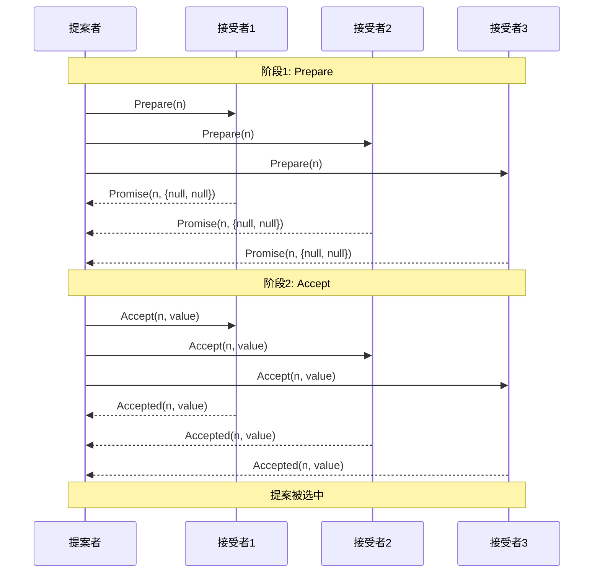

### 4.3 Paxos 关键机制

**Prepare 阶段：**

```mermaid
graph TD
    subgraph Prepare["Prepare 阶段"]
        P[提案者] --> Q[发送 Prepare(n)]

        A[接受者] --> B{收到更高的 Prepare?}
        B -->|是| C[Promise + 返回已接受的提案]
        B -->|否| D[忽略]

        C --> E[承诺不再接受更低编号的提案]
    end
```

**Accept 阶段：**

```mermaid
graph TD
    subgraph Accept["Accept 阶段"]
        P[提案者] --> Q[收到多数 Promise]

        Q --> R{有返回已接受提案?}
        R -->|是| S[选择最大编号的 value]
        R -->|否| T[选择自己的 value]

        P --> U[发送 Accept(n, value)]

        A[接受者] --> V{已Promise更高编号?}
        V -->|是| W[拒绝]
        V -->|否| X[接受]
    end
```

### 4.4 Paxos 的问题与改进

| 问题 | 改进方案 |
|-----|---------|
| **活锁** | Multi-Paxos、引入 leader |
| **实现复杂** | Raft 算法 |
| **性能低** | 批处理、流水线 |

---

## 五、Raft 算法

### 5.1 Raft 算法概述

**Raft** 是一个更容易理解和实现的共识算法，通过将问题分解为三个独立的部分。

```mermaid
graph TD
    A[Raft] --> B[Leader 选举]
    A --> C[日志复制]
    A --> D[安全性保证]

    B --> B1["任期号 Term"]
    B --> B2["随机超时"]
    B --> B3[心跳]

    C --> C1["日志条目"]
    C --> C2["多数派确认"]
    C --> C3["快照"]

    D --> D1["日志匹配"]
    D --> D2["Leader 完整性]
    D --> D3["状态机安全"]
```

### 5.2 Leader 选举

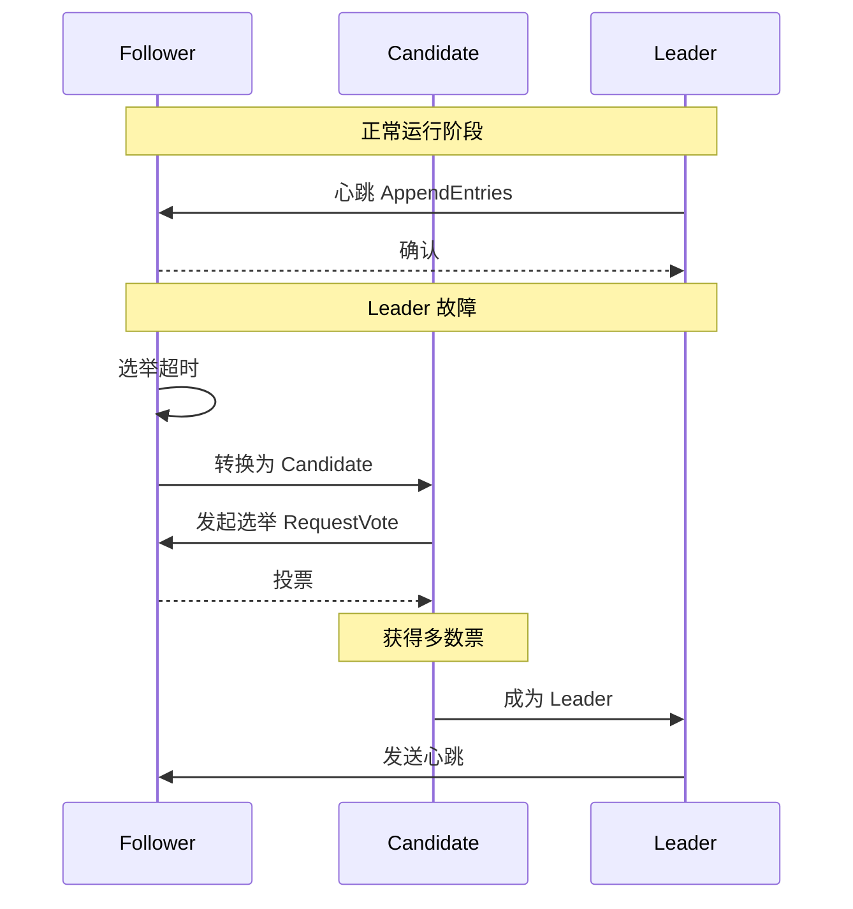

**选举规则：**

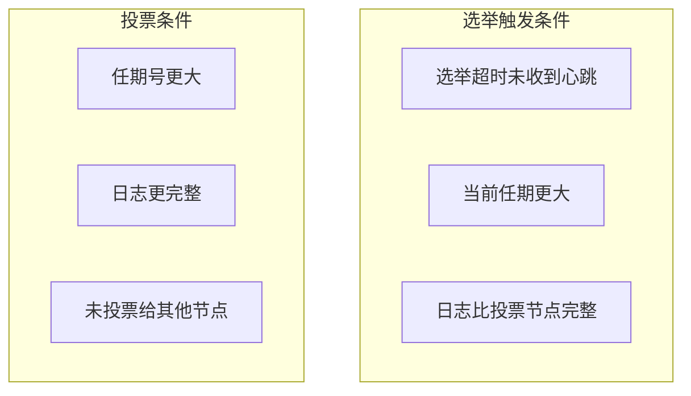

### 5.3 日志复制

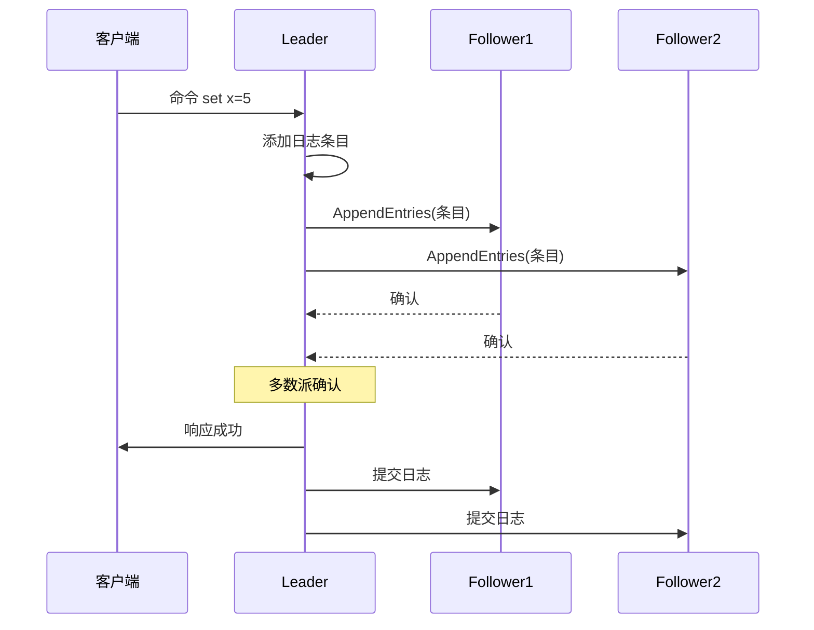

### 5.4 Raft 日志结构

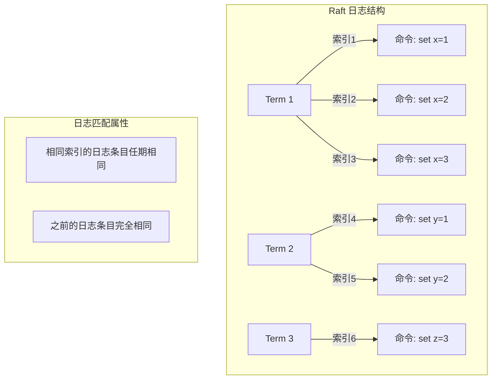

### 5.5 Raft 安全性

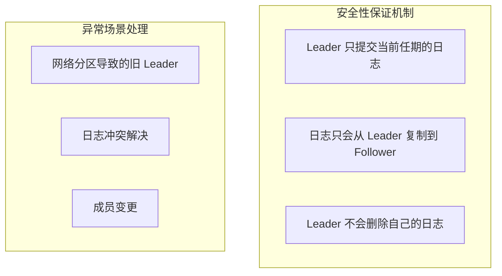

---

## 六、ZooKeeper 与分布式协调

### 6.1 ZooKeeper 概述

**ZooKeeper** 是一个分布式协调服务，提供分布式系统的协调能力。

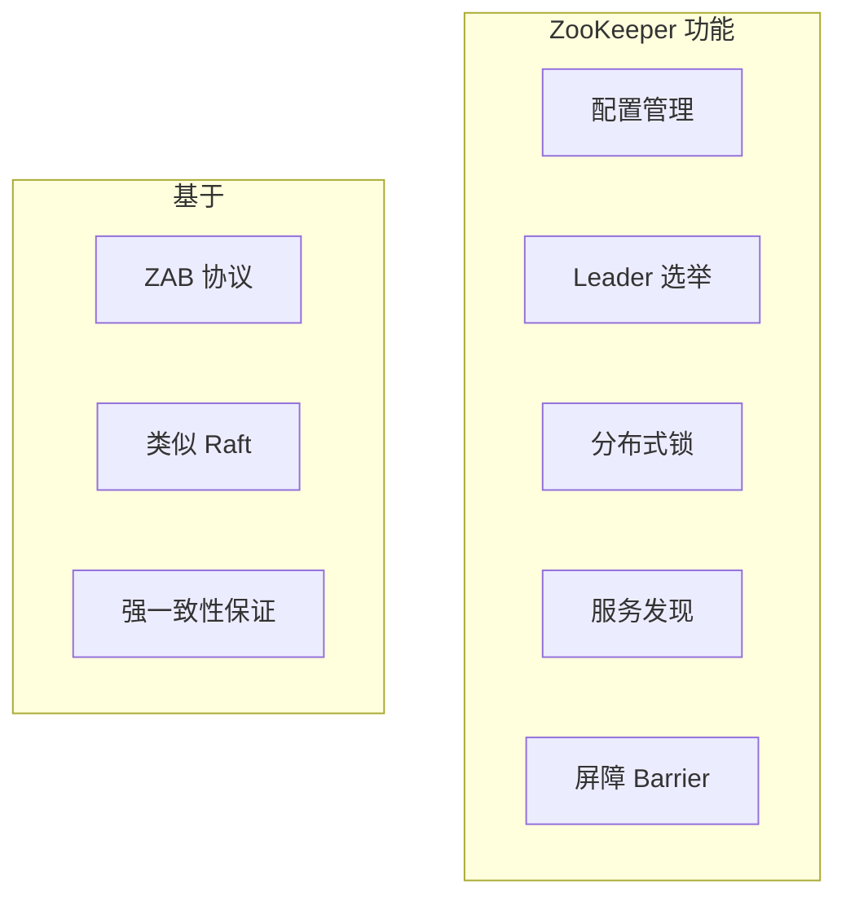

### 6.2 ZooKeeper 数据模型

```mermaid
graph TD
    subgraph 树形结构["ZooKeeper 数据模型"]
        R[/] --> A[/app1]
        R --> B[/app2]

        A --> A1[/app1/config]
        A --> A2[/app1/workers]

        B --> B1[/app2/tasks]
        B --> B2[/app2/locks]

        A1 --> A11[key1=value1]
        A1 --> A12[key2=value2]
    end

    subgraph 操作类型["操作类型"]
        O1[Create / Delete]
        O2[Get / Set]
        O3[Watch]
        O4[List]
    end
```

### 6.3 分布式锁实现

```mermaid
sequenceDiagram
    participant C as 客户端1
    participant Z as ZooKeeper
    participant C2 as 客户端2

    C->>Z: Create /lock/lock- (临时顺序节点)
    Z-->>C: 返回节点序号 1

    C->>Z: GetChildren /lock
    Z-->>C: 返回 [lock-1, lock-2]

    Note over C: 序号最小，获得锁

    C2->>Z: Create /lock/lock- (临时顺序节点)
    Z-->>C2: 返回节点序号 2

    C2->>Z: GetChildren /lock
    Z-->>C2: 返回 [lock-1, lock-2]

    Note over C2: 序号不是最小，等待 Watch
```

### 6.4 共识系统对比

| 系统 | 算法 | 特点 | 适用场景 |
|-----|-----|-----|---------|
| **ZooKeeper** | ZAB | 强一致、功能丰富 | 分布式协调 |
| **etcd** | Raft | 简单、高性能 | 配置存储 |
| **Consul** | Raft | 服务发现强 | 服务网格 |
| **TiKV** | Raft | 列式存储 | HTAP |

---

## 七、分布式事务与共识

### 7.1 两阶段提交与共识

```mermaid
graph TD
    subgraph 两阶段提交["两阶段提交"]
        C[协调者] --> P1[参与者1]
        C --> P2[参与者2]
        C --> P3[参与者3]
    end

    subgraph 问题["问题"]
        Q1[协调者单点]
        Q2[同步阻塞]
        Q3[不一致风险]
    end
```

**两阶段提交与共识的关系：**

| 特性 | 两阶段提交 | 共识 |
|-----|-----------|-----|
| **目标** | 分布式事务 | 值的一致 |
| **参与者** | 任意数量 | 固定集合 |
| **容错** | 协调者故障难处理 | 节点故障可处理 |
| **复杂度** | O(n) 通信 | O(log n) 通信 |

### 7.2 线性化存储的实现

```mermaid
graph TD
    subgraph 线性化存储["线性化存储实现"]
        C1[客户端] --> L[Leader 节点]

        L --> R[复制日志到 Follower]
        R --> M[多数派确认]

        M --> S[日志提交]
        S --> R1[应用到状态机]
    end

    subgraph 读操作["读操作的处理"]
        R2[读请求]
        R2 --> L
        L --> R3[读取本地状态]
        R3 --> R4[或查询最新日志]
    end
```

---

## 八、面试题整理

### 8.1 概念理解类 🌱

**Q1：线性一致性和可串行化有什么区别？**

**答案：**

| 特性 | 线性一致性 | 可串行化 |
|-----|-----------|---------|
| **定义** | 操作的实时顺序保证 | 事务的串行执行等价 |
| **作用域** | 单对象操作 | 多对象事务 |
| **实现** | 共识算法 | 并发控制 |
| **适用** | KV 存储 | 数据库事务 |

**简单理解：**
- 线性一致性：所有操作按时间顺序执行，看起来是原子的
- 可串行化：事务的效果等价于串行执行

**Q2：什么是最终一致性？它能保证什么？**

**答案：**

**最终一致性**保证：如果没有新的更新操作，最终所有副本会收敛到相同的值。

| 保证 | 不保证 |
|-----|-------|
| 所有副本最终一致 | 什么时候收敛 |
| 收敛到一个稳定状态 | 具体时刻的值 |
| | 强一致性保证 |

---

### 8.2 原理分析类 🌿

**Q3：Paxos 算法为什么难以理解？如何简化？**

**答案：**

**Paxos 难以理解的原因：**

1. **两阶段交织**：Prepare 和 Accept 阶段交错
2. **编号复杂**：多个编号系统（提案号、epoch）
3. **边界条件**：各种 corner case

**简化的方法：**

| 方法 | 说明 |
|-----|-----|
| **Multi-Paxos** | 引入稳定 Leader |
| **Raft** | 重新设计，更易理解 |
| **学习资源** | 使用可视化工具学习 |

**Raft 相对于 Paxos 的改进：**

| 改进 | Paxos | Raft |
|-----|-------|-----|
| 角色划分 | 提案者/接受者/学习者 | Leader/Follower/Candidate |
| 选举机制 | 复杂编号比较 | 任期号 + 随机超时 |
| 日志复制 | 需要证明 | 直观理解 |
| 实现难度 | 困难 | 相对简单 |

**Q4：Raft 算法中，如果 Follower 的日志和 Leader 不一致怎么办？**

**答案：**

**不一致的原因：**
- Leader 崩溃
- 网络分区期间多个 Leader
- 旧 Leader 的日志未同步

**解决机制：**

```mermaid
graph TD
    subgraph 不一致处理["Raft 不一致处理"]
        A[Follower 日志与 Leader 不一致]

        B{找到共同前缀}
        B -->|是| C[追加新日志]
        B -->|否| D[删除不一致日志]

        D --> C
        C --> E[保持一致]
    end

    subgraph 具体操作["具体操作"]
        O1[Leader 维护 nextIndex]
        O2[从后向前扫描]
        O3[找到匹配的日志]
        O4[同步后续日志]
    end
```

---

### 8.3 对比选型类 🔧

**Q5：什么场景下应该使用 Raft，什么场景下应该使用最终一致性？**

**答案：**

```mermaid
flowchart TD
    A[选择一致性模型] --> B{业务需求}

    B -->|强一致性要求| C[Raft/共识]
    B -->|高可用优先| D[最终一致性]

    C --> C1["配置管理"]
    C --> C2["分布式锁"]
    C --> C3["元数据存储"]

    D --> D1["用户内容存储"]
    D --> D2["社交Feed]
    D --> D3["日志收集"]

    subgraph 决策因素["决策因素"]
        F1[数据重要性]
        F2[延迟要求]
        F3[可用性要求]
    end
```

**选择建议：**

| 场景 | 推荐方案 | 原因 |
|-----|---------|-----|
| **配置存储** | Raft | 需要强一致 |
| **服务发现** | Raft | 配置必须准确 |
| **用户信息** | 最终一致 | 可容忍短暂不一致 |
| **金融交易** | Raft | 不能出错 |
| **缓存** | 最终一致 | 可以重建 |

**Q6：如何设计一个分布式锁服务？有哪些坑？**

**答案：**

**设计要点：**

```mermaid
graph TD
    subgraph 锁服务设计["分布式锁服务设计"]
        L1[基于 ZooKeeper]
        L2[基于 etcd]
        L3[基于 Redis]

        L1 --> S1["强一致、可靠"]
        L2 --> S2["高性能、可靠"]
        L3 --> S3["高性能、有风险"]
    end
```

**常见坑：**

| 坑 | 原因 | 解决方案 |
|----|-----|---------|
| **锁过期** | TTL 设置不合理 | 续租机制 |
| **单点故障** | 锁服务本身故障 | 多副本 |
| **时钟不同步** | 依赖系统时钟 | 使用单调时钟 |
| **羊群效应** | 大量客户端争锁 | 临时顺序节点 |
| **锁误删** | 持有者不是自己 | 持有者标识验证 |

---

### 8.4 实战应用类 🔧

**Q7：在实际项目中如何使用 Raft 或类似系统？**

**答案：**

**使用现有系统：**

| 系统 | 使用方式 | 特点 |
|-----|---------|-----|
| **etcd** | 直接使用 KV API | 成熟、稳定 |
| **ZooKeeper** | 使用 Curator 客户端 | 功能丰富 |
| **TiKV** | 使用 TiDB 兼容协议 | HTAP 能力 |
| **Consul** | 服务发现 + KV | 云原生友好 |

**最佳实践：**

```mermaid
graph TD
    subgraph 生产实践["生产环境实践"]
        P1[监控告警]
        P2[日志分析]
        P3[备份恢复]
        P4[容量规划]
    end

    P1 --> P1a["监控 Raft 延迟"]
    P1 --> P1b["监控复制状态"]

    P2 --> P2a["日志追踪"]
    P2 --> P2b["性能分析"]

    P3 --> P3a["定期快照]
    P3 --> P3b["跨机房复制"]

    P4 --> P4a["评估存储]
    P4 --> P4b["评估网络]
```

---

## 九、实践要点

### 9.1 一致性模型选择指南

```mermaid
flowchart TD
    A[选择一致性模型] --> B{数据重要性}

    B -->|关键数据| C[强一致性]
    B -->|普通数据| D{可用性要求}

    D -->|高可用| E[最终一致性]
    D -->|一般| F[因果一致性]

    C --> C1["使用 Raft/etcd"]
    E --> E1["使用 DynamoDB/Cassandra"]
    F --> F1["使用自定义逻辑"]
```

### 9.2 共识系统运维要点

```mermaid
graph TD
    subgraph 运维监控["共识系统运维"]
        M1[集群健康]
        M2[复制延迟]
        M3[Leader 状态]
        M4[日志大小]

        M1 --> A1["节点存活"]
        M2 --> A2["复制落后告警"]
        M3 --> A3["频繁切换调查"]
        M4 --> A4["快照/压缩"]
    end
```

### 9.3 常见问题与解决方案

| 问题 | 原因 | 解决方案 |
|-----|-----|---------|
| **Leader 频繁切换** | 网络不稳定 | 延长超时 |
| **复制延迟高** | 节点性能差 | 扩容/优化 |
| **数据不一致** | 违反安全性 | 检查配置 |
| **脑裂** | 网络分区 | 仲裁配置 |

---

## 十、扩展阅读

### 10.1 必读论文

| 论文 | 作者 | 年份 | 贡献 |
|-----|-----|-----|-----|
| Paxos Made Simple | Lamport | 2001 | Paxos 简化版 |
| In Search of an Understandable Consensus Algorithm | Ongaro, Ousterhout | 2014 | Raft 论文 |
| The Part-Time Parliament | Lamport | 1998 | Paxos 原始论文 |

### 10.2 推荐资源

- Raft 可视化：https://raft.github.io/
- etcd 官方文档
- ZooKeeper 官方文档

### 10.3 实践项目

- 实现简化版 Raft
- 搭建 etcd 集群
- 设计分布式配置中心

---

## 十一、本章小结

### 核心收获

1. **一致性模型的强度**
   - 线性一致性 > 顺序一致性 > 因果一致性 > 最终一致性
   - 越强的一致性，性能开销越大

2. **共识是分布式系统的基石**
   - Paxos：理论基础，但难以实现
   - Raft：更易理解和实现
   - 共识保证数据的安全性和一致性

3. **实际系统需要权衡**
   - 不是所有场景都需要强一致
   - 根据业务需求选择合适的一致性级别

4. **共识系统的应用**
   - 配置管理
   - 分布式锁
   - 服务发现

### 概念地图

```mermaid
mindmap
  root((一致性与共识))
    一致性模型
      线性一致性
      顺序一致性
      因果一致性
      最终一致性
    共识算法
      Paxos
      Raft
      ZAB
    应用场景
      配置管理
      分布式锁
      Leader选举
```

### 下一章预告

第 10 章将探讨**批处理**，了解大规模数据处理的经典方法：
- MapReduce 模型
- 数据流引擎
- 批处理优化

---

## 附录 A：一致性模型对比

| 模型 | 实时性 | 顺序性 | 性能 | 实现难度 |
|-----|-------|-------|-----|---------|
| 线性一致 | ✓ | ✓ | 低 | 高 |
| 顺序一致 | ✗ | ✓ | 中 | 中 |
| 因果一致 | ✗ | 因果 | 高 | 中 |
| 最终一致 | ✗ | ✗ | 最高 | 低 |

## 附录 B：共识算法对比

| 算法 | 复杂度 | 可理解性 | 性能 | 适用场景 |
|-----|-------|---------|-----|---------|
| Paxos | 高 | 低 | 高 | 理论参考 |
| Multi-Paxos | 中 | 中 | 高 | 生产系统 |
| Raft | 中 | 高 | 高 | 通用场景 |
| ZAB | 中 | 中 | 高 | ZooKeeper |

---

*文档生成时间：2024-01-08*
*基于《Designing Data-Intensive Applications》第9章*
