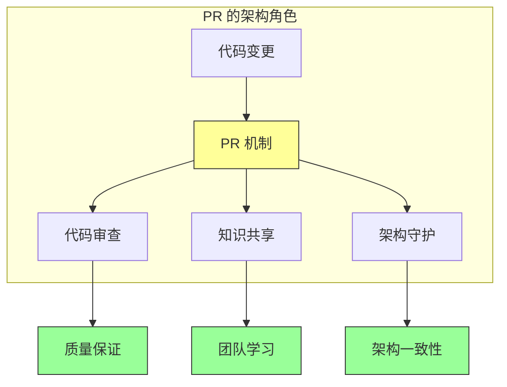
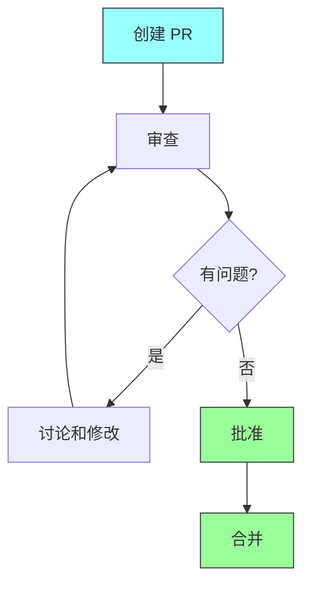

# 第一章：Pull Request 设计

## 一、Pull Request 的本质

### 1.1 什么是 Pull Request

Pull Request（PR）是现代软件开发中代码协作的核心机制。它不仅是一种代码合并的方式，更是一种促进团队协作、保证代码质量的知识交流工具。

在分布式版本控制系统中，PR 提供了一种优雅的方式来讨论、审查和合并代码变更。它将代码变更的讨论与代码本身紧密结合，使得代码演进的过程变得透明和可追溯。

PR 的核心价值体现在几个方面：**代码审查**确保代码质量，**知识共享**促进团队学习，**变更追踪**记录决策历史，**协作讨论**解决技术分歧。

### 1.2 PR 在架构中的角色

PR 不仅仅是一个技术工具，更是架构决策的执行机制：

**图解说明**：PR 在架构中扮演多重角色，从代码变更到架构守护。

### 1.3 PR 设计原则

好的 PR 设计应该遵循以下原则：

**小而专注**：每个 PR 只做一个有意义的变更。**自包含**：PR 应该可以独立测试和审查。**清晰的描述**：提供充分的上下文和说明。**可审查**：代码应该易于审查和理解。

## 二、PR 工作流设计

### 2.1 PR 的生命周期

PR 的完整生命周期包括以下阶段：

**创建**：开发者提交 PR 请求。**审查**：审查者审阅代码。**讨论**：针对问题进行讨论。**修改**：作者根据反馈修改。**批准**：审查者批准变更。**合并**：代码被合并到目标分支。

**图解说明**：PR 的生命周期流程，从创建到合并的完整过程。

### 2.2 PR 模板设计

使用 PR 模板可以提高 PR 的质量：

**变更描述**：说明这次变更的目的。**影响范围**：描述变更的影响。**测试说明**：描述如何测试变更。**相关问题**：链接到相关的问题或任务。

### 2.3 自动化与 PR

将自动化集成到 PR 工作流：

**CI 检查**：自动运行构建和测试。**代码质量**：自动运行静态分析。**变更验证**：验证变更的正确性。**合并检查**：检查是否可以安全合并。

## 三、大规模变更的 PR 策略

### 3.1 大规模变更的挑战

大规模变更在 PR 中面临特殊挑战：

**审查困难**：大量的代码难以全面审查。**合并复杂**：合并冲突的可能性增加。**测试耗时**：测试时间显著增长。**沟通低效**：讨论变得冗长和低效。

### 3.2 大规模变更的策略

处理大规模变更的策略：

**分解策略**：将大变更分解为小 PR。**分层审查**：先审查设计，再审查实现。**渐进合并**：分批次合并变更。**并行工作**：多人并行审查不同的部分。

### 3.3 代码所有者模式

对于大规模代码库，代码所有者模式可以帮助：

**明确责任**：每个文件有明确的所有者。**自动分配**：自动分配审查者。**分层审查**：不同层次的代码有不同的所有者。

## 四、PR 与架构一致性

### 4.1 PR 作为架构检查点

PR 是维护架构一致性的关键检查点：

**架构合规性**：检查变更是否符合架构决策。**设计审查**：审查变更的设计是否合理。**依赖检查**：检查变更对依赖的影响。**性能影响**：评估变更对性能的影响。

### 4.2 自动化架构检查

将架构检查集成到 PR 流程：

**架构规则检查**：检查代码是否符合架构规则。**依赖分析**：分析变更对依赖图的影响。**接口变更检查**：检查 API 变更的影响。**技术债务检查**：检查是否引入技术债务。

### 4.3 处理架构偏离

当 PR 违反架构原则时：

**识别偏离**：自动化工具识别架构偏离。**讨论和决策**：团队讨论如何处理。**记录决策**：记录决策和理由。**跟踪改进**：跟踪架构偏离的改进。

## 五、总结与启示

### 5.1 核心要点回顾

PR 是代码协作的核心机制。好的 PR 设计应该遵循小而专注、自包含的原则。大规模变更需要特殊的处理策略。PR 是维护架构一致性的关键检查点。

### 5.2 实践建议

- 使用 PR 模板提高 PR 质量
- 将自动化集成到 PR 工作流
- 对于大变更采用分解策略
- 利用 PR 作为架构守护机制

### 5.3 思考题

1. 你的团队的 PR 工作流是否高效？有哪些可以改进的地方？
2. 如何处理大规模变更的 PR？
3. 如何利用 PR 维护架构一致性？

---

*本章精读笔记完成*
