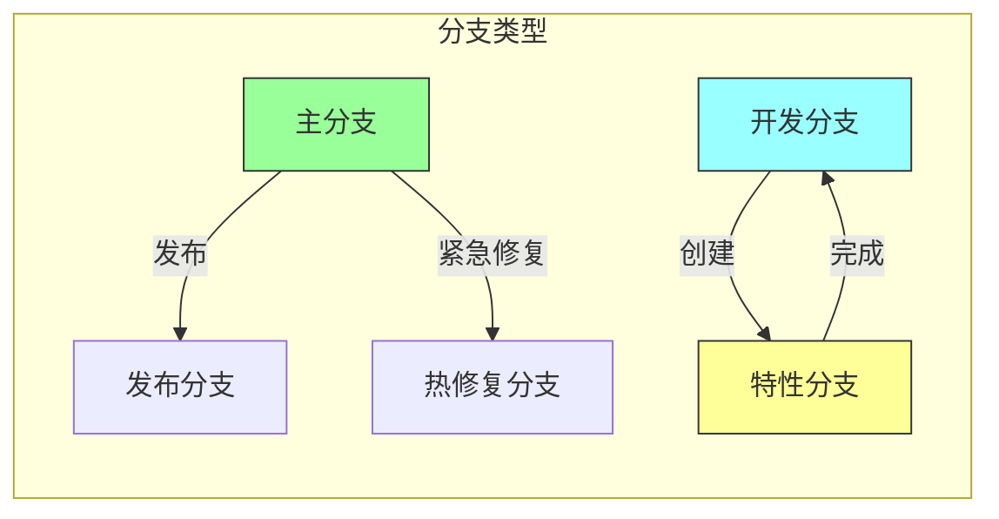
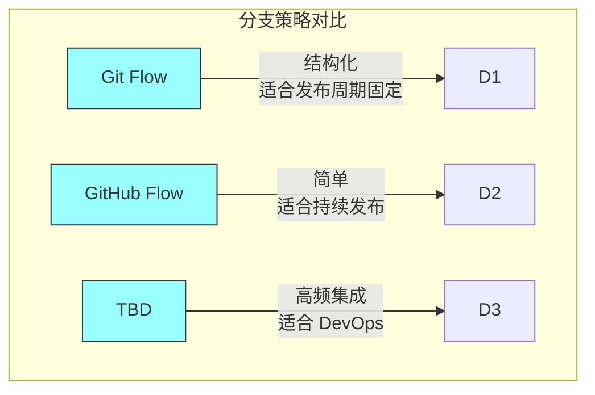

# 第二章：分支模式

## 一、分支策略概述

### 1.1 为什么需要分支

分支是版本控制的核心功能，它允许开发者在不影响主线的情况下进行开发工作。合理的分支策略对于团队协作和代码管理至关重要。

分支的核心价值体现在：**隔离开发**，让新功能开发与主线隔离；**并行开发**，支持多个功能并行开发；**发布管理**，支持不同版本的维护；**实验探索**，支持探索性开发的尝试。

### 1.2 分支的分类

常见的分支类型包括：

**主分支**：代表生产就绪的代码。**开发分支**：集成分支，用于开发工作。**特性分支**：为特定功能创建的临时分支。**发布分支**：为特定发布版本创建的分支。**热修复分支**：用于紧急修复生产问题的分支。

**图解说明**：不同类型分支之间的关系和生命周期。

### 1.3 分支策略的选择

选择分支策略需要考虑以下因素：

**团队规模**：小团队与大团队有不同的需求。**发布频率**：频繁发布与周期发布的区别。**协作模式**：代码审查的强度。**工具支持**：版本控制系统的能力。

## 二、常见分支策略

### 2.1 Git Flow

Git Flow 是一种结构化的分支策略：

**主分支**：master，保存生产版本。**开发分支**：develop，集成开发工作。**特性分支**：feature/*，新功能开发。**发布分支**：release/*，发布准备。**热修复分支**：hotfix/*，紧急修复。

### 2.2 GitHub Flow

GitHub Flow 是一种简化的分支策略：

**主分支**：main，始终保持可部署状态。**特性分支**：从 main 创建，完成后合并回 main。**Pull Request**：通过 PR 进行代码审查和讨论。

### 2.3 Trunk-Based Development

基于主干的开发（Trunk-Based Development）强调：

**频繁提交**：开发者频繁提交到主干。**短生命周期**：特性分支的生命周期很短。**特性开关**：使用特性开关控制功能发布。**持续集成**：代码始终保持集成状态。

**图解说明**：三种常见分支策略的对比。

## 三、分支命名规范

### 3.1 命名约定

好的分支命名约定应该：

**清晰表达**：名称应该表达分支的目的。**一致性**：所有团队成员遵循相同的约定。**可追溯**：能够追溯到相关的任务或需求。**可过滤**：支持按名称过滤分支。

### 3.2 命名模式

常见的分支命名模式：

**特性分支**：`feature/ticket-id-short-description`**修复分支**：`bugfix/ticket-id-short-description`**热修复分支**：`hotfix/short-description`**发布分支**：`release/version-number`

### 3.3 分支清理策略

定期清理过期分支：

**合并后清理**：特性分支合并后删除。**过期分支**：定期检查和删除过期分支。**自动化清理**：使用脚本自动化清理流程。

## 四、分支与架构

### 4.1 分支对架构的影响

分支策略对系统架构有重要影响：

**代码分离**：分支导致代码的物理分离。**集成成本**：分支生命周期越长，集成成本越高。**架构漂移**：长期分支可能导致架构偏离。**知识隔离**：分支隔离可能阻碍知识共享。

### 4.2 减少分支成本

降低分支成本的策略：

**短生命周期**：保持分支短生命周期。**频繁集成**：频繁将变更集成到主线。**自动化测试**：自动化测试减少集成风险。**架构支持**：架构设计支持增量变更。

### 4.3 分支策略与发布策略

分支策略与发布策略紧密相关：

**发布分支**：支持多版本并行维护。**特性开关**：通过开关控制功能发布。**蓝绿部署**：通过部署实现版本切换。**金丝雀发布**：通过流量控制管理发布。

## 五、总结与启示

### 5.1 核心要点回顾

分支策略需要根据团队和项目特点选择。常见的分支策略有 Git Flow、GitHub Flow 和 Trunk-Based Development。分支命名规范是团队协作的基础。分支策略与架构和发布策略紧密相关。

### 5.2 实践建议

- 选择适合团队的分支策略
- 保持分支短生命周期
- 建立分支命名规范
- 定期清理过期分支

### 5.3 思考题

1. 你的团队使用什么分支策略？为什么选择它？
2. 如何平衡分支隔离和集成成本？
3. 分支策略如何支持团队的发布节奏？

---

*本章精读笔记完成*
