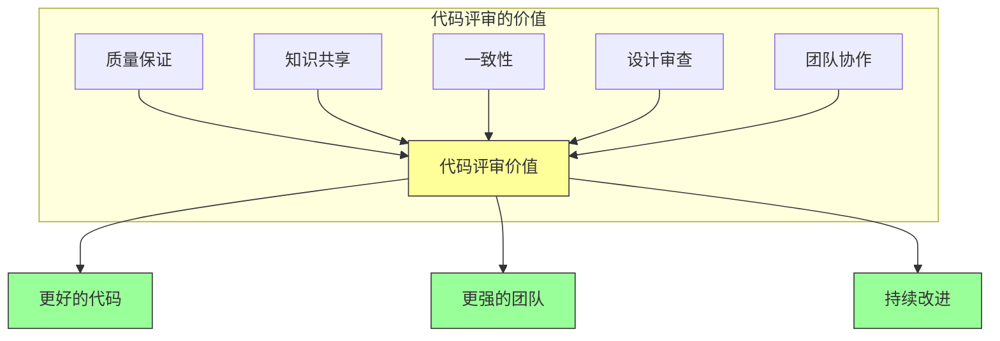

# 第三章：代码评审

## 一、代码评审的价值

### 1.1 代码评审的目的

代码评审是保证代码质量、促进知识共享的核心实践。它不仅是发现错误的手段，更是团队学习和成长的机会。

代码评审的核心价值：

**质量保证**：发现和修复代码中的问题。**知识共享**：在团队中传播知识和经验。**一致性**：确保代码符合团队标准。**设计审查**：审查代码设计的合理性。**团队协作**：促进团队成员之间的协作。

### 1.2 评审的类型

不同类型的代码评审：

**即时评审**：代码合并前的快速审查。**深度评审**：对重要变更的深入审查。**设计评审**：对架构设计的审查。**安全评审**：对安全相关变更的审查。

**图解说明**：代码评审的多重价值最终带来更好的代码和更强的团队。

### 1.3 评审的文化

代码评审文化的建设：

**尊重**：审查者和作者相互尊重。**开放**：欢迎不同意见的讨论。**学习**：将评审视为学习机会。**反馈**：提供建设性的反馈。

## 二、评审的最佳实践

### 2.1 作为审查者

作为审查者的最佳实践：

**及时响应**：尽快开始和完成审查。**全面审阅**：审查代码的所有方面。**明确反馈**：提供具体和明确的反馈。**区分优先级**：区分必须修改和建议改进。**解释原因**：说明为什么提出修改建议。

### 2.2 作为作者

作为作者的最佳实践：

**准备充分**：提交前自我检查代码。**描述清晰**：提供清晰的变更说明。**响应及时**：及时回应审查反馈。**解释背景**：帮助审查者理解上下文。**保持开放**：接受和认真考虑反馈。

### 2.3 评审的内容

代码评审应该关注：

**正确性**：代码是否正确解决问题。**设计**：代码设计是否合理。**可读性**：代码是否易于理解。**测试**：是否有充分的测试。**文档**：文档是否充分和准确。

## 三、大规模变更的评审

### 3.1 大规模变更的挑战

大规模变更的评审面临挑战：

**审查负担**：审查大量代码需要大量时间。**上下文丢失**：过多的变更难以追踪上下文。**讨论效率**：冗长的讨论降低效率。**合并冲突**：长期分支导致合并冲突。

### 3.2 大规模变更的策略

处理大规模变更的评审策略：

**分解变更**：将大变更分解为小 PR。**分层审查**：先审查设计，再审查实现。**渐进式审查**：分批次审查不同的部分。**并行审查**：多人并行审查不同的部分。

### 3.3 自动化辅助

利用自动化辅助大规模变更的评审：

**静态分析**：自动检查代码质量问题。**测试自动化**：自动运行测试验证正确性。**变更分析**：自动分析变更的影响范围。**风险评估**：自动评估变更的风险级别。

## 四、评审与架构

### 4.1 架构守护

代码评审是架构守护的重要机制：

**架构规则检查**：检查代码是否符合架构规则。**设计一致性**：确保设计的一致性。**依赖分析**：分析变更对依赖的影响。**技术债务**：识别和防止技术债务。

### 4.2 架构决策的评审

架构决策的评审需要特别关注：

**决策依据**：决策基于什么数据和推理。**权衡分析**：如何权衡不同的方案。**影响评估**：评估决策的影响范围。**替代方案**：为什么选择这个方案而不是其他。

### 4.3 架构评审委员会

对于重大架构决策，可能需要架构评审委员会：

**职责**：评审重大架构决策。**成员**：包括架构师和关键技术专家。**流程**：明确的评审流程和标准。**决策**：做出架构决策并记录理由。

## 五、总结与启示

### 5.1 核心要点回顾

代码评审是保证代码质量、促进知识共享的核心实践。好的评审需要审查者和作者的配合。大规模变更需要特殊的评审策略。评审是架构守护的重要机制。

### 5.2 实践建议

- 建立健康的评审文化
- 使用自动化辅助评审
- 对大规模变更采用分解策略
- 利用评审维护架构一致性

### 5.3 思考题

1. 你的团队如何进行代码评审？效果如何？
2. 如何提高评审的效率和质量？
3. 如何利用评审维护架构一致性？

---

*本章精读笔记完成*
