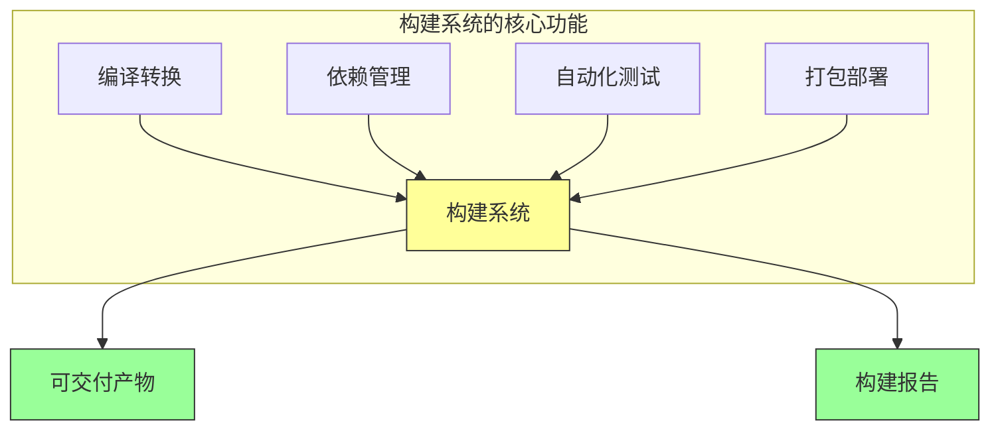
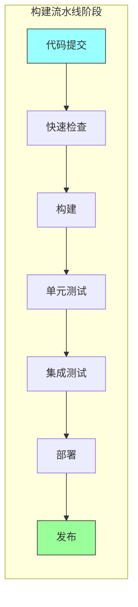

# 第四章：分支与构建

## 一、构建系统的角色

### 1.1 构建系统的定义

构建系统是将源代码转换为可执行程序的自动化工具。在现代软件开发中，构建系统不仅负责编译代码，还包括运行测试、打包部署、生成文档等任务。

构建系统的核心功能：

**编译转换**：将源代码转换为可执行代码。**依赖管理**：管理项目依赖的库和工具。**自动化测试**：自动运行测试验证代码。**打包部署**：生成可部署的包或镜像。**环境配置**：管理构建环境的一致性。

### 1.2 构建与分支的关系

构建系统与分支策略紧密相关：

**分支隔离**：每个分支有独立的构建。**变更验证**：分支变更触发自动构建。**构建缓存**：缓存构建结果加速构建。**构建合并**：合并前验证分支可以合并。

**图解说明**：构建系统的核心功能及其产出。

### 1.3 构建系统的演进

构建系统随着软件开发实践演进：

**Make**：最早的构建工具，基于时间戳。**Ant/Maven**：Java 世界的构建工具。**Gradle**：现代化的构建工具，支持增量构建。**Bazel**：大规模代码库的构建系统。**云构建**：云原生的构建服务。

## 二、构建流水线

### 2.1 流水线设计

构建流水线将构建过程分解为多个阶段：

**提交阶段**：代码提交触发的快速检查。**构建阶段**：编译和打包代码。**测试阶段**：运行各类测试。**部署阶段**：部署到目标环境。**发布阶段**：生成发布产物。

### 2.2 阶段优化

优化构建流水线的各个阶段：

**快速反馈**：把最快的检查放在前面。**并行执行**：独立的阶段并行执行。**按需执行**：根据变更类型决定执行哪些阶段。**缓存利用**：利用构建缓存避免重复工作。

**图解说明**：典型的构建流水线阶段，从提交到发布的完整流程。

### 2.3 流水线的工具

常用的构建流水线工具：

**Jenkins**：灵活的 CI/CD 平台。**GitHub Actions**：GitHub 的 CI/CD 解决方案。**GitLab CI**：GitLab 的 CI/CD 解决方案。**CircleCI**：云原生的 CI/CD 平台。**Bazel**：大规模代码库的构建系统。

## 三、分支构建策略

### 3.1 分支构建策略

针对不同分支采用不同的构建策略：

**主分支**：每次提交都运行完整构建。**特性分支**：运行基本检查和快速测试。**发布分支**：运行完整的测试和验收测试。**热修复分支**：运行紧急构建流程。

### 3.2 构建缓存策略

利用缓存加速构建：

**依赖缓存**：缓存下载的依赖。**构建缓存**：缓存编译结果。**测试缓存**：缓存测试结果。**Docker 缓存**：利用 Docker 层缓存。

### 3.3 构建失败处理

处理构建失败：

**快速反馈**：构建失败立即通知。**失败分析**：分析失败的原因。**自动回滚**：自动回滚有问题的构建。**修复优先**：构建失败优先于新功能开发。

## 四、构建与架构

### 4.1 架构对构建的影响

架构决策影响构建系统：

**模块化**：良好的模块化支持增量构建。**依赖管理**：清晰的依赖关系便于管理。**构建粒度**：组件的粒度影响构建效率。**技术栈**：技术栈的选择影响工具选择。

### 4.2 构建守护架构

构建系统可以守护架构：

**架构规则检查**：在构建中检查架构规则。**依赖检查**：检查依赖是否符合架构原则。**代码质量**：在构建中运行代码质量检查。**安全扫描**：在构建中运行安全扫描。

### 4.3 单体仓库 vs 多仓库

构建策略取决于代码库的组织：

**单体仓库**：依赖管理简单，构建复杂。**多仓库**：构建独立，但依赖管理复杂。**混合模式**：结合两者的优点。

## 五、构建性能优化

### 5.1 构建性能指标

衡量构建性能的指标：

**总构建时间**：从提交到产物的总时间。**增量构建时间**：增量变更的构建时间。**构建成功率**：构建成功的比例。**构建资源**：构建消耗的资源。

### 5.2 优化策略

优化构建性能的策略：

**并行构建**：利用多核 CPU 并行构建。**增量构建**：只构建改变的部分。**分布式构建**：将构建分布到多台机器。**缓存利用**：充分利用构建缓存。

### 5.3 持续优化

持续优化构建性能：

**监控和度量**：持续监控构建性能。**瓶颈分析**：分析构建瓶颈并优化。**自动化优化**：自动化重复的优化工作。**定期审查**：定期审查构建流程。

## 六、总结与启示

### 6.1 核心要点回顾

构建系统是软件交付的基础设施。构建流水线将构建过程分阶段管理。分支构建策略需要根据分支类型调整。构建系统可以守护架构一致性。

### 6.2 实践建议

- 建立高效的构建流水线
- 为不同分支设计不同的构建策略
- 利用缓存加速构建
- 利用构建守护架构一致性

### 6.3 思考题

1. 你的团队使用什么构建系统？构建性能如何？
2. 如何优化构建流水线的效率？
3. 如何利用构建系统守护架构一致性？

---

*本章精读笔记完成*
