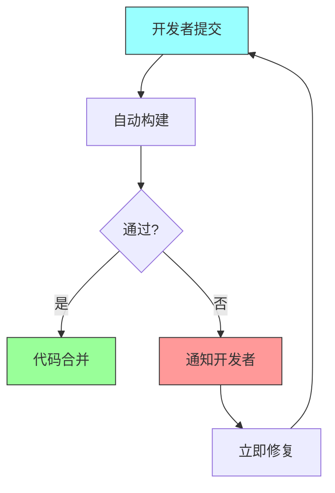
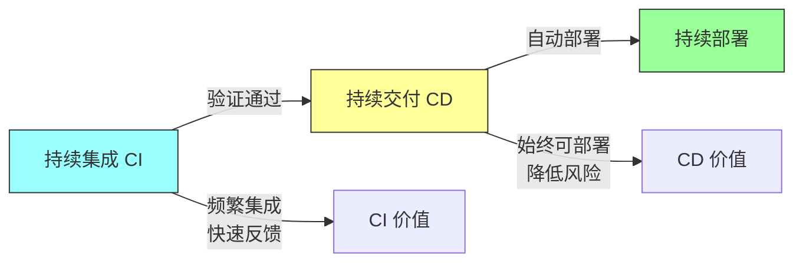

# 第五章：持续集成与持续交付

## 一、持续集成的原则

### 1.1 持续集成的定义

持续集成（CI）是开发者频繁将代码变更集成到共享仓库的实践。每次集成都通过自动化构建和测试验证，以便尽早发现集成问题。

持续集成的核心原则：

**频繁集成**：开发者每天至少集成一次代码。**自动化构建**：每次提交都触发自动化构建。**快速反馈**：构建和测试应该在几分钟内完成。**立即修复**：构建失败应该立即修复。

### 1.2 持续集成的价值

持续集成带来的价值：

**早发现 bug**：问题在引入后很快被发现。**减少集成痛苦**：频繁的小集成比偶尔的大集成容易。**增强信心**：开发者知道代码始终可用。**加速迭代**：快速反馈允许更快的开发节奏。

**图解说明**：持续集成的核心流程，每次提交都触发自动化验证。

### 1.3 持续集成的挑战

持续集成面临的挑战：

**构建速度**：构建时间影响集成频率。**测试稳定性**：不稳定的测试影响反馈。**大型代码库**：大规模代码库的构建挑战。**团队习惯**：改变团队习惯的困难。

## 二、持续交付

### 2.1 持续交付的定义

持续交付（CD）确保代码始终处于可部署状态。代码变更通过自动化测试后，可以随时部署到生产环境。

持续交付的要求：

**自动化测试**：完整的自动化测试覆盖。**部署自动化**：部署过程完全自动化。**环境一致性**：开发、测试、生产环境一致。**随时可部署**：代码库始终处于可部署状态。

### 2.2 持续部署

持续部署是持续交付的延伸，自动将通过测试的代码部署到生产环境。

**优势**：用户可以快速看到新功能。**风险**：需要非常完善的测试和监控。**适用**：对发布速度要求高的场景。

### 2.3 CI/CD 的关系

CI 和 CD 是相互补充的实践：

**CI**：关注代码变更的集成和验证。**CD**：关注代码的交付和部署。**结合**：CI/CD 共同构成现代化交付流程。

**图解说明**：CI、CD 和持续部署的关系和价值。

## 三、部署策略

### 3.1 蓝绿部署

蓝绿部署维护两套相同的生产环境：

**优点**：回滚快，环境完全对称。**缺点**：资源成本高，需要两套环境。

### 3.2 金丝雀发布

金丝雀发布将新版本逐步推广到用户：

**步骤**：新版本先发布 1%，然后逐步扩大。**监控**：每一步都监控指标。**回滚**：发现问题可以快速回滚。

### 3.3 滚动部署

滚动部署逐个替换生产实例：

**优点**：不需要额外资源。**缺点**：部署时间长，版本共存。

## 四、流水线设计

### 4.1 流水线架构

设计高效的 CI/CD 流水线：

**阶段划分**：构建、测试、部署阶段。**并行执行**：独立的作业并行执行。**按需执行**：根据变更类型决定执行哪些阶段。**快速反馈**：让反馈尽快到达开发者。

### 4.2 环境管理

管理不同环境的策略：

**环境一致性**：开发、测试、预发布、生产环境一致。**环境配置**：使用配置管理环境。**数据管理**：管理测试数据。**环境清理**：自动化环境清理。

### 4.3 部署自动化

实现部署自动化的方法：

**基础设施即代码**：使用代码管理基础设施。**脚本化部署**：编写可重复的部署脚本。**一键部署**：一键触发完整部署。**回滚自动化**：自动化回滚流程。

## 五、度量与改进

### 5.1 CI/CD 度量指标

衡量 CI/CD 效果的指标：

**部署频率**：多长时间部署一次。**变更前置时间**：从提交到部署的时间。**恢复时间**：故障后恢复的时间。**变更失败率**：部署导致故障的比例。

### 5.2 持续改进

持续改进 CI/CD 流程：

**定期回顾**：分析最近的部署和问题。**识别瓶颈**：找出流程中的瓶颈。**自动化改进**：自动化重复的优化工作。**工具更新**：保持工具和依赖更新。

### 5.3 最佳实践

CI/CD 的最佳实践：

**保持绿色**：主干始终保持可部署。**快速构建**：构建时间控制在几分钟内。**全面测试**：自动化测试覆盖关键路径。**监控部署**：部署后密切监控。

## 六、总结与启示

### 6.1 核心要点回顾

持续集成是频繁集成代码并自动验证的实践。持续交付确保代码始终可部署。渐进式发布策略降低发布风险。CI/CD 需要持续度量和改进。

### 6.2 实践建议

- 建立高效的 CI/CD 流水线
- 采用渐进式发布策略
- 度量 CI/CD 效果并持续改进
- 建立部署自动化的能力

### 6.3 思考题

1. 你的团队的 CI/CD 实践如何？部署频率和恢复时间是多少？
2. 你的团队使用什么发布策略？如何控制发布风险？
3. 如何度量 CI/CD 效果？有哪些改进空间？

---

*本章精读笔记完成*
