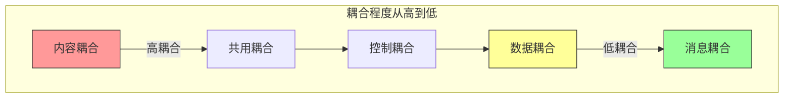
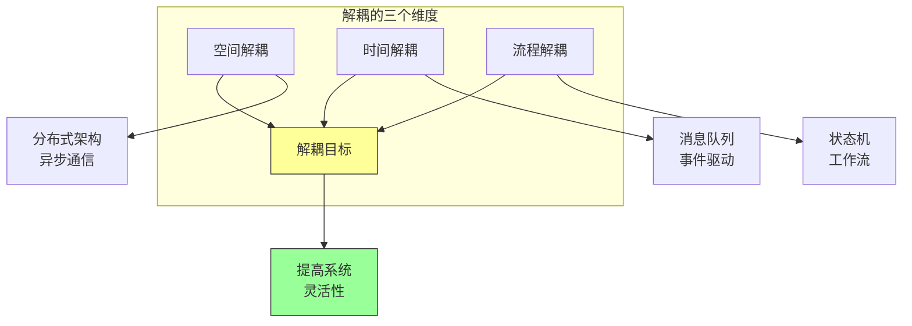

# 第六章：什么是解耦

## 一、解耦的本质

### 1.1 解耦的定义

解耦是减少系统组件之间依赖程度的过程。好的系统应该具有高内聚、低耦合的特性，使得每个组件可以独立开发、测试、部署和扩展。

解耦的核心目标是：**提高可维护性**，组件可以独立修改；**增强可测试性**，组件可以独立测试；**支持独立部署**，组件可以独立部署；**提升可扩展性**，组件可以独立扩展。

### 1.2 耦合的类型

系统中存在不同类型的耦合：

**内容耦合**：一个组件直接访问另一个组件的内部。**共用耦合**：多个组件共享相同的数据或资源。**控制耦合**：一个组件控制另一个组件的执行流程。**数据耦合**：组件之间传递数据进行通信。

**图解说明**：不同类型的耦合及其耦合程度。

### 1.3 解耦的收益

解耦带来的收益：

**并行开发**：团队可以并行工作。**故障隔离**：一个问题不会级联影响。**技术灵活性**：可以独立更新技术栈。**可扩展性**：可以根据需要扩展特定组件。

## 二、耦合的来源

### 2.1 代码级耦合

代码中的耦合来源：

**共享变量**：多个组件访问同一个变量。**直接调用**：组件之间直接方法调用。**继承关系**：类之间的继承耦合。**类型依赖**：代码依赖于特定类型。

### 2.2 数据级耦合

数据层面的耦合：

**共享数据库**：多个服务共享同一个数据库。**数据复制**：数据在多个地方复制。**数据格式**：组件之间共享特定的数据格式。**数据顺序**：组件之间有数据顺序依赖。

### 2.3 时间级耦合

时间相关的耦合：

**同步调用**：调用方必须等待被调用方返回。**时序依赖**：组件之间有时序依赖。**资源争用**：多个组件竞争同一个资源。**会话状态**：用户状态在组件间共享。

## 三、解耦的维度

### 3.1 空间解耦

空间解耦是消除组件之间的物理或逻辑邻近依赖：

**分布式架构**：组件可以部署在不同位置。**异步通信**：通过消息队列进行通信。**服务边界**：清晰定义服务边界。**接口抽象**：通过接口隔离实现。

### 3.2 时间解耦

时间解耦是消除组件之间的时间依赖：

**异步处理**：生产者不需要等待消费者。**消息队列**：使用队列缓冲消息。**缓存策略**：使用缓存减少实时依赖。**事件驱动**：通过事件进行通信。

### 3.3 流程解耦

流程解耦是消除组件之间的执行流程依赖：

**业务流程**：将业务流程分解为独立步骤。**状态机**：使用状态机管理状态转换。**工作流引擎**：使用工作流引擎编排流程。**补偿机制**：为每个步骤设计补偿操作。

**图解说明**：解耦的三个维度及其实现方式。

## 四、解耦的权衡

### 4.1 解耦的成本

解耦带来的成本：

**复杂性增加**：分布式系统带来复杂性。**一致性挑战**：最终一致性带来复杂性。**运维成本**：更多的部署和监控点。**性能开销**：通信开销和延迟。

### 4.2 解耦的边界

确定解耦的边界：

**业务边界**：根据业务能力划分边界。**变更频率**：将经常变更的部分解耦。**团队边界**：根据团队结构划分边界。**技术边界**：根据技术特性划分边界。

### 4.3 过度解耦的风险

过度解耦的问题：

**系统碎片**：系统变得过于碎片化。**调试困难**：问题难以追踪和调试。**性能下降**：过多的通信开销。**维护困难**：系统难以理解和维护。

## 五、总结与启示

### 5.1 核心要点回顾

解耦是减少组件之间依赖的过程。解耦有不同的类型和维度。解耦需要权衡成本和收益。过度解耦可能带来问题。

### 5.2 实践建议

- 根据业务需求确定解耦边界
- 从高耦合的领域开始解耦
- 避免过度解耦
- 持续评估解耦的效果

### 5.3 思考题

1. 你的系统中有哪些高耦合的地方？
2. 如何确定解耦的正确边界？
3. 解耦带来了哪些收益和成本？

---

*本章精读笔记完成*
