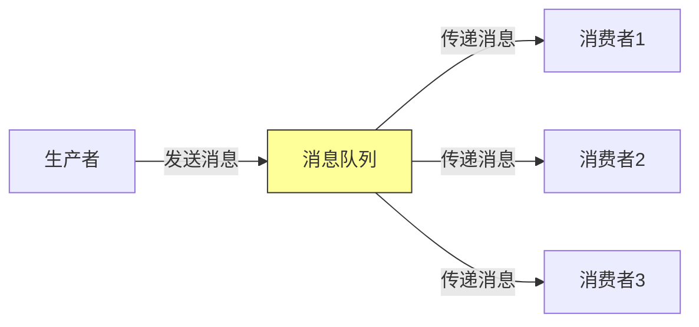
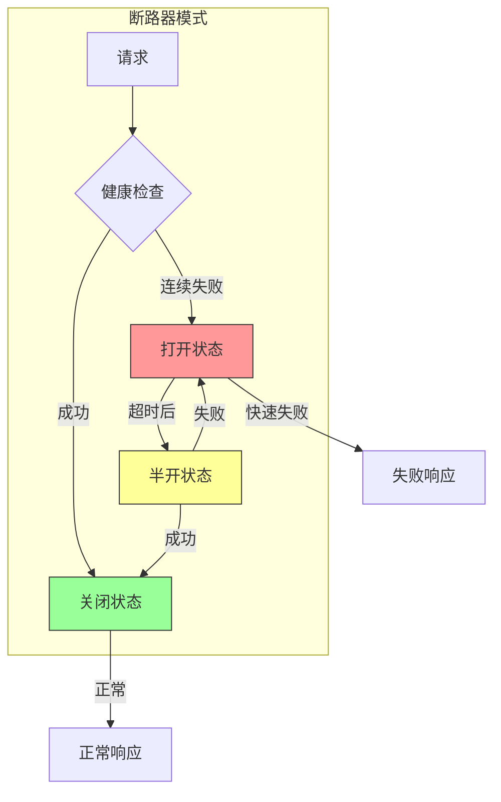

# 第七章：解耦模式

## 一、异步解耦模式

### 1.1 消息队列模式

消息队列是最常用的解耦模式之一：

**生产者**：发送消息到队列。**消息队列**：存储和传递消息。**消费者**：从队列接收消息处理。

这种模式实现了时间和空间的解耦：

**时间解耦**：生产者不需要等待消费者。**空间解耦**：生产者不知道消费者的存在。**负载均衡**：消息可以在消费者之间分配。

### 1.2 事件驱动模式

事件驱动模式通过事件的发布和订阅实现解耦：

**事件发布**：组件发布事件表示状态变化。**事件订阅**：组件订阅感兴趣的事件。**事件总线**：事件传递的中介。

**图解说明**：消息队列模式实现生产者和消费者的解耦。

### 1.3 发布订阅模式

发布订阅是事件驱动模式的扩展：

**主题**：事件按主题分类。**订阅者**：订阅特定主题的接收者。**发布者**：向主题发布事件的发送者。

## 二、服务解耦模式

### 2.1 断路器模式

断路器模式用于防止级联故障：

**关闭状态**：正常处理请求。**打开状态**：快速失败，拒绝请求。**半开状态**：尝试恢复请求。

当下游服务故障时，断路器打开，快速失败而不是等待超时，保护系统整体可用性。

### 2.2 限流模式

限流模式用于控制请求速率：

**令牌桶**：按固定速率添加令牌。**漏桶**：按固定速率处理请求。**滑动窗口**：基于滑动窗口的限流。

### 2.3 重试模式

重试模式用于处理瞬时故障：

**立即重试**：失败后立即重试。**指数退避**：每次重试间隔增加。**限制重试**：限制重试次数。**熔断重试**：重试失败后熔断。

**图解说明**：断路器模式的三种状态转换。

## 三、数据解耦模式

### 3.1 事件溯源模式

事件溯源通过事件序列来重建状态：

**事件存储**：存储所有状态变化事件。**事件重放**：通过重放事件重建状态。**快照**：定期创建状态快照加速重建。

### 3.2 CQRS 模式

命令查询职责分离（CQRS）分离读写操作：

**命令端**：处理状态变更操作。**查询端**：处理查询操作。**数据同步**：保持读写数据同步。

### 3.3 缓存模式

缓存模式用于解耦数据访问：

**旁路缓存**：先查缓存，缓存没有再查数据库。**写穿透**：同时写入缓存和数据库。**写回**：先写入缓存，异步写入数据库。

## 四、架构解耦模式

### 4.1 边界模式

通过定义清晰的边界来解耦：

**有界上下文**：DDD 中的边界概念。**服务边界**：微服务之间的边界。**模块边界**：代码模块之间的边界。

### 4.2 防腐层模式

防腐层（Anti-corruption Layer）隔离不同系统：

**适配器**：适配不同系统的接口。**翻译器**：翻译不同系统的数据格式。**隔离器**：隔离不同系统的变化。

### 4.3 守护进程模式

守护进程模式用于后台处理：

**后台任务**：独立于主应用的长时间运行任务。**任务队列**：管理待处理任务的队列。**工作进程**：处理任务的工作进程。

## 五、模式选择与组合

### 5.1 模式选择指南

选择解耦模式需要考虑：

**耦合类型**：代码耦合、数据耦合还是时间耦合。**性能要求**：延迟、吞吐量要求。**可靠性要求**：故障处理和恢复要求。**复杂度容忍**：团队对复杂度的容忍度。

### 5.2 模式组合

实际系统中通常需要组合多种模式：

**消息队列 + 断路器**：可靠的消息传递和故障处理。**缓存 + 限流**：高性能的数据访问和流量控制。**事件驱动 + CQRS**：灵活的状态管理和查询。

### 5.3 模式反模式

需要避免的解耦反模式：

**过度工程**：为不存在的需求设计解耦。**分散系统**：过度解耦导致系统碎片。**隐藏复杂性**：解耦带来的复杂性被隐藏。**不一致的策略**：不同部分使用不同的解耦策略。

## 六、总结与启示

### 6.1 核心要点回顾

有多种解耦模式可供选择。模式选择需要根据具体需求。实践中通常需要组合多种模式。需要避免过度解耦。

### 6.2 实践建议

- 从简单的解耦开始
- 根据需求选择合适的模式
- 组合多种模式解决复杂问题
- 持续评估解耦的效果

### 6.3 思考题

1. 你的系统使用了哪些解耦模式？
2. 如何选择合适的解耦模式？
3. 如何避免过度解耦？

---

*本章精读笔记完成*
