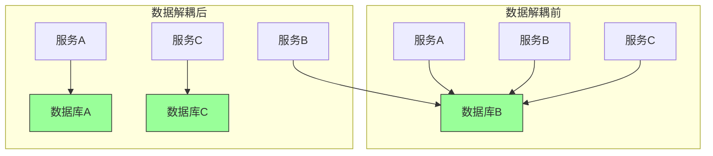

# 第八章：数据解耦

## 一、数据解耦的挑战

### 1.1 数据耦合的问题

数据层面的耦合是系统中最顽固的耦合类型：

**共享数据库**：多个服务直接访问同一个数据库。**数据复制**：数据在多个地方复制导致一致性问题。**数据Schema依赖**：服务之间共享Schema定义。**事务边界**：跨服务的事务管理困难。

数据耦合带来的问题：

**变更困难**：修改数据Schema影响多个服务。**扩展受限**：数据层成为扩展瓶颈。**故障传播**：数据层故障影响多个服务。**技术锁定**：难以更换数据技术。

### 1.2 数据解耦的目标

数据解耦的目标：

**服务自治**：每个服务管理自己的数据。**技术独立**：服务可以选择自己的数据技术。**边界清晰**：数据边界与服务边界一致。**一致性管理**：管理分布式数据一致性。

**图解说明**：数据解耦前后服务与数据的关系变化。

### 1.3 数据解耦的策略

数据解耦的主要策略：

**数据库每服务**：每个服务有自己的数据库。**事件驱动同步**：通过事件同步数据变化。**API 数据共享**：通过 API 访问其他服务的数据。**数据契约**：定义明确的数据契约。

## 二、数据所有权

### 2.1 所有权模式

明确数据的归属：

**单一所有者**：每个数据只有唯一的所有者服务。**读取权限**：其他服务可以读取但不能修改。**事件通知**：数据变更通过事件通知相关方。**数据版本**：支持数据的历史版本。

### 2.2 边界与聚合

在领域层面定义数据边界：

**聚合**：将相关数据分组为聚合。**聚合根**：聚合的访问入口点。**一致性边界**：聚合内部保持强一致性。**跨聚合引用**：通过 ID 引用其他聚合。

### 2.3 数据共享模式

处理跨服务数据共享：

**API 查询**：通过 API 查询其他服务的数据。**数据缓存**：缓存其他服务的数据。**事件订阅**：通过订阅事件获取数据变化。**数据复制**：复制其他服务的只读数据。

## 三、分布式数据管理

### 3.1 一致性模型

不同的数据一致性模型：

**强一致性**：所有副本立即一致。**最终一致性**：副本最终达到一致。**因果一致性**：相关操作保持因果顺序。**读己写一致性**：能看到自己的写入。

### 3.2 Saga 模式

Saga 模式管理分布式事务：

**补偿事务**：每个步骤有对应的补偿操作。**编排协调**：有协调者管理 Saga 执行。**事件驱动**：通过事件触发下一步骤。

### 3.3 分布式查询

处理跨服务的数据查询：

**API 聚合**：在应用层聚合多个 API 的结果。**查询服务**：专门的查询服务整合数据。**缓存视图**：维护预计算的查询视图。**事件溯源**：通过事件重建查询结果。

## 四、数据契约

### 4.1 数据契约定义

数据契约定义数据交换的规则：

**数据结构**：数据的 Schema 定义。**数据类型**：数据的类型和约束。**变更策略**：数据变更的版本管理。**兼容性**：向后兼容的变更规则。

### 4.2 契约管理

管理数据契约的变更：

**版本控制**：为数据契约使用版本。**兼容性检查**：检查契约变更的兼容性。**契约测试**：验证契约实现的正确性。**契约文档**：维护契约的文档。

### 4.3 契约实施

确保契约被遵守：

**契约测试**：在 CI 中运行契约测试。**消费者驱动测试**：消费者定义契约测试。**契约模拟**：模拟契约验证。**监控违反**：监控契约违反情况。

## 五、数据迁移与同步

### 5.1 数据迁移策略

解耦过程中的数据迁移：

**并行运行**：新旧系统并行运行。**双写**：同时写入新旧系统。**数据泵**：批量迁移历史数据。**验证迁移**：验证迁移数据的正确性。

### 5.2 数据同步机制

保持数据同步：

**变更数据捕获（CDC）**：捕获数据变更事件。**事件同步**：通过事件同步数据变化。**定时同步**：定时批量同步数据。**双向同步**：处理双向数据同步。

### 5.3 迁移风险

数据迁移的风险：

**数据丢失**：迁移过程中的数据丢失。**数据不一致**：迁移导致的数据不一致。**性能影响**：迁移对系统性能的影响。**回滚困难**：迁移失败后的回滚。

## 六、总结与启示

### 6.1 核心要点回顾

数据解耦是实现服务解耦的关键。明确数据所有权是数据解耦的基础。Saga 模式管理分布式事务。数据契约确保数据交换的一致性。

### 6.2 实践建议

- 从共享数据库开始解耦
- 明确每个服务的数据所有权
- 使用 Saga 模式管理分布式事务
- 建立数据契约管理机制

### 6.3 思考题

1. 你的系统中有哪些数据耦合问题？
2. 如何确定数据的所有权和边界？
3. 如何处理跨服务的数据查询？

---

*本章精读笔记完成*
