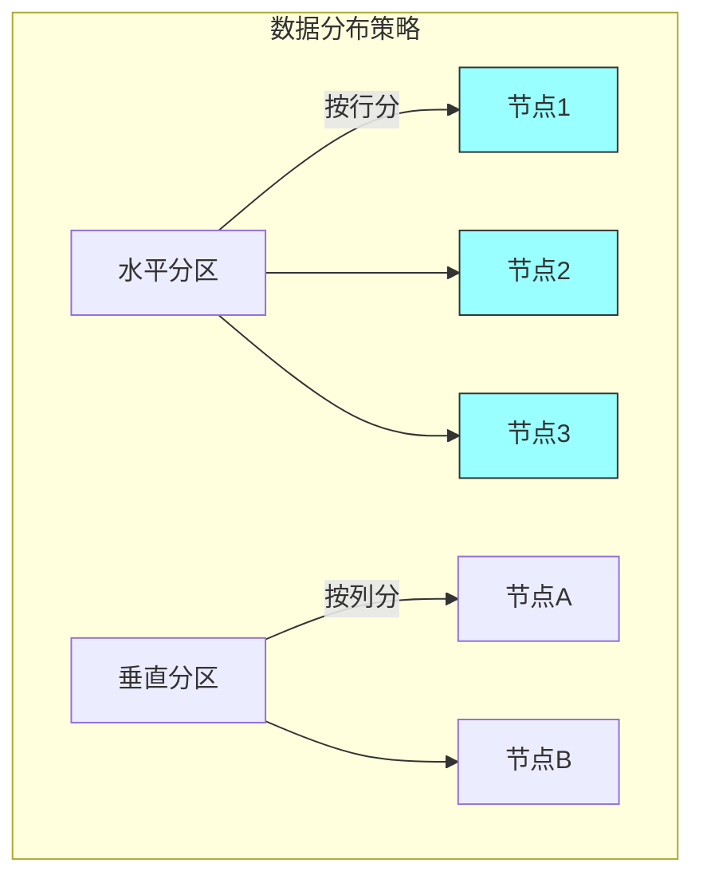
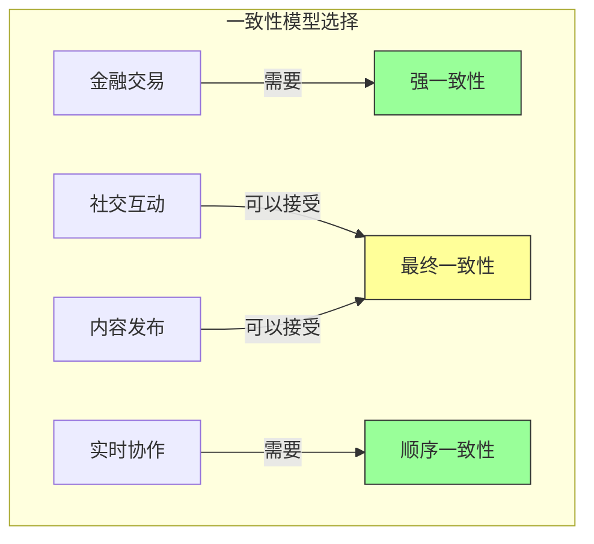

# 第九章：分布式数据

## 一、分布式数据的挑战

### 1.1 分布式数据的复杂性

分布式系统中的数据管理比单机系统复杂得多：

**数据分布**：数据分布在多个节点。**一致性维护**：保持数据的一致性。**分区管理**：处理数据的分区和复制。**故障处理**：处理节点故障和数据恢复。

分布式数据带来的挑战：

**CAP 定理**：一致性、可用性、分区容忍性的权衡。**延迟问题**：网络延迟影响数据访问。**并发控制**：分布式环境下的并发控制。**数据丢失**：节点故障可能导致数据丢失。

### 1.2 数据分布策略

数据分布的策略：

**水平分区**：按行将数据分布到不同节点。**垂直分区**：按列将数据分布到不同节点。**混合分区**：结合水平和垂直分区。**分片策略**：确定数据如何分片。

**图解说明**：水平分区和垂直分区的数据分布方式。

### 1.3 分区设计

设计分区策略需要考虑：

**查询模式**：系统的查询模式是什么。**数据大小**：每部分数据的大小。**增长预测**：数据增长的预测。**热点问题**：避免产生热点。

## 二、一致性与可用性

### 2.1 CAP 定理

CAP 定理指出分布式系统无法同时满足一致性、可用性和分区容忍性：

**一致性（C）**：所有节点看到相同的数据。**可用性（A）**：每个请求都能得到响应。**分区容忍（P）**：系统能够容忍网络分区。

实际系统通常在 CP（一致性优先）或 AP（可用性优先）之间选择。

### 2.2 一致性模型

不同的一致性模型：

**强一致性**：所有副本完全同步。**线性一致性**：所有操作按全局顺序执行。**顺序一致性**：操作按程序的顺序执行。**最终一致性**：副本最终达到一致。

### 2.3 选择一致性模型

根据业务需求选择一致性模型：

**金融交易**：需要强一致性。**社交互动**：可以接受最终一致性。**实时协作**：需要顺序一致性。**内容发布**：可以接受最终一致性。

**图解说明**：不同业务场景对一致性模型的选择。

## 三、分布式事务

### 3.1 两阶段提交

两阶段提交（2PC）是分布式事务的经典方案：

**准备阶段**：协调者询问参与者是否准备好。**提交阶段**：协调者决定提交或回滚。

2PC 的问题：**阻塞问题**：协调者故障会导致阻塞。**性能影响**：多次网络通信影响性能。

### 3.2 Saga 模式

Saga 模式使用补偿事务管理分布式事务：

**步骤**：每个步骤执行本地事务。**补偿**：每个步骤有对应的补偿操作。**协调**：编排器协调 Saga 执行。

### 3.3 事务模型选择

选择合适的分布式事务模型：

**业务需求**：业务对一致性的要求。**性能需求**：性能要求影响模型选择。**复杂度容忍**：团队对复杂度的容忍。**技术支持**：可用的技术框架。

## 四、数据复制

### 4.1 复制策略

数据复制的策略：

**主从复制**：一个主节点，多个从节点。**多主复制**：多个节点都可以接受写入。**无主复制**：没有固定的主节点。

### 4.2 复制延迟处理

处理复制延迟带来的问题：

**读自己的写**：保证能看到自己的写入。**读最新副本**：从最新副本读取。**延迟补偿**：补偿复制延迟的影响。**用户提示**：提示用户数据可能不完全最新。

### 4.3 冲突解决

处理多主复制中的冲突：

**最后写入胜**：最后写入的操作获胜。**向量时钟**：使用向量时钟检测冲突。**应用层解决**：在应用层解决冲突。**避免冲突**：通过设计避免冲突。

## 五、数据分片

### 5.1 分片策略

数据分片的策略：

**哈希分片**：使用哈希函数分配数据。**范围分片**：按数据范围分配数据。**目录分片**：使用目录查找数据位置。**地理位置**：按地理位置分配数据。

### 5.2 分片管理

管理分片的生命周期：

**分片平衡**：平衡各分片的数据量。**分片迁移**：在线迁移分片数据。**分片分裂**：当分片过大时分裂。**分片合并**：合并过小的分片。

### 5.3 分片查询

优化跨分片的查询：

**查询路由**：将查询路由到正确的分片。**并行查询**：并行查询多个分片。**结果合并**：合并多个分片的结果。**聚合计算**：在分片层进行聚合计算。

## 六、总结与启示

### 6.1 核心要点回顾

分布式数据管理面临一致性、可用性、分区的权衡。不同业务场景需要不同的数据分布和一致性策略。分布式事务可以使用 2PC 或 Saga 模式。数据复制和分片是分布式数据管理的关键技术。

### 6.2 实践建议

- 根据业务需求选择一致性模型
- 谨慎选择分布式事务方案
- 设计和监控数据复制
- 合理设计数据分片策略

### 6.3 思考题

1. 你的系统如何处理分布式数据管理？
2. 如何选择合适的一致性模型？
3. 如何处理分布式事务？

---

*本章精读笔记完成*
