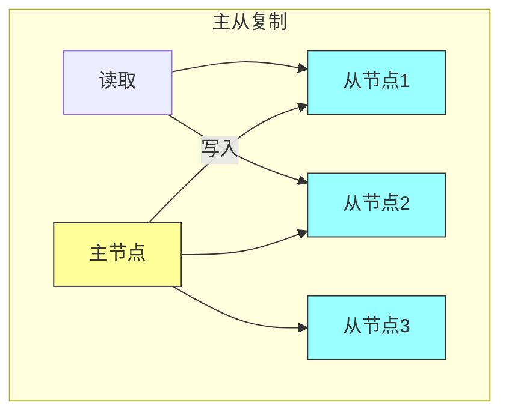
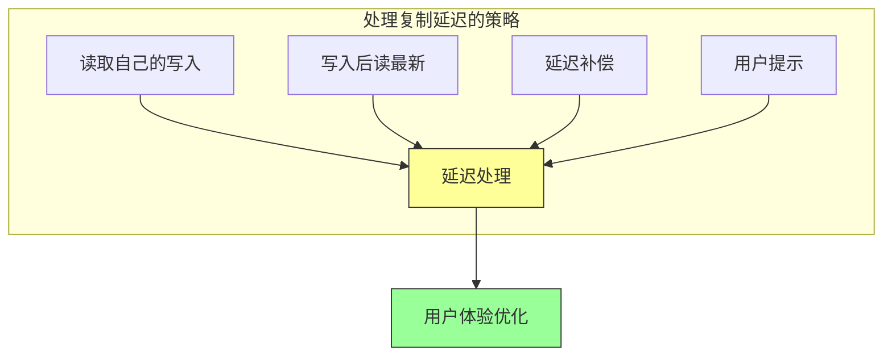

# 第十章：数据复制

## 一、数据复制的概念

### 1.1 为什么需要数据复制

数据复制是分布式系统的核心机制：

**可用性**：提高系统的可用性。**性能**：提高读取性能。**容灾**：防止数据丢失。**地理分布**：在地理上分布数据。

### 1.2 复制模式

常见的数据复制模式：

**主从复制**：一个主节点，多个从节点。**多主复制**：多个节点都可以接受写入。**无主复制**：没有固定的主节点。**链式复制**：节点形成复制链。

**图解说明**：主从复制模式，主节点处理写入，从节点处理读取。

### 1.3 复制拓扑

不同的复制拓扑结构：

**星型拓扑**：一个中心节点连接多个节点。**链式拓扑**：节点形成链状结构。**树状拓扑**：节点形成树状结构。**全连接拓扑**：每个节点都连接其他节点。

## 二、复制机制

### 2.1 同步复制

同步复制确保数据一致性的方式：

**写入确认**：写入操作需要所有副本确认。**强一致性**：所有副本数据完全一致。**延迟问题**：写入延迟受最慢的副本影响。

### 2.2 异步复制

异步复制提高性能的方式：

**快速返回**：写入操作快速返回。**最终一致**：副本最终达到一致。**数据丢失风险**：主节点故障可能丢失数据。

### 2.3 半同步复制

半同步复制是同步和异步的折中：

**多数确认**：写入需要多数副本确认。**平衡性能**：在一致性和性能之间平衡。**容错能力**：可以容忍部分节点故障。

## 三、复制延迟

### 3.1 延迟的原因

复制延迟产生的原因：

**网络延迟**：节点之间的网络延迟。**处理时间**：副本处理写入的时间。**负载压力**：高负载下的处理延迟。**地理距离**：跨地域复制的距离延迟。

### 3.2 延迟的影响

复制延迟对应用的影响：

**读取不一致**：读取可能读到过期的数据。**写入可见性**：写入可能需要时间才可见。**事务隔离**：事务隔离可能受影响。**用户体验**：用户可能看到不一致的数据。

### 3.3 延迟处理策略

处理复制延迟的策略：

**读取自己的写入**：保证用户能看到自己的写入。**写入后读最新**：写入后从主节点读取。**延迟补偿**：在应用层补偿延迟影响。**用户提示**：向用户提示数据可能不完全最新。

**图解说明**：处理复制延迟的多种策略。

## 四、冲突处理

### 4.1 冲突的产生

在多主复制中可能产生冲突：

**并发写入**：多个节点同时写入相同数据。**网络分区**：网络分区导致的写入冲突。**时钟差异**：节点时钟差异导致的冲突。**业务冲突**：业务层面的冲突。

### 4.2 冲突检测

检测复制冲突的方法：

**版本向量**：使用版本向量检测冲突。**时间戳比较**：使用时间戳比较写入顺序。**哈希检测**：使用哈希检测数据差异。**应用层检测**：在应用层检测业务冲突。

### 4.3 冲突解决

解决复制冲突的方法：

**最后写入胜**：最后写入的操作获胜。**应用层解决**：在应用层解决冲突。**合并策略**：自动合并冲突的数据。**冲突避免**：通过设计避免冲突。

## 五、复制监控

### 5.1 监控指标

监控数据复制的指标：

**复制延迟**：主从之间的延迟。**复制吞吐量**：复制的吞吐量。**复制状态**：复制的健康状态。**冲突数量**：冲突发生的频率。

### 5.2 告警策略

设置合理的告警：

**延迟阈值**：设置延迟告警阈值。**状态变化**：复制状态变化时告警。**冲突告警**：冲突频率异常时告警。**性能告警**：复制性能下降时告警。

### 5.3 容量规划

基于复制进行容量规划：

**副本数量**：确定合适的副本数量。**存储容量**：规划存储容量。**网络带宽**：规划网络带宽。**性能余量**：预留性能余量。

## 六、总结与启示

### 6.1 核心要点回顾

数据复制是分布式系统的核心机制。复制模式包括主从复制、多主复制和无主复制。复制延迟需要特殊处理。多主复制需要处理冲突。

### 6.2 实践建议

- 根据需求选择复制模式
- 监控复制延迟和健康状态
- 设计冲突处理策略
- 基于复制进行容量规划

### 6.3 思考题

1. 你的系统使用什么复制模式？如何处理复制延迟？
2. 如何检测和解决复制冲突？
3. 如何监控数据复制？

---

*本章精读笔记完成*
