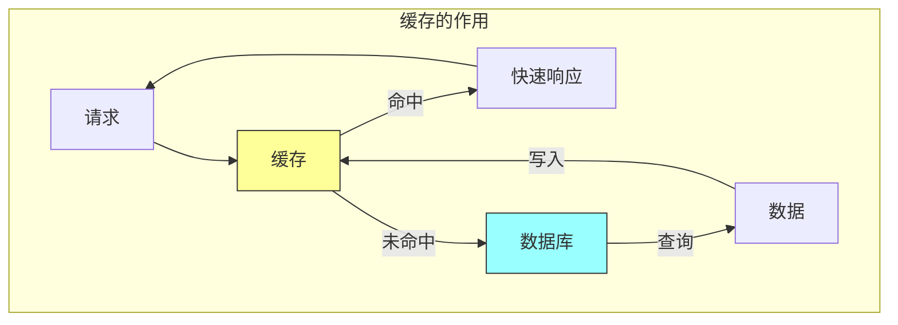
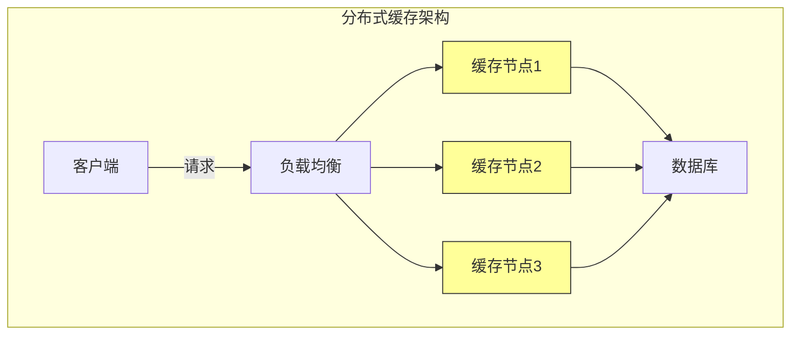

# 第十一章：数据缓存

## 一、缓存的原理

### 1.1 缓存的本质

缓存是存储数据的临时副本，以加快数据访问速度：

**时间局部性**：最近访问的数据可能再次访问。**空间局部性**：访问的数据附近的数据可能被访问。**成本差异**：不同存储介质的访问成本不同。**一致性缓存**：缓存是主数据源的副本。

### 1.2 缓存的收益

使用缓存带来的收益：

**降低延迟**：减少数据访问时间。**提高吞吐量**：提高系统的处理能力。**降低负载**：减少后端系统的负载。**降低成本**：减少昂贵的存储使用。

### 1.3 缓存的挑战

使用缓存面临的挑战：

**一致性**：缓存与主数据源的一致性。**容量管理**：缓存空间的有限性。**失效策略**：缓存失效的策略选择。**复杂度**：增加系统的复杂度。

**图解说明**：缓存的工作流程，命中缓存快速响应，未命中则查询数据库。

## 二、缓存策略

### 2.1 缓存位置

不同层级的缓存：

**客户端缓存**：浏览器或应用的本地缓存。**CDN 缓存**：内容分发网络的边缘缓存。**应用缓存**：应用服务器上的缓存。**数据库缓存**：数据库内置的缓存。**分布式缓存**：独立的分布式缓存系统。

### 2.2 缓存模式

不同的缓存模式：

**旁路缓存（Cache-Aside）**：先查缓存，未命中查数据库并写入缓存。**读穿透（Read-Through）**：读取时自动从数据源加载到缓存。**写穿透（Write-Through）**：写入时同时写入缓存和数据库。**写回（Write-Behind）**：写入先到缓存，异步写入数据库。

### 2.3 失效策略

缓存失效的策略：

**TTL（Time-To-Live）**：设置缓存的有效时间。**LRU（Least Recently Used）**：最近最少使用的先淘汰。**LFU（Least Frequently Used）**：使用频率最低的先淘汰。**主动失效**：数据变更时主动失效缓存。

## 三、一致性管理

### 3.1 一致性挑战

缓存带来的数据一致性问题：

**缓存过期**：缓存数据可能过期。**并发更新**：并发更新导致的数据不一致。**多副本**：缓存多副本的一致性问题。**失效延迟**：失效通知的延迟。

### 3.2 一致性策略

维护缓存一致性的策略：

**读写策略**：选择合适的读写策略。**失效机制**：设计有效的失效机制。**版本控制**：使用版本号检测变化。**事件驱动**：使用事件保持同步。

### 3.3 分布式缓存

分布式缓存的特殊考虑：

**数据分片**：缓存数据的分片策略。**副本管理**：缓存副本的一致性。**故障处理**：节点故障的处理。**一致性哈希**：使用一致性哈希减少迁移。

**图解说明**：分布式缓存的架构，多个缓存节点提供缓存服务。

## 四、缓存设计

### 4.1 缓存键设计

设计有效的缓存键：

**唯一性**：键能唯一标识数据。**可读性**：键有一定的可读性。**简短性**：键不要太长。**一致性**：键的格式保持一致。

### 4.2 缓存值设计

设计缓存值的考虑：

**序列化**：选择合适的序列化方式。**压缩**：考虑是否需要压缩。**结构**：选择合适的存储结构。**过期**：设置合理的过期时间。

### 4.3 缓存分层

设计多级缓存：

**本地缓存**：第一级，访问最快。**分布式缓存**：第二级，容量大。**数据库缓存**：第三级，数据库内置缓存。

## 五、缓存最佳实践

### 5.1 缓存使用场景

适合使用缓存的场景：

**频繁读取**：读取频率远高于写入的数据。**计算昂贵**：计算成本远高于缓存成本。**变化有限**：数据变化频率有限。**容忍延迟**：应用可以容忍一定的延迟。

### 5.2 缓存问题处理

处理常见的缓存问题：

**缓存穿透**：查询不存在的数据。**缓存击穿**：热点数据过期时的并发查询。**缓存雪崩**：大量缓存同时失效。**缓存抖动**：缓存频繁失效和重建。

### 5.3 缓存监控

监控缓存的运行状态：

**命中率**：缓存的命中率。**延迟**：缓存的访问延迟。**内存使用**：缓存的内存使用。**错误率**：缓存的错误率。

## 六、总结与启示

### 6.1 核心要点回顾

缓存是提高系统性能的重要手段。不同的缓存模式和失效策略适用于不同的场景。缓存带来一致性的挑战。一致性哈希是分布式缓存的关键技术。

### 6.2 实践建议

- 根据访问模式选择缓存策略
- 设计有效的失效机制
- 监控缓存的健康状态
- 预防和处理缓存问题

### 6.3 思考题

1. 你的系统如何使用缓存？缓存命中率如何？
2. 如何处理缓存一致性问题？
3. 如何设计缓存的失效策略？

---

*本章精读笔记完成*
