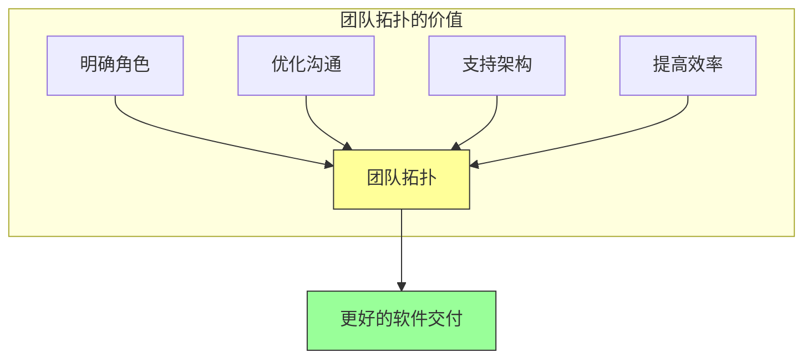

# 第十二章：团队拓扑

## 一、团队结构的重要性

### 1.1 团队与架构的关系

团队结构与系统架构之间存在密切的关系。根据康威定律，组织的沟通结构会影响系统的设计结构。

**康威定律**：设计系统的组织会产生与其沟通结构相同的设计。

这意味着：

- 大的单体团队倾向于构建单体系统
- 分布式的团队倾向于构建分布式的系统
- 团队的边界会影响系统的边界

### 1.2 团队拓扑的价值

团队拓扑帮助组织设计适合现代软件开发的团队结构：

**明确角色**：定义不同团队的职责和角色。**优化沟通**：优化团队之间的沟通模式。**支持架构**：设计支持目标架构的团队结构。**提高效率**：提高团队的自治和效率。

**图解说明**：团队拓扑的价值维度，最终带来更好的软件交付。

### 1.3 团队设计的原则

设计高效团队的原则：

**自治性**：团队应该有足够的自治权。**目标清晰**：每个团队有清晰的目标。**边界明确**：团队之间的边界明确。**能力完整**：团队有完整的交付能力。

## 二、团队类型

### 2.1 流线型团队

流线型团队（Stream-Aligned Team）是面向业务流的团队：

**职责**：负责一个业务流或产品领域。**自主性**：有足够的自主权完成交付。**端到端**：对业务流的全生命周期负责。**跨职能**：包含交付所需的各类角色。

### 2.2 赋能团队

赋能团队（Enabling Team）为其他团队提供支持和工具：

**工具开发**：开发工具和平台。**最佳实践**：传播最佳实践。**技术咨询**：提供技术咨询。**能力建设**：帮助团队提升能力。

### 2.3 平台团队

平台团队（Platform Team）提供内部平台服务：

**平台服务**：提供开发、部署、运维等平台。**自服务**：支持其他团队的自助使用。**抽象复杂性**：抽象底层复杂性。**标准化**：推动标准化和一致性。

### 2.4 协作模式

不同团队之间的协作模式：

**协作**：团队之间紧密合作。**X-as-a-Service**：一个团队为另一个团队提供服务。**促进**：赋能团队促进其他团队的能力提升。

## 三、团队边界与架构

### 3.1 边界设计

设计团队边界需要考虑：

**业务边界**：按业务能力划分边界。**技术边界**：按技术领域划分边界。**变更频率**：将经常变更的部分放在一起。**稳定接口**：保持接口稳定。

### 3.2 沟通模式

团队之间的沟通模式：

**同步沟通**：实时讨论和决策。**异步沟通**：通过文档和消息沟通。**接口沟通**：通过 API 或服务接口沟通。**事件沟通**：通过事件进行通信。

### 3.3 自治与协调

平衡团队自治和整体协调：

**自治权**：给予团队足够的自治权。**协调机制**：建立有效的协调机制。**标准制定**：制定团队需要遵守的标准。**依赖管理**：管理团队之间的依赖。

## 四、规模化团队

### 4.1 大规模团队的挑战

大规模团队面临的挑战：

**沟通成本**：沟通成本随人数增加。**协调难度**：协调多个团队的难度增加。**一致性**：保持一致性的难度增加。**文化维护**：维护团队文化的难度增加。

### 4.2 规模化策略

应对规模化挑战的策略：

**分层结构**：建立分层的团队结构。**自治边界**：明确团队的自治边界。**协调机制**：建立有效的协调机制。**工具支持**：使用工具支持分布式协作。

### 4.3 分布式团队

分布式团队的特殊考虑：

**时区差异**：处理不同时区的工作协调。**文化差异**：处理不同地区的文化差异。**沟通工具**：使用高效的远程沟通工具。**信任建立**：建立远程团队的信任。

## 五、总结与启示

### 5.1 核心要点回顾

团队结构影响系统架构。团队拓扑定义了不同类型的团队及其协作模式。团队边界的设计需要考虑业务和技术因素。大规模团队需要特殊的策略。

### 5.2 实践建议

- 根据业务需求设计团队结构
- 明确团队的职责和边界
- 建立有效的团队协作机制
- 支持团队的自治和效率

### 5.3 思考题

1. 你的团队结构如何？是否符合业务需求？
2. 如何设计团队的边界和职责？
3. 如何支持大规模分布式团队？

---

*本章精读笔记完成*
