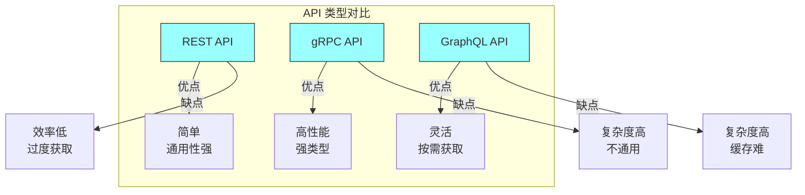

# 第十三章：API 设计

## 一、API 的重要性

### 1.1 API 的角色

API（应用程序接口）是系统之间交互的契约：

**集成点**：API 是系统集成的关键点。**抽象层**：API 隐藏实现细节。**契约**：API 是服务提供者和使用者的契约。**演进基础**：API 是系统演进的基础。

好的 API 设计对系统的成功至关重要：

**易用性**：易于理解和使用。**稳定性**：保持向后兼容。**安全性**：保护系统免受恶意使用。**可演进**：支持系统的持续演进。

### 1.2 API 的类型

不同类型的 API：

**REST API**：基于 HTTP 的资源 API。**gRPC API**：基于 Protocol Buffers 的高性能 API。**GraphQL API**：声明式的查询 API。**消息 API**：基于消息的异步 API。

**图解说明**：三种主要 API 类型的优缺点对比。

### 1.3 API 设计原则

好的 API 设计遵循以下原则：

**一致性**：API 的风格和模式一致。**简洁性**：API 简单易用。**可发现性**：API 易于探索和使用。**向后兼容**：保持向后兼容。**文档完善**：有完善的文档。

## 二、REST API 设计

### 2.1 资源设计

REST API 的核心是资源设计：

**资源命名**：使用名词命名资源。**层次结构**：使用 URI 表示资源的层次。**标准化路径**：使用标准化的路径格式。**过滤和分页**：支持数据的过滤和分页。

### 2.2 HTTP 方法

正确使用 HTTP 方法：

**GET**：获取资源。**POST**：创建资源。**PUT**：完全更新资源。**PATCH**：部分更新资源。**DELETE**：删除资源。

### 2.3 响应设计

设计 API 响应：

**状态码**：使用正确的 HTTP 状态码。**错误处理**：提供有意义的错误信息。**数据格式**：选择合适的数据格式。**超媒体**：使用 HATEOAS 提供导航。

## 三、API 版本管理

### 3.1 版本策略

API 版本管理的策略：

**URI 版本**：在 URI 中包含版本号。**Header 版本**：在 HTTP Header 中传递版本。**媒体类型**：通过 Accept Header 指定版本。**默认版本**：提供默认版本支持。

### 3.2 兼容性

保持 API 的向后兼容性：

**添加字段**：可以添加新字段。**删除字段**：不能删除现有字段。**修改字段**：谨慎修改字段含义。**变更通知**：提前通知破坏性变更。

### 3.3 废弃策略

处理 API 的废弃：

**标记废弃**：明确标记废弃的 API。**提供替代**：提供替代的 API。**设置期限**：设置使用期限。**监控使用**：监控废弃 API 的使用情况。

## 四、API 安全

### 4.1 认证

API 认证的方式：

**API Key**：使用 API 密钥认证。**OAuth 2.0**：使用 OAuth 2.0 授权。**JWT**：使用 JWT 令牌认证。**mTLS**：使用双向 TLS 认证。

### 4.2 授权

API 授权的方式：

**角色授权**：基于角色的访问控制。**资源授权**：基于资源的访问控制。**属性授权**：基于属性的访问控制。**细粒度控制**：提供细粒度的权限控制。

### 4.3 速率限制

控制 API 的使用速率：

**全局限制**：设置全局的请求限制。**用户限制**：按用户设置限制。**端点限制**：按端点设置限制。**配额管理**：管理用户的配额。

## 五、API 文档与测试

### 5.1 API 文档

API 文档的内容：

**概述**：API 的总体介绍。**认证**：认证方式的说明。**端点**：每个端点的详细说明。**示例**：请求和响应的示例。**错误**：错误代码和处理。

### 5.2 API 测试

API 测试的类型：

**单元测试**：测试单个端点。**集成测试**：测试端点的集成。**契约测试**：测试 API 契约。**性能测试**：测试 API 的性能。**安全测试**：测试 API 的安全性。

### 5.3 API 模拟

使用 API 模拟进行开发：

**Mock 服务**：提供 API 的 Mock 服务。**契约测试**：使用契约测试验证实现。**消费者驱动**：消费者驱动契约测试。

## 六、总结与启示

### 6.1 核心要点回顾

API 是系统集成的关键点。好的 API 设计需要遵循一致性、简洁性、可发现性等原则。API 版本管理保持向后兼容。API 安全需要认证、授权和速率限制。

### 6.2 实践建议

- 为 API 设计制定规范和标准
- 使用自动化工具生成和测试 API 文档
- 建立 API 版本管理策略
- 重视 API 安全

### 6.3 思考题

1. 你的团队如何设计 API？有哪些最佳实践？
2. 如何管理 API 的版本和兼容性？
3. 如何确保 API 的安全性？

---

*本章精读笔记完成*
