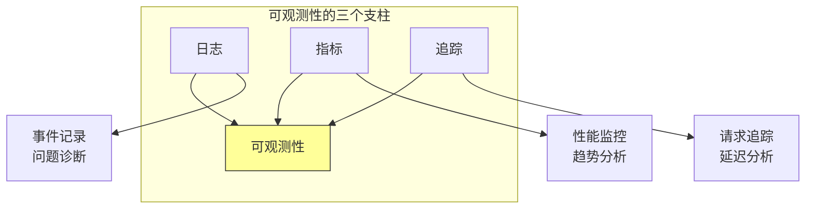
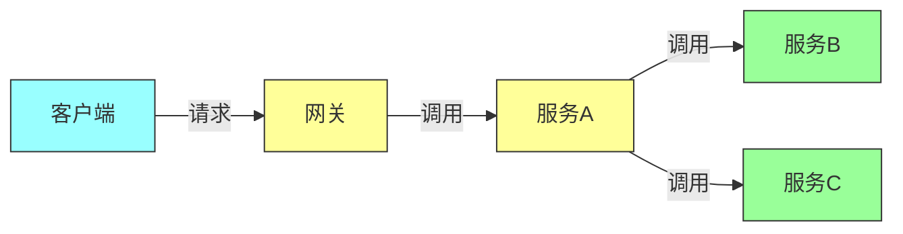

# 第十四章：可观测性架构

## 一、可观测性的定义

### 1.1 什么是可观测性

可观测性是系统能够被外部观察和理解的程度：

**输出**：系统输出的可观测数据。**内部状态**：从外部推断系统内部状态。**问题诊断**：诊断系统问题的能力。**洞察**：获得系统运行洞察的能力。

可观测性的三个支柱：

**日志（Logs）**：记录系统的事件。**指标（Metrics）**：收集系统的度量数据。**追踪（Traces）**：跟踪请求的完整路径。

**图解说明**：可观测性的三个支柱及其作用。

### 1.2 可观测性的价值

可观测性带来的价值：

**快速诊断**：快速定位和诊断问题。**性能优化**：发现性能瓶颈和优化机会。**容量规划**：支持容量规划和预测。**用户洞察**：了解用户使用模式。**业务洞察**：获得业务运营的洞察。

### 1.3 可观测性与监控

可观测性与传统监控的区别：

**监控**：预先定义的指标和告警。**可观测性**：从数据中发现未知问题。**被动 vs 主动**：监控是被动的，可观测性是主动的。**已知 vs 未知**：监控已知问题，可观测性发现未知问题。

## 二、日志架构

### 2.1 日志设计

设计有效的日志系统：

**结构化日志**：使用结构化的日志格式。**上下文丰富**：包含足够的上下文信息。**级别明确**：使用明确的日志级别。**采样策略**：对高频日志使用采样。

### 2.2 日志管理

管理日志的流程：

**日志收集**：收集各服务的日志。**日志传输**：高效传输日志数据。**日志存储**：存储和索引日志。**日志分析**：分析和查询日志。

### 2.3 日志最佳实践

日志的最佳实践：

**敏感信息**：不要记录敏感信息。**性能影响**：最小化日志对性能的影响。**可搜索**：确保日志可搜索。**保留策略**：制定日志保留策略。

## 三、指标架构

### 3.1 指标类型

不同类型的指标：

**计数器（Counter）**：单调递增的值。**仪表盘（Gauge）**：当前值。**直方图（Histogram）**：值的分布。**摘要（Summary）**：客户端计算的分布。

### 3.2 指标设计

设计有效的指标：

**业务指标**：与业务相关的指标。**技术指标**：与系统性能相关的指标。**服务级别指标**：SLO 相关的指标。**关键指标**：关键的少数指标。

### 3.3 指标系统

构建指标系统：

**指标收集**：从各服务收集指标。**指标存储**：存储和聚合指标。**指标查询**：查询和可视化指标。**告警规则**：设置指标告警规则。

## 四、分布式追踪

### 4.1 追踪的概念

分布式追踪的概念：

**Span**：追踪中的一个操作单元。**Trace**：一个请求的完整追踪。**上下文传播**：追踪上下文的传播。**采样策略**：对追踪进行采样。

### 4.2 追踪数据

追踪数据的内容：

**Span ID**：Span 的唯一标识。**Trace ID**：Trace 的唯一标识。**时间戳**：操作的时间戳。**父子关系**：Span 之间的父子关系。**事件**：Span 中的事件。

**图解说明**：分布式追踪展示请求在多个服务间的调用路径。

### 4.3 追踪工具

常用的分布式追踪工具：

**Jaeger**：开源的分布式追踪系统。**Zipkin**：开源的分布式追踪系统。**OpenTelemetry**：可观测性框架和标准。

## 五、可观测性最佳实践

### 5.1 设计原则

可观测性设计原则：

**尽早设计**：在设计阶段就考虑可观测性。**标准化**：建立可观测性的标准。**自动化**：自动化可观测性的收集和分析。**持续改进**：持续改进可观测性能力。

### 5.2 SLO 与可观测性

可观测性支持 SLO：

**SLI 定义**：定义服务级别指标。**SLO 监控**：监控是否达到 SLO。**错误预算**：监控错误预算的使用。**告警设置**：基于 SLO 设置告警。

### 5.3 可观测性成本

可观测性的成本考量：

**数据量**：可观测性数据可能很大。**存储成本**：存储可观测性数据的成本。**处理成本**：处理可观测性数据的成本。**采样策略**：使用采样控制成本。

## 六、总结与启示

### 6.1 核心要点回顾

可观测性包括日志、指标和追踪三个支柱。可观测性支持快速诊断和性能优化。分布式追踪是理解分布式系统的关键。可观测性需要在设计阶段就考虑。

### 6.2 实践建议

- 建立可观测性的标准和规范
- 部署分布式追踪系统
- 基于 SLO 设置监控和告警
- 持续改进可观测性能力

### 6.3 思考题

1. 你的系统有哪些可观测性能力？
2. 如何设计可观测性架构？
3. 如何利用可观测性数据改进系统？

---

*本章精读笔记完成*
