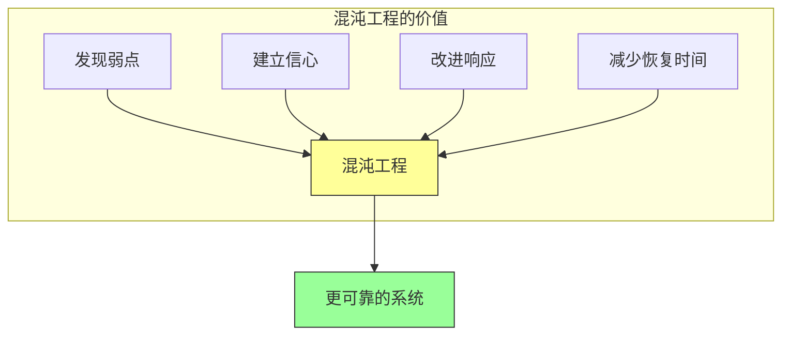

# 第十五章：混沌工程

## 一、混沌工程的定义

### 1.1 混沌工程的原则

混沌工程是在分布式系统上进行实验的学科：

**稳态假设**：定义系统的稳态行为。**实验假设**：做出关于稳态的假设。**真实世界实验**：在真实世界条件下进行实验。**最小化影响**：最小化实验的影响范围。

混沌工程的目标是建立对系统承受混乱能力的信心。

### 1.2 混沌工程的价值

混沌工程带来的价值：

**发现弱点**：在故障发生前发现弱点。**建立信心**：对系统的韧性有信心。**改进响应**：改进故障响应能力。**减少恢复时间**：更快从故障中恢复。

**图解说明**：混沌工程的多重价值最终带来更可靠的系统。

### 1.3 混沌工程的原则

混沌工程的核心原则：

**稳态定义**：首先定义什么是稳态。**假设验证**：做出可验证的假设。**真实实验**：在生产环境或类生产环境实验。**控制爆炸半径**：控制实验的影响范围。

## 二、混沌工程实践

### 2.1 实验设计

设计混沌工程实验：

**选择变量**：选择要注入的故障类型。**定义假设**：定义要验证的假设。**选择指标**：选择衡量影响的指标。**设计场景**：设计实验的场景和步骤。

### 2.2 故障注入

常见的故障注入类型：

**延迟**：注入网络延迟。**超时**：注入请求超时。**故障**：注入服务故障。**资源耗尽**：注入资源耗尽。**网络分区**：注入网络分区。

### 2.3 实验执行

执行混沌工程实验：

**从简单开始**：从简单的实验开始。**小范围验证**：在小范围验证实验效果。**逐步扩大**：逐步扩大实验范围。**实时监控**：在实验中实时监控系统。

## 三、混沌工程工具

### 3.1 开源工具

常用的混沌工程开源工具：

**Chaos Monkey**：随机终止实例。**LitmusChaos**：Kubernetes 环境的混沌工程。**Chaos Mesh**：云原生的混沌工程平台。**Pumba**：Docker 容器的混沌测试。

### 3.2 商业工具

商业混沌工程平台：

**Gremlin**：商业混沌工程平台。**ChaosIQ**：混沌工程分析和优化。**故障测试服务**：云提供商的故障测试服务。

### 3.3 自研工具

一些组织选择自研混沌工具：

**定制需求**：满足特定的故障场景。**深度集成**：与内部系统深度集成。**安全控制**：满足安全合规要求。

## 四、混沌工程最佳实践

### 4.1 实验原则

混沌工程实验的原则：

**稳态优先**：先定义稳态，再进行实验。**可逆操作**：确保实验可逆。**监控到位**：实验时监控系统。**快速停止**：问题发现时快速停止实验。

### 4.2 渐进式实验

采用渐进式的实验方法：

**小规模实验**：从小的故障注入开始。**逐步升级**：逐步增加故障的强度。**观察响应**：观察系统的响应行为。**记录学习**：记录实验结果和学习。

### 4.3 团队文化

混沌工程需要特定的文化：

**接受失败**：接受故障会发生。**学习导向**：从实验结果中学习。**全员参与**：不仅是 SRE，也包括开发团队。**持续实验**：持续进行混沌实验。

## 五、混沌工程与可靠性

### 5.1 可靠性测试

混沌工程是可靠性测试的一部分：

**主动测试**：主动测试系统的可靠性。**真实场景**：使用真实世界的故障场景。**发现弱点**：发现系统的弱点。**验证改进**：验证可靠性改进的效果。

### 5.2 SRE 与混沌工程

SRE 与混沌工程的结合：

**错误预算**：使用错误预算进行混沌实验。**验证 SLO**：验证系统是否达到 SLO。**改进响应**：改进故障响应能力。**建立信心**：建立对系统的信心。

### 5.3 可观测性与混沌工程

可观测性支持混沌工程：

**稳态测量**：测量系统的稳态。**影响观察**：观察故障注入的影响。**恢复验证**：验证系统的恢复能力。**结果分析**：分析实验结果。

## 六、总结与启示

### 6.1 核心要点回顾

混沌工程是在分布式系统上进行实验的学科。混沌工程通过主动注入故障来发现系统弱点。混沌工程需要特定的文化和工具支持。混沌工程与 SRE 和可观测性紧密结合。

### 6.2 实践建议

- 从简单的混沌工程实验开始
- 建立支持混沌工程的文化
- 使用合适的工具支持实验
- 持续进行混沌工程实验

### 6.3 思考题

1. 你的系统是否进行混沌工程实验？有哪些可以尝试的实验？
2. 如何设计一个混沌工程实验来测试系统的某个方面？
3. 如何在团队中推广混沌工程文化？

---

*本章精读笔记完成*
