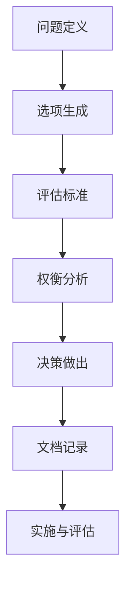
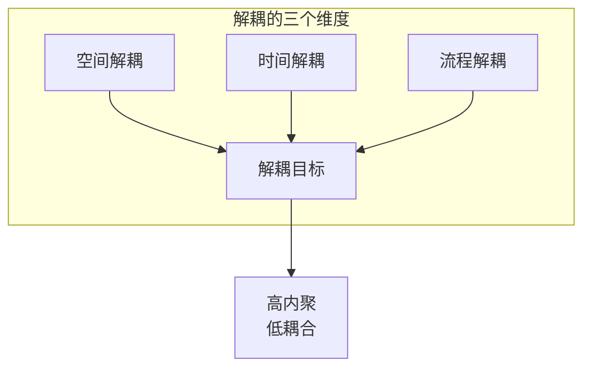

# Software Architecture: The Hard Parts 精读笔记

## 书籍信息

- **书名**：Software Architecture: The Hard Parts
- **作者**：Neal Ford, Mark Richards, Pramod Sadalage, Zhamak Dehghani
- **核心主题**：架构决策的本质、权衡取舍、复杂系统的设计挑战

---

## 书籍概述

本书深入探讨软件架构中最具挑战性的方面——那些没有明确答案的决策。作者通过实际案例分析，展示了架构师如何在多个相互竞争的需求之间找到平衡。

---

## 章节结构

### 第一部分：分支与发布（第1-5章）

| 章节 | 主题 | 核心内容 |
|-----|------|---------|
| 第1章 | Pull Request 设计 | PR 工作流、大规模变更处理、架构守护 |
| 第2章 | 分支模式 | Git Flow、GitHub Flow、Trunk-Based Development |
| 第3章 | 代码评审 | 评审价值、最佳实践、评审与架构 |
| 第4章 | 分支与构建 | 构建系统、流水线设计、构建优化 |
| 第5章 | CI/CD | 持续集成、持续交付、部署策略 |

### 第二部分：解耦模式（第6-8章）

| 章节 | 主题 | 核心内容 |
|-----|------|---------|
| 第6章 | 什么是解耦 | 解耦的本质、耦合来源、解耦维度 |
| 第7章 | 解耦模式 | 异步解耦、服务解耦、数据解耦 |
| 第8章 | 数据解耦 | 数据所有权、分布式数据、数据契约 |

### 第三部分：数据一致性（第9-11章）

| 章节 | 主题 | 核心内容 |
|-----|------|---------|
| 第9章 | 分布式数据 | 分布式数据挑战、一致性模型、分布式事务 |
| 第10章 | 数据复制 | 复制模式、复制延迟、冲突处理 |
| 第11章 | 数据缓存 | 缓存策略、一致性管理、缓存设计 |

### 第四部分：组织与可观测性（第12-15章）

| 章节 | 主题 | 核心内容 |
|-----|------|---------|
| 第12章 | 团队拓扑 | 团队结构、团队类型、团队与架构 |
| 第13章 | API 设计 | API 设计原则、版本管理、API 安全 |
| 第14章 | 可观测性架构 | 日志、指标、分布式追踪 |
| 第15章 | 混沌工程 | 混沌工程原则、实验设计、最佳实践 |

---

## 核心主题总结

### 1. 架构决策的本质

架构决策是权衡取舍的艺术：

```
需求 + 约束 + 权衡 → 决策 → 实施 → 评估 → 演进
```

### 2. 解耦的重要性

解耦是架构的核心目标：

- **空间解耦**：组件可以独立部署
- **时间解耦**：组件可以异步通信
- **流程解耦**：业务流程可以独立演进

### 3. 数据一致性

分布式系统中的数据一致性挑战：

```
强一致性 ←→ 可用性 ←→ 分区容忍性
     ↑
  根据业务需求选择平衡点
```

### 4. 团队与架构

团队结构影响架构设计：

- 康威定律：组织结构影响系统结构
- 团队拓扑：定义不同类型的团队
- 自治与协调：平衡团队自治和整体协调

### 5. 可观测性与可靠性

可观测性是系统可靠性的基础：

```
日志 + 指标 + 追踪 = 可观测性
混沌工程 → 发现弱点 → 持续改进
```

---

## 关键概念图解

### 架构决策框架



### 解耦模式



---

## 实践建议

### 对于架构师

1. **理解业务**：架构决策必须基于业务需求
2. **权衡分析**：系统分析每个决策的利弊
3. **持续演进**：架构不是一蹴而就的
4. **数据驱动**：用数据验证架构决策

### 对于团队

1. **建立规范**：建立代码和架构规范
2. **持续集成**：采用持续集成实践
3. **监控改进**：建立可观测性能力
4. **培养文化**：培养 DevOps 和 SRE 文化

### 对于组织

1. **投资基础设施**：投资 CI/CD 和可观测性工具
2. **优化团队结构**：设计支持高效交付的团队结构
3. **度量改进**：度量架构决策的效果
4. **持续学习**：持续学习和改进

---

## 延伸阅读

- 《架构整洁之道》- Robert C. Martin
- 《领域驱动设计》- Eric Evans
- 《微服务设计》- Sam Newman
- 《持续交付》- Jez Humble

---

## 使用说明

本书精读笔记按照章节组织，每章包含：

- 核心概念和定义
- 关键原理和模式
- 图解说明
- 最佳实践
- 思考题

建议按章节顺序阅读，或根据需要选择性阅读。

---

*本精读笔记由 AI 自动生成，仅供学习参考*
