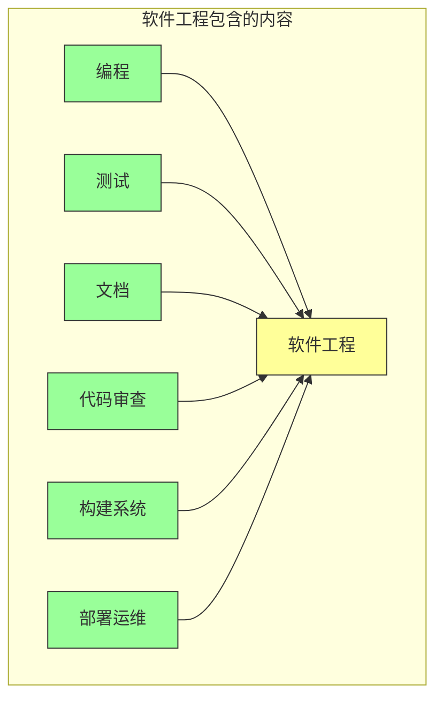
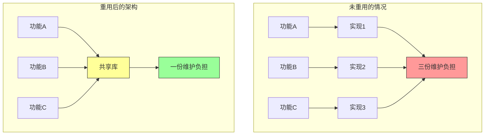
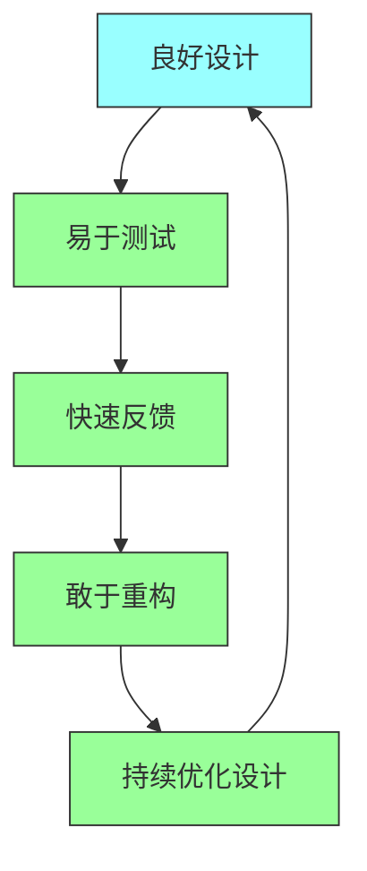
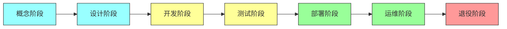
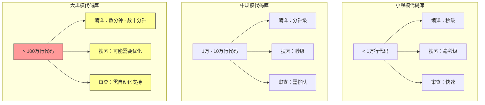

# 第一章：什么是软件工程

## 一、核心定义与概念

### 1.1 软件工程的本质

软件工程是一门在长期时间尺度上管理代码的学科。与单纯的编程不同，软件工程关注的不仅是代码的实现，更是代码在整个生命周期中的演进、维护和优化。Google 对软件工程的定义强调了两个核心要素：**时间**（Time）和**变更**（Change）。任何代码库只要存在足够长的时间，就必然面临软件工程层面的挑战。

编程关注的是如何用计算机语言表达算法和逻辑，而软件工程关注的是如何在团队协作的环境中，随着时间推移，持续地演进一个复杂的系统。这是一个根本性的区别。编程可以是个人活动，而软件工程本质上是团队活动。编程的成果是可运行的程序，而软件工程的成果是可维护、可演进的系统。

Google 的经验表明，软件工程的挑战主要来自三个方面。第一是**规模**，大型代码库有数百万行代码，数千个模块，数百名工程师同时工作。第二是**时间**，代码库可能存在十年甚至更长时间，期间经历无数次修改。第三是**变化**，技术栈会更新，团队会重组，需求会变化，只有良好的软件工程实践才能应对这些挑战。

### 1.2 软件工程与编程的关系

软件工程和编程不是对立的，而是包含与被包含的关系。编程是软件工程的基础，没有代码实现，软件工程就无从谈起。但仅有编程是不够的，还需要测试、文档、代码审查、构建系统等配套实践，才能称之为软件工程。

**图解说明**：软件工程是一个庞大的体系，编程只是其中的一部分。测试确保代码质量，文档传承知识，代码审查促进协作，构建系统保证可靠性，部署运维实现持续交付。这些要素缺一不可。

Google 的工程师每天都在进行软件工程活动。编写代码只是工作的一小部分，更多时间花在阅读他人代码、参与代码审查、编写测试、更新文档等活动中。这与许多人的想象不同，但正是这种全面的实践保证了 Google 代码库的长期健康。

### 1.3 时间维度的挑战

时间对软件工程的影响是深远而复杂的。一个典型的软件项目，编程阶段可能只占整个生命周期的 10% 到 20%，其余时间都在进行维护和演进。这意味着软件工程的大部分工作是在代码已经存在多年后进行的。

**人员流动**是时间带来的第一个挑战。原始作者可能早已不在团队，新接手的工程师需要理解他们从未参与创作的代码。如果代码缺乏良好的注释、文档和清晰的结构，这个过程会变得异常困难。Google 的代码库平均年龄超过十年，大部分代码都是由早已不在当前团队的工程师编写的。

**技术演进**是第二个挑战。编程语言会更新版本，框架会发布新版本，依赖库会有安全漏洞。这些变化要求代码不断适应。有时候，升级一个依赖库可能需要修改数百个文件。Google 必须谨慎处理这些变更，确保兼容性。

**需求变化**是第三个挑战。业务需求会随着市场环境、用户反馈、竞争态势而变化。代码需要相应调整，可能涉及架构的重构、功能的增删、接口的变更。这些变化需要在不破坏现有功能的前提下进行。

## 二、软件工程的三大支柱

### 2.1 可重用性

可重用性是软件工程的核心原则之一 DRY（Don't Repeat Yourself）的体现。重复的代码不仅浪费开发时间，还会增加维护负担。当需要修改一个通用的逻辑时，所有重复的地方都需要同步修改，很容易遗漏。

Google 在代码组织上投入大量精力来促进重用。代码按功能模块组织，有清晰的边界和接口。通用的功能被抽取为库或服务，供多个消费者使用。这种架构使得新功能的开发可以基于已有的组件，而不是从零开始。

**图解说明**：左侧展示未重用时，每个功能都有独立实现，维护负担随功能数量线性增长。右侧展示重用后，所有功能共享一个实现，维护负担大大降低。

然而，可重用性也有其代价。过早地抽象可能导致不必要的复杂性。如果两个功能目前相似但未来可能分化，强行抽象可能会带来束缚。Google 的经验是在第三次需要相同功能时才进行抽象，而不是更早。

### 2.2 可测试性

可测试性是软件工程的基本要求。没有测试的代码是不可信的，因为我们无法确信它正确工作。更重要的是，测试为代码提供了安全网，允许我们在修改代码时不用担心引入新的错误。

Google 的代码库有严格的测试要求。每个重要的代码变更都必须包含相应的测试。测试覆盖率是代码健康度的重要指标，但不是唯一指标。重要的是测试的质量，而非单纯的数量。

可测试性对代码设计有反向影响。为了易于测试，代码通常需要遵循一些原则，如单一职责、依赖注入、解耦等。这些设计原则不仅有利于测试，也提高了代码的整体质量。

**图解说明**：可测试性与良好设计形成良性循环。良好的设计使代码易于测试，测试提供快速反馈，让我们敢于重构，持续优化又带来更好的设计。

### 2.3 可维护性

可维护性是软件工程的终极目标。一个可维护的代码库意味着新的工程师可以快速上手，现有工程师可以高效工作，整个团队可以持续推进功能开发。可维护性包括多个维度：可读性、可理解性、可修改性、可调试性等。

可读性是最基础的要求。代码应该像散文一样清晰，变量名、函数名应该准确表达意图。复杂的逻辑应该被分解为简单的小步骤。注释应该解释「为什么」而不是「是什么」，因为代码本身已经说明了「是什么」。

可理解性是更高的要求。即使是第一次阅读代码的人，也能快速理解代码的结构和意图。这需要良好的代码组织、清晰的架构设计、充分的文档支持。Google 的代码审查过程确保每段代码都能被团队其他成员理解。

## 三、软件工程的实践框架

### 3.1 生命周期模型

软件工程不是一次性的活动，而是贯穿整个软件生命周期的持续实践。从概念阶段到退役阶段，每个阶段都有相应的工程实践。

**图解说明**：软件生命周期的各个阶段。开发和测试阶段是软件工程实践最密集的时期，但运维阶段同样重要，需要持续的监控和问题修复。

### 3.2 核心实践清单

Google 在长期实践中形成了一套核心实践清单，这些实践被视为软件工程的基本功：

| 实践领域 | 关键实践 | 目的 |
|---------|---------|------|
| 代码质量 | 代码审查、静态分析、代码风格 | 保证代码质量，促进知识共享 |
| 测试 | 单元测试、集成测试、端到端测试 | 验证功能正确性，防止回归 |
| 构建 | 持续集成、自动构建、依赖管理 | 快速反馈，保证构建可靠性 |
| 文档 | 设计文档、用户文档、代码注释 | 传承知识，降低学习成本 |
| 部署 | 持续部署、蓝绿部署、回滚机制 | 快速交付，快速恢复 |
| 运维 | 监控告警、日志分析、故障响应 | 及时发现问题，快速恢复 |

每个领域都有专门的工具链支持。Google 的理念是让正确的做法变得容易，错误的做法变得困难。例如，代码风格由工具自动检查，测试覆盖率自动统计，构建失败自动通知相关人员。

### 3.3 实践的演进

软件工程实践不是一成不变的，而是随着技术和环境的变化不断演进。Google 每年都会评估现有实践的有效性，引入新的工具和方法，淘汰过时的实践。

演进的关键是保持开放的心态和学习的能力。新的编程语言、新的框架、新的工具不断涌现，工程师需要持续学习。但核心原则是稳定的，如重视测试、重视文档、重视协作，这些原则已经经受了几十年的考验。

## 四、规模化带来的挑战

### 4.1 代码库规模

Google 的代码库是世界上最大的单体代码库之一。它包含数十亿行代码，数百万个文件，每天有数千次代码提交。这种规模带来了独特的挑战。

代码库规模使得很多在小项目中不成问题的事情变成大问题。例如，编译时间可能很长，需要分布式编译。代码搜索可能很慢，需要专门的索引系统。代码审查可能积压，需要自动化的预审查工具。

**图解说明**：代码库规模对工程效率的影响。随着规模增长，编译、搜索、审查等基础活动都需要专门的工具和流程支持。

### 4.2 团队规模

与代码库规模同样重要的是团队规模。Google 的许多项目有数百甚至数千名工程师参与。如何在这么多人之间保持协作效率是一个巨大的挑战。

大规模团队协作需要清晰的沟通渠道、明确的分工、强大的工具支持。Google 通过建立团队结构、制定沟通规范、提供协作工具来应对这些挑战。

### 4.3 地理分布

Google 的团队分布在世界各地，不同的时区、不同的文化背景、不同的语言。这增加了协作的复杂性。同步沟通需要考虑时区，异步沟通需要确保信息的清晰准确。

Google 的解决方案是建立强大的异步协作机制。文档、代码审查、问题跟踪都支持异步工作。重要决策被详细记录，供后来者参考。工具支持多语言和国际化。

## 五、Google 软件工程的核心价值

### 5.1 人比代码更重要

Google 的软件工程哲学强调人比代码更重要。代码可以被重写，但团队的信任和协作关系是长期积累的宝贵资产。好的软件工程实践应该服务于人的高效工作，而不是让人服务于工具。

这个理念体现在多个方面。代码审查是建设性的，而不是批评性的。工具的设计考虑人的使用体验。流程的制定听取一线工程师的意见。技术债务被认真对待，因为它是工程师日常工作的负担。

### 5.2 长期思维

软件工程是长期投资。很多实践的收益不是立即可见的，而是在数月甚至数年后才显现。例如，编写文档的收益可能在几年后，当新成员需要理解旧代码时才能体现。编写测试的收益可能在某次回归故障时才能感受到。

Google 的管理层理解这种长期思维，不会因为短期压力而牺牲长期健康。他们愿意投入资源建设基础设施，支持最佳实践的推广。这种支持是 Google 软件工程成功的重要原因。

### 5.3 持续改进

没有完美的软件工程实践，只有不断改进的过程。Google 定期回顾和反思，识别做得好的地方和需要改进的地方。每个团队都有定期的回顾会议，讨论流程和实践的优化。

改进不是一蹴而就的，而是渐进式的。每次变更都应该小而明确，可以快速评估效果。大规模的变革往往因为难以推行而失败，渐进式的改进更容易被接受。

## 六、总结与启示

### 6.1 核心要点回顾

软件工程是在时间尺度上管理代码的艺术。它与编程的区别在于关注长期维护和团队协作。Google 的软件工程实践围绕可重用性、可测试性、可维护性三大支柱展开，通过代码审查、测试、文档、构建系统等实践实现。

规模化是软件工程的巨大挑战，需要专门的工具和流程支持。人比代码更重要，长期思维和持续改进是 Google 软件工程文化的核心。

### 6.2 对个人开发者的启示

即使不在 Google 工作，个人开发者也可以从 Google 的软件工程实践中受益。重视代码质量，编写测试，编写文档，参与代码审查。这些习惯会让你的代码更可靠，你的团队更高效。

从小处做起，不要等到代码库变大才开始关注可维护性。从第一天起就养成好习惯，以后会受益匪浅。代码是写给人看的，顺便让机器执行。

### 6.3 对团队的启示

团队应该建立软件工程的文化，让每个成员都认同质量的重要性。领导层应该支持工程师投入时间在工程实践上，而不是总是催促进度。工具应该让正确的做法变得容易。

定期回顾和改进团队的软件工程实践。什么效果好，什么需要改进，如何让新成员快速上手。这些问题值得团队认真讨论。

---

## 课后思考

1. 你的团队是否存在「编程」和「软件工程」的混淆？如何向团队成员解释两者的区别？

2. 你的代码库中是否存在知识孤岛？如何识别和打破这些孤岛？

3. 你的团队在可测试性方面做得如何？测试是否被视为一等公民？

4. 你的团队是否有长期思维？还是总是被短期进度压力推着走？

5. 你的团队如何进行持续改进？有哪些机制确保实践的演进？

---

*本章精读笔记完成*
