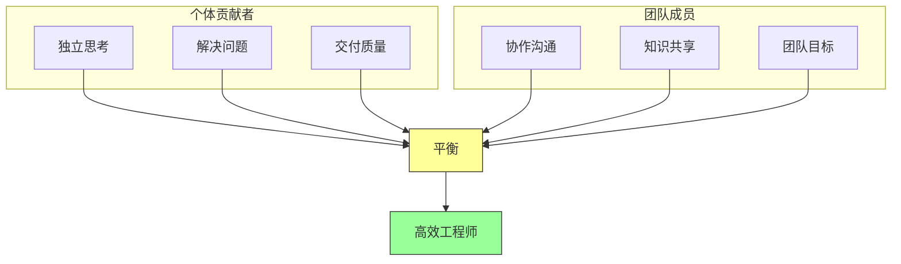
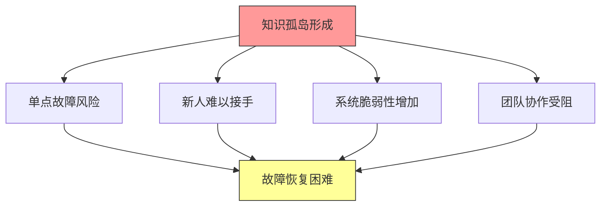
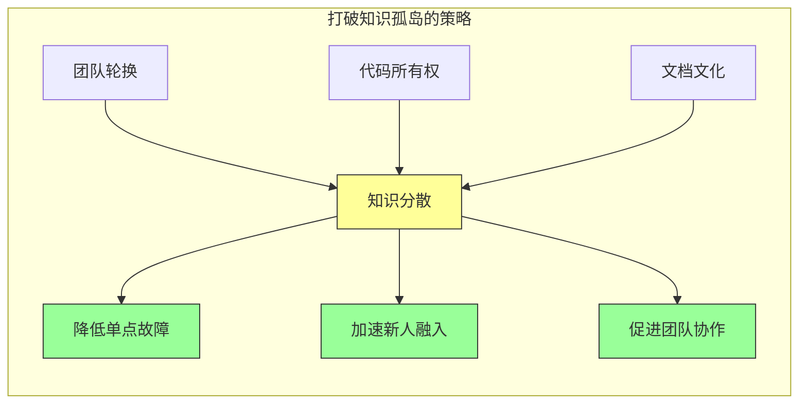
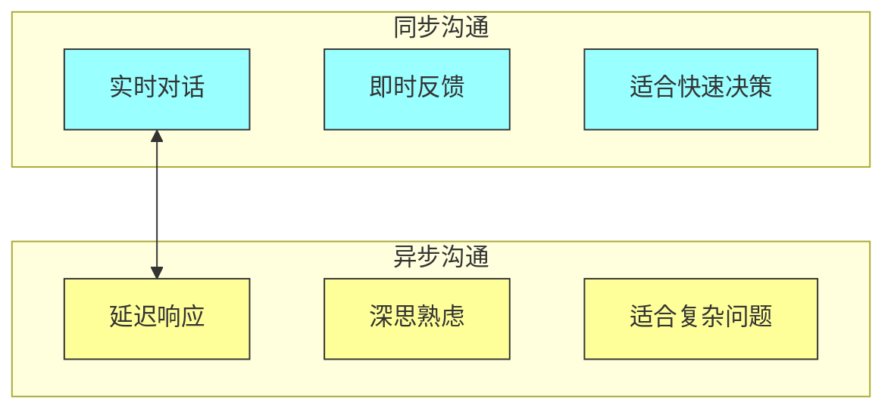
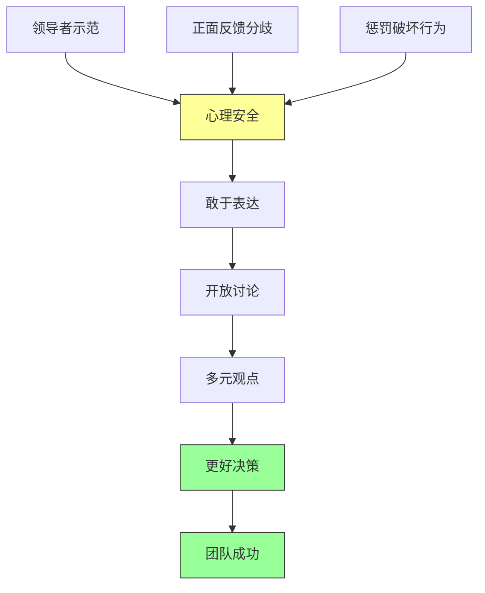
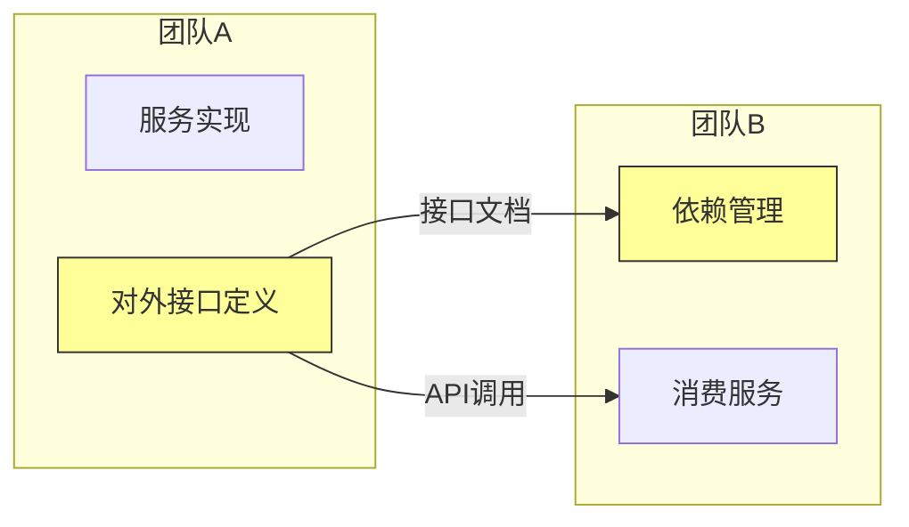

# 第二章：如何在团队中出色工作

## 一、团队协作的本质

### 1.1 软件开发是团队运动

软件开发从来不是一个人的活动。在 Google 这样的公司，一个大型项目可能涉及数十个团队、数百名工程师的协作。即使是看似简单的功能，也需要多个角色的配合才能完成。

理解这一点是团队协作的基础。每个工程师都是更大系统的一部分，我们的工作会影响他人，他人的工作也会影响我们。这种相互依存的关系要求我们不仅要做好自己的本职工作，还要考虑如何与他人协作。

团队协作的复杂性在于，它涉及人与人之间的沟通、信任、协调。与机器不同，人有情绪、有偏好、有不同的背景。好的团队协作需要理解这些人的因素，而不是仅仅关注技术。

### 1.2 个体贡献者与团队成员的双重角色

每位工程师都扮演着双重角色：既是独立的个体贡献者，又是团队的一员。作为个体贡献者，你需要独立思考、独立解决问题、交付高质量的工作。作为团队成员，你需要与他人协作、分享知识、考虑团队整体目标。

这两个角色有时会有冲突。独立思考可能导致与他人意见相左，交付压力可能让你没时间帮助他人。好的工程师能够在两个角色之间找到平衡，既发挥个人能力，又促进团队协作。

**图解说明**：高效工程师是独立贡献者与团队成员两种角色的平衡。纯粹的个人英雄主义或纯粹的团队服从都无法发挥最大价值。

### 1.3 团队成功的定义

团队成功不仅仅是完成任务，更包括团队的长期健康和持续发展。一个成功的团队应该有开放的文化、高效的沟通、持续的学习、成员的成长。

Google 的经验表明，团队健康比短期交付更重要。过度加班、忽视代码质量、牺牲成员健康来换取短期进度，从长期看都是不可持续的。好的团队领导会关注这些软性因素，因为它们决定了团队的长期表现。

## 二、避免知识孤岛

### 2.1 知识孤岛的危害

知识孤岛是指某个领域的知识只被少数人掌握的情况。这是大型软件项目中最危险的问题之一。当关键知识集中在少数人手中时，这些人就成了系统的单点故障。

知识孤岛的危害是多方面的。首先是**可用性风险**，当掌握关键知识的人离职或休假时，系统可能陷入困境。其次是**风险盲区**，只有少数人了解系统的脆弱点，潜在风险可能被忽视。第三是**创新受阻**，知识的集中限制了思想的碰撞和创新的产生。

**图解说明**：知识孤岛会引发一系列连锁问题，最终导致系统脆弱性和团队协作困难。

### 2.2 识别知识孤岛

识别知识孤岛是解决问题的第一步。以下是一些常见的信号，表明团队可能存在知识孤岛问题：

| 信号 | 表现 | 潜在问题 |
|-----|------|---------|
| 关键人物依赖 | 某些人请假时工作停滞 | 单点故障风险 |
| 文档缺失 | 系统行为只有少数人知道 | 知识无法传承 |
| 代码所有权集中 | 某些文件只有少数人修改 | 代码演化困难 |
| 问题定位困难 | 出了问题需要特定人才能解决 | 响应速度慢 |
| 新人融入慢 | 新人需要很长时间才能上手 | 知识传递效率低 |

Google 通过定期审计来识别知识孤岛。审查代码变更记录，分析团队成员的工作分布，评估文档覆盖情况。这些数据帮助团队了解知识分布，识别需要改进的地方。

### 2.3 打破知识孤岛的方法

打破知识孤岛需要系统性的方法。Google 采用了多种策略来确保知识的分散和共享。

**团队轮换**是一种有效的方法。让工程师在不同团队之间流动，带走和带来不同的知识。这种流动不仅传播知识，还能让工程师获得更广阔的视野。Google 鼓励工程师每 18 个月到 2 年换一次团队。

**代码所有权**的设计确保每个文件都有多个所有者。任何人都可以修改任何代码，没有人能垄断某块代码的知识。这种设计降低了单点故障的风险，也促进了知识的传播。

**文档文化**要求关键决策必须被记录下来。设计文档、决策记录、架构说明都是知识传承的载体。新成员可以通过阅读文档快速了解系统的历史和设计思路。

**图解说明**：多种策略共同作用，实现知识的分散和共享，最终降低风险、提高效率。

## 三、有效的沟通机制

### 3.1 代码审查作为沟通渠道

代码审查是 Google 最重要的沟通渠道之一。每次代码变更都需要经过至少一位其他工程师的审查才能提交。这个过程不仅保证了代码质量，还促进了知识的传播和团队的协作。

代码审查是一种结构化的沟通方式。它有明确的上下文（代码变更）、明确的参与者（作者和审查者）、明确的目标（改进代码）。这种结构使得沟通更加高效，减少了信息丢失和误解。

好的代码审查应该是双向的学习机会。审查者可以从中学到新的技术和模式，作者可以获得宝贵的反馈。当审查者提出问题时，往往能帮助作者发现思维的盲点。

### 3.2 会议与讨论

除了代码审查，团队还需要通过会议和讨论来沟通。Google 有多种类型的会议，每种会议都有不同的目的。

**每日站会**简短同步进展和问题，时长控制在 15 分钟以内。**设计评审**讨论重大技术决策，需要提前准备材料。**回顾会议**反思过去的实践，讨论改进方向。**技术分享**传播技术知识，促进跨团队学习。

会议的有效性取决于参与者的准备和投入。无效的会议浪费所有人的时间。Google 鼓励会议有明确的目标、议程和预期产出。无准备的会议应该被取消或推迟。

### 3.3 异步沟通

在分布式团队中，异步沟通变得尤为重要。异步沟通不依赖双方同时在线，给予双方更多思考和准备的时间。文档、邮件、问题跟踪、代码审查都是异步沟通的形式。

异步沟通的关键是信息的清晰和完整。由于无法立即获得反馈，需要在第一次就把信息表达清楚。这包括清晰的标题、完整的背景、明确的问题、具体的请求。

**图解说明**：同步和异步沟通各有优势，应该根据问题性质选择合适的方式。快速协调适合同步，复杂讨论适合异步。

## 四、处理分歧与冲突

### 4.1 分歧的价值

在技术团队中，分歧和冲突是不可避免的，也是健康的。不同的观点可以带来更全面的分析，避免盲目的从众。Google 的文化鼓励工程师提出不同的意见，而不是一味地同意权威。

好的分歧是建设性的，关注点和问题本身，而不是个人。它寻求最好的解决方案，而不是证明自己是对的。当分歧被正确处理时，它可以带来比任何单一观点都更好的结果。

### 4.2 处理技术分歧的方法

处理技术分歧需要方法和技巧。以下是 Google 推荐的做法：

**第一步：用数据和实验验证**。当有两种技术方案时，尝试用数据和实验来验证哪个更好。基准测试、原型实现、用户反馈都可以作为依据。数据比观点更有说服力。

**第二步：明确决策标准**。在讨论之前，先就评估标准达成一致。什么是最重要的因素？性能、复杂度、可维护性、安全性？不同的标准可能导致不同的选择。

**第三步：寻求第三方意见**。当双方无法达成一致时，寻求第三方的意见。这个人应该足够客观，有能力评估两种方案的优劣。Google 有技术委员会来处理这类争议。

**第四步：接受决策并继续前进**。一旦做出决定，所有人都应该接受并支持。即使你不同意这个决定，也要全力执行。持续的分歧会损害团队的效率。

### 4.3 建立健康的冲突文化

健康的冲突文化需要刻意的培养。领导者的示范作用至关重要。当领导者公开承认自己的错误，欢迎他人的批评时，团队成员才会敢于提出不同意见。

建立心理安全是前提。团队成员需要相信，提出分歧不会带来惩罚或负面后果。这需要长期的、一致的文化培育。小的负面反馈如果不被处理，会逐渐侵蚀心理安全。

**图解说明**：心理安全是健康冲突文化的基础。领导者需要通过行动建立心理安全，健康的冲突带来更好的决策和团队成功。

## 五、团队角色与职责

### 5.1 角色分工的原则

在大型团队中，清晰的角色分工是必要的。每个人需要知道自己的职责范围，也需要知道与其他角色的接口。模糊的职责会导致推诿或重复工作。

角色分工应该基于能力、兴趣和项目需要。同一个人可能在不同项目中扮演不同角色。重要的是职责清晰、接口明确、协作顺畅。

### 5.2 跨团队协作

大型项目通常需要多个团队的协作。Google 有专门的机制来协调跨团队的工作。

**接口定义**是跨团队协作的基础。每个团队定义好自己对外提供的服务（API、协议、数据格式），以及消费的外部服务。这些接口应该稳定，有良好的文档。

**依赖管理**确保团队之间的依赖关系被正确处理。当一个团队需要依赖另一个团队的服务时，需要有明确的 SLA（服务等级协议），包括可用性、响应时间、支持响应等。

**协调机制**处理跨团队的决策和争议。技术委员会、架构评审委员会等组织可以协调重大决策。定期的跨团队会议促进信息同步和问题解决。

**图解说明**：跨团队协作基于清晰的接口定义。一个团队的输出是另一个团队的输入，接口文档是协调的关键。

### 5.3 领导与跟随

在团队工作中，领导与跟随的角色是动态的。在不同的情况下，同一个人可能需要扮演领导或跟随的角色。好的工程师知道何时该引领方向，何时该支持他人。

技术领导不是职位，而是一种影响力和能力。技术领导者不一定有管理头衔，但能够通过专业能力和沟通技巧影响团队的方向。这种影响力来自尊重，而非权力。

## 六、远程与分布式团队

### 6.1 分布式协作的挑战

Google 的团队分布在世界各地，不同的时区、不同的文化、不同的语言。这带来了独特的协作挑战。

**时区差异**使得同步沟通困难。当旧金山团队开始工作时，北京团队已经在下班路上。关键会议需要考虑所有时区，总有人需要在非工作时间参加。

**文化差异**可能导致沟通误解。不同文化对直接表达、层级关系、时间观念有不同的期望。来自不同文化背景的团队成员需要学习相互理解。

**语言障碍**增加了沟通成本。即使使用同一种语言，非母语表达可能不够准确。缩写、俚语、文化典故可能造成理解困难。

### 6.2 应对分布式挑战

应对分布式挑战需要刻意的设计和努力。以下是 Google 的做法：

**异步优先**。尽可能使用异步沟通，让对方有足够时间理解和回应。文档要详尽，邮件要清晰，问题跟踪要完整。

**仪式感**。在远程环境中，仪式感更加重要。固定的会议时间、清晰的角色分工、明确的议程，这些都能帮助团队保持凝聚力。

**技术支持**。好的视频会议、即时通讯、协作工具是分布式团队的基础设施。Google 在这些工具上投入大量资源，让远程协作尽可能顺畅。

### 6.3 远程工作的优势

虽然有挑战，分布式团队也有独特的优势。**人才池扩大**使团队可以在全球范围内招聘最优秀的人才。**多元化**带来更广阔的视野和更丰富的创意。**24 小时工作**在某些情况下可以加速开发。

关键是要充分发挥这些优势，同时管理好挑战。好的分布式团队不是把远程当作问题，而是当作机会。

## 七、团队文化与个人成长

### 7.1 建立学习文化

优秀的团队是学习的团队。成员不仅完成任务，还从任务中学习。团队鼓励知识分享，成员愿意花时间帮助他人成长。

学习文化体现在多个方面。技术分享会传播新知识。代码审查中学习他人经验。错误回顾中学习教训。跨团队轮换拓宽视野。

### 7.2 职业发展支持

团队应该支持成员的职业发展。这不仅是管理者的责任，也是每位成员的责任。好的团队成员会帮助他人成长，分享自己的经验和知识。

职业发展包括技术能力、软技能、职业规划等多个维度。团队可以提供培训机会、项目挑战、导师指导等支持。成员的发展最终也会反哺团队。

### 7.3 工作与生活的平衡

可持续的高效来自工作与生活的平衡。过度工作从长期看是适得其反的。Google 重视员工的健康和家庭生活，反对过度加班。

平衡不是平均分配，而是在不同阶段灵活调整。有时候需要加班完成任务，有时候需要休假恢复精力。关键是长期来看保持健康和可持续。

## 八、总结与启示

### 8.1 核心要点回顾

团队协作是软件工程的核心。避免知识孤岛确保系统韧性。有效沟通是协作的基础。健康的冲突文化促进创新。清晰的角色分工提高效率。分布式协作需要特殊的设计和支持。

人比代码更重要。好的团队文化促进个人成长，个人的成长又推动团队的进步。这是一个良性循环。

### 8.2 对个人的建议

作为个人，你可以主动促进团队协作。参与代码审查，学习他人经验，也分享自己的知识。主动帮助新人，帮助他们快速融入。提出建设性的分歧，而不是沉默或对抗。

持续学习不仅是学习新技术，也包括学习如何更好地与他人协作。沟通技巧、冲突处理、影响力都是可以学习的技能。

### 8.3 对团队的建议

作为团队，要建立促进协作的机制和文化。知识分享应该被鼓励和奖励。代码审查应该是学习机会而非负担。冲突应该被健康地处理，而不是回避。

定期反思团队协作的效果。什么是好的，什么需要改进？让每个成员都参与这个反思过程。持续改进团队文化，让它更加开放、高效、包容。

---

## 课后思考

1. 你的团队是否存在知识孤岛？如何识别和打破？

2. 你的团队如何处理技术分歧？是否有健康的冲突文化？

3. 你的团队是否充分利用了分布式协作的优势？

4. 你在团队中扮演什么角色？如何在个体贡献者和团队成员之间找到平衡？

5. 你的团队如何支持成员的学习和职业发展？

---

*本章精读笔记完成*
