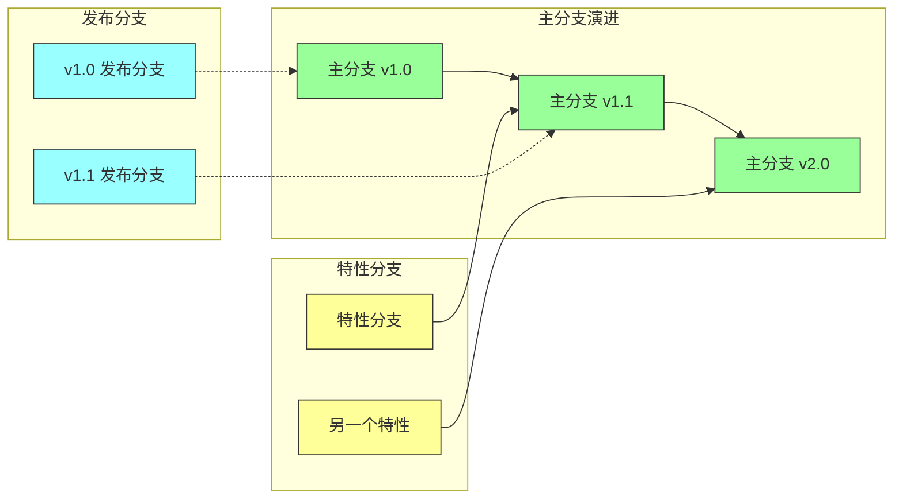
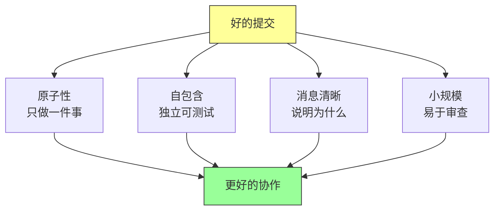
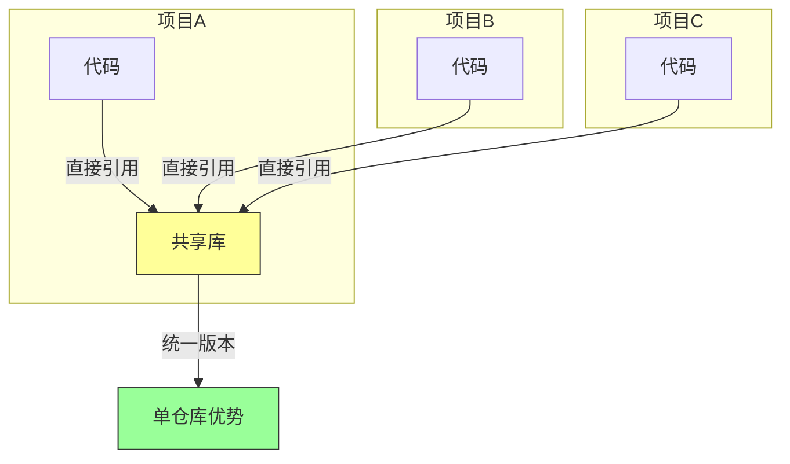

# 第三章：版本控制与分支管理

## 一、版本控制的重要性

### 1.1 版本控制的核心价值

版本控制系统（Version Control System，VCS）是软件工程的基石之一。它记录代码的每一次变更，保存历史版本，支持多人协作。Google 使用自己开发的版本控制系统（基于 Perforce），能够处理超大规模的代码库。

版本控制的核心价值体现在几个方面。**历史追溯**：可以查看任何文件的历史，了解谁在什么时候做了什么修改，为什么这样做。**协作支持**：多人可以同时工作在同一个代码库上，合并各自的修改。**回滚能力**：当出现问题时，可以快速回滚到之前的稳定版本。**分支实验**：可以在独立的分支上进行实验，不影响主代码。

### 1.2 集中式与分布式

版本控制系统分为集中式（如 Subversion、Perforce）和分布式（如 Git）两大类。Google 采用集中式模式，有其特定的原因和考虑。

集中式的优势在于：**单一真相源**，所有开发者工作在同一个代码库上，不存在同步问题。**权限控制精细**，可以精确控制谁可以访问什么内容。**大文件支持**，适合处理非代码资产（如二进制文件、图形资源）。**审计追踪**，可以精确追踪每个操作。

### 1.3 Google 的版本控制实践

Google 的代码库是单一的巨大仓库（monorepo），包含数千个项目，所有代码都在同一个版本控制系统中。这种模式有其独特的优势和挑战。

**优势**包括：跨项目依赖简单（直接引用，不需要包管理），代码共享容易（任何代码都可以被其他项目使用），重构影响可控（工具可以找到所有受影响的调用者）。

**挑战**包括：工具需要能够处理超大规模，权限管理需要精细控制，大文件需要特殊处理。

## 二、分支管理策略

### 2.1 分支的类型

在版本控制中，分支是并行的开发线。Google 使用几种不同类型的分支：

**主分支**（main 或 master）：代码的稳定版本，可以随时发布。**特性分支**：为特定功能创建的临时分支，功能完成后合并回主分支。**发布分支**：为特定发布版本创建的分支，只进行缺陷修复和安全更新。**修订分支**：用于紧急修复生产问题的短期分支。



**图解说明**：主分支持续演进，特性分支在完成开发后合并，发布分支从对应的主分支版本创建。

### 2.2 分支策略的选择

不同的团队规模、项目类型、发布周期适合不同的分支策略。Google 推崇简单清晰的分支策略，避免过于复杂的分支结构。

**主干开发**（Trunk-Based Development）：开发者尽可能直接在主分支上工作，短生命周期的特性分支很快合并回主分支。这种方式减少了分支合并的痛苦，提高了持续集成的效率。

**Git Flow**：更结构化的分支策略，有明确的开发分支、发布分支、特性分支、Hotfix 分支。适合需要严格发布管理的项目。

### 2.3 合并的挑战

分支合并是版本控制中最具挑战性的操作之一。当两个分支独立发展一段时间后，合并可能产生冲突，需要人工解决。

Google 使用的高级合并工具可以自动解决大部分冲突。工具会分析代码结构，理解语义的变更，而不是简单地逐行比较。当无法自动解决时，会标记需要人工审查的冲突。

## 三、代码变更的工作流

### 3.1 提交的最佳实践

提交是版本控制的基本单元。一次好的提交应该：**原子性**（只做一件事），**自包含**（可以独立测试和部署），**消息清晰**（说明做了什么，为什么这样做）。

提交消息应该遵循一定的格式。**头部**简要说明变更类型和内容。**正文**详细解释变更的背景、方法和影响。**尾部**列出相关的任务、Bug 编号、审查者等信息。



**图解说明**：好的提交具备多个特征，这些特征共同促进团队协作效率。

### 3.2 变更列表（CL）

在 Google 的术语中，一次代码变更被称为 CL（Change List）。CL 是代码审查的基本单元，包含一组相关的文件修改。

CL 应该足够小，以便于审查。Google 的经验是，一个 CL 最好在 400 行代码以内。太大的 CL 应该被拆分成多个小的 CL，每个都有独立的审查。

### 3.3 持续集成

持续集成（CI）是每次代码提交都触发构建和测试的实践。Google 的 CI 系统会在每次提交时运行快速的预提交检查，确保代码基本正确后才允许提交。

CI 的关键是**快速反馈**。如果构建和测试需要很长时间，开发者就会减少提交的频率。Google 投入大量资源优化构建系统，确保快速得到反馈。

## 四、大规模代码库的管理

### 4.1 代码库的组织

Google 的代码库有数百万个文件，需要良好的组织结构。代码按**根目录**、**子树**、**目录**的层次结构组织，每个目录都有明确的所有者和职责。

```
/
├── third_party/          # 第三方依赖
├── buildtools/          # 构建工具
├── docs/                # 文档
├── projects/            # 项目目录
│   ├── project_a/       # 项目A
│   ├── project_b/       # 项目B
│   └── ...
└── ...
```

### 4.2 文件所有权

每个文件都有一个或多个**所有者**（OWNERS 文件）。所有者负责审查对文件的修改，确保质量和一致性。文件可以有多位所有者，避免单点故障。

### 4.3 依赖管理

在单仓库模式下，依赖管理相对简单。项目可以直接引用同一仓库中的其他代码，不需要通过包管理器。这种方式减少了版本冲突，也便于跨项目重构。



**图解说明**：在单仓库模式下，所有项目共享同一版本的依赖库，避免了版本不一致的问题。

## 五、变更追踪与审计

### 5.1 变更历史

版本控制系统记录每一次变更的完整历史。这包括：谁做了修改，什么时间，修改了什么，提交消息是什么，经过了谁审查。

这些历史记录对于理解代码演进、追踪问题根因、满足合规要求都非常重要。Google 的审计系统可以回答「为什么这个代码是这样」的问题。

### 5.2 追溯性

追溯性是指能够追踪从一个点到另一个点的路径。例如，从一个线上问题追溯到引入它的代码变更，从一个需求追踪到实现它的代码。

追溯性需要工具和文化两方面的支持。工具需要能够建立和维护这些关联，文化需要鼓励开发者记录这些信息。

### 5.3 自动化审计

大型代码库需要自动化的审计能力。Google 有专门的系统来检查代码库的合规性，包括许可证检查、安全漏洞扫描、敏感信息检测等。

## 六、总结与启示

### 6.1 核心要点回顾

版本控制是软件工程的基石。Google 使用单一仓库模式管理超大规模代码库。分支管理策略应该简单清晰。提交应该是原子性的、自包含的。持续集成确保快速反馈。

### 6.2 对个人的建议

养成良好的提交习惯。每次提交只做一件事，提交消息清晰描述做了什么和为什么。保持提交的小规模，便于审查和回滚。

### 6.3 对团队的建议

建立清晰的分支策略和提交流规范。使用工具自动化重复的检查。投资于版本控制基础设施，因为这是每天都在使用的工具。

---

## 课后思考

1. 你的团队使用什么版本控制系统？分支策略是什么？

2. 你的团队如何处理大的代码变更？是否拆分成小的 CL？

3. 你的 CI 流程是否高效？反馈时间是否在可接受范围内？

4. 你的代码库组织是否清晰？新人能否快速找到需要的代码？

---

*本章精读笔记完成*
