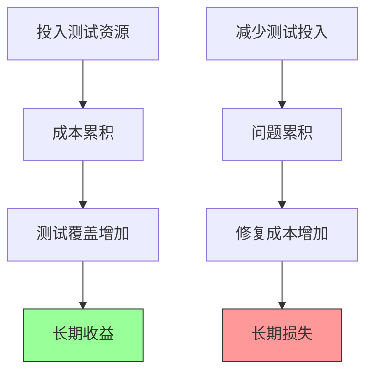
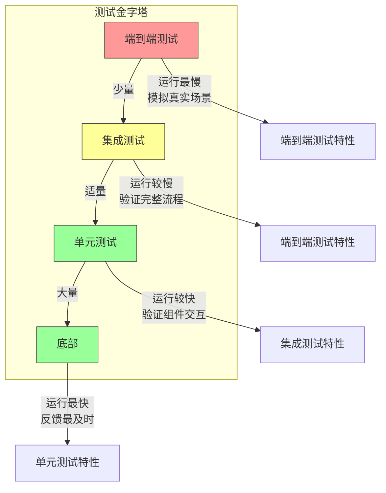
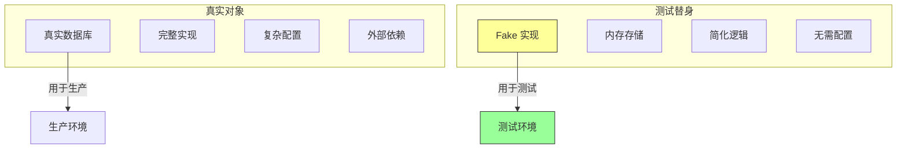
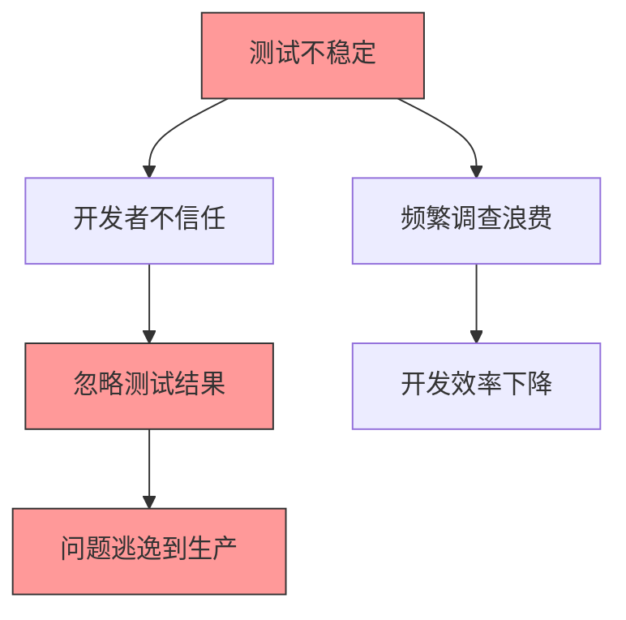
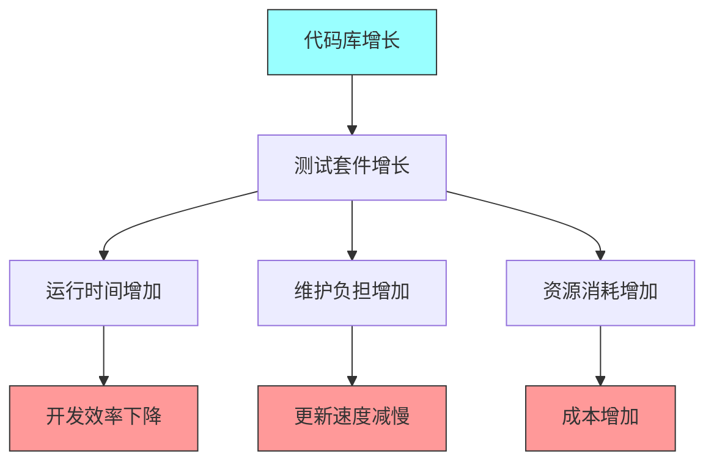

# 第四章：测试工程

## 一、测试的重要性

### 1.1 为什么测试是软件工程的核心

测试是软件工程的基石之一。没有测试的代码就像没有安全网的高空杂技，看起来很酷，但一旦失足就是灾难。在 Google，测试被视为一等公民，与功能代码享有同等的重视和资源投入。

测试的价值体现在多个层面。首先，**验证功能正确性**，确保代码按预期工作。其次，**防止回归**，当修改代码时，测试可以发现意外引入的错误。第三，**促进设计改进**，为了易于测试，代码通常需要更好的设计，如解耦、单一职责等。第四，**增强信心**，有完善测试的代码库让团队敢于进行重构和改进。

Google 的经验表明，测试投入的回报是巨大的。虽然前期需要投入时间编写测试，但后续会节省大量的调试时间和问题修复成本。一个完善的测试套件可以让团队快速迭代，而不用担心引入难以发现的问题。

### 1.2 测试的经济学

测试是一种投资，需要平衡成本和收益。过度测试和测试不足都会带来问题。理解测试的经济学有助于做出正确的决策。

**测试成本**包括编写测试的时间、维护测试的时间、运行测试的时间（CI 时间）、测试失败时调查的时间。**测试收益**包括提前发现问题的收益、减少手动测试的收益、增强重构信心的收益、降低生产事故的收益。

**图解说明**：测试投入的长期收益与短期成本的权衡。前期投入测试资源会产生长期的收益回报，而减少测试投入会导致问题累积和更高的长期损失。

### 1.3 测试文化的建设

在 Google，测试不仅是一套实践，更是一种文化。从新员工入职第一天起，测试就被强调为开发过程的重要组成部分。代码审查会检查测试的充分性，构建系统会强制要求测试覆盖。

建设测试文化需要自上而下的支持和自下而上的认同。领导层需要认可测试的价值，提供时间和资源支持。工程师需要理解测试的重要性，愿意投入精力编写和维护测试。两者缺一不可。

## 二、测试金字塔

### 2.1 金字塔模型概述

测试金字塔是 Google 倡导的测试投入分布模型。它建议在不同层次的测试上投入不同数量的资源，从底层到顶层形成一个金字塔形状。

**图解说明**：测试金字塔展示了不同层次测试的数量分布和特性。底部是大量的单元测试，顶部是少量的端到端测试。

### 2.2 单元测试

单元测试是金字塔的基座，数量最多，运行最快，反馈最及时。一个好的单元测试应该具备以下特征：

**快速**：毫秒级完成，可以频繁运行。**独立**：不依赖其他测试，不共享状态。**确定**：每次运行结果一致，不受外部因素影响。**聚焦**：只测试一个关注点，失败时能快速定位问题。**自足**：不依赖外部系统，使用测试替身。

单元测试的粒度可以是一个函数、一个类或一个小模块。关键是测试要足够细粒度，能够快速定位问题。测试替身（Mock、Stub、Fake 等）是单元测试的重要工具，用于隔离被测试代码与其他组件的依赖。

### 2.3 集成测试

集成测试验证多个组件之间的交互。它比单元测试慢，但能发现单元测试无法发现的问题，如接口不匹配、资源竞争、配置错误等。

集成测试的典型场景包括：测试数据库交互、测试网络调用、测试模块间协作。集成测试应该专注于组件间的接口，而不是内部实现。

### 2.4 端到端测试

端到端测试从用户的角度验证完整的系统功能。它模拟真实的用户场景，使用真实（或接近真实）的依赖环境。端到端测试数量最少，运行最慢，但最能验证系统的整体行为。

端到端测试的典型场景包括：关键用户流程、支付流程、登录认证、系统集成。由于端到端测试的脆弱性和成本，应该谨慎使用，只覆盖最重要的场景。

| 测试类型 | 数量 | 运行速度 | 覆盖范围 | 典型用途 |
|---------|------|---------|---------|---------|
| 单元测试 | 最多 | 毫秒级 | 小单元 | 验证单个函数或类 |
| 集成测试 | 适中 | 秒级 | 模块交互 | 验证组件间协作 |
| 端到端测试 | 最少 | 分钟级 | 完整系统 | 验证用户场景 |

## 三、测试替身

### 3.1 测试替身的类型

测试替身（Test Doubles）是测试中用于替代真实依赖的各种对象。Google 使用多种类型的测试替身，每种适用于不同的场景：

**Dummy**（虚设对象）：仅用于填充参数，不参与任何逻辑。最简单也最常用。**Stub**（桩）：提供预设的响应，不验证交互。**Spy**（间谍）：记录交互信息，可以用于验证。**Mock**（模拟对象）：预设期望，验证交互。**Fake**（伪造对象）：提供简化的实现，功能类似但更简单。

**图解说明**：Fake 对象是真实对象的简化实现，用于测试环境。Fake 提供相似的功能但更简单、更快速、更易配置。

### 3.2 如何选择测试替身

选择测试替身需要考虑几个因素：**测试目的**、**复杂度**、**维护成本**。

如果只需要提供预设响应，Stub 就足够了。如果需要验证交互，使用 Spy 或 Mock。如果需要一个可复用的简单实现，考虑 Fake。Fake 的开发和维护成本较高，但一旦建立可以大大简化测试。

Google 的经验是，Fake 通常优于 Mock。Mock 需要设置大量期望，测试代码冗长复杂。Fake 提供真实的使用方式，测试代码更简洁自然。当然，Fake 需要与真实实现保持一致，这需要额外的工作。

### 3.3 测试替身的最佳实践

使用测试替身有一些最佳实践需要注意：

**保持简单**：测试替身应该尽可能简单，专注于测试所需的行为。过度复杂的替身本身就需要大量测试。

**隔离外部依赖**：测试替身的主要用途是隔离代码与外部系统的依赖，如数据库、网络服务、文件系统等。这些依赖通常不适合用于单元测试。

**不测试替身本身**：测试替身不需要被测试，只需要确保它正确模拟了真实对象的行为。替身的正确性通过集成测试来验证。

## 四、测试的可达性与稳定性

### 4.1 什么是可达性

测试可达性（Test Accessibility）是指测试是否能够覆盖代码的所有路径。如果代码有分支没有被测试覆盖，就存在可达性问题。不可达的测试意味着潜在的风险。

可达性问题通常源于几个原因：**条件永远为真或假**、**异常处理没有被测试**、**私有方法难以直接测试**、**复杂的状态组合难以触发**。

提高可达性需要仔细分析代码逻辑，识别可能的路径。边界条件、错误处理、状态转换都是常见的测试盲点。

### 4.2 什么是稳定性

测试稳定性（Test Stability）是指测试结果的一致性。不稳定的测试会随机失败或flake（时好时坏），严重影响测试套件的可信度和开发效率。

测试不稳定的常见原因包括：**时序依赖**（测试执行顺序影响结果）、**资源竞争**（多线程访问共享资源）、**外部依赖不稳定**（网络延迟、服务不可用）、**随机数据**（使用随机数导致不同结果）、**状态泄露**（测试之间共享状态）。

**图解说明**：测试不稳定会引发一系列负面后果，最终导致问题逃逸到生产环境。

### 4.3 处理不稳定的测试

当发现不稳定的测试时，应该及时处理，而不是忽略它。Google 的做法是：**修复**（找到根本原因并修复）、**隔离**（将不稳定的测试移到单独的套件）、**删除**（如果无法修复且价值不高，直接删除）。

防止不稳定测试的最佳实践是：避免测试之间的共享状态、使用时间容忍的断言、避免时序依赖、使用确定性数据。

## 五、大规模测试套件的管理

### 5.1 测试套件的增长挑战

随着代码库的增长，测试套件也会增长。这带来了一系列挑战：

**运行时间增长**：更多的测试意味着更长的运行时间。如果单元测试运行需要数小时，开发效率会严重受影响。**维护负担增加**：测试代码需要与生产代码同步更新，过时的测试会增加负担。**脆弱性增加**：大型测试套件更容易出现不稳定测试。**资源消耗**：测试运行消耗计算资源，需要考虑成本。

**图解说明**：测试套件增长带来的一系列挑战，最终影响开发效率和成本。

### 5.2 优化测试运行时间

优化测试运行时间是保持开发效率的关键。Google 采用了多种策略：

**并行化**：将测试分散到多台机器上同时运行。Google 的测试基础设施支持大规模并行测试执行。**分层测试**：根据变更类型运行不同层次的测试。小变更只运行单元测试，全量变更运行完整测试套件。**按需加载**：只运行受变更影响的测试，而非所有测试。**测试选择**：智能选择需要运行的测试，减少冗余。

### 5.3 测试的维护与清理

测试代码也是代码，需要被维护。Google 的做法包括：

**定期清理**：删除过时的测试、更新陈旧的测试、修复不稳定的测试。这项工作应该定期进行，而不是等到问题严重。**测试评审**：代码审查不仅审查生产代码，也审查测试代码。确保测试质量与生产代码同等重要。**测试债务**：像对待技术债务一样对待测试债务，定期偿还。

## 六、Google 的测试基础设施

### 6.1 测试框架

Google 内部开发了多种测试框架，支持不同语言和测试类型。Test Solutions 团队负责开发和维护这些框架，确保它们满足 Google 的需求。

### 6.2 测试执行平台

Google 的大规模代码库需要大规模的测试执行基础设施。测试分布在数千台机器上执行，支持数百万个测试的并行运行。这个基础设施是 Google 软件工程能力的重要支撑。

### 6.3 测试结果分析

测试结果需要被收集、分析、可视化。Google 有专门的系统来追踪测试结果，识别趋势，发现问题。测试失败会立即通知相关团队，确保问题被及时处理。

## 七、行为驱动测试

### 7.1 什么是行为驱动测试

行为驱动测试（Behavior-Driven Testing，BDT）是一种测试方法，强调从用户行为的角度编写测试。测试描述的不是实现细节，而是期望的系统行为。

BDT 的好处是测试更接近需求，更容易被非技术人员理解。当需求变化时，测试可以快速更新以反映新的期望。

### 7.2 在 Google 的应用

Google 在某些项目中使用 BDT 方法，特别是在需求明确、变更频繁的领域。BDT 帮助团队保持测试与需求的一致性。

## 八、测试与持续集成

### 8.1 测试在 CI 中的角色

在持续集成（CI）流程中，测试是最重要的质量关卡。每次代码提交都会触发自动化测试，只有通过所有测试的提交才能被合并。

CI 中的测试通常包括：快速验证的单元测试、基本的集成测试、关键的端到端测试。全面的测试套件可能需要更长时间，通常在专门的验证环境中运行。

### 8.2 处理 CI 测试失败

当 CI 测试失败时，应该立即处理，而不是忽略它。Google 的做法是：**阻止提交**（失败的提交不应该被合并）、**快速反馈**（失败信息应该清晰详细）、**优先处理**（测试失败应该是最高优先级的问题）。

## 九、总结与启示

### 9.1 核心要点回顾

测试是软件工程的核心实践。测试金字塔指导测试资源的分配。测试替身帮助隔离依赖，提高测试效率。测试的可达性和稳定性是测试质量的关键。大规模测试套件需要专门的优化和维护。

### 9.2 对个人的建议

作为工程师，应该重视测试，将它视为开发过程的一部分，而不是事后补充。编写高质量的测试，修复不稳定的测试，定期清理过时的测试。让测试成为你的安全网和自信心的来源。

### 9.3 对团队的建议

作为团队，应该建立测试文化，让测试成为开发的标准实践。提供测试基础设施的支持，让编写和运行测试变得容易。定期审查测试的质量，及时处理问题。将测试债务视为真正的技术债务，定期偿还。

---

## 课后思考

1. 你的团队的测试金字塔是否平衡？是否存在测试层次失调的问题？

2. 你的团队如何处理不稳定的测试？是否有明确的处理流程？

3. 你的团队的测试运行时间是否在可接受范围内？有哪些优化空间？

4. 你的团队是否有测试债务？计划如何偿还？

5. 你的团队是否建立了有效的测试文化？如何进一步培养？

---

*本章精读笔记完成*
