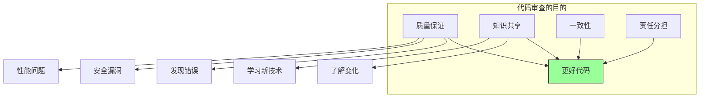
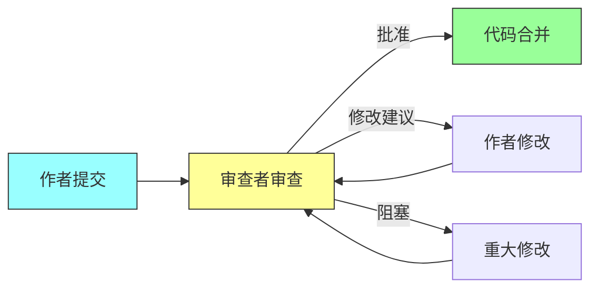
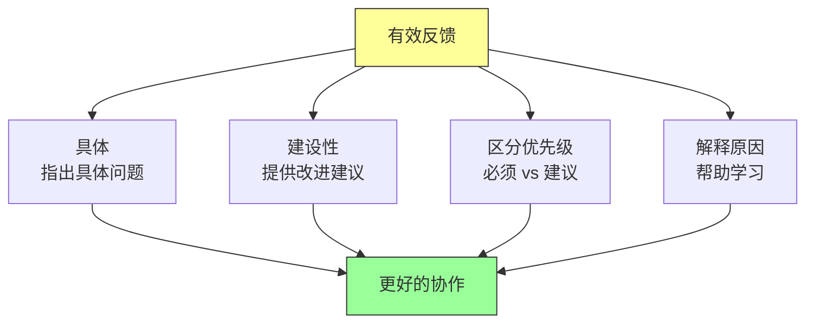

# 第五章：代码审查

## 一、代码审查的哲学

### 1.1 代码审查的本质

代码审查（Code Review）是 Google 最重要的质量保证机制之一。几乎所有的代码变更在提交前都需要经过至少一位其他工程师的审查。这个过程不仅保证了代码质量，还促进了知识传播和团队协作。

代码审查的本质是**人与人之间的技术交流**。审查者通过阅读代码来理解作者的意图，作者通过审查者的反馈来改进代码。这种交流是建设性的，目的是产出更好的代码，而不是证明谁对谁错。

### 1.2 代码审查的目的

代码审查有多个目的，它们同等重要：

**质量保证**：发现代码中的错误、漏洞、性能问题。**知识共享**：让团队成员了解代码库的变化，学习新的技术和模式。**一致性**：确保代码符合团队的编码标准和设计原则。**责任分担**：代码的最终质量是整个团队的责任，而不仅仅是作者的责任。

**图解说明**：代码审查的多个目的最终汇聚到「更好代码」这个核心目标。

### 1.3 代码审查的价值观

Google 的代码审查建立在几个核心价值观之上：

**尊重**：审查者和作者相互尊重，把对方当作想要做好工作的专业人士。**效率**：审查应该快速完成，不阻塞开发流程。**清晰**：反馈应该明确具体，避免模糊和歧义。**学习**：审查是学习的机会，审查者和作者都可以从中成长。

## 二、代码审查的流程

### 2.1 提交审查

当作者准备好代码变更后，通过审查系统提交审查。提交时需要填写变更说明，解释这次变更的目的和主要内容。好的变更说明帮助审查者快速理解上下文。

变更说明应该包括：**这次变更解决了什么问题或实现了什么功能**，**主要的修改点是什么**，**有什么特别需要审查者注意的地方**，**相关的背景信息或设计文档**。

### 2.2 审查过程

审查者阅读代码，给出反馈。反馈可以是：

**批准**（LGTM - Looks Good To Me）：代码可以提交，不需要进一步修改。**修改建议**：代码基本可以接受，但有一些小问题需要修改。**阻塞**：代码有重大问题，需要作者修改后才能继续。

审查者应该在合理时间内完成审查。Google 的期望是，大多数审查在 24 小时内完成。如果需要更长时间，审查者应该告知作者。

### 2.3 解决反馈

作者根据审查者的反馈修改代码。修改完成后，再次提交给审查者审查。这个过程可能来回多次，直到代码被批准。

重要的是，**反馈应该被认真对待**。即使作者不同意某个反馈，也应该讨论清楚，而不是简单忽略。讨论的目的不是分出胜负，而是产出最好的代码。

**图解说明**：代码审查的流程图。正常的流程是作者提交、审查者批准、代码合并。当有反馈时，会回到作者修改。

## 三、作为审查者

### 3.1 审查的重点

好的审查者知道应该关注什么。审查的重点应该按优先级排列：

**正确性**：代码是否正确解决了问题？逻辑是否有漏洞？边界条件是否处理？**设计**：代码的结构是否合理？是否遵循设计原则？是否与其他部分一致？**可读性**：代码是否容易理解？命名是否清晰？逻辑是否简洁？**测试**：是否有足够的测试？测试是否有效？边界条件是否覆盖？

不应该过度关注的事情：代码风格（应该由工具自动检查）、个人偏好（如果代码正确且可读，就接受）、无关紧要的细节（不阻塞小问题）。

### 3.2 给出有效的反馈

有效的反馈应该具备以下特征：

**具体**：指出具体的问题，而不是泛泛而谈。说「这个变量名 `x` 不够清晰，建议改成 `userCount`」比说「命名需要改进」更有帮助。

**建设性**：不仅指出问题，还提供改进建议。说「可以考虑使用 Map 而不是 List 来提高查找效率」比说「这个实现效率低」更有帮助。

**区分优先级**：区分必须修改的问题和建议改进的问题。使用清晰的标注，如「必须修改」和「建议考虑」。

**解释原因**：说明为什么这是个问题，帮助作者学习和成长。

**图解说明**：有效的反馈应该具备的具体特征，最终促进更好的协作。

### 3.3 处理分歧

审查过程中可能出现分歧。处理分歧的原则是：

**关注代码**：讨论应该集中在代码本身，而不是人。说「这段代码可能有性能问题」比说「你这段代码写得不好」更容易被接受。

**用数据说话**：如果可能，用数据或实验来支持你的观点。基准测试、用户反馈、安全审计报告都可以作为依据。

**寻求共识**：目标是达成共识，而不是分出胜负。如果双方都有一定道理，可以考虑折中方案。

**升级处理**：如果无法达成共识，可以寻求第三方的意见。团队领导、技术专家都可以帮助调解。

## 四、作为作者

### 4.1 准备提交

在提交审查前，作者应该先自我审查一遍。检查代码是否完整、是否通过了所有测试、是否符合编码标准。

好的 CL（变更列表）应该：包含一个清晰的描述、有合理的粒度（不太大也不太小）、只包含相关的修改、已经有足够的自测。

### 4.2 响应反馈

当收到审查反馈时，应该：

**理解反馈**：仔细阅读每条反馈，确保理解审查者的意思。如果有不清楚的地方，礼貌地请求解释。**及时响应**：尽快处理反馈，不要让审查积压。**展示努力**：当修改代码时，回应每条反馈，说明做了什么修改。

### 4.3 处理不合理的反馈

有时候收到的反馈可能不合理或错误。这时候应该：

**保持冷静**：不要立即防御性地回应。先理解反馈的出发点。**澄清误解**：如果审查者误解了代码，说明你的意图。可能需要更清楚地解释。**提供证据**：如果审查者的建议不正确，提供证据支持你的观点。**礼貌坚持**：如果经过讨论仍然分歧，礼貌地坚持你的立场，但保持开放。

## 五、大型变更的审查

### 5.1 拆分为小 CL

大型代码变更应该被拆分成多个小的 CL。每个 CL 应该：

**自包含**：可以独立理解、审查、测试、部署。**逻辑完整**：完成一个明确的功能或修复。**规模适中**：通常不超过 400 行代码。

拆分大型变更有几个好处：审查更快更有效、问题更容易定位、回滚更容易、合并冲突更少。

### 5.2 概述和依赖说明

当有多个相关的 CL 时，应该提供：

**总体概述**：解释这一系列 CL 的目的和整体设计。**依赖关系**：说明 CL 之间的依赖顺序。**上下文**：提供相关的设计文档或讨论链接。

### 5.3 渐进式审查策略

对于特别大的变更，可以采用渐进式审查策略：

**设计评审**：先提交设计文档，获得设计层面的批准。**原型评审**：实现一个简化的原型，获得架构层面的认可。**完整评审**：实现完整功能，提交完整代码审查。

## 六、代码审查的工具

### 6.1 审查系统

Google 使用自研的代码审查系统（类似 Gerrit 或 Phabricator）。好的审查系统应该支持：

**差异比较**：清晰显示修改前后的代码差异。**评论和回复**：审查者可以添加评论，作者可以回复。**状态追踪**：显示审查的当前状态和历史。**通知**：当状态变化时通知相关人员。

### 6.2 自动化检查

在人工审查之前，自动化检查可以捕获很多问题：

**静态分析**：检查代码风格、潜在错误、安全漏洞。**测试运行**：确保代码通过了单元测试。**依赖检查**：确保没有引入有问题的依赖。

自动化检查不通过时，代码不应该进入人工审查阶段。这保证了人工审查集中在更复杂的问题上。

## 七、代码审查的度量

### 7.1 审查效率

审查效率可以用以下指标衡量：

**审查时间**：从提交到批准的时间。**往返次数**：审查来回的次数。**审查大小**：每次审查的代码量。

这些指标帮助识别审查流程中的瓶颈。过长的审查时间可能是审查者太忙、CL 太大、反馈不够清晰等原因。

### 7.2 审查质量

审查质量更难量化，但可以通过以下方式评估：

**代码质量趋势**：代码质量是否在改善？**问题逃逸率**：有多少问题在审查中没有发现，后来才暴露？**开发者满意度**：开发者对审查过程的满意度如何？

## 八、总结与启示

### 8.1 核心要点回顾

代码审查是 Google 质量保证的核心机制。审查是建设性的交流，目的是产出更好的代码。审查者应该关注正确性、设计、可读性、测试。好的反馈应该是具体、建设性、区分优先级的。大型变更应该拆分成小的 CL。

### 8.2 对个人的建议

作为审查者，认真对待审查，给出建设性的反馈。作为作者，准备好代码，积极响应反馈，把审查当作学习的机会。

### 8.3 对团队的建议

建立清晰的审查规范和期望。投资于审查工具，让审查更高效。定期回顾审查流程，识别改进点。

---

## 课后思考

1. 你的团队的代码审查流程是什么？效率如何？

2. 作为审查者，你通常关注什么？如何给出有效的反馈？

3. 作为作者，你如何准备代码变更？如何处理审查反馈？

4. 你的团队是否有审查积压的问题？如何解决？

---

*本章精读笔记完成*
