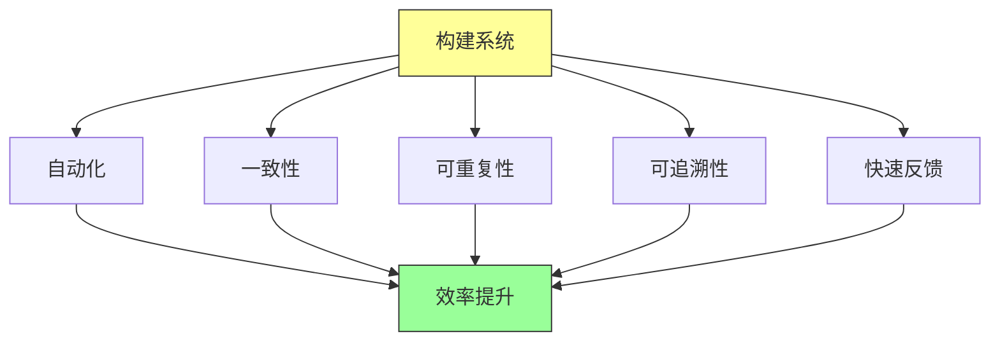
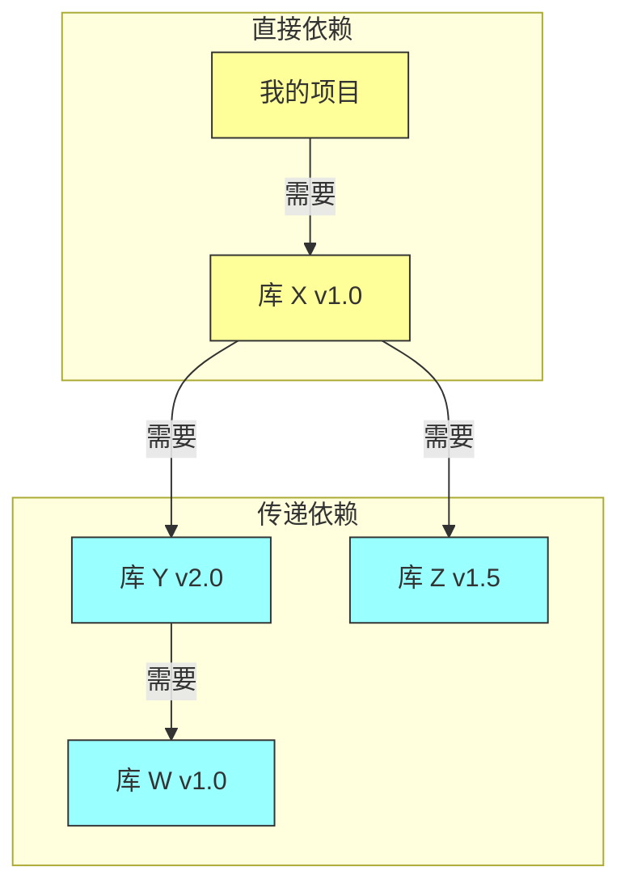

# 第六章：构建系统与构建哲学

## 一、构建系统的重要性

### 1.1 什么是构建

构建是将源代码转换为可执行程序或可部署包的过程。它包括编译代码、打包资源、运行测试、生成文档等步骤。对于大型项目，构建是一个复杂的过程，需要专门的工具来管理。

在 Google，每天有数万次构建发生。构建系统必须能够处理这种规模的请求，同时保证快速、可靠、可重复。构建系统的质量直接影响开发效率。

### 1.2 构建系统的价值

好的构建系统带来多方面的价值：

**自动化**：减少手动操作，避免人为错误。**一致性**：确保每个人使用相同的构建过程。**可重复性**：同样的源代码产生同样的输出。**可追溯性**：可以追踪每个构建使用的源代码和依赖。**快速反馈**：快速构建让开发者及时得到反馈。

**图解说明**：构建系统的多个特性共同作用，提升整体开发效率。

### 1.3 构建系统的演进

构建系统从简单的命令行脚本发展到复杂的分布式系统。Google 的构建系统（Blaze）也是长期演进的产物。

早期的构建工具如 Make 只处理文件依赖，无法满足大型项目的需求。现代构建系统如 Bazel、Gradle 提供了更强大的功能，包括增量构建、分布式构建、依赖解析等。

## 二、Google 的构建系统

### 2.1 Bazel 简介

Bazel 是 Google 内部构建系统 Blaze 的开源版本。它被设计用来处理 Google 规模的构建需求，支持多种编程语言和平台。

Bazel 的核心概念包括：

**Workspace**：代码的工作目录，包含构建定义文件。**Target**：构建的目标，如二进制文件、库、测试等。**Rule**：定义如何构建目标的规则，如 cc_library、java_binary。**Dependency**：目标之间的依赖关系。

### 2.2 声明式构建

Bazel 使用声明式的构建语言。你描述你想要什么（构建目标），而不是如何构建它（命令式脚本）。这带来几个好处：

**正确性**：Bazel 可以精确计算依赖，只重新构建需要的内容。**可缓存性**：相同的输入产生相同的输出，结果可以被缓存和复用。**并行性**：依赖分析后，可以并行执行独立的构建任务。

**图解说明**：声明式构建与命令式构建的对比。声明式构建让系统优化执行，命令式构建每次可能重复工作。

### 2.3 远程构建与缓存

Bazel 支持远程构建和缓存。构建可以在远程机器上执行，结果被缓存起来供团队共享。这对于大型团队特别有价值。

**远程执行**：构建任务在专用机器上执行，不占用开发者机器的资源。**共享缓存**：构建结果被缓存，团队成员可以复用。**一致性**：所有开发者使用相同的构建环境和缓存。

## 三、构建最佳实践

### 3.1 快速构建

构建速度是开发效率的关键。Google 的目标是让单元测试在几分钟内完成，让完整构建在合理时间内完成。

提高构建速度的策略：

**增量构建**：只构建改变的内容，而不是每次都全量构建。**并行构建**：充分利用多核 CPU，同时执行独立的任务。**分布式构建**：将构建任务分散到多台机器。**优化依赖**：减少不必要的依赖，简化依赖结构。

### 3.2 可靠的构建

构建应该是可靠的，同样的源代码应该总是产生同样的输出。不可靠的构建会浪费大量时间在调试「在我机器上可以」的问题上。

保证构建可靠性的方法：

**隔离环境**：使用容器或虚拟机确保构建环境一致。**明确依赖**：指定依赖的确切版本，而不是使用「最新」。**不可变输入**：源代码和依赖一旦确定就不应该改变。**全面测试**：在构建后运行测试，验证输出正确性。

### 3.3 简化构建配置

构建配置应该尽可能简单。复杂的构建配置难以维护，容易出错。

**避免复杂的条件逻辑**：构建配置应该清晰直接，避免过多的 if-else。**统一构建工具**：减少使用不同构建工具，让构建流程一致。**清晰的命名**：目标命名清晰，让人容易理解。

## 四、依赖管理

### 4.1 依赖的挑战

依赖管理是构建系统的核心挑战之一。代码依赖外部库，这些库又可能依赖其他库，形成复杂的依赖图。

依赖带来的问题：

**版本冲突**：不同库需要同一依赖的不同版本。**传递依赖**：直接依赖可能引入意想不到的传递依赖。**安全漏洞**：依赖库可能有安全漏洞。**维护负担**：需要保持依赖的更新。

**图解说明**：项目的直接依赖会引入传递依赖，形成复杂的依赖图。

### 4.2 Google 的依赖管理

Google 使用单仓库模式，依赖管理相对简单。所有代码在同一仓库中，依赖通过源码引用而不是包版本。

这种方式的好处：

**无版本冲突**：所有代码使用同一版本的依赖。**直接修改**：可以直接修改依赖代码。**统一更新**：依赖更新可以一次完成。**易于追踪**：可以追踪依赖的使用情况。

### 4.3 外部依赖

对于必须使用外部依赖的情况（如开源库），Google 有专门的策略：

**版本固定**：指定依赖的确切版本。**安全审查**：外部依赖需要经过安全审查。**镜像维护**：维护依赖的内部镜像，确保可用性。**定期更新**：定期检查和更新依赖，修复安全漏洞。

## 五、构建安全

### 5.1 供应链安全

构建系统是软件供应链的关键环节。如果构建过程被攻击，恶意代码可能被注入到软件中。

供应链安全的威胁：

**恶意依赖**：依赖库被攻击者篡改。**构建脚本注入**：构建脚本被植入恶意代码。**构建环境被攻破**：构建机器被攻击者控制。**缓存投毒**：构建缓存被污染。

### 5.2 Google 的安全实践

Google 采用多层防御策略保护构建过程：

**依赖审查**：外部依赖需要经过审查。**隔离构建**：构建在隔离环境中执行。**签名验证**：构建产物有数字签名。**审计日志**：构建操作有完整的审计日志。

**图解说明**：多层防护确保构建过程的安全。

## 六、持续集成与构建

### 6.1 CI 中的构建

在持续集成流程中，构建是核心环节。每次代码提交都触发构建，验证代码可以正确编译和测试。

CI 构建与开发者本地构建的区别：

**全面性**：CI 构建通常运行完整的测试套件。**一致性**：CI 环境是标准化的，不依赖开发者的本地配置。**可重复性**：CI 构建使用确定的配置和依赖。

### 6.2 构建失败的处理

构建失败应该被及时处理。Google 的实践是：

**阻止合并**：构建失败的代码不应该被合并。**快速反馈**：构建失败应该立即通知相关开发者。**优先处理**：构建失败应该是最高优先级的问题。**分析根因**：不仅修复失败，还要分析原因，防止再次发生。

## 七、构建系统的演进

### 7.1 构建系统的迁移

构建系统的迁移是重大工程。需要考虑：

**兼容性**：新旧系统需要一段时间共存。**渐进迁移**：可以先迁移一部分项目。**工具适配**：构建规则需要重新编写。**培训支持**：开发者需要学习新工具。

### 7.2 新技术的支持

构建系统需要支持新的编程语言、新的构建工具、新的部署方式。Google 的构建系统不断演进，以支持新的需求。

支持新技术的策略：

**扩展性**：构建系统应该易于扩展。**模块化**：不同语言的支持应该是独立的模块。**社区贡献**：开源社区可以贡献新语言的支持。

## 八、总结与启示

### 8.1 核心要点回顾

构建系统是软件工程的基石。Bazel 是 Google 构建系统的开源版本。快速、可靠、安全是构建系统的关键特性。依赖管理需要系统性的方法。

### 8.2 对个人的建议

理解构建系统的工作原理，能够排查构建问题。遵循构建最佳实践，保持构建配置简单。重视构建安全，使用可信的依赖。

### 8.3 对团队的建议

投资于构建基础设施，这是每天都在使用的工具。建立构建安全的实践，保护软件供应链。持续优化构建性能，提升开发效率。

---

## 课后思考

1. 你的团队使用什么构建系统？构建速度如何？

2. 你的团队如何管理依赖？有什么最佳实践？

3. 你的构建系统是否安全？如何保护供应链？

4. CI 构建与本地构建有什么异同？

---

*本章精读笔记完成*
