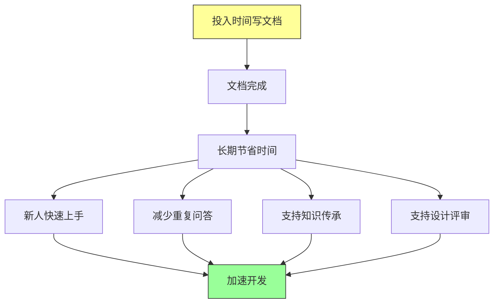
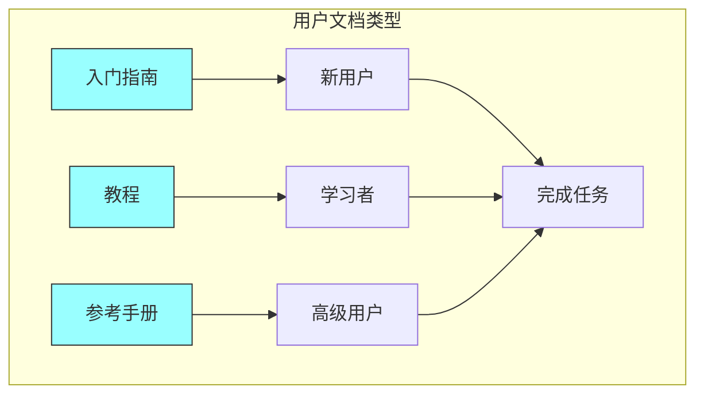
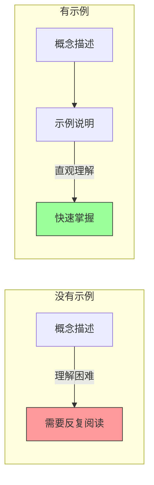
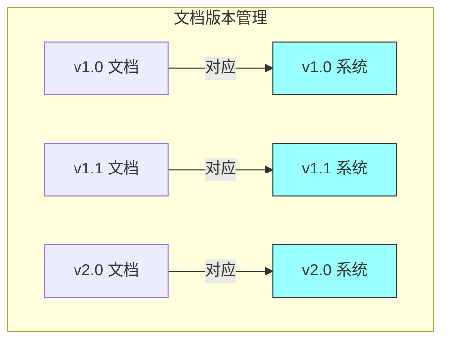

# 第七章：文档工程

## 一、文档的重要性

### 1.1 文档即代码

在 Google，文档被视为代码的一部分。好的文档与好的代码同等重要。文档不是事后补充，而是开发过程的有机组成部分。

这种理念体现在多个方面。文档与代码放在一起，通过相同的版本控制系统管理。文档的修改经过代码审查，确保质量。文档使用特定格式（如 Markdown），便于渲染和搜索。文档有专门的工具支持生成和发布。

文档即代码的理念带来了几个重要好处。首先，文档可以随代码一起演进，不会与代码脱节。其次，文档的修改会经过审查，保证质量。第三，文档可以自动生成，保持与代码同步。第四，文档成为团队知识管理的一部分。

### 1.2 文档的投资回报

编写文档需要时间，但这是一项值得的投资。好的文档可以节省大量的时间和精力。以下是文档的主要收益：

**加速新人上手**：新成员可以通过阅读文档快速了解系统，而不需要逐一询问。**减少重复问答**：常见问题的答案在文档中，不需要反复回答。**支持决策**：设计文档记录了决策的背景和理由，帮助后来者理解。**促进知识传承**：关键知识被记录下来，不会因为人员变动而丢失。

**图解说明**：编写文档的前期投入会在长期带来多方面的收益，最终加速整个开发过程。

### 1.3 文档的读者

写文档时，首先要考虑的是读者。不同的读者有不同的需求和背景。好的文档会明确它的目标读者，并针对这些读者进行优化。

**新用户**：需要入门指南，快速了解系统的基本使用方法。**普通用户**：需要功能文档，了解如何使用各种功能。**高级用户**：需要深入文档，了解高级功能和最佳实践。**开发者**：需要 API 文档和架构文档，了解系统内部实现。**运维人员**：需要部署文档和故障处理文档。

## 二、文档的类型

### 2.1 设计文档

设计文档记录系统的重要设计决策。它回答「为什么」和「是什么」的问题，而不仅仅是「怎么做」。

一个好的设计文档应该包括：**背景和问题陈述**（为什么需要这个设计）、**目标和约束**（要解决什么问题，有什么限制）、**方案描述**（核心设计是什么）、**替代方案**（为什么选择这个方案而不是其他）、**决策和理由**（关键的决策点和依据）、**开放问题**（尚未解决的问题）。

设计文档在设计阶段编写，经过评审后作为系统的权威参考。随着系统演进，设计文档需要同步更新。

### 2.2 用户文档

用户文档面向使用系统的用户，帮助他们完成各种任务。用户文档应该从用户的角度出发，使用用户熟悉的语言。

用户文档的常见类型包括：**入门指南**（快速上手的步骤）、**教程**（通过示例学习）、**参考手册**（详细的功能说明）、**故障排除**（常见问题和解决方案）。

**图解说明**：不同类型的用户文档服务于不同阶段的用户，共同帮助用户完成任务。

### 2.3 代码文档

代码文档包括代码注释、API 文档、代码示例等。好的代码文档应该补充代码，让代码更容易理解。

代码注释应该解释「为什么」，而不是「是什么」。如果代码的意图不明显，或者有特殊的考虑，就值得添加注释。过于明显的注释反而会增加阅读负担。

API 文档描述接口的契约，包括参数、返回值、异常、使用示例等。Google 使用特定的工具从代码注释生成 API 文档。

### 2.4 运维文档

运维文档帮助运维团队管理系统的运行。它包括部署步骤、配置说明、监控指标、故障处理流程等。

运维文档的关键是准确性。部署步骤必须精确可执行，配置说明必须与实际配置一致。错误的运维文档会导致生产事故。

| 文档类型 | 主要读者 | 编写时机 | 更新频率 |
|---------|---------|---------|---------|
| 设计文档 | 开发者、架构师 | 设计阶段 | 中等 |
| 用户文档 | 最终用户 | 功能开发时 | 较高 |
| 代码文档 | 开发者 | 编码时 | 高 |
| 运维文档 | 运维人员 | 部署时 | 较高 |

## 三、文档的编写原则

### 3.1 清晰简洁

好的文档应该是清晰简洁的。避免冗余和废话，直接切入主题。使用简单的语言，避免不必要的术语。

清晰意味着读者能够快速理解文档的内容。简洁意味着文档没有多余的信息。两者需要平衡：过于简洁可能难以理解，过于详细可能让人失去耐心。

### 3.2 结构化

好的文档应该有良好的结构。标题层次清晰，段落主题明确，内容逻辑连贯。读者应该能够快速定位他们需要的信息。

结构化的文档更容易阅读和维护。使用列表来组织并列的信息，使用表格来展示结构化的数据，使用图表来可视化复杂的关系。

### 3.3 示例驱动

示例是文档的重要组成部分。抽象的描述往往难以理解，具体的示例可以让读者快速掌握。

好的示例应该：足够简单（不引入额外复杂性）、足够完整（可以实际运行）、有注释（解释关键点）。

**图解说明**：示例让抽象概念变得直观，大大加速读者的理解过程。

### 3.4 保持更新

最大的挑战是保持文档的更新。过时的文档比没有文档更有害，因为它会误导读者。

Google 通过几种方式解决这个问题。首先，文档与代码放在一起，修改代码时容易想到修改文档。其次，文档审查确保变更被记录。第三，定期审计文档，识别和更新过时的内容。

## 四、Google 的文档实践

### 4.1 文档审查

在 Google，重要的文档需要经过审查才能发布。文档审查与代码审查类似，关注内容是否准确、表达是否清晰、结构是否合理。

专门的文档审查员负责确保文档质量。这个角色需要技术背景和写作能力的结合。他们不仅指出问题，还提供改进建议。

### 4.2 文档工具链

Google 有完善的文档工具链，从编写到发布都有支持。文档使用特定格式编写，通过工具渲染成网页，支持搜索和导航。

工具的便利性降低了编写文档的门槛。工程师不需要花时间学习复杂的工具，只需要专注于内容。

### 4.3 文档指标

Google 追踪文档的关键指标，如文档覆盖率（有多少重要内容有文档）、文档新鲜度（文档最近更新时间）、文档访问量（有多少人阅读）。这些指标帮助识别需要改进的地方。

## 五、文档即知识的挑战

### 5.1 知识隐性与显性

有些知识是隐性的，难以用文档表达。它存在于专家的头脑中，体现在他们的判断和决策中。文档只能捕捉显性知识，无法完全替代人与人之间的交流。

解决方法是结合文档和交流。文档提供基础框架，人与人的交流填补细节和上下文。

### 5.2 文档债务

与代码债务类似，文档也会积累债务。过时的文档、缺失的文档、低质量的文档都是债务。偿还文档债务需要时间和资源的投入。

团队应该像对待代码债务一样对待文档债务，定期评估并投入资源改进。

### 5.3 文档疲劳

当文档过多或质量参差不齐时，读者会产生文档疲劳，不再信任和阅读文档。这使得即使有价值的文档也发挥不了作用。

解决方法是专注于最重要的文档，提高文档质量而非数量。少而精的文档比多而散的文档更有价值。

## 六、文档与代码的同步

### 6.1 文档随代码变更

理想情况下，文档应该随代码一起变更。当代码变更影响用户接口或行为时，相应的文档也应该更新。

Google 通过一些实践来促进这种同步。代码审查时检查相关文档是否需要更新。构建系统会检查文档与代码的一致性。文档有所有者，对文档质量负责。

### 6.2 自动化文档生成

一些文档可以从代码自动生成，如 API 文档、配置参考等。这种方式确保文档与代码保持同步，减少手动维护的工作。

自动生成的文档通常是机械的、参考性的。对于解释性的内容，如设计背景、使用指南，仍然需要人工编写。

### 6.3 文档版本管理

当系统有多个版本时，文档也需要版本化。每个版本的文档应该清晰标注，让读者找到正确版本。

**图解说明**：文档版本与系统版本对应，确保读者能找到与所用系统匹配的文档。

## 七、文档的最佳实践

### 7.1 从读者角度写作

始终从读者的角度思考：他们需要什么信息？他们已经知道什么？他们可能有什么问题？好的文档回答这些问题。

### 7.2 使用一致的格式

一致的格式让文档更容易阅读。使用统一的标题层次、列表格式、术语选择。团队应该有文档风格指南，确保一致性。

### 7.3 包含使用示例

每个功能都应该有使用示例。示例应该简洁、可运行、有注释。读者可以通过示例快速理解如何使用。

### 7.4 定期审查和更新

文档不是一次性的，而是需要持续维护的。定期审查文档的准确性和完整性，及时更新过时的内容。

## 八、总结与启示

### 8.1 核心要点回顾

文档是软件工程的重要组成部分。文档即代码的理念将文档视为代码库的一等公民。不同类型的文档服务于不同的目的和读者。保持文档更新是最大的挑战，需要持续的投入。

### 8.2 对个人的建议

作为工程师，应该重视文档，将它视为工作的一部分。编写清晰的注释，补充必要的文档，参与文档审查。让文档成为你的专业习惯。

### 8.3 对团队的建议

作为团队，应该建立文档文化，让文档成为开发的标准实践。提供文档工具的支持，让编写文档变得容易。重视文档质量，定期审查和更新。将文档债务视为真正的技术债务。

---

## 课后思考

1. 你的团队是否有系统的文档实践？文档覆盖了哪些方面？

2. 你的团队如何确保文档与代码同步？有哪些机制？

3. 你的团队是否存在文档债务？计划如何偿还？

4. 你的团队是否建立了文档审查流程？效果如何？

5. 你个人在文档方面做得如何？有哪些可以改进的地方？

---

*本章精读笔记完成*
