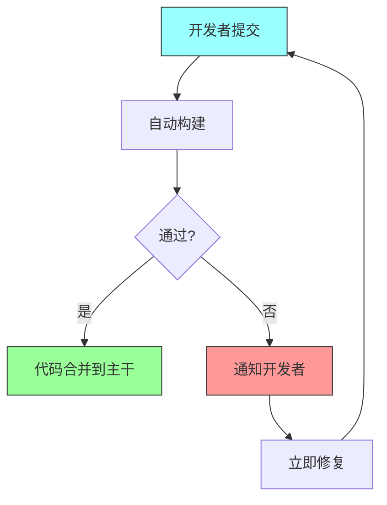

# 第八章：持续集成与持续交付

## 一、持续集成的概念

### 1.1 什么是持续集成

持续集成（Continuous Integration，CI）是一种软件开发实践，开发者频繁地将代码变更集成到共享的主干。每次集成都会触发自动化的构建和测试，以便尽早发现问题。

持续集成的核心思想是「**尽早并经常集成**」。与传统的方式相比，CI 大大缩短了从代码变更到发现问题的时间。这减少了集成冲突，降低了修复成本。

### 1.2 持续集成的原则

成功的 CI 需要遵循几个原则：

**频繁提交**：开发者每天至少提交一次代码到主干。**自动化构建**：每次提交都触发自动化构建，不需要人工干预。**快速反馈**：构建和测试应该在几分钟内完成。**立即修复**：构建失败应该立即修复，不允许积压。**保持构建绿色**：主干代码应该始终处于可发布状态。



**图解说明**：持续集成的基本流程。每次提交触发构建，通过则合并，失败则修复。

### 1.3 持续集成的收益

持续集成带来多方面的收益：

**早发现 bug**：问题在引入后很快被发现，容易定位和修复。**减少集成痛苦**：频繁的小集成比偶尔的大集成容易得多。**增强信心**：开发者知道代码始终处于可用状态。**加速迭代**：快速反馈允许更快的开发节奏。

## 二、持续交付与持续部署

### 2.1 持续交付

持续交付（Continuous Delivery，CD）确保代码始终处于可部署状态。任何时候都可以将代码部署到生产环境，而不需要额外的测试或准备工作。

持续交付的要求：

**自动化测试**：完整的自动化测试覆盖关键功能。**部署自动化**：部署过程完全自动化，一键可执行。**环境一致性**：开发、测试、生产环境尽可能一致。**随时可发布**：代码库始终处于可发布状态。

### 2.2 持续部署

持续部署是持续交付的进一步延伸。除了代码始终可部署外，还会自动将通过测试的代码部署到生产环境。

持续部署的优势是发布速度极快，用户可以很快看到新功能。但风险也更高，需要非常完善的测试和监控体系。

### 2.3 CI/CD 的关系

CI 和 CD 是相互补充的实践。CI 关注代码变更的集成和验证，CD 关注代码的交付和部署。两者共同构成了现代化的软件交付流程。

```
持续集成 (CI) → 持续交付 (CD) → 持续部署
     ↓              ↓              ↓
   代码集成       自动交付       自动部署
```

## 三、构建流水线

### 3.1 流水线设计

构建流水线（Build Pipeline）将构建过程分解为多个阶段，每个阶段执行特定的任务。典型的阶段包括：

**编译**：将源代码编译为可执行代码。**单元测试**：运行单元测试验证基本功能。**静态分析**：使用工具检查代码质量。**集成测试**：测试组件间的交互。**端到端测试**：验证完整的用户流程。**性能测试**：测量系统性能。**安全扫描**：检查安全漏洞。


**图解说明**：典型的构建流水线阶段。每个阶段都作为「门禁」，前一个阶段通过才能进入下一个。

### 3.2 阶段优化

构建流水线的各阶段需要优化，以确保整体效率：

**快速反馈在前**：把最快的检查放在前面，尽早发现问题。**并行执行**：独立的阶段可以并行执行。**按需执行**：不总是执行所有阶段，根据变更类型决定。**缓存结果**：重复使用之前的构建结果。

### 3.3 失败处理

构建失败需要及时处理：

**立即通知**：失败应该立即通知相关开发者。**阻塞流程**：失败的阶段应该阻塞后续流程。**快速修复**：构建失败应该是最高优先级。**记录和分析**：记录失败原因，用于改进。

## 四、发布策略

### 4.1 蓝绿部署

蓝绿部署维护两套相同的生产环境（蓝环境和绿环境）。一套运行当前版本，另一套准备新版本。切换时只需将流量从一套环境转到另一套。

**优点**：回滚快，两套环境完全对称。**缺点**：资源成本高，需要两套环境。

### 4.2 金丝雀发布

金丝雀发布先将新版本部署到一小部分用户（如 1%），观察没有问题后逐步扩大范围。这降低了新版本的风险。


**图解说明**：金丝雀发布逐步扩大新版本的覆盖范围，每一步都基于监控结果决定。

### 4.3 特性开关

特性开关（Feature Flag）允许在代码中控制特性的启用和禁用。新代码可以部署但不激活，需要时再打开。

**用途**：控制发布节奏、A/B 测试、快速回滚。**风险**：开关可能变得复杂，需要清理。

## 五、部署自动化

### 5.1 基础设施即代码

基础设施即代码（Infrastructure as Code）使用代码来管理基础设施配置。这使得环境可重复、可版本控制、可审计。

常用的工具包括 Terraform、CloudFormation、Pulumi 等。这些工具允许用代码定义服务器、网络、数据库等资源。

### 5.2 部署脚本

部署脚本自动化部署的步骤：

**停止服务**：优雅地停止运行中的服务。**备份数据**：确保可以回滚。**更新代码**：将新版本部署到服务器。**运行迁移**：数据库迁移等。**启动服务**：启动更新后的服务。**验证健康**：检查服务是否正常运行。

### 5.3 回滚机制

部署应该支持快速回滚。当新版本出现问题时，可以快速恢复到之前的版本。

回滚策略：

**版本记录**：保存之前版本的部署包。**一键回滚**：提供简单的回滚命令。**数据库回滚**：处理数据库变更的回滚。**验证回滚**：回滚后验证系统正常。

## 六、度量与改进

### 6.1 CI/CD 度量

CI/CD 的效果可以通过以下指标衡量：

**部署频率**：多长时间部署一次。**变更前置时间**：从代码提交到部署的时间。**恢复时间**：故障后恢复需要多长时间。**变更失败率**：部署导致故障的比例。

这些指标来自 DORA（DevOps Research and Assessment）研究，被广泛用于评估软件交付效能。

### 6.2 持续改进

CI/CD 流程需要持续改进：

**定期回顾**：分析最近的部署和问题。**自动化重复工作**：识别并自动化手动步骤。**优化瓶颈**：找出流程中的瓶颈并优化。**更新工具**：保持工具和依赖的更新。

## 七、总结与启示

### 7.1 核心要点回顾

持续集成是频繁集成代码并自动验证的实践。持续交付确保代码始终可部署。构建流水线将构建过程分阶段管理。发布策略控制新版本的发布风险。

### 7.2 对个人的建议

养成频繁提交代码的习惯。理解 CI/CD 流程，能够排查构建问题。重视构建失败，及时修复。

### 7.3 对团队的建议

投资 CI/CD 基础设施，让自动化部署更容易。采用渐进式发布策略，降低发布风险。建立度量体系，持续改进交付效能。

---

## 课后思考

1. 你的团队的 CI/CD 实践如何？部署频率和恢复时间是多少？

2. 你的团队使用什么发布策略？如何控制发布风险？

3. 你的构建流水线有哪些阶段？是否需要优化？

4. 你的团队如何处理部署失败和回滚？

---

*本章精读笔记完成*
