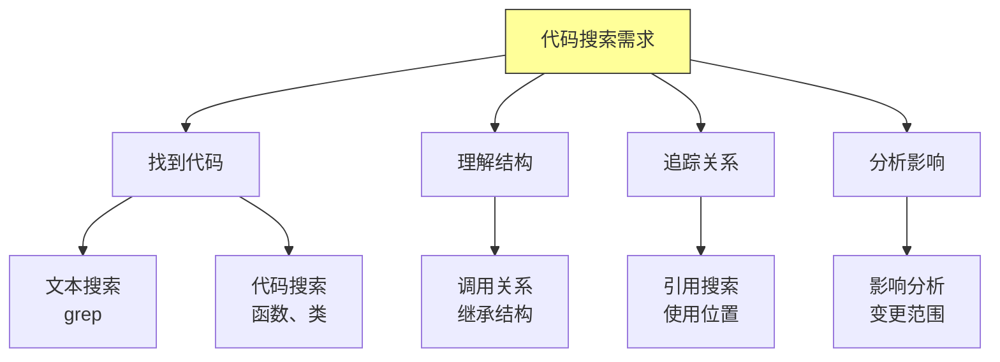
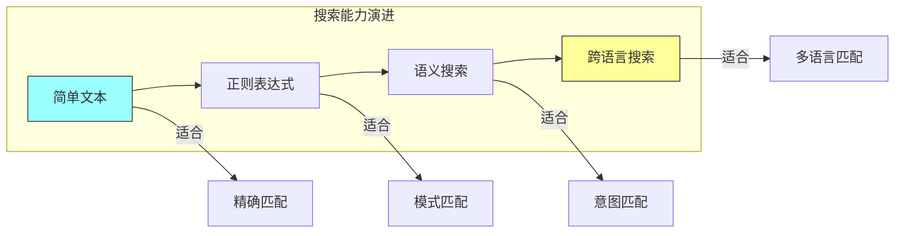

# 第九章：代码搜索与导航

## 一、代码搜索的价值

### 1.1 大规模代码库的挑战

Google 的代码库有数百万个文件，数十亿行代码。在这样的规模下，找到需要的代码、理解代码结构、追踪调用关系都是巨大的挑战。

传统的文件浏览和 grep 已经不够用了。工程师需要专门的工具来高效地搜索和导航代码库。这些工具需要理解代码的语义，而不仅仅是文本匹配。

### 1.2 代码搜索的类型

代码搜索可以分为几种类型：

**文本搜索**：在文件中搜索特定的字符串。**代码搜索**：搜索代码结构，如函数定义、类、方法。**依赖搜索**：找到使用某个函数或类的所有地方。**语义搜索**：理解代码含义的高级搜索。

**图解说明**：代码搜索的不同需求和对应的搜索类型。

### 1.3 搜索对开发效率的影响

高效的代码搜索直接影响开发效率。工程师每天花大量时间阅读和理解代码，搜索是其中重要的环节。

**减少查找时间**：快速定位需要的代码。**理解代码结构**：轻松找到相关代码。**安全重构**：全面了解变更的影响范围。

## 二、Google 的代码搜索工具

### 2.1 Code Search

Google 内部开发了 Code Search 工具，专门用于搜索大规模代码库。它提供：

**快速搜索**：在数百万文件中秒级返回结果。**语法高亮**：搜索结果显示代码语法高亮。**上下文信息**：显示文件路径、最后修改时间等。**代码预览**：可以直接查看代码内容。

### 2.2 代码浏览

除了搜索，还需要代码浏览能力。工具提供：

**文件树浏览**：层次化浏览代码结构。**符号导航**：跳转到函数、类、变量的定义。**快速打开**：通过文件名或符号快速打开文件。**历史记录**：访问最近查看的文件。

### 2.3 调用图

调用图展示函数之间的调用关系。这对于理解代码和评估变更影响非常重要。

**调用者**：哪些函数调用了当前函数。**被调用者**：当前函数调用了哪些函数。**调用深度**：多层次的调用关系。**动态调用**：运行时可能发生的调用。

## 三、搜索的高级功能

### 3.1 语义搜索

语义搜索理解代码的含义，而不仅仅是文本匹配。例如，搜索「创建用户」可以找到所有与用户创建相关的代码，即使它们使用不同的措辞。

语义搜索的实现：

**代码索引**：建立代码结构的索引。**语义理解**：理解代码的语义含义。**同义词映射**：将不同表述映射到相同概念。**上下文考虑**：考虑代码的上下文环境。

### 3.2 跨语言搜索

在多语言代码库中，需要跨语言搜索。例如，找到所有调用某个 API 的地方，无论它是用什么语言实现的。

跨语言搜索的挑战：

**语法差异**：不同语言的语法不同。**调用约定**：不同语言的调用方式不同。**名称映射**：不同语言的命名转换。

### 3.3 正则表达式搜索

正则表达式提供更强大的搜索能力。可以搜索符合特定模式的代码，如「以 get 开头的方法」或「处理错误的代码」。

**图解说明**：搜索能力从简单文本逐步演进到高级的语义和跨语言搜索。

## 四、代码导航

### 4.1 定义跳转

从代码中的符号跳转到它的定义。这是理解代码最基本也是最常用的功能。

实现原理：

**索引构建**：建立符号到定义的索引。**解析代码**：理解代码结构，识别符号。**多语言支持**：处理不同语言的语法。**增量更新**：代码变更时更新索引。

### 4.2 引用查找

找到所有使用某个定义的地方。与定义跳转相反，用于了解一个函数或变量被谁使用。

引用查找的用途：

**理解影响**：变更一个函数会影响哪些地方。**阅读代码**：了解某个功能的完整调用链。**安全重构**：全面评估重构的影响。

### 4.3 类型层次

展示类型（类）的继承层次：

**父类**：类型的直接和间接父类。**子类**：类型的所有子类。**实现接口**：类型实现的接口。**重写方法**：类型重写的方法。

## 五、搜索的组织与管理

### 5.1 代码组织

良好的代码组织使搜索更容易：

**一致的目录结构**：代码按功能模块组织。**清晰的命名**：文件名和符号名有意义。**合理的模块化**：代码分解为可管理的单元。**文档位置**：文档与相关代码放在一起。

### 5.2 元数据管理

代码的元数据帮助搜索和导航：

**所有者信息**：每个文件有明确的所有者。**依赖信息**：文件之间的依赖关系。**变更历史**：代码的修改历史。**审查信息**：代码变更的审查记录。

### 5.3 搜索结果的组织

搜索结果的组织方式影响使用效率：

**分组**：按文件、目录或其他维度分组。**排序**：按相关性、时间等排序。**过滤**：按语言、文件类型等过滤。**预览**：快速预览搜索结果的内容。

## 六、IDE 集成

### 6.1 IDE 中的代码搜索

IDE 通常内置了代码搜索和导航功能：

**项目内搜索**：在当前项目中搜索。**全局搜索**：跨多个项目搜索。**结构化搜索**：利用 AST 进行精确搜索。

### 6.2 键盘快捷键

熟练使用键盘快捷键可以大大提高效率：

**跳转定义**：Ctrl+点击或 F12。**查找引用**：Shift+F12。**最近文件**：Ctrl+E 或 Cmd+E。**快速搜索**：Ctrl+Shift+F。

### 6.3 插件扩展

IDE 可以通过插件扩展搜索功能：

**代码片段搜索**：搜索和复用代码片段。**API 文档搜索**：搜索 API 文档。**示例代码搜索**：搜索使用示例。

## 七、总结与启示

### 7.1 核心要点回顾

代码搜索是大型代码库的必需能力。不同类型的搜索满足不同的需求。语义搜索和跨语言搜索是高级能力。良好的代码组织使搜索更有效。

### 7.2 对个人的建议

熟练使用代码搜索和导航工具。掌握键盘快捷键，提高操作效率。理解代码库的组织结构。

### 7.3 对团队的建议

投资代码搜索基础设施。建立一致的代码组织规范。利用搜索数据进行代码分析。

---

## 课后思考

1. 你使用什么工具进行代码搜索？是否充分利用了其功能？

2. 你的代码库组织是否便于搜索和导航？

3. 如何使用搜索工具来安全地进行重构？

---

*本章精读笔记完成*
