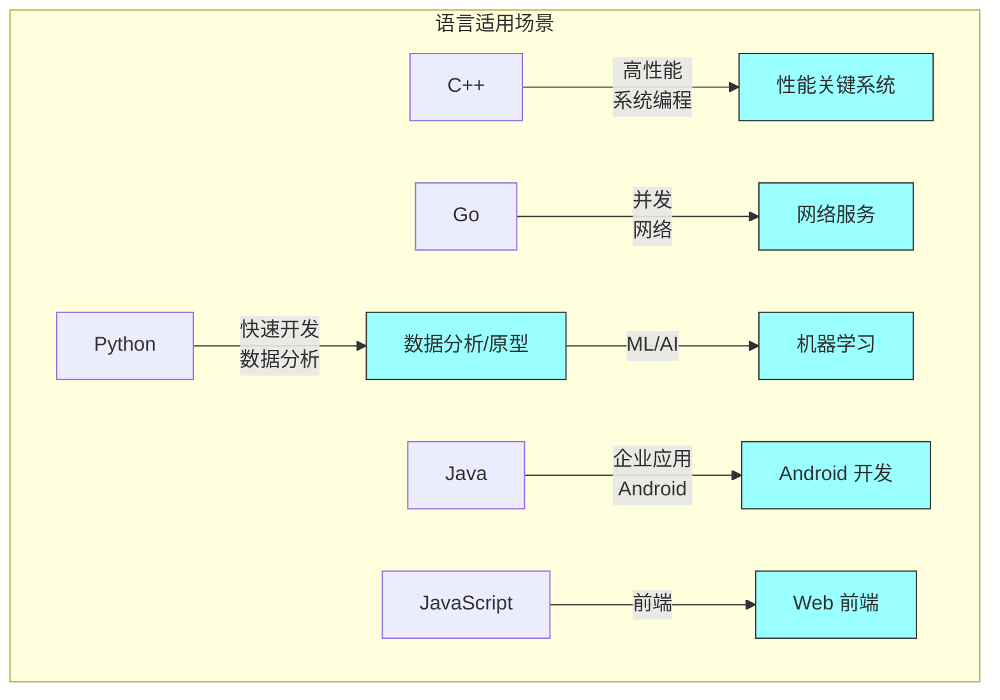
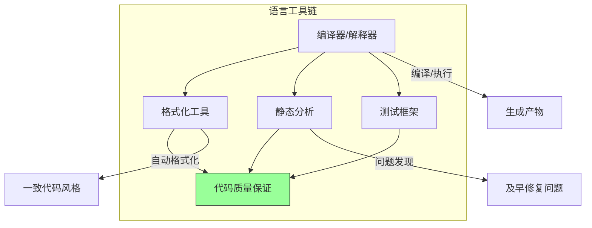

# 第十章：编程语言与生产力

## 一、Google 的语言策略

### 1.1 语言选择的原则

Google 不强制使用单一编程语言，而是根据项目需求选择合适的语言。每种语言都有自己的适用场景，选择正确的语言可以显著提高生产力。

语言选择的考虑因素：

**性能需求**：对执行速度、内存使用的要求。**生态系统**：库的可用性和成熟度。**团队技能**：团队的熟悉程度。**互操作性**：与其他系统的集成。**长期维护**：语言的稳定性和前景。

### 1.2 主要语言

Google 使用多种编程语言：

**C++**：性能关键的底层系统。**Go**：高并发的网络服务和工具。**Python**：快速原型、数据分析、机器学习。**Java**：大型企业应用、Android 开发。**JavaScript**：前端开发。

**图解说明**：不同编程语言适用于不同的场景，选择正确的语言是重要的决策。

### 1.3 语言演进

编程语言在不断演进。Google 密切关注语言的更新，评估新特性的价值和迁移成本。

语言升级的考虑：

**兼容性**：新版本是否兼容现有代码。**迁移成本**：升级需要多少工作。**性能提升**：新版本是否带来性能提升。**新特性**：新特性是否值得迁移。

## 二、语言设计模式

### 2.1 惯用法

每种语言都有自己的惯用法（Idioms）。使用语言的惯用法写出的代码更自然、更易读、更高效。

Google 维护各种语言的风格指南，定义惯用法和最佳实践。这些指南确保代码库的一致性，让开发者能够快速理解任何代码。

### 2.2 跨语言模式

在多语言系统中，需要跨语言的模式：

**接口定义**：使用 Protocol Buffers 定义语言无关的接口。**桥接代码**：在语言之间转换数据和调用。**统一错误处理**：跨语言的一致错误处理模式。

### 2.3 语言特定最佳实践

每种语言都有自己的最佳实践：

**C++**：RAII、智能指针、现代特性。**Go**：错误处理、并发模式、接口使用。**Python**：类型提示、虚拟环境、包管理。

## 三、语言工具链

### 3.1 编译器与解释器

语言工具链的核心是编译器或解释器。Google 投入资源优化这些工具，提高编译速度和错误信息质量。

**快速编译**：优化编译速度，减少开发者等待。**错误信息**：提供清晰、有帮助的错误信息。**类型检查**：静态类型检查在编译时发现问题。

### 3.2 格式化与静态分析

代码质量工具是工具链的重要部分：

**格式化工具**：自动格式化代码，保持风格一致。**静态分析**：检查潜在问题和代码异味。**linters**：特定语言的代码检查工具。

**图解说明**：语言工具链的组成部分，共同保证代码质量和开发效率。

### 3.3 依赖管理

每种语言有自己的依赖管理工具：

**Python**：pip、requirements.txt。**Java**：Maven、Gradle。**Go**：go mod。**C++**：Bazel 的依赖管理。

## 四、生产力度量

### 4.1 开发效率

如何度量开发效率是一个挑战。Google 使用多种指标：

**代码吞吐量**：单位时间产出的代码量。**功能交付速度**：从需求到交付的时间。**缺陷率**：代码中的缺陷密度。**代码审查时间**：审查代码变更所需的时间。

### 4.2 生产力因素

影响生产力的因素：

**工具质量**：好的工具提高效率。**流程效率**：流程的顺畅程度。**知识获取**：找到信息需要的时间。**协作效率**：团队协作的效率。

### 4.3 持续改进

生产力需要持续改进：

**定期评估**：定期评估当前的效率。**识别瓶颈**：找出最大的效率障碍。**实验改进**：尝试不同的改进方法。**度量效果**：验证改进的效果。

## 五、语言安全

### 5.1 类型安全

类型安全是防止错误的重要手段：

**静态类型**：编译时检查类型正确性。**动态类型**：运行时检查类型。**类型推断**：减少显式类型标注。

Google 倾向于使用静态类型语言，或在动态语言中使用类型注解（如 Python 的 type hints）。

### 5.2 内存安全

内存安全是另一个重要的安全考虑：

**自动内存管理**：垃圾回收避免内存泄漏。**安全语言**：Rust 等语言从设计上保证内存安全。**工具检测**：使用工具检测内存问题。

### 5.3 并发安全

并发程序的正确性更难保证：

**线程安全**：正确处理多线程访问。**避免竞争**：设计和代码层面避免数据竞争。**并发测试**：测试并发场景。

## 六、总结与启示

### 6.1 核心要点回顾

Google 使用多种编程语言，每种语言有自己的适用场景。语言的惯用法和最佳实践提高代码质量。工具链对开发效率有重要影响。

### 6.2 对个人的建议

深入学习你使用的语言，掌握其惯用法和最佳实践。保持对新语言特性的了解，适时采用有用的特性。

### 6.3 对团队的建议

建立语言风格指南，确保代码一致性。投资工具链，让开发者更高效。定期评估语言选择是否仍然合适。

---

## 课后思考

1. 你的团队使用什么编程语言？为什么选择这些语言？

2. 你的团队是否有语言风格指南？执行情况如何？

3. 语言工具链是否满足团队的需求？有哪些改进空间？

---

*本章精读笔记完成*
