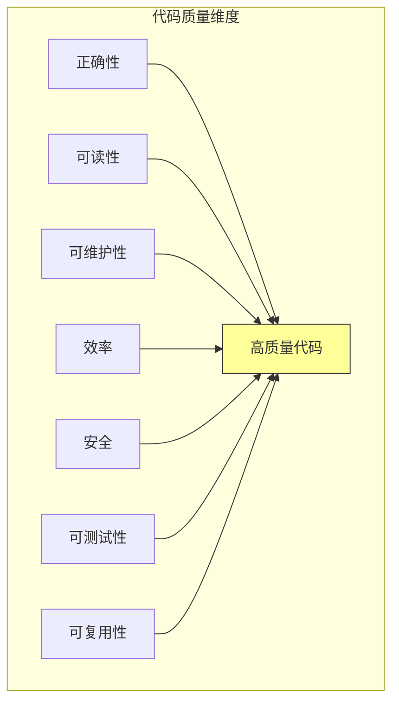
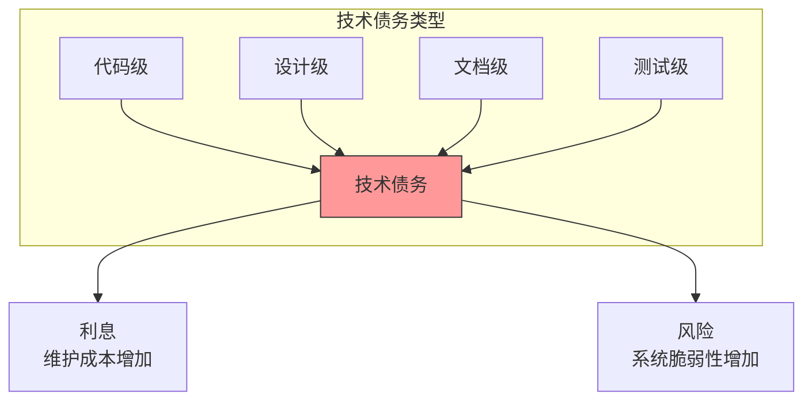

# 第十一章：代码质量与健康度

## 一、代码质量的定义

### 1.1 什么是高质量代码

高质量代码不仅能工作，更应该易于理解、维护和扩展。Google 对高质量代码的定义包括多个维度：

**正确性**：代码按预期工作，结果正确。**可读性**：代码容易阅读和理解。**可维护性**：代码易于修改和扩展。**效率**：代码使用合理的资源。**安全**：代码没有安全漏洞。

**图解说明**：高质量代码是多个维度的综合表现。

### 1.2 代码健康度

代码健康度是代码库整体质量的度量。健康的代码库易于工作，问题容易发现和修复。代码健康度会随时间变化，需要持续关注。

代码健康度的指标：

**技术债务**：需要偿还的债务量。**代码异味**：代码中的不良模式。**测试覆盖**：测试覆盖的程度。**文档状况**：文档的完整程度。**重复代码**：代码重复的比例。

### 1.3 质量与速度的权衡

开发过程中经常面临质量和速度的权衡。快速交付可能牺牲质量，长期维护需要投入质量改进。

Google 的经验是，短期加速往往导致长期的减速。技术债务会累积，最终需要花费更多时间偿还。平衡质量和速度是持续的管理挑战。

## 二、代码异味

### 2.1 常见的代码异味

代码异味是代码中潜在问题的信号。以下是一些常见的代码异味：

**过长方法**：一个方法包含太多代码，应该拆分。**过大类**：一个类承担太多职责，应该拆分。**重复代码**：相同的代码在多处出现，应该抽取。**过多参数**：方法参数过多，应该封装为对象。**魔法数字**：代码中使用硬编码的数字，应该定义为常量。

### 2.2 代码异味的影响

代码异味虽然不一定是错误，但会影响代码的维护性：

**理解困难**：代码异味让代码更难理解。**修改困难**：代码异味使修改更容易引入错误。**测试困难**：代码异味使编写测试更困难。**知识隐藏**：代码异味可能隐藏重要的逻辑。

### 2.3 识别和重构

识别代码异味需要经验和工具：

**代码审查**：审查中发现异味。**静态分析**：工具自动检测常见的异味。**度量指标**：某些指标异常可能表明异味。

发现异味后，应该考虑重构。重构是改进代码结构而不改变行为的过程。

## 三、技术债务

### 3.1 技术债务的定义

技术债务是为了短期速度而牺牲长期质量的权衡。像金融债务一样，技术债务会产生「利息」——额外的维护成本。

技术债务的来源：

**故意承担**：为了快速交付，有意识地选择。**无意积累**：因为缺乏经验或关注而积累。**外部引入**：继承的代码中已有债务。

### 3.2 债务的类型

技术债务可以分为不同类型：

**代码级债务**：代码质量问题。**设计债务**：架构设计的问题。**文档债务**：缺失或过时的文档。**测试债务**：测试覆盖不足。

**图解说明**：技术债务有多种类型，每种都会产生维护成本和风险。

### 3.3 债务管理

技术债务需要被管理：

**识别**：了解债务的存在和范围。**评估**：评估债务的影响和偿还成本。**优先级**：根据影响确定偿还优先级。**偿还计划**：制定偿还计划，分配资源。**预防**：采取措施防止新债务产生。

## 四、代码度量

### 4.1 代码度量指标

代码度量提供代码质量的量化视角。常用的指标包括：

**圈复杂度**：代码分支的复杂程度。**代码行数**：代码的长度。**重复率**：代码重复的比例。**注释率**：注释与代码的比例。**继承深度**：类的继承层次深度。

### 4.2 度量的使用

代码度量应该被谨慎使用：

**趋势关注**：关注指标的趋势，而非绝对值。**综合判断**：不要依赖单一指标。**避免游戏**：不要为了指标而牺牲真正的质量。**上下文考虑**：指标需要结合上下文理解。

### 4.3 自动化度量

代码度量应该自动化收集：

**持续集成**：在 CI 中收集度量。**仪表板**：可视化展示度量趋势。**告警**：指标异常时发出告警。

## 五、质量保证机制

### 5.1 多层质量保证

Google 使用多层的质量保证机制：

**单元测试**：开发者编写和运行测试。**代码审查**：每次变更经过审查。**静态分析**：自动化检查代码质量。**测试覆盖**：监控测试覆盖情况。**安全扫描**：检查安全漏洞。

### 5.2 自动化检查

自动化检查是质量保证的基础：

**持续集成检查**：每次提交都运行检查。**阻塞合并**：检查不通过不能合并。**快速反馈**：检查应该在几分钟内完成。**可配置规则**：检查规则可以定制。

### 5.3 人工审查

自动化检查不能替代人工审查：

**代码审查**：人工审查代码的设计和逻辑。**安全审查**：专门的安全审查。**架构评审**：重大变更的架构评审。

## 六、持续改进

### 6.1 代码健康度回顾

定期回顾代码健康度：

**定期评估**：周期性评估代码库健康度。**识别问题**：找出最需要改进的地方。**制定计划**：制定改进计划。**跟踪进度**：跟踪改进的进展。

### 6.2 重构策略

代码需要定期重构以保持健康：

**持续重构**：随时重构发现的代码异味。**专项改进**：定期进行专项改进。**渐进式重构**：大型重构分步进行。**安全重构**：确保重构不改变行为。

### 6.3 预防措施

预防胜于治疗：

**代码审查**：防止有问题的代码进入代码库。**测试文化**：确保有足够的测试。**文档要求**：保持必要的文档。**培训提升**：提升团队的编码技能。

## 七、总结与启示

### 7.1 核心要点回顾

代码质量是多维度的，包括正确性、可读性、可维护性等。代码异味是潜在问题的信号。技术债务需要被识别和管理。质量保证需要自动化和人工结合。

### 7.2 对个人的建议

编写代码时考虑可读性和可维护性。识别代码异味，及时重构。重视代码审查，既作为审查者也作为作者。

### 7.3 对团队的建议

建立代码质量的度量和监控。定期回顾代码健康度。投入资源偿还技术债务。培养代码质量的文化。

---

## 课后思考

1. 你的代码库有哪些代码异味？最需要改进的是什么？

2. 你的团队有多少技术债务？计划如何偿还？

3. 你的团队有哪些质量保证机制？效果如何？

---

*本章精读笔记完成*
