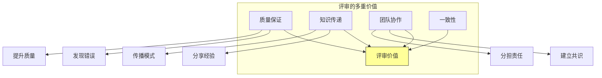

# 第十二章：代码评审深入实践

## 一、评审的文化意义

### 1.1 评审作为知识传递

代码评审不仅是质量控制，更是知识传递的渠道。通过评审，团队成员可以学习新的技术、模式和最佳实践。

**作者学习**：从审查者的反馈中学习。**审查者学习**：阅读好的代码是学习机会。**团队学习**：评审中讨论的内容被团队共享。

### 1.2 评审作为协作方式

代码评审是团队协作的重要形式。它促进沟通、建立共识、分享责任。

**图解说明**：代码评审具有多重价值，不仅仅是检查代码。

### 1.3 评审文化的影响

评审文化对团队有深远影响：

**开放氛围**：鼓励开放讨论和不同意见。**学习文化**：促进持续学习和成长。**代码所有权**：代码是团队的责任。**质量意识**：质量是每个人的关注点。

## 二、高效评审的技巧

### 2.1 评审者的技巧

作为评审者，应该：

**快速响应**：收到评审请求后尽快开始。**全面覆盖**：检查所有重要方面。**清晰反馈**：反馈应该具体和建设性。**区分优先级**：区分必须修改和建议改进。

### 2.2 作者的技巧

作为作者，应该：

**准备充分**：提交前自我检查。**描述清晰**：提供清晰的变更说明。**响应及时**：及时回应反馈。**解释背景**：帮助审查者理解上下文。

### 2.3 处理大型变更

大型变更的评审需要特别处理：

**拆分 CL**：将大变更拆成小 CL。**分层评审**：先评审设计，再评审实现。**提供背景**：解释整体设计和依赖关系。**预期时间**：给审查者更多时间。

## 三、评审的领域特定

### 3.1 安全评审

涉及安全的代码需要专门的安全评审：

**安全视角**：从攻击者角度审视代码。**常见漏洞**：检查常见的安全漏洞模式。**权限检查**：验证权限控制是否正确。**加密使用**：验证加密的正确使用。

### 3.2 性能评审

性能敏感的代码需要性能评审：

**算法选择**：选择合适的算法和数据结构。**资源使用**：检查内存、网络、CPU 使用。**扩展性**：考虑未来的扩展需求。**测量验证**：验证性能确实改善。

### 3.3 可用性评审

用户-facing 的代码需要可用性评审：

**用户体验**：评估对用户的影响。**可访问性**：确保可访问性要求。**国际化**：考虑国际化需求。**错误处理**：用户友好的错误信息。

## 四、评审工具与流程

### 4.1 评审工具的功能

好的评审工具应该支持：

**差异比较**：清晰的代码差异展示。**评论线程**：针对特定代码行的评论。**状态追踪**：评审状态的跟踪和管理。**通知集成**：与团队沟通工具集成。

### 4.2 评审流程优化

优化评审流程可以提高效率：

**预审检查**：自动化检查先于人工审查。**小 CL 鼓励**：促进提交小的变更。**并行审查**：多人可以同时审查。**自动合并**：审查通过后自动合并。

### 4.3 评审的度量

度量评审过程帮助改进：

**评审时间**：从请求到批准的时间。**反馈往返**：评审来回的次数。**阻塞原因**：导致阻塞的主要原因。**评审者负载**：评审者的评审量。

## 五、建立评审文化

### 5.1 培训新成员

帮助新成员理解评审文化：

**解释目的**：说明评审的意义。**示范评审**：展示好的评审是什么样的。**提供指南**：提供评审指南和最佳实践。**导师指导**：有经验的成员指导新成员。

### 5.2 处理评审冲突

评审中可能出现冲突：

**保持专业**：将人和问题分开。**寻求理解**：先理解对方的观点。**用证据说话**：用数据和例子支持观点。**升级处理**：必要时寻求第三方意见。

### 5.3 认可和激励

认可好的评审行为：

**感谢好的评审**：感谢提供有价值反馈的审查者。**表彰贡献**：认可对代码质量的贡献。**分享案例**：分享好的评审案例。

## 六、总结与启示

### 6.1 核心要点回顾

代码评审是知识传递和团队协作的重要渠道。评审需要技巧和练习。建立评审文化需要持续投入。不同领域可能需要专门的评审。

### 6.2 对个人的建议

把每次评审当作学习和贡献的机会。提供建设性的反馈，也乐于接受反馈。持续改进评审技巧。

### 6.3 对团队的建议

建立清晰的评审规范和期望。投资评审工具，让评审更高效。培养开放、学习的评审文化。

---

## 课后思考

1. 你的团队的评审文化是什么？有哪些可以改进的地方？

2. 你在评审中通常关注什么？有什么可以拓展的领域？

3. 如何处理评审中的分歧和冲突？

---

*本章精读笔记完成*
