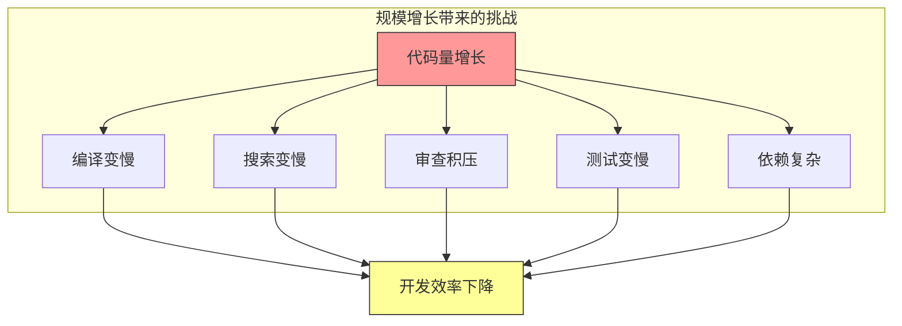

# 第十三章：规模化的挑战与应对

## 一、规模化带来的变化

### 1.1 代码库规模

随着代码库增长，很多在小规模时不成问题的事情变得困难：

**编译时间**：编译需要更长时间，可能需要分布式编译。**搜索效率**：搜索数百万文件需要专门的索引。**审查积压**：代码审查可能积压，需要更多审查者。**测试套件**：测试套件运行时间显著增长。

**图解说明**：代码库规模增长带来一系列挑战，最终影响开发效率。

### 1.2 团队规模

团队规模增长也带来协作挑战：

**沟通成本**：N 个人有 N(N-1)/2 个沟通路径。**知识分布**：知识更难共享和传播。**一致性**：保持代码和实践一致更困难。**协调成本**：协调工作需要更多努力。

### 1.3 组织规模

多团队协作需要新的协调机制：

**团队边界**：定义清晰的团队边界和接口。**依赖管理**：管理跨团队的依赖。**共享服务**：建设共享的基础设施。**治理机制**：处理跨团队的决策和争议。

## 二、Google 的规模化实践

### 2.1 单仓库模式

Google 使用单一的巨大仓库（monorepo）管理所有代码。这种模式有独特的优势和挑战。

**优势**：依赖简单、代码共享容易、重构影响可控。**挑战**：工具需要支持大规模、权限管理复杂、大文件处理。

### 2.2 微服务架构

Google 的服务采用微服务架构，每个服务独立开发、部署和扩展：

**服务边界**：清晰定义服务边界。**API 契约**：服务间通过 API 通信。**独立部署**：服务可以独立部署。**故障隔离**：服务故障不会级联。

### 2.3 分布式团队

Google 的团队分布在世界各地，需要支持分布式协作：

**异步优先**：尽可能使用异步沟通。**会议优化**：让跨时区会议更高效。**文档充分**：依赖文档而非口头沟通。**工具支持**：使用好的协作工具。

## 三、规模化的工具支持

### 3.1 代码搜索引擎

大规模代码库需要专门的搜索工具：

**快速索引**：支持数百万文件的索引。**语义搜索**：理解代码语义的搜索。**分布式搜索**：搜索可以分布式执行。**结果排名**：按相关性排序结果。

### 3.2 构建系统

大规模构建需要专门的构建系统：

**增量构建**：只构建改变的内容。**分布式构建**：构建任务分布到多台机器。**缓存共享**：构建结果被团队共享。**依赖分析**：精确的依赖分析。

### 3.3 持续集成

大规模 CI 需要特殊考虑：

**并行测试**：测试并行执行。**测试选择**：只运行受影响的测试。**资源管理**：高效管理 CI 资源。**快速反馈**：保持快速的反馈时间。

## 四、规模化的组织策略

### 4.1 团队结构

合理的团队结构可以降低协作成本：

**小团队**：每个团队规模控制在 6-8 人。**清晰边界**：团队之间有清晰的职责边界。**接口定义**：团队间的接口明确定义。**所有者明确**：每个代码区域有明确的所有者。

### 4.2 决策机制

规模化需要清晰的决策机制：

**技术委员会**：处理重大技术决策。**架构评审**：评审架构变更。**标准制定**：制定跨团队的标准。**争议解决**：解决团队间的争议。

### 4.3 知识管理

规模化下知识管理更重要：

**文档文化**：重视文档的编写和维护。**知识库**：建立和维护知识库。**技术分享**：定期的技术分享和讨论。**导师制度**：知识通过导师传递。

## 五、规模化的最佳实践

### 5.1 渐进式变更

大规模变更应该渐进式进行：

**小步快跑**：每次变更尽量小。**可逆变更**：确保变更可以回滚。**渐进发布**：新功能渐进式发布。**监控验证**：密切监控变更的效果。

### 5.2 自动化一切

规模化下，自动化是必须的：

**自动化测试**：测试完全自动化。**自动化部署**：部署过程自动化。**自动化运维**：运维操作自动化。**自动化监控**：监控和告警自动化。

### 5.3 监控与可观测性

大规模系统需要强大的监控：

**指标收集**：收集关键的运行指标。**日志聚合**：聚合和分析日志。**分布式追踪**：追踪请求的完整路径。**告警系统**：及时发现和通知问题。

## 六、总结与启示

### 6.1 核心要点回顾

规模化带来代码库、团队、组织多个层面的挑战。需要专门的工具支持规模化的需求。组织策略和流程需要相应调整。自动化和监控是规模化的基础。

### 6.2 对个人的建议

理解规模化的挑战，培养相应的技能。掌握规模化的工具和方法。关注全局而非只关注局部。

### 6.3 对团队的建议

投资规模化的基础设施。建立适应规模化的组织机制。培养规模化的文化和实践。

---

## 课后思考

1. 你的团队或代码库面临哪些规模化的挑战？

2. 你的团队使用什么策略应对规模化？

3. 什么工具和实践可以帮助应对规模化？

---

*本章精读笔记完成*
