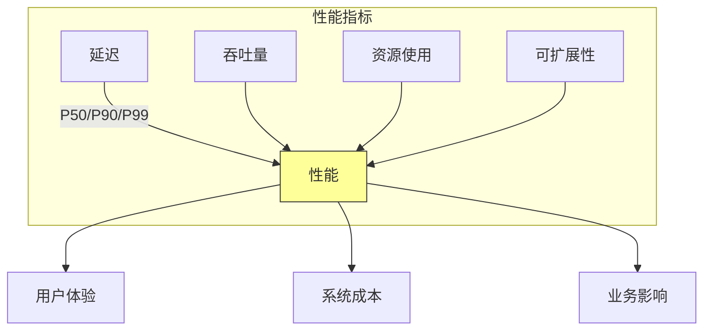
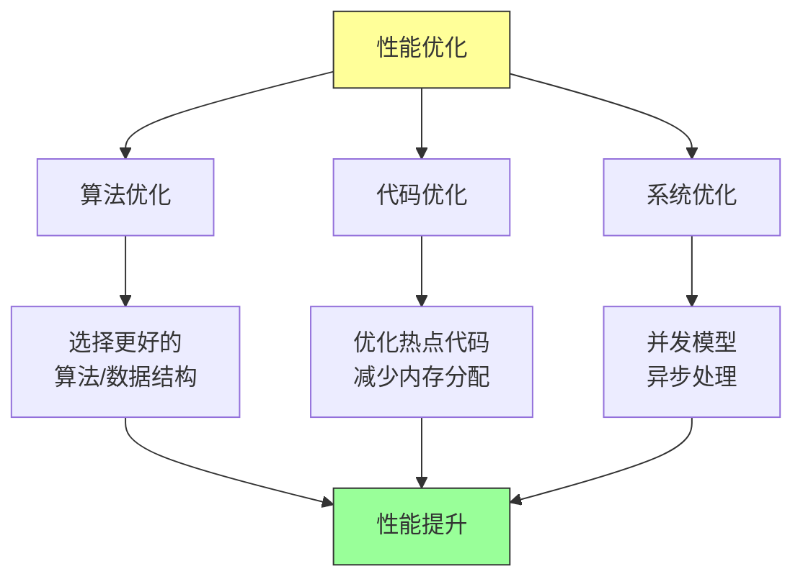

# 第十四章：性能工程

## 一、性能的重要性

### 1.1 为什么性能重要

性能对用户体验和业务有直接影响：

**用户体验**：慢的响应让用户不满。**系统成本**：低效的系统需要更多资源。**可扩展性**：高性能的系统更容易扩展。**竞争差异**：性能可以是竞争优势。

### 1.2 性能指标

衡量性能的关键指标：

**延迟**：请求处理的响应时间。**吞吐量**：系统单位时间处理的请求数。**资源使用**：CPU、内存、网络的使用量。**可扩展性**：资源增加时性能的提升。

**图解说明**：性能指标影响用户体验、系统成本和业务结果。

### 1.3 性能与复杂性的权衡

性能优化通常增加复杂性。需要在性能和可维护性之间找到平衡：

**过早优化**：在不需要时优化是浪费。**基于数据**：根据数据决定是否优化。**可读性优先**：除非必要，保持代码简单。**测量验证**：优化前后的测量对比。

## 二、性能分析

### 2.1 性能瓶颈

性能问题通常来自几个方面：

**CPU 瓶颈**：计算密集型任务。**内存瓶颈**：内存分配、垃圾回收。**I/O 瓶颈**：磁盘或网络 I/O。**锁竞争**：并发访问的锁争用。

### 2.2 性能分析工具

Google 使用各种性能分析工具：

**CPU 分析器**：分析 CPU 使用情况。**内存分析器**：分析内存分配和使用。**I/O 分析器**：分析 I/O 操作。**网络分析器**：分析网络流量。

### 2.3 分析方法

系统性的性能分析方法：

**建立基线**：了解当前的性能水平。**压力测试**：在负载下测量性能。**剖析分析**：使用剖析工具定位热点。**追踪分析**：追踪请求的完整路径。

## 三、性能优化策略

### 3.1 算法优化

选择更高效的算法是优化性能的根本：

**时间复杂度**：选择更低复杂度的算法。**空间复杂度**：平衡时间和空间。**数据结构**：选择合适的数据结构。**缓存利用**：利用缓存避免重复计算。

### 3.2 代码级优化

在算法层面以下，可以进行代码级优化：

**热点优化**：优化频繁执行的代码。**减少分配**：减少内存分配和垃圾回收。**向量化**：利用 SIMD 指令。**内联优化**：帮助编译器优化。

### 3.3 系统级优化

在系统层面进行优化：

**并发模型**：使用更高效的并发模型。**异步处理**：使用异步 I/O。**批处理**：合并多次操作为批处理。**资源池**：使用连接池、线程池。

**图解说明**：性能优化可以在算法、代码、系统三个层面进行。

## 四、性能测试

### 4.1 基准测试

基准测试量化代码的性能：

**微基准**：测试小代码段的性能。**宏基准**：测试整个系统的性能。**基准比较**：对比不同实现的性能。**持续追踪**：追踪性能随时间的变化。

### 4.2 负载测试

负载测试在真实负载下测量系统性能：

**峰值负载**：系统在峰值负载下的表现。**压力测试**：系统的极限在哪里。**持久测试**：系统在长时间负载下的稳定性。**突发测试**：系统对突发负载的响应。

### 4.3 性能回归

性能回归是性能变差：

**监控性能**：持续监控性能指标。**回归检测**：发现性能回归。**根因分析**：分析回归的原因。**快速修复**：尽快修复性能回归。

## 五、性能文化

### 5.1 性能意识

在团队中培养性能意识：

**性能作为需求**：将性能作为功能需求。**性能考虑在先**：设计时就考虑性能。**性能责任**：每个人都对性能负责。**性能庆祝**：认可性能优化的成果。

### 5.2 性能预算

建立性能预算制度：

**定义预算**：为关键性能指标设定预算。**监控预算**：持续监控是否超出预算。**超出处理**：超出预算时采取措施。**定期审查**：定期审查和调整预算。

### 5.3 性能评审

在开发过程中进行性能评审：

**设计评审**：评审设计的性能考量。**代码评审**：评审代码的性能影响。**发布评审**：发布前的性能验证。**事后评审**：发布后的性能回顾。

## 六、总结与启示

### 6.1 核心要点回顾

性能对用户体验和成本有重要影响。性能优化需要系统性的分析和策略。性能测试和监控是持续性能的基础。性能文化需要全团队的参与。

### 6.2 对个人的建议

培养性能意识，在编写代码时考虑性能。学习性能分析的方法和工具。测量验证优化效果。

### 6.3 对团队的建议

建立性能预算和监控机制。定期进行性能评审。培养性能文化，让性能成为每个人的关注点。

---

## 课后思考

1. 你的系统有哪些已知的性能瓶颈？

2. 你的团队如何进行性能测试和监控？

3. 如何在团队中培养性能意识？

---

*本章精读笔记完成*
