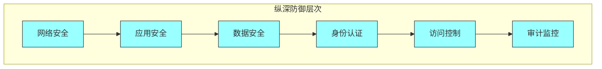

# 第十五章：安全工程

## 一、安全工程概述

### 1.1 安全的重要性

安全是软件工程的核心关注点之一。安全漏洞可能导致数据泄露、服务中断、声誉损失。在 Google，安全被视为每个人的责任，而不仅仅是安全团队的责任。

安全的核心目标是保护系统的**机密性**（防止未授权访问）、**完整性**（防止未授权修改）、**可用性**（确保服务可用）。

### 1.2 纵深防御

Google 采用纵深防御（Defense in Depth）策略，在多个层次建立安全防护：

**图解说明**：纵深防御在多个层次建立安全防护，每层都是独立的防线。

### 1.3 安全原则

安全工程遵循几个核心原则：

**最小权限**：只授予必要的权限。**默认安全**：默认配置应该是安全的。**纵深防御**：多层防护，不依赖单一机制。**持续监控**：持续检测和响应威胁。

## 二、常见安全威胁

### 2.1 注入攻击

注入攻击是最常见的安全威胁之一：

**SQL 注入**：通过输入注入恶意 SQL。**命令注入**：通过输入执行系统命令。**跨站脚本（XSS）**：注入恶意脚本。**LDAP 注入**：注入 LDAP 查询。

防御注入攻击的方法：

**参数化查询**：使用参数化查询。**输入验证**：验证和清理输入。**输出编码**：对输出进行适当编码。

### 2.2 认证与授权

认证和授权是安全的关键环节：

**认证**：验证用户身份。**会话管理**：管理用户会话。**授权**：控制用户能做什么。**多因素认证**：使用多种认证因素。

### 2.3 数据保护

保护敏感数据：

**加密**：对敏感数据加密。**脱敏**：在非生产环境脱敏。**访问控制**：控制数据访问。**数据生命周期**：安全地删除数据。

## 三、安全开发实践

### 3.1 安全代码

编写安全的代码：

**输入验证**：验证所有输入。**输出编码**：正确编码输出。**安全库**：使用安全的标准库。**错误处理**：安全地处理错误。

### 3.2 安全审查

安全审查是发现漏洞的重要手段：

**代码审查**：审查代码的安全性。**渗透测试**：模拟攻击测试。**安全扫描**：使用自动化工具扫描。**红队演练**：专业的安全团队进行测试。

### 3.3 依赖安全

管理第三方依赖的安全：

**依赖审查**：审查依赖的安全性。**漏洞监控**：监控依赖的漏洞。**版本更新**：及时更新有漏洞的版本。**最小依赖**：减少依赖的数量。

## 四、事件响应

### 4.1 安全事件

安全事件是安全控制被突破的情况：

**检测**：发现安全事件。**分析**：分析事件的性质和范围。**遏制**：阻止事件扩散。**恢复**：恢复正常状态。**复盘**：学习经验教训。

### 4.2 响应流程

建立安全事件响应流程：

**准备**：建立响应团队和流程。**检测**：持续监控和检测。**响应**：快速有效地响应。**恢复**：恢复系统到安全状态。**改进**：基于事件改进安全。

## 五、安全文化

### 5.1 安全意识

在团队中培养安全意识：

**安全培训**：定期进行安全培训。**安全 champions**：在团队中培养安全代表。**安全实践**：将安全实践融入开发。**安全沟通**：开放讨论安全问题。

### 5.2 安全度量

度量安全的效果：

**漏洞数量**：已知漏洞的数量。**修复时间**：漏洞修复的平均时间。**安全事件**：安全事件的数量和严重度。**安全覆盖**：安全控制的覆盖率。

## 六、总结与启示

### 6.1 核心要点回顾

安全是软件工程的核心关注点。纵深防御提供多层保护。安全开发实践预防漏洞。安全事件响应能力很重要。

### 6.2 对个人的建议

培养安全意识，在编写代码时考虑安全。学习常见的安全漏洞和防御方法。及时更新有漏洞的依赖。

### 6.3 对团队的建议

建立安全开发流程和标准。定期进行安全审查和测试。培养安全文化，让安全成为每个人的责任。

---

## 课后思考

1. 你的系统面临哪些安全威胁？有什么防护措施？

2. 你的团队如何进行安全审查？

3. 如何在团队中培养安全意识？

---

*本章精读笔记完成*
