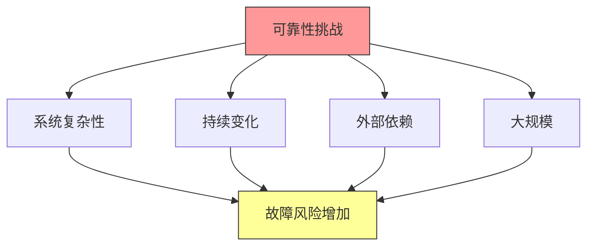
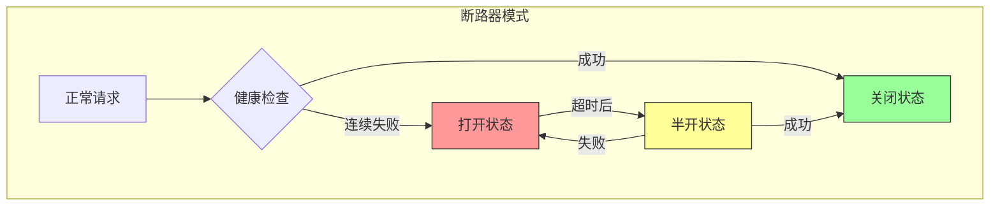

# 第十六章：可靠性工程

## 一、可靠性的定义

### 1.1 什么是可靠性

可靠性是系统在规定条件下保持正常运行的能力。可靠性对用户体验和业务连续性至关重要。

可靠性的度量：

**可用性**：系统正常运行的时间比例。**平均故障间隔（MTBF）**：两次故障之间的平均时间。**平均修复时间（MTTR）**：故障后恢复的平均时间。**恢复点目标（RPO）**：可接受的数据丢失量。

### 1.2 可靠性的重要性

可靠性影响用户体验和业务：

**用户体验**：不可靠的服务让用户不满。**业务连续性**：故障导致业务损失。**声誉影响**：频繁故障影响声誉。**成本影响**：故障恢复有直接成本。

### 1.3 可靠性的挑战

提高可靠性面临的挑战：

**复杂性**：系统越复杂，越容易出问题。**变化**：系统变化可能引入故障。**外部依赖**：第三方服务可能不可靠。**规模**：大规模系统更难保证可靠性。

**图解说明**：系统复杂性、变化、外部依赖和大规模都增加故障风险。

## 二、容错设计

### 2.1 容错原则

容错是系统在部分故障时继续运行的能力：

**冗余**：有备份组件可以接管。**隔离**：故障不会扩散。**优雅降级**：部分故障时保持基本功能。**快速恢复**：故障后快速恢复。

### 2.2 冗余设计

冗余是容错的基础：

**数据冗余**：数据有多个副本。**服务冗余**：多个服务实例。**地域冗余**：跨地域部署。**备份恢复**：定期备份，可快速恢复。

### 2.3 故障隔离

限制故障的影响范围：

**服务隔离**：服务之间相互隔离。**数据隔离**：数据访问有限制。**请求隔离**：请求不会互相影响。**沙箱隔离**：危险操作在沙箱中执行。

## 三、可靠性模式

### 3.1 重试模式

处理瞬时故障：

**指数退避**：每次重试等待时间增加。**限流**：限制重试频率。**熔断**：连续失败后停止重试。**超时设置**：设置合理的超时时间。

### 3.2 断路器模式

防止级联故障：

**关闭状态**：正常处理请求。**打开状态**：快速失败，不调用后端。**半开状态**：尝试调用，验证恢复。

### 3.3 降级模式

优雅降级保证基本功能：

**备用数据**：使用缓存或静态数据。**功能降级**：禁用非核心功能。**限制服务**：限制请求速率。**友好错误**：返回友好的错误信息。

**图解说明**：断路器模式在正常、打开、半开三种状态间转换，保护系统免受级联故障。

## 四、监控与告警

### 4.1 监控体系

全面的监控是可靠性的基础：

**指标监控**：收集关键性能指标。**日志收集**：收集和分析日志。**链路追踪**：追踪请求的完整路径。**健康检查**：定期检查服务健康。

### 4.2 告警策略

有效的告警确保问题被及时发现：

**告警级别**：区分紧急和非紧急告警。**告警阈值**：设置合理的阈值。**告警聚合**：避免告警风暴。**值班制度**：有人响应告警。

### 4.3 可观测性

可观测性帮助理解系统行为：

**分布式追踪**：理解请求在服务间的流动。**关联分析**：关联不同来源的数据。**根因分析**：快速定位问题根因。**趋势分析**：识别长期趋势。

## 五、故障管理

### 5.1 故障预防

预防故障发生：

**变更管理**：控制变更，减少故障。**混沌工程**：主动测试故障。**容量规划**：确保足够容量。**技术债务**：及时偿还技术债务。

### 5.2 故障响应

快速有效地响应故障：

**定义角色**：明确故障响应的角色。**沟通机制**：建立故障沟通渠道。**恢复优先**：首先恢复服务。**状态更新**：保持状态更新。

### 5.3 事后复盘

从故障中学习：

**根因分析**：找出故障的根本原因。**影响评估**：评估故障的影响。**改进措施**：制定改进措施。**跟踪落实**：跟踪改进措施的落实。

## 六、总结与启示

### 6.1 核心要点回顾

可靠性是系统的核心质量属性。容错设计保证部分故障时系统继续运行。监控和告警确保问题被及时发现。故障管理包括预防、响应和复盘。

### 6.2 对个人的建议

培养可靠性意识，在设计时考虑故障。掌握监控和故障排查的技能。从故障中学习，不断改进。

### 6.3 对团队的建议

建立可靠性监控和告警机制。建立故障响应流程和值班制度。定期进行混沌工程实验。进行事后复盘，持续改进。

---

## 课后思考

1. 你的系统目前的可靠性如何？有哪些已知的可靠性问题？

2. 你的团队如何进行故障响应？

3. 如何在团队中培养可靠性文化？

---

*本章精读笔记完成*
