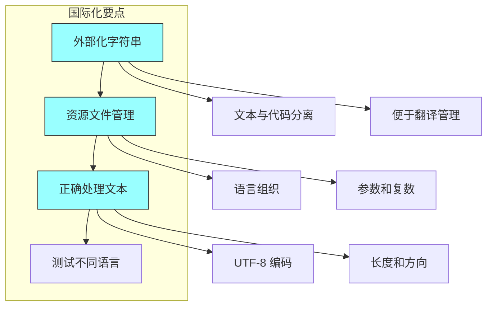

# 第十七章：国际化与本地化

## 一、国际化与本地化的概念

### 1.1 定义

**国际化（i18n）**是设计和开发应用使其能够适应不同语言和地区的过程。**本地化（l10n）**是使应用适应特定语言和地区的过程。

国际化和本地化的目标是为全球用户提供良好的体验，无论他们使用什么语言、什么地区设置。

### 1.2 为什么重要

对于服务全球用户的系统，国际化和本地化是必需的：

**市场覆盖**：服务更多用户。**用户体验**：用户用自己的语言使用服务。**法规合规**：某些地区有本地化要求。**竞争优势**：本地化提供竞争优势。

### 1.3 本地化的方面

本地化涉及多个方面：

**文本翻译**：将界面文本翻译成不同语言。**格式本地化**：日期、时间、数字格式。**排版规则**：不同语言的文字方向和排版。**文化适应**：符合当地文化和习惯。

## 二、国际化的最佳实践

### 2.1 外部化字符串

将用户可见的文本外部化到资源文件：

```java
// 错误：硬编码字符串
String message = "Hello, World!";

// 正确：使用资源文件
String message = getMessage("greeting");
```

这样做的好处是：添加新语言只需添加翻译，文本修改不需要改代码，翻译工作可以独立进行。

### 2.2 使用资源文件

使用结构化的资源文件管理翻译：

**按语言组织**：每种语言有对应的资源文件。**按功能分组**：按功能模块组织字符串。**参数支持**：支持带参数的字符串。**复数处理**：处理不同语言的复数形式。

### 2.3 处理文本

处理文本需要注意：

**字符编码**：使用 UTF-8 编码。**文本长度**：考虑翻译后文本长度变化。**文字方向**：支持从右到左的语言。**复合文本**：处理复杂的文本组合。



**图解说明**：国际化的三个关键要点和它们的具体含义。

## 三、本地化的流程

### 3.1 翻译管理

管理翻译的流程：

**提取字符串**：从代码中提取需要翻译的字符串。**翻译记忆**：使用翻译记忆库。**质量保证**：翻译质量的审核。**集成流程**：将翻译集成到产品中。

### 3.2 格式本地化

不同地区有不同的格式习惯：

**日期格式**：MM/DD/YYYY vs DD/MM/YYYY。**时间格式**：12小时制 vs 24小时制。**数字格式**：使用千位分隔符和小数点。**货币格式**：货币符号和位置。

### 3.3 测试本地化

测试本地化的质量：

**视觉测试**：界面显示是否正确。**功能测试**：功能在不同语言下是否正常。**语言测试**：翻译是否准确自然。**边界测试**：特殊字符和长文本的测试。

## 四、Unicode 与字符处理

### 4.1 Unicode 基础

Unicode 是字符编码的标准，支持世界上几乎所有文字：

**代码点**：每个字符有一个唯一的代码点。**UTF-8**：常用的 Unicode 编码方式。**字符属性**：字符的大小写、方向等属性。

### 4.2 字符处理

正确处理字符：

**字符 vs 字节**：区分字符和字节。**字符串操作**：正确处理字符串。**正则表达式**：使用 Unicode 感知的正则表达式。**排序规则**：不同语言有不同的排序规则。

### 4.3 字体与渲染

文本渲染需要考虑：

**字体选择**：支持目标语言的字体。**字形渲染**：正确渲染字符。**连字和合字**：处理特殊的字形组合。**文本对齐**：考虑不同语言的文本方向。

## 五、本地化工具

### 5.1 翻译管理平台

专业的翻译管理平台：

**字符串管理**：管理需要翻译的字符串。**翻译工作流**：管理翻译的流程。**质量检查**：自动检查翻译质量。**集成能力**：与开发和发布流程集成。

### 5.2 国际化框架

编程语言和框架提供国际化支持：

**Java**：ResourceBundle、MessageFormat。**JavaScript**：Intl API、框架 i18n。**Python**：gettext、babel。**框架支持**：React、Angular、Vue 等框架都有 i18n 支持。

### 5.3 测试工具

本地化测试的工具：

**伪翻译**：生成伪翻译测试界面。**截图比较**：比较不同语言的界面。**自动化测试**：自动化的本地化测试。**翻译验证**：验证翻译的准确性。

## 六、总结与启示

### 6.1 核心要点回顾

国际化是从设计时就考虑多语言支持。本地化是将应用适配特定语言和地区。正确处理 Unicode 和字符是基础。翻译管理需要专门的流程和工具。

### 6.2 对个人的建议

在编写代码时考虑国际化。使用正确的 Unicode 处理方式。了解目标语言的特殊需求。

### 6.3 对团队的建议

建立国际化的规范和流程。使用翻译管理平台管理翻译。定期测试本地化的质量。

---

## 课后思考

1. 你的系统是否支持国际化？有哪些可以改进的地方？

2. 你的团队如何管理翻译流程？

3. 处理过哪些本地化的挑战？如何解决的？

---

*本章精读笔记完成*
