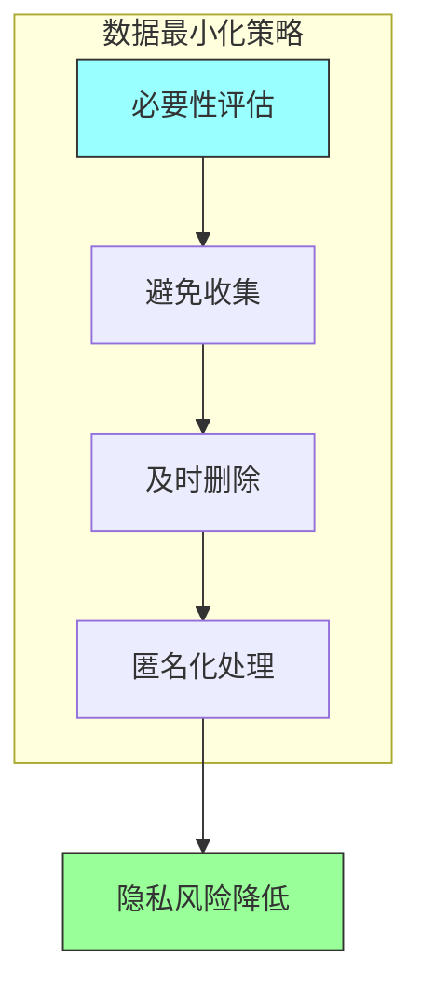

# 第十八章：隐私工程

## 一、隐私的重要性

### 1.1 为什么隐私重要

隐私是用户的基本权利，也是法规的要求。保护用户隐私是软件工程的重要责任。

隐私的价值：

**用户信任**：用户信任才会使用服务。**法规合规**：各国都有隐私保护法规。**商业价值**：隐私保护是竞争优势。**伦理责任**：保护用户是道德义务。

### 1.2 隐私威胁

隐私威胁来自多个方面：

**数据泄露**：未授权访问敏感数据。**追踪分析**：用户行为被追踪分析。**推断攻击**：从数据推断敏感信息。**内部威胁**：内部人员滥用数据。

### 1.3 隐私原则

隐私工程的几个核心原则：

**最小化**：只收集必要的数据。**目的限制**：数据只用于收集时声明的目的。**透明度**：用户知道数据如何被使用。**安全性**：保护数据免受未授权访问。

## 二、隐私设计

### 2.1 隐私设计原则

将隐私融入系统设计：

**默认隐私**：默认配置保护隐私。**嵌入设计**：隐私是设计的一部分。**端到端安全**：全流程保护数据。**可见透明**：用户可以了解隐私实践。

### 2.2 数据最小化

只收集必要的数据：

**必要性评估**：每项数据收集都要评估必要性。**避免收集**：能不收集就不收集。**及时删除**：不再需要时删除数据。**匿名化**：考虑匿名化处理。

**图解说明**：数据最小化的策略链条，从评估到匿名化，最终降低隐私风险。

### 2.3 隐私影响评估

在项目开始前进行隐私影响评估：

**数据映射**：了解数据流。**风险识别**：识别隐私风险。**控制措施**：评估控制措施的有效性。**决策记录**：记录决策和理由。

## 三、隐私技术

### 3.1 数据脱敏

脱敏保护敏感数据：

**数据掩码**：部分隐藏敏感信息。**数据替换**：用假数据替换真实数据。**数据泛化**：降低数据精度。**数据聚合**：使用聚合数据而非明细。

### 3.2 差分隐私

差分隐私是数学上保证隐私的技术：

**隐私预算**：控制隐私泄露的程度。**噪声添加**：在数据中添加噪声。**查询限制**：限制可以查询的次数。**隐私-效用权衡**：平衡隐私和可用性。

### 3.3 同态加密

同态加密允许在加密数据上计算：

**加密计算**：数据保持加密状态。**结果解密**：只解密最终结果。**应用场景**：安全的数据处理。**技术成熟度**：仍在发展中。

## 四、隐私合规

### 4.1 隐私法规

主要的隐私法规：

**GDPR**：欧盟通用数据保护条例。**CCPA**：加州消费者隐私法案。**PIPL**：中国个人信息保护法。**其他法规**：各国各地区的法规。

### 4.2 合规要求

合规需要满足的要求：

**用户同意**：收集数据需要用户同意。**数据访问**：用户可以访问自己的数据。**数据删除**：用户可以要求删除数据。**数据携带**：用户可以导出自己的数据。

### 4.3 合规实践

实现合规的实践：

**隐私政策**：清晰说明隐私实践。**同意管理**：管理用户同意。**权利响应**：响应用户权利请求。**合规审计**：定期进行合规审计。

## 五、隐私与安全的协同

### 5.1 隐私与安全的关系

隐私和安全相互关联但有区别：

**安全**保护系统免受攻击。**隐私**保护用户信息免受滥用。**协同作用**：安全措施支持隐私保护。

### 5.2 协同设计

协同设计安全和隐私：

**访问控制**：支持隐私的访问控制。**加密保护**：保护隐私数据的加密。**审计追踪**：支持隐私的审计。**事件响应**：包含隐私的事件响应。

## 六、总结与启示

### 6.1 核心要点回顾

隐私是用户的基本权利和法规的要求。隐私设计将保护隐私融入系统设计。技术手段如脱敏和差分隐私提供保护。合规是隐私工程的重要组成部分。

### 6.2 对个人的建议

在设计中考虑隐私影响。了解主要的隐私法规。学习隐私保护的技术方法。

### 6.3 对团队的建议

建立隐私设计和合规流程。进行隐私影响评估。培养隐私意识文化。

---

## 课后思考

1. 你的系统处理哪些敏感数据？有什么隐私保护措施？

2. 你的团队如何进行隐私影响评估？

3. 面临哪些隐私合规的挑战？

---

*本章精读笔记完成*
